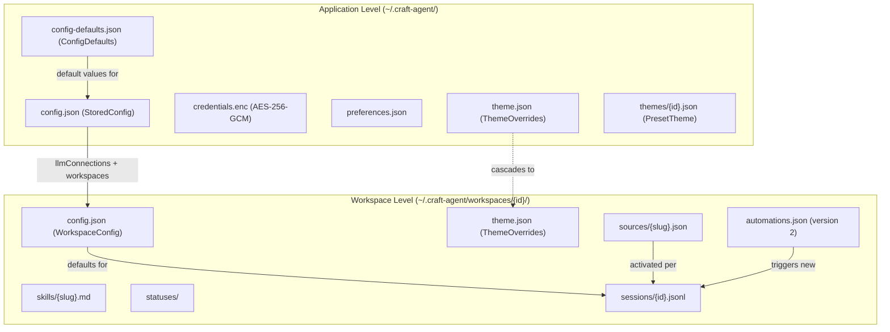
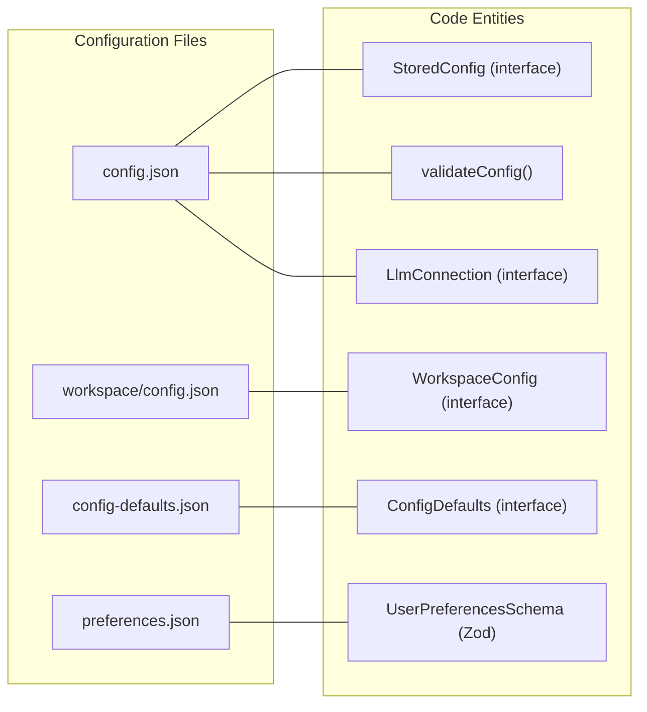

# Configuration Files

<details>
<summary>Relevant source files</summary>

The following files were used as context for generating this wiki page:

- [apps/electron/resources/config-defaults.json](apps/electron/resources/config-defaults.json)
- [apps/electron/src/main/onboarding.ts](apps/electron/src/main/onboarding.ts)
- [apps/electron/src/renderer/pages/settings/AppSettingsPage.tsx](apps/electron/src/renderer/pages/settings/AppSettingsPage.tsx)
- [apps/electron/src/shared/types.ts](apps/electron/src/shared/types.ts)
- [bun.lock](bun.lock)
- [packages/shared/src/config/config-defaults-schema.ts](packages/shared/src/config/config-defaults-schema.ts)
- [packages/shared/src/config/llm-connections.ts](packages/shared/src/config/llm-connections.ts)
- [packages/shared/src/config/storage.ts](packages/shared/src/config/storage.ts)
- [packages/shared/src/config/validators.ts](packages/shared/src/config/validators.ts)

</details>


This page provides a comprehensive reference for all configuration file formats used by Craft Agents. Configuration data is stored in `~/.craft-agent/` with a hierarchical structure spanning application-level, workspace-level, and session-level files.

For information about the storage system architecture and data persistence patterns, see [Storage & Configuration (2.8)](). For workspace-specific settings and organization, see [Workspaces (4.1)]().

---

## Configuration Hierarchy

Craft Agents uses a three-tier configuration system with clear inheritance and override patterns. Application-level defaults are synced from bundled assets on every launch to ensure the local environment matches the current application version [packages/shared/src/config/storage.ts:125-152]().

**Configuration Inheritance and Flow**


Sources: [packages/shared/src/config/storage.ts:51-87](), [packages/shared/src/config/config-defaults-schema.ts:11-33]()

---

## Application-Level Configuration

Application-level files control global settings, authentication, and user preferences. These files are read at application startup and modified through settings UI or OAuth flows.

### config.json (App Level)

Main application configuration. Defined by the `StoredConfig` interface [packages/shared/src/config/storage.ts:51-87](). Read by `loadStoredConfig()` and written by `saveConfig()`.

**Location:** `~/.craft-agent/config.json`

**Format:**
```json
{
  "llmConnections": [
    {
      "slug": "anthropic-api",
      "name": "Anthropic (API Key)",
      "providerType": "anthropic",
      "authType": "api_key",
      "models": [{ "id": "claude-3-5-sonnet-latest", "name": "Claude 3.5 Sonnet" }],
      "defaultModel": "claude-3-5-sonnet-latest",
      "createdAt": 1705320000000
    }
  ],
  "defaultLlmConnection": "anthropic-api",
  "workspaces": [
    {
      "id": "uuid-v4-string",
      "name": "My Workspace",
      "slug": "my-workspace",
      "createdAt": 1705320000000
    }
  ],
  "activeWorkspaceId": "uuid-v4-string",
  "activeSessionId": "session-uuid",
  "notificationsEnabled": true,
  "colorTheme": "default",
  "autoCapitalisation": true,
  "sendMessageKey": "enter",
  "spellCheck": false,
  "keepAwakeWhileRunning": false,
  "richToolDescriptions": true,
  "enable1MContext": true
}
```

| Field | Type | Default | Description |
|-------|------|---------|-------------|
| `llmConnections` | `LlmConnection[]` | `[]` | All configured LLM provider connections [packages/shared/src/config/storage.ts:53]() |
| `defaultLlmConnection` | `string` | — | Slug of default connection for new sessions [packages/shared/src/config/storage.ts:54]() |
| `workspaces` | `Workspace[]` | — | Registered workspace entries [packages/shared/src/config/storage.ts:57]() |
| `activeWorkspaceId` | `string \| null` | — | Currently active workspace ID [packages/shared/src/config/storage.ts:58]() |
| `activeSessionId` | `string \| null` | — | Currently active session ID [packages/shared/src/config/storage.ts:59]() |
| `notificationsEnabled` | `boolean` | `true` | Desktop notifications for task completion [packages/shared/src/config/storage.ts:61]() |
| `colorTheme` | `string` | `"default"` | Preset theme ID (e.g. `"dracula"`, `"nord"`) [packages/shared/src/config/storage.ts:63]() |
| `autoCapitalisation` | `boolean` | `true` | Auto-capitalize first letter in input [packages/shared/src/config/storage.ts:67]() |
| `sendMessageKey` | `"enter" \| "cmd-enter"` | `"enter"` | Key combination to send messages [packages/shared/src/config/storage.ts:68]() |
| `spellCheck` | `boolean` | `false` | Enable spell check in input [packages/shared/src/config/storage.ts:69]() |
| `keepAwakeWhileRunning` | `boolean` | `false` | Prevent screen sleep during active sessions [packages/shared/src/config/storage.ts:71]() |
| `richToolDescriptions` | `boolean` | `true` | Inject intent/action metadata into tool calls [packages/shared/src/config/storage.ts:73]() |
| `enable1MContext` | `boolean` | `true` | Enable 1M context window for supported models [packages/shared/src/config/storage.ts:78]() |

Sources: [packages/shared/src/config/storage.ts:51-87](), [packages/shared/src/config/validators.ts:90-99]()

---

### LlmConnection

Each entry in `llmConnections` is an `LlmConnection` object. Credentials (API keys/tokens) are stored separately in the encrypted `credentials.enc`.

**`LlmProviderType` values [packages/shared/src/config/llm-connections.ts:51-54]():**

| Value | Backend Implementation |
|-------|------------------------|
| `anthropic` | Direct Anthropic API (Claude Agent SDK) |
| `pi` | Pi unified LLM API (20+ providers) |
| `pi_compat` | Pi with custom endpoint (Ollama, self-hosted) |

**`LlmAuthType` values [packages/shared/src/config/llm-connections.ts:81-89]():**

| Value | Description |
|-------|-------------|
| `api_key` | Single API key field |
| `api_key_with_endpoint` | API key + custom endpoint URL |
| `oauth` | Browser OAuth flow |
| `iam_credentials` | AWS Access Key + Secret Key + Region |
| `bearer_token` | Single bearer token |
| `service_account_file` | GCP JSON service account file |
| `environment` | Auto-detect from environment variables |
| `none` | No authentication required |

Sources: [packages/shared/src/config/llm-connections.ts:51-172](), [packages/shared/src/config/validators.ts:66-89]()

---

### preferences.json

User profile and preferences accessible to the agent for personalization. Defined by `UserPreferencesSchema` [packages/shared/src/config/validators.ts:109-116]().

**Location:** `~/.craft-agent/preferences.json`

**Format:**
```json
{
  "name": "Alice",
  "timezone": "Europe/Berlin",
  "language": "en-US",
  "location": {
    "city": "Berlin",
    "country": "Germany"
  },
  "notes": "I prefer concise technical explanations.",
  "updatedAt": 1705320000000
}
```

Sources: [packages/shared/src/config/validators.ts:103-116]()

---

## Workspace-Level Configuration

### config.json (Workspace Level)

Per-workspace settings. These settings govern how an agent behaves within a specific workspace context.

**Location:** `~/.craft-agent/workspaces/{id}/config.json`

| Field | Type | Description |
|-------|------|-------------|
| `id` | `string` | Workspace UUID |
| `name` | `string` | Display name |
| `slug` | `string` | Folder name (URL-safe) |
| `defaults.model` | `string` | Default model ID for new sessions |
| `defaults.permissionMode` | `PermissionMode` | Default mode (`safe`, `ask`, `allow-all`) |
| `defaults.thinkingLevel` | `ThinkingLevel` | Default thinking level (`off` to `max`) |
| `localMcpServers.enabled` | `boolean` | Whether stdio-based MCP servers are allowed |

Sources: [packages/shared/src/config/config-defaults-schema.ts:25-32](), [packages/shared/src/config/storage.ts:117-122]()

---

### automations.json

Event-driven automation rules for a workspace. Must include `"version": 2`. Triggers are processed by the application main process and can initiate new agent sessions or prompt existing ones.

**Location:** `~/.craft-agent/workspaces/{id}/automations.json`

**Supported Event Types:**
- `LabelAdd` / `LabelRemove`: Triggered by session labeling.
- `SessionStatusChange`: Triggered by workflow status updates.
- `SchedulerTick`: Triggered by cron schedules.
- `SessionStart` / `SessionEnd`: Lifecycle hooks.

Sources: [apps/electron/src/shared/types.ts:203-206]()

---

## Implementation Mapping

**Config Entity to Code Symbol Mapping**


Sources: [packages/shared/src/config/storage.ts:51-87](), [packages/shared/src/config/validators.ts:90-116](), [packages/shared/src/config/config-defaults-schema.ts:11-33]()

---

## Configuration Validation

Validation is performed using `Zod` schemas defined in `packages/shared/src/config/validators.ts`. This ensures that manual edits to JSON files do not crash the application.

| Schema | File Validated | Key Function |
|--------|----------------|--------------|
| `StoredConfigSchema` | `config.json` | `validateConfig()` [packages/shared/src/config/validators.ts:137]() |
| `UserPreferencesSchema` | `preferences.json` | — |
| `LlmConnectionSchema` | `config.json` (partial) | `isValidProviderAuthCombination()` [packages/shared/src/config/validators.ts:212]() |

Validation results return a `ValidationResult` containing `errors` and `warnings` with JSON paths (e.g., `workspaces[0].name`) [packages/shared/src/config/validators.ts:42-47]().

Sources: [packages/shared/src/config/validators.ts:34-116](), [packages/shared/src/config/validators.ts:137-215]()