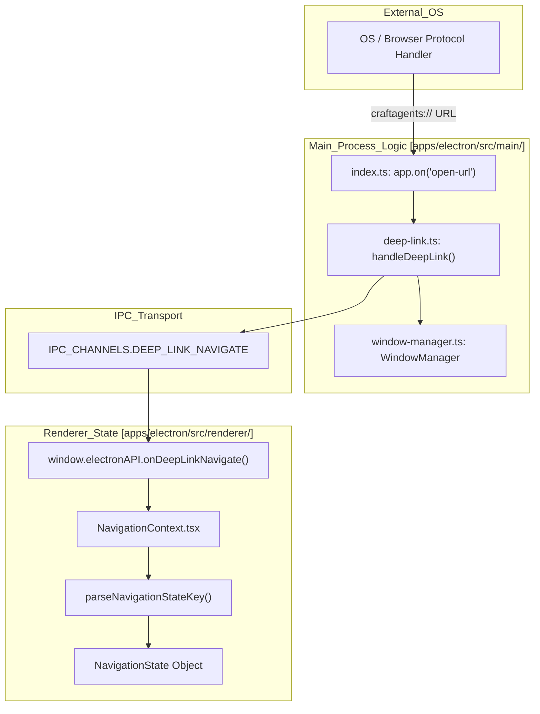
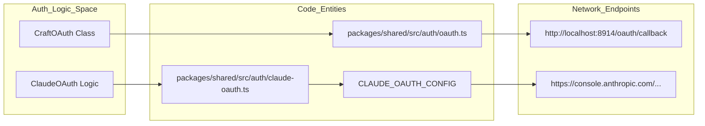

# Deep Link URLs

<details>
<summary>Relevant source files</summary>

The following files were used as context for generating this wiki page:

- [packages/shared/src/auth/__tests__/oauth.test.ts](packages/shared/src/auth/__tests__/oauth.test.ts)
- [packages/shared/src/auth/claude-oauth-config.ts](packages/shared/src/auth/claude-oauth-config.ts)
- [packages/shared/src/auth/claude-oauth.ts](packages/shared/src/auth/claude-oauth.ts)
- [packages/shared/src/auth/claude-token.ts](packages/shared/src/auth/claude-token.ts)
- [packages/shared/src/auth/oauth.ts](packages/shared/src/auth/oauth.ts)

</details>


This page documents the `craftagents://` URL scheme and the OAuth callback mechanisms used by Craft Agents. The system utilizes deep links for two primary purposes:

1.  **Navigation Links**: Opening specific views (sessions, sources, settings) or triggering actions (new chat) from outside the application (e.g., browser, email, or CLI).
2.  **OAuth Callbacks**: Receiving authorization codes from external browser-based authentication flows during the onboarding of providers like Claude Max, ChatGPT Plus, or GitHub Copilot.

## URL Scheme Overview

Craft Agents registers the `craftagents://` protocol handler with the operating system at application startup [apps/electron/src/main/index.ts:90](). When an external application opens a URL with this scheme, the OS routes it to the Craft Agents main process.

Navigation deep links are also utilized internally. For instance, when a session is opened in a new window, the application constructs a `craftagents://` URL to initialize the state of the newly created window [apps/electron/src/main/index.ts:1330-1340]().

Sources: [apps/electron/src/main/index.ts:90](), [apps/electron/src/main/index.ts:1330-1340]()

## Deep Link Architecture

Deep links flow from the OS protocol handler into the main process, are parsed by `handleDeepLink` in `apps/electron/src/main/deep-link.ts`, and are then forwarded to the renderer via the `DEEP_LINK_NAVIGATE` IPC channel.

### Deep Link Processing Flow

The following diagram illustrates how an external URL is transformed into a typed `NavigationState` within the renderer.

**Flow: External URL → NavigationState**



Sources: [apps/electron/src/main/index.ts:90](), [apps/electron/src/main/index.ts:1330-1340](), [apps/electron/src/shared/protocol.ts:1-50]()

## OAuth Callbacks and Redirects

While navigation uses the `craftagents://` scheme, OAuth flows utilize a combination of local HTTP servers and specific redirect URIs to capture authorization codes securely.

### Claude OAuth (PKCE)
Claude authentication uses a Proof Key for Code Exchange (PKCE) flow. The `prepareClaudeOAuth` function generates a `code_challenge` and `state` [packages/shared/src/auth/claude-oauth.ts:65-89](). The `REDIRECT_URI` is set to `https://console.anthropic.com/oauth/code/callback` [packages/shared/src/auth/claude-oauth-config.ts:30](). Users manually copy the resulting code back into the app for exchange via `exchangeClaudeCode` [packages/shared/src/auth/claude-oauth.ts:141-216]().

### Generic MCP OAuth
For Model Context Protocol (MCP) servers, `CraftOAuth` starts a local temporary HTTP server on a port between `8914` and `8924` [packages/shared/src/auth/oauth.ts:26-27](). The redirect path is hardcoded to `/oauth/callback` [packages/shared/src/auth/oauth.ts:28]().

**OAuth Entity Mapping**



Sources: [packages/shared/src/auth/oauth.ts:26-28](), [packages/shared/src/auth/claude-oauth.ts:65-89](), [packages/shared/src/auth/claude-oauth-config.ts:30]()

## URL Pattern Structure

Deep link URLs follow a hierarchical structure that mirrors the application's internal routing keys:

```
craftagents://<route-key>[/<sub-path>][?window=new]
```

| Component | Required | Description |
| :--- | :--- | :--- |
| `craftagents://` | Yes | Protocol scheme registered with the OS. |
| `<route-key>` | Yes | Top-level navigator: `allSessions`, `sources`, `settings`, `skills`, `automations`, `action`. |
| `/<sub-path>` | No | Additional path segments, e.g., `session/{id}` or `source/{slug}`. |
| `?window=new` | No | Optional query parameter to force the URL to open in a new window. |

Sources: [apps/electron/src/main/index.ts:1330-1340]()

## Supported Navigation Routes

These routes map directly to the `NavigationState` types. The path following the scheme is passed to `parseNavigationStateKey` to produce the appropriate state object.

| URL Pattern | Target View |
| :--- | :--- |
| `craftagents://allSessions` | All sessions list |
| `craftagents://allSessions/session/{id}` | Specific session detail |
| `craftagents://flagged` | Flagged sessions filter |
| `craftagents://archived` | Archived sessions filter |
| `craftagents://state:{stateId}` | Sessions filtered by workflow status |
| `craftagents://label:{labelId}` | Sessions filtered by label |
| `craftagents://sources` | Sources management list |
| `craftagents://sources/source/{slug}` | Specific source configuration |
| `craftagents://skills` | Skills management list |
| `craftagents://automations` | Automations list |
| `craftagents://settings` | General App Settings |
| `craftagents://settings:{subpage}` | Specific settings subpage (e.g., `shortcuts`) |

Sources: [apps/electron/src/main/index.ts:1330-1340]()

## Action Routes

Action routes trigger specific operations rather than just navigating to a view. These are handled via the `action` field in the deep link payload.

| URL Pattern | Description |
| :--- | :--- |
| `craftagents://action/new-chat` | Creates a new chat session in the current workspace. |
| `craftagents://action/new-chat?agentId={id}` | Creates a new chat using a specific agent connection. |

Sources: [apps/electron/src/main/index.ts:1330-1340]()

## Deep Link Processing Implementation

### Main Process: handleDeepLink
The `handleDeepLink(url, windowManager)` function in the main process is responsible for:
1.  Parsing the incoming `craftagents://` URL.
2.  Determining if the request requires a new window (via `?window=new`).
3.  Dispatching the `DeepLinkNavigation` payload to the appropriate `BrowserWindow` via IPC.

### Renderer: onDeepLinkNavigate
The renderer uses the `window.electronAPI.onDeepLinkNavigate` bridge to listen for incoming links. When a link is received, the `NavigationContext` updates the global application state, triggering a re-render of the UI to the requested view.

### Security and Validation
Deep link processing includes several security layers:
*   **Protocol Filtering**: The application explicitly validates the protocol. Only `craftagents://` is handled by the deep link logic [apps/electron/src/main/index.ts:90]().
*   **Route Validation**: `parseNavigationStateKey` acts as a whitelist. If a route key is not recognized, it returns `null`, and no navigation occurs.
*   **Sanitization**: Query parameters and path segments are parsed to ensure they do not contain malicious payloads before being used to update the application state.
*   **OAuth Discovery Security**: When discovering OAuth metadata for MCP servers, the system implements RFC 9728 protected resource discovery to prevent SSRF and ensure metadata is fetched from trusted endpoints [packages/shared/src/auth/__tests__/oauth.test.ts:65-101]().

Sources: [apps/electron/src/main/index.ts:90](), [apps/electron/src/main/index.ts:1330-1340](), [packages/shared/src/auth/__tests__/oauth.test.ts:65-101]()