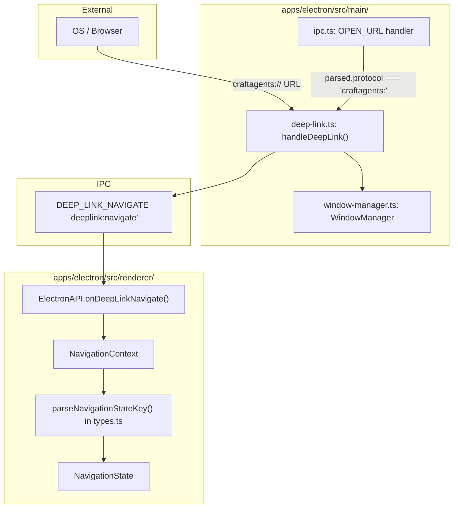
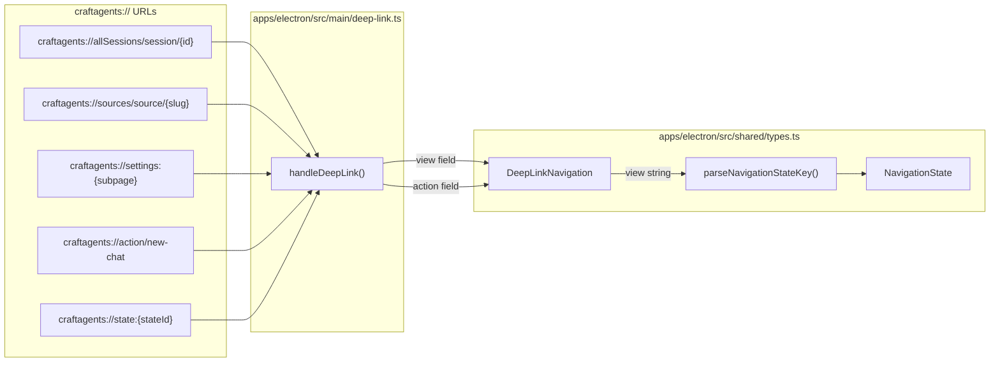
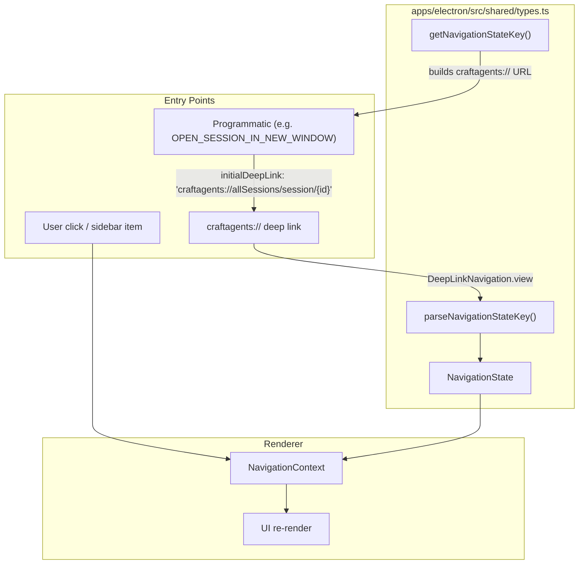

# Deep Link URLs

<details>
<summary>Relevant source files</summary>

The following files were used as context for generating this wiki page:

- [README.md](README.md)
- [apps/electron/src/main/ipc.ts](apps/electron/src/main/ipc.ts)
- [apps/electron/src/shared/types.ts](apps/electron/src/shared/types.ts)

</details>

This page documents the `craftagents://` URL scheme. The scheme serves two purposes:

1. **Navigation links** — Open specific views, sessions, or trigger actions from outside the application (e.g., from a browser, email, or external tool).
2. **OAuth callbacks** — Receive authorization codes from external browser-based authentication flows (Claude Max, ChatGPT Plus, GitHub Copilot).

For the internal navigation types that deep links map to, see page 2.5. For the IPC channel surface that transports deep link events, see page 2.6. For authentication setup flows that use these callbacks, see page 3.3.

## URL Scheme Overview

Craft Agents registers the `craftagents://` protocol handler with the operating system at application startup, across all supported platforms (macOS, Windows, Linux). When any external application or browser opens a URL with this scheme, the OS routes it to Craft Agents, launching or focusing the app first if necessary.

Navigation deep links are also used internally — for example, the `OPEN_SESSION_IN_NEW_WINDOW` IPC handler constructs `craftagents://allSessions/session/{sessionId}` to tell a newly created window which session to open.

Sources: [README.md:363-373](), [apps/electron/src/main/ipc.ts:222-229]()

## Deep Link Architecture

Deep links flow from the OS protocol handler into the main process, are parsed by `handleDeepLink` in `deep-link.ts`, and then forwarded to the renderer via the `DEEP_LINK_NAVIGATE` IPC channel. The renderer's `NavigationContext` processes the payload and converts it to a `NavigationState` using `parseNavigationStateKey`.

`craftagents://` URLs that are opened by the renderer itself (e.g., from the "Open in New Window" menu item) go through the `OPEN_URL` IPC handler, which detects the protocol and routes them to `handleDeepLink` as well.

### Deep Link Processing Flow

**Flow: External URL → NavigationState**



Sources: [apps/electron/src/main/ipc.ts:1093-1107](), [apps/electron/src/shared/types.ts:693-694](), [apps/electron/src/shared/types.ts:1066](), [apps/electron/src/shared/types.ts:1639-1715]()

## URL Pattern Structure

Deep link URLs follow a hierarchical structure that mirrors the application's `NavigationState` types:

```
craftagents://<route-key>[/<sub-path>][?window=new]
```

| Component        | Required | Description                                                                                  |
| ---------------- | -------- | -------------------------------------------------------------------------------------------- |
| `craftagents://` | Yes      | Protocol scheme registered with OS                                                           |
| `<route-key>`    | Yes      | Top-level navigator: `allSessions`, `sources`, `settings`, `skills`, `automations`, `action` |
| `/<sub-path>`    | No       | Additional path segments, e.g. `session/{id}`, `source/{slug}`                               |
| `?window=new`    | No       | Optional query param to open the URL in a new window                                         |

The route key and sub-path together form a compound string (e.g. `allSessions/session/abc123`) that `parseNavigationStateKey` in `apps/electron/src/shared/types.ts` converts to a typed `NavigationState` object.

Sources: [README.md:363-373](), [apps/electron/src/main/ipc.ts:1099-1107](), [apps/electron/src/shared/types.ts:1639-1715]()

## Supported URL Patterns

### Navigation Routes

These routes map directly to the `NavigationState` types defined in `apps/electron/src/shared/types.ts`. The path after `craftagents://` is passed to `parseNavigationStateKey` to produce the appropriate state.

| URL Pattern                                 | `NavigationState` type                                           | Description                 |
| ------------------------------------------- | ---------------------------------------------------------------- | --------------------------- |
| `craftagents://allSessions`                 | `SessionsNavigationState { filter: { kind: 'allSessions' } }`    | All sessions view           |
| `craftagents://allSessions/session/{id}`    | `SessionsNavigationState { details: { sessionId } }`             | Specific session            |
| `craftagents://flagged`                     | `SessionsNavigationState { filter: { kind: 'flagged' } }`        | Flagged sessions            |
| `craftagents://archived`                    | `SessionsNavigationState { filter: { kind: 'archived' } }`       | Archived sessions           |
| `craftagents://state:{stateId}`             | `SessionsNavigationState { filter: { kind: 'state', stateId } }` | Sessions by workflow status |
| `craftagents://label:{labelId}`             | `SessionsNavigationState { filter: { kind: 'label', labelId } }` | Sessions by label           |
| `craftagents://view:{viewId}`               | `SessionsNavigationState { filter: { kind: 'view', viewId } }`   | Saved view                  |
| `craftagents://sources`                     | `SourcesNavigationState { details: null }`                       | Sources list                |
| `craftagents://sources/source/{slug}`       | `SourcesNavigationState { details: { sourceSlug } }`             | Specific source             |
| `craftagents://skills`                      | `SkillsNavigationState { details: null }`                        | Skills list                 |
| `craftagents://skills/skill/{slug}`         | `SkillsNavigationState { details: { skillSlug } }`               | Specific skill              |
| `craftagents://automations`                 | `AutomationsNavigationState { details: null }`                   | Automations list            |
| `craftagents://automations/automation/{id}` | `AutomationsNavigationState { details: { automationId } }`       | Specific automation         |
| `craftagents://settings`                    | `SettingsNavigationState { subpage: 'app' }`                     | Settings (default subpage)  |
| `craftagents://settings:{subpage}`          | `SettingsNavigationState { subpage }`                            | Specific settings subpage   |

Sources: [README.md:363-373](), [apps/electron/src/shared/types.ts:1546-1551](), [apps/electron/src/shared/types.ts:1639-1715]()

### Action Routes

Action routes trigger operations rather than navigating to views. The `action` field of the `DeepLinkNavigation` payload carries the action type.

| URL Pattern                     | Description               |
| ------------------------------- | ------------------------- |
| `craftagents://action/new-chat` | Create a new chat session |

Sources: [README.md:363-373](), [apps/electron/src/shared/types.ts:1370-1378]()

## DeepLinkNavigation Payload

When the main process forwards a deep link to the renderer, it sends a `DeepLinkNavigation` object over the `DEEP_LINK_NAVIGATE` IPC channel. The renderer registers a listener via `ElectronAPI.onDeepLinkNavigate`.

```typescript
// apps/electron/src/shared/types.ts
export interface DeepLinkNavigation {
  view?: string // compound route, e.g. 'allSessions/session/abc123'
  tabType?: string
  tabParams?: Record<string, string>
  action?: string // e.g. 'new-chat'
  actionParams?: Record<string, string>
}
```

The `view` field is a compound string matching what `parseNavigationStateKey` accepts. `action` carries action route types. These are mutually exclusive — a given URL is either a navigation link (`view`) or an action (`action`).

Sources: [apps/electron/src/shared/types.ts:1370-1378](), [apps/electron/src/shared/types.ts:693-694]()

## Route Type Mapping

The following diagram maps URL patterns to the code that resolves them.

**URL Patterns → Code Resolution**



Sources: [apps/electron/src/main/ipc.ts:1093-1107](), [apps/electron/src/shared/types.ts:1370-1378](), [apps/electron/src/shared/types.ts:1639-1715]()

## Deep Link Processing Implementation

### Main Process: handleDeepLink

`apps/electron/src/main/deep-link.ts` contains `handleDeepLink(url, windowManager)`, which:

- Parses the `craftagents://` URL
- Determines whether to focus an existing window or create a new one (handles `?window=new` style parameters)
- Sends a `DeepLinkNavigation` payload over the `DEEP_LINK_NAVIGATE` IPC channel to the target renderer

This function is imported and called from two places in `ipc.ts`:

1. The `OPEN_URL` handler — when the renderer requests a `craftagents://` URL be opened (e.g., from "Open in New Window"). [apps/electron/src/main/ipc.ts:1099-1107]()
2. The OS `open-url` event listener in the main entry point — for URLs opened externally.

### Renderer: onDeepLinkNavigate

The renderer exposes `ElectronAPI.onDeepLinkNavigate(callback)` which registers a listener for the `'deeplink:navigate'` channel. The callback receives a `DeepLinkNavigation` object and the `NavigationContext` processes the `view` field through `parseNavigationStateKey` to produce a typed `NavigationState`.

### Route Resolution: parseNavigationStateKey and getNavigationStateKey

Both functions are in `apps/electron/src/shared/types.ts`:

- `parseNavigationStateKey(key: string): NavigationState | null` — Converts a compound route string (e.g. `allSessions/session/abc123`) to a typed `NavigationState` object. [apps/electron/src/shared/types.ts:1639-1715]()
- `getNavigationStateKey(state: NavigationState): string` — The inverse: converts a `NavigationState` to the canonical route string. Used when constructing deep links programmatically. [apps/electron/src/shared/types.ts:1600-1633]()

Sources: [apps/electron/src/main/ipc.ts:1093-1107](), [apps/electron/src/main/ipc.ts:222-229](), [apps/electron/src/shared/types.ts:1600-1715]()

## Integration with Navigation System

Deep links are one entry point into the navigation system alongside direct user interactions in the renderer. All paths converge on `parseNavigationStateKey` to produce a `NavigationState`.

**Navigation Entry Points → NavigationState**



Sources: [apps/electron/src/shared/types.ts:1546-1715](), [apps/electron/src/main/ipc.ts:222-229]()

## Usage Examples

### Opening a Specific Session from Email

An email notification can include a deep link to open the related session:

```
craftagents://allSessions/session/session-abc123
```

### Creating a New Session from an External Tool

A browser extension or script can trigger session creation:

```bash
# macOS/Linux
open "craftagents://action/new-chat"

# Windows PowerShell
Start-Process "craftagents://action/new-chat"
```

### Opening a Specific Source's Detail Page

Documentation or a setup guide can link to a specific source configuration:

```
craftagents://sources/source/linear-mcp
```

### Navigating to Sessions with a Specific Label

```
craftagents://label:urgent
```

### Navigating to a Specific Settings Subpage

```
craftagents://settings:shortcuts
```

Sources: [README.md:363-373](), [apps/electron/src/shared/types.ts:1639-1715]()

## Security Considerations

Deep links are processed within the Electron application's security context and follow these constraints:

1. **No arbitrary code execution** — Deep links only navigate to predefined routes or trigger predefined actions; they cannot execute arbitrary JavaScript.
2. **Validation** — The `parseNavigationStateKey` function returns `null` for unrecognized route keys, which are ignored.
3. **URL protocol filtering** — The `OPEN_URL` IPC handler explicitly blocks non-allowlisted protocols. Only `http:`, `https:`, `mailto:`, `craftdocs:`, and `craftagents:` are accepted; all others throw an error. [apps/electron/src/main/ipc.ts:1110-1113]()
4. **No credential exposure** — Deep links do not expose credentials or bypass the application's permission system.

Sources: [apps/electron/src/main/ipc.ts:1093-1119](), [apps/electron/src/shared/types.ts:1639-1715]()

## Complete URL Reference Table

| Category             | URL Pattern                                  | Description            | Example                                        |
| -------------------- | -------------------------------------------- | ---------------------- | ---------------------------------------------- |
| **Tab Routes**       |                                              |                        |                                                |
| Settings             | `craftagents://settings`                     | Open settings          | `craftagents://settings`                       |
| All Chats            | `craftagents://allChats`                     | Show all chats         | `craftagents://allChats`                       |
| Specific Chat        | `craftagents://allChats/chat/{id}`           | Open chat by ID        | `craftagents://allChats/chat/s-123`            |
| Agent Info           | `craftagents://agentInfo/{id}`               | Agent details          | `craftagents://agentInfo/claude`               |
| Sources              | `craftagents://sources`                      | Sources overview       | `craftagents://sources`                        |
| Source Detail        | `craftagents://sources/source/{id}`          | Specific source        | `craftagents://sources/source/github`          |
| **Action Routes**    |                                              |                        |                                                |
| New Chat             | `craftagents://action/new-chat`              | Create new chat        | `craftagents://action/new-chat`                |
| New Chat (Agent)     | `craftagents://action/new-chat?agentId={id}` | New chat with agent    | `craftagents://action/new-chat?agentId=claude` |
| Delete Session       | `craftagents://action/delete-session/{id}`   | Delete session         | `craftagents://action/delete-session/s-123`    |
| **Sidebar Routes**   |                                              |                        |                                                |
| Inbox                | `craftagents://inbox`                        | Show inbox             | `craftagents://inbox`                          |
| Flagged              | `craftagents://flagged`                      | Show flagged items     | `craftagents://flagged`                        |
| All Chats            | `craftagents://allChats`                     | Show all chats         | `craftagents://allChats`                       |
| **Workspace Routes** |                                              |                        |                                                |
| Workspace Context    | `craftagents://workspace/{id}/<route>`       | Any route in workspace | `craftagents://workspace/ws-1/settings`        |

**Sources:** [README.md:186-193](), [apps/electron/README.md:236-242](), [apps/electron/src/shared/routes.ts]()
