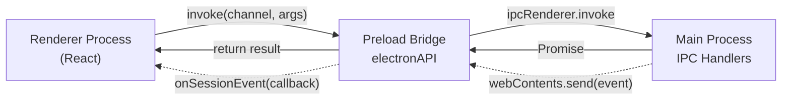
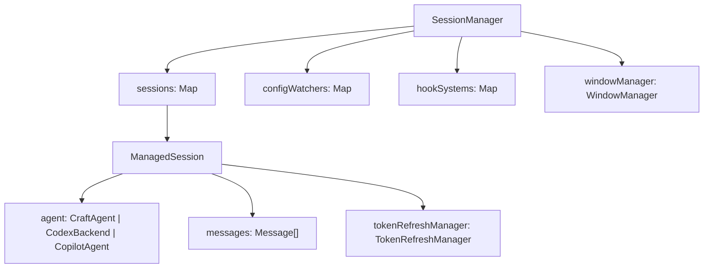
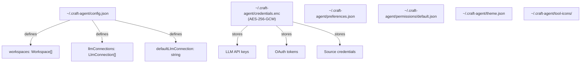
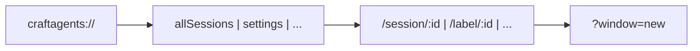
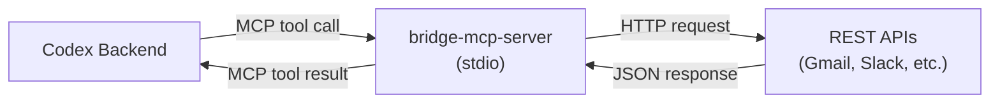

# API Reference

<details>
<summary>Relevant source files</summary>

The following files were used as context for generating this wiki page:

- [apps/electron/src/main/ipc.ts](apps/electron/src/main/ipc.ts)
- [apps/electron/src/shared/types.ts](apps/electron/src/shared/types.ts)

</details>

This document provides detailed API documentation for the IPC communication layer, SessionManager public methods, configuration file formats, deep link protocols, session-scoped tools, and MCP server binaries. This is the technical reference for developers integrating with or extending the Craft Agents OSS system.

For architectural context on how these APIs fit into the overall system, see [Architecture](#2). For development setup and build processes, see [Development Guide](#5).

---

## IPC Channels

The Electron application exposes a type-safe IPC API via the preload bridge. All channels are defined in `IPC_CHANNELS` and registered in the main process with corresponding handlers.

### Communication Pattern



**Sources:** [apps/electron/src/main/ipc.ts:1-1700](), [apps/electron/src/preload/index.ts]()

### Session Management Channels

| Channel                      | Request                                                          | Response                       | Description                           |
| ---------------------------- | ---------------------------------------------------------------- | ------------------------------ | ------------------------------------- |
| `GET_SESSIONS`               | none                                                             | `Session[]`                    | Get all sessions for active workspace |
| `GET_SESSION_MESSAGES`       | `sessionId: string`                                              | `Session` with messages        | Load messages for lazy loading        |
| `CREATE_SESSION`             | `workspaceId: string, options?: CreateSessionOptions`            | `Session`                      | Create new session                    |
| `CREATE_SUB_SESSION`         | `workspaceId: string, parentSessionId: string, options?`         | `Session`                      | Create child session                  |
| `DELETE_SESSION`             | `sessionId: string`                                              | `void`                         | Delete session and files              |
| `SEND_MESSAGE`               | `sessionId, message, attachments?, storedAttachments?, options?` | `{ started: true }`            | Send message (streams via events)     |
| `CANCEL_PROCESSING`          | `sessionId: string, silent?: boolean`                            | `void`                         | Interrupt agent processing            |
| `SESSION_COMMAND`            | `sessionId: string, command: SessionCommand`                     | varies                         | Unified session operations            |
| `GET_PENDING_PLAN_EXECUTION` | `sessionId: string`                                              | `{ planPath: string } \| null` | Get pending plan state                |

**Sources:** [apps/electron/src/main/ipc.ts:459-781]()

### Session Command Types

The `SESSION_COMMAND` channel accepts a discriminated union of command types:

```typescript
type SessionCommand =
  | { type: 'flag' }
  | { type: 'unflag' }
  | { type: 'archive' }
  | { type: 'unarchive' }
  | { type: 'rename'; name: string }
  | { type: 'setSessionStatus'; state: string }
  | { type: 'markRead' }
  | { type: 'markUnread' }
  | { type: 'setActiveViewing'; workspaceId: string }
  | { type: 'setPermissionMode'; mode: PermissionMode }
  | { type: 'setThinkingLevel'; level: ThinkingLevel }
  | { type: 'updateWorkingDirectory'; dir: string }
  | { type: 'setSources'; sourceSlugs: string[] }
  | { type: 'setLabels'; labels: string[] }
  | { type: 'showInFinder' }
  | { type: 'copyPath' }
  | { type: 'shareToViewer' }
  | { type: 'updateShare' }
  | { type: 'revokeShare' }
  | { type: 'startOAuth'; requestId: string }
  | { type: 'refreshTitle' }
  | { type: 'setConnection'; connectionSlug: string }
  | { type: 'setPendingPlanExecution'; planPath: string }
  | { type: 'markCompactionComplete' }
  | { type: 'clearPendingPlanExecution' }
  | { type: 'getSessionFamily' }
  | { type: 'updateSiblingOrder'; orderedSessionIds: string[] }
  | { type: 'archiveCascade' }
  | { type: 'deleteCascade' }
```

**Sources:** [apps/electron/src/main/ipc.ts:686-772](), [apps/electron/src/shared/types.ts]()

### Workspace Management Channels

| Channel                | Request                            | Response                            | Description                 |
| ---------------------- | ---------------------------------- | ----------------------------------- | --------------------------- |
| `GET_WORKSPACES`       | none                               | `Workspace[]`                       | List all workspaces         |
| `CREATE_WORKSPACE`     | `folderPath: string, name: string` | `Workspace`                         | Create workspace at folder  |
| `CHECK_WORKSPACE_SLUG` | `slug: string`                     | `{ exists: boolean, path: string }` | Validate workspace slug     |
| `GET_WINDOW_WORKSPACE` | none                               | `string \| null`                    | Get workspace ID for window |
| `OPEN_WORKSPACE`       | `workspaceId: string`              | `void`                              | Focus or create window      |
| `SWITCH_WORKSPACE`     | `workspaceId: string`              | `void`                              | Switch workspace in-window  |

**Sources:** [apps/electron/src/main/ipc.ts:481-592]()

### File Operations Channels

| Channel                | Request                                 | Response           | Description                    |
| ---------------------- | --------------------------------------- | ------------------ | ------------------------------ |
| `READ_FILE`            | `path: string`                          | `string`           | Read file as UTF-8 (validated) |
| `READ_FILE_DATA_URL`   | `path: string`                          | `string`           | Read as data: URL for preview  |
| `READ_FILE_BINARY`     | `path: string`                          | `Uint8Array`       | Read as binary (for PDFs)      |
| `OPEN_FILE_DIALOG`     | none                                    | `string[]`         | Native file picker             |
| `READ_FILE_ATTACHMENT` | `path: string`                          | `FileAttachment`   | Read with thumbnail            |
| `GENERATE_THUMBNAIL`   | `base64: string, mimeType: string`      | `string \| null`   | Generate Quick Look thumb      |
| `STORE_ATTACHMENT`     | `sessionId, attachment: FileAttachment` | `StoredAttachment` | Persist attachment to disk     |
| `OPEN_FILE`            | `path: string`                          | `void`             | Open in default app            |
| `SHOW_IN_FOLDER`       | `path: string`                          | `void`             | Reveal in Finder/Explorer      |

All file paths are validated via `validateFilePath()` to prevent path traversal attacks. Only paths within `homedir()` or `tmpdir()` are allowed, and sensitive patterns (`.ssh/`, `.aws/credentials`, etc.) are blocked.

**Sources:** [apps/electron/src/main/ipc.ts:784-1120](), [apps/electron/src/main/ipc.ts:393-454]()

### LLM Connection Channels

| Channel                      | Request                                         | Response                               | Description              |
| ---------------------------- | ----------------------------------------------- | -------------------------------------- | ------------------------ |
| `SETUP_LLM_CONNECTION`       | `LlmConnectionSetup`                            | `{ success: boolean, error?: string }` | Unified connection setup |
| `GET_LLM_CONNECTIONS`        | none                                            | `LlmConnection[]`                      | List all connections     |
| `GET_LLM_CONNECTION`         | `slug: string`                                  | `LlmConnection \| null`                | Get single connection    |
| `ADD_LLM_CONNECTION`         | `connection: LlmConnection`                     | `void`                                 | Add custom connection    |
| `UPDATE_LLM_CONNECTION`      | `slug: string, updates: Partial<LlmConnection>` | `void`                                 | Update connection        |
| `DELETE_LLM_CONNECTION`      | `slug: string`                                  | `void`                                 | Delete connection        |
| `GET_DEFAULT_LLM_CONNECTION` | none                                            | `string \| null`                       | Get default slug         |
| `SET_DEFAULT_LLM_CONNECTION` | `slug: string`                                  | `void`                                 | Set default              |
| `TOUCH_LLM_CONNECTION`       | `slug: string`                                  | `void`                                 | Update lastUsedAt        |

The `LlmConnectionSetup` type consolidates all connection configuration:

```typescript
interface LlmConnectionSetup {
  slug: string
  credential?: string // API key or OAuth token
  baseUrl?: string | null
  defaultModel?: string | null
  models?: ModelDefinition[] | null
}
```

**Sources:** [apps/electron/src/main/ipc.ts:1581-1712]()

### OAuth Flow Channels

| Channel               | Request                                     | Response               | Description             |
| --------------------- | ------------------------------------------- | ---------------------- | ----------------------- |
| `GET_OAUTH_URL`       | `slug: string`                              | `string`               | Get authorization URL   |
| `START_OAUTH_FLOW`    | `slug: string`                              | `void`                 | Open browser for OAuth  |
| `GET_OAUTH_STATUS`    | `slug: string`                              | `OAuthStatus`          | Poll for completion     |
| `CANCEL_OAUTH_FLOW`   | `slug: string`                              | `void`                 | Abort flow              |
| `COMPLETE_OAUTH_FLOW` | `slug: string, code: string, state: string` | `{ success: boolean }` | Exchange code for token |

**Sources:** [apps/electron/src/main/onboarding.ts]()

### Event Streaming

Bidirectional events are sent via `SESSION_EVENT` channel:

```typescript
type SessionEvent =
  | { type: 'start', sessionId: string }
  | { type: 'text_delta', sessionId: string, delta: string, turnId?: string }
  | { type: 'tool_use', sessionId: string, toolName: string, toolUseId: string, ... }
  | { type: 'tool_result', sessionId: string, toolUseId: string, ... }
  | { type: 'complete', sessionId: string }
  | { type: 'error', sessionId: string, error: string }
  | { type: 'permission_request', sessionId: string, requestId: string, ... }
  | { type: 'credential_request', sessionId: string, requestId: string, ... }
  | { type: 'auth_request', sessionId: string, requestId: string, ... }
  | { type: 'session_created', session: Session, workspaceId: string }
  | { type: 'session_deleted', sessionId: string, workspaceId: string }
  | { type: 'labels_changed', sessionId: string, labels: string[] }
  | { type: 'session_flagged' | 'session_unflagged', sessionId: string }
  | { type: 'name_changed', sessionId: string, name?: string }
  | { type: 'session_status_changed', sessionId: string, sessionStatus: string }
```

Events are batched for performance (50ms intervals) to reduce IPC overhead during streaming.

**Sources:** [apps/electron/src/main/sessions.ts:922-927](), [apps/electron/src/shared/types.ts]()

---

## SessionManager API

The `SessionManager` class is the main process's session orchestrator. It manages agent instances, message processing, configuration watching, and hook execution.

### Core Architecture



**Sources:** [apps/electron/src/main/sessions.ts:929-957]()

### Initialization

```typescript
class SessionManager {
  async initialize(): Promise<void>
  waitForInit(): Promise<void>
}
```

`initialize()` is called once at app startup. It:

1. Sets paths to Claude SDK CLI, Copilot binary, and network interceptors
2. Sets bundled Bun path for packaged apps
3. Runs credential migrations (legacy formats)
4. Reinitializes auth environment variables
5. Loads all sessions from disk
6. Marks initialization complete via `InitGate`

`waitForInit()` blocks until initialization completes. All IPC handlers call this before accessing sessions.

**Sources:** [apps/electron/src/main/sessions.ts:1392-1549]()

### Session Lifecycle Methods

| Method                 | Signature                                                                      | Description                   |
| ---------------------- | ------------------------------------------------------------------------------ | ----------------------------- |
| `createSession`        | `(workspaceId: string, options?: CreateSessionOptions) => Session`             | Create new session            |
| `createSubSession`     | `(workspaceId: string, parentSessionId: string, options?) => Promise<Session>` | Create child session          |
| `getSession`           | `(sessionId: string) => Promise<Session \| null>`                              | Load session with messages    |
| `getSessions`          | `(workspaceId?: string) => Session[]`                                          | List sessions (metadata only) |
| `deleteSession`        | `(sessionId: string) => Promise<void>`                                         | Delete session and files      |
| `deleteSessionCascade` | `(sessionId: string) => Promise<void>`                                         | Delete session + children     |

Sessions are lazy-loaded: `getSessions()` returns metadata only (no messages). Call `getSession(id)` to load full message history.

**Sources:** [apps/electron/src/main/sessions.ts:1551-1708](), [apps/electron/src/main/sessions.ts:2485-2568]()

### Message Processing

| Method                | Signature                                                                           | Description           |
| --------------------- | ----------------------------------------------------------------------------------- | --------------------- |
| `sendMessage`         | `(sessionId, message, attachments?, storedAttachments?, options?) => Promise<void>` | Send message to agent |
| `cancelProcessing`    | `(sessionId: string, silent?: boolean) => Promise<void>`                            | Interrupt agent       |
| `killShell`           | `(sessionId, shellId: string) => Promise<void>`                                     | Kill background shell |
| `getTaskOutput`       | `(taskId: string) => Promise<string>`                                               | Read task output file |
| `respondToPermission` | `(sessionId, requestId, allowed, alwaysAllow) => boolean`                           | Approve/deny tool use |
| `respondToCredential` | `(sessionId, requestId, response) => boolean`                                       | Provide auth input    |

`sendMessage()` is non-blocking. It returns immediately, and results stream via `SESSION_EVENT` channel. The method:

1. Loads or creates the agent instance (lazy)
2. Refreshes OAuth tokens if needed
3. Builds source servers (MCP + API)
4. Calls `agent.chat()` with streaming callbacks
5. Persists messages to JSONL after completion

**Sources:** [apps/electron/src/main/sessions.ts:2732-3289]()

### Metadata Operations

| Method              | Signature                                        | Description         |
| ------------------- | ------------------------------------------------ | ------------------- |
| `flagSession`       | `(sessionId: string) => Promise<void>`           | Mark as flagged     |
| `unflagSession`     | `(sessionId: string) => Promise<void>`           | Unmark flagged      |
| `archiveSession`    | `(sessionId: string) => Promise<void>`           | Archive session     |
| `unarchiveSession`  | `(sessionId: string) => Promise<void>`           | Unarchive session   |
| `renameSession`     | `(sessionId, name: string) => Promise<void>`     | Set user title      |
| `setSessionStatus`  | `(sessionId, status: string) => Promise<void>`   | Set workflow status |
| `setSessionLabels`  | `(sessionId, labels: string[]) => Promise<void>` | Set labels          |
| `markSessionRead`   | `(sessionId: string) => Promise<void>`           | Clear unread badge  |
| `markSessionUnread` | `(sessionId: string) => Promise<void>`           | Set unread badge    |

All metadata updates emit events to the renderer and persist to disk via `updateSessionMetadata()`.

**Sources:** [apps/electron/src/main/sessions.ts:3808-4104]()

### Configuration & Sources

| Method                     | Signature                                              | Description                |
| -------------------------- | ------------------------------------------------------ | -------------------------- |
| `setSessionSources`        | `(sessionId, sourceSlugs: string[]) => Promise<void>`  | Enable sources for session |
| `setSessionPermissionMode` | `(sessionId, mode: PermissionMode) => Promise<void>`   | Set safe/ask/allow-all     |
| `setSessionThinkingLevel`  | `(sessionId, level: ThinkingLevel) => Promise<void>`   | Set thinking level         |
| `setSessionConnection`     | `(sessionId, connectionSlug: string) => Promise<void>` | Set LLM connection         |
| `updateWorkingDirectory`   | `(sessionId, dir: string) => Promise<void>`            | Set bash cwd               |
| `setupConfigWatcher`       | `(workspaceRootPath, workspaceId: string) => void`     | Start watching configs     |

`setupConfigWatcher()` creates a `ConfigWatcher` that monitors workspace files and broadcasts changes via IPC. It handles:

- Source config changes → rebuild servers for active sessions
- Skill changes → broadcast to UI
- Label/status changes → broadcast to UI
- Hooks config changes → reload HookSystem
- LLM connection changes → broadcast to UI

**Sources:** [apps/electron/src/main/sessions.ts:976-1191](), [apps/electron/src/main/sessions.ts:4167-4299]()

### Viewer Sharing

| Method          | Signature                                                     | Description            |
| --------------- | ------------------------------------------------------------- | ---------------------- |
| `shareToViewer` | `(sessionId: string) => Promise<{ url: string, id: string }>` | Share to viewer        |
| `updateShare`   | `(sessionId: string) => Promise<{ url: string }>`             | Refresh shared content |
| `revokeShare`   | `(sessionId: string) => Promise<void>`                        | Revoke share           |

Sharing uploads session transcript to `viewer.craft-agents.com` and returns a public URL.

**Sources:** [apps/electron/src/main/sessions.ts:4501-4654]()

### Agent Instance Management

Sessions use lazy agent instantiation. The agent is `null` until the first message is sent:

```typescript
interface ManagedSession {
  agent: CraftAgent | CodexBackend | CopilotAgent | null
  agentReady?: Promise<void>
  agentReadyResolve?: () => void
}
```

Agent creation:

1. Resolves session's LLM connection
2. Loads all sources (workspace-level)
3. Builds MCP/API servers for enabled sources
4. Creates agent instance (Claude, Codex, or Copilot)
5. Sets up event streaming callbacks
6. For Codex: writes `config.toml` to `.codex-home/`
7. For Copilot: writes bridge config to `.copilot-config/`

**Sources:** [apps/electron/src/main/sessions.ts:2732-3003]()

---

## Configuration Files

Craft Agents OSS uses a hierarchical configuration system with global settings and workspace-level overrides.

### Global Configuration Hierarchy



**Sources:** [packages/shared/src/config/index.ts](), [packages/shared/src/credentials/manager.ts]()

### config.json Structure

```json
{
  "workspaces": [
    {
      "id": "workspace-id",
      "name": "My Workspace",
      "rootPath": "/Users/name/workspace",
      "createdAt": 1234567890
    }
  ],
  "activeWorkspace": "workspace-id",
  "llmConnections": [
    {
      "slug": "anthropic-api",
      "name": "Anthropic (API Key)",
      "providerType": "anthropic",
      "authType": "api_key",
      "models": [...],
      "defaultModel": "claude-3-7-sonnet-20250219",
      "createdAt": 1234567890,
      "lastUsedAt": 1234567890
    }
  ],
  "defaultLlmConnection": "anthropic-api",
  "dismissedUpdateVersion": "0.2.3",
  "gitBashPath": "C:\\Program Files\\Git\\bin\\bash.exe"
}
```

**Sources:** [packages/shared/src/config/schema.ts](), [packages/shared/src/config/storage.ts]()

### Workspace Configuration

Each workspace folder contains:

```
workspace-root/
├── config.json           # Workspace settings (optional)
├── sources/              # Source configurations
│   ├── linear/
│   │   ├── config.json
│   │   └── icon.png (optional)
│   └── gmail/
│       └── config.json
├── skills/               # Agent skills/instructions
│   ├── code-review/
│   │   ├── config.json
│   │   ├── icon.png (optional)
│   │   └── instruction.md
│   └── summarize/
│       └── config.json
├── sessions/             # Session transcripts
│   └── session-id/
│       ├── session.jsonl
│       ├── attachments/
│       └── plans/
├── statuses/             # Workflow statuses
│   ├── config.json
│   └── icons/
├── labels/               # Label config
│   └── config.json
├── hooks.json            # Event hooks
└── theme.json            # Workspace theme override
```

**Sources:** [packages/shared/src/workspaces/index.ts](), [packages/shared/src/config/defaults.ts]()

### Source Configuration

Each source has a `config.json` in `sources/<slug>/`:

```json
{
  "slug": "linear",
  "name": "Linear",
  "tagline": "Issue tracking and project management",
  "icon": "🔷",
  "type": "mcp",
  "provider": "linear",
  "enabled": true,
  "isAuthenticated": true,
  "needsReauth": false,
  "permissionMode": "ask",
  "settings": {
    "serverType": "stdio",
    "command": "npx",
    "args": ["-y", "@modelcontextprotocol/server-linear"],
    "env": {
      "LINEAR_API_KEY": "${credential}"
    }
  }
}
```

API sources use `type: "api"` and have different settings:

```json
{
  "slug": "gmail",
  "type": "api",
  "provider": "google-gmail",
  "authMode": "oauth",
  "settings": {
    "scopes": ["https://www.googleapis.com/auth/gmail.readonly"]
  }
}
```

**Sources:** [packages/shared/src/sources/schema.ts](), [packages/shared/src/sources/storage.ts]()

### Skill Configuration

Skills have `config.json` + `instruction.md`:

```json
{
  "slug": "code-review",
  "name": "Code Reviewer",
  "description": "Reviews code for best practices",
  "icon": "👀",
  "version": "1.0.0",
  "author": "Your Name",
  "tags": ["code", "review"]
}
```

The `instruction.md` contains the system prompt:

```markdown
You are a senior code reviewer. When reviewing code:

1. Check for common bugs and edge cases
2. Suggest performance improvements
3. Ensure code follows project conventions

Be constructive and explain your reasoning.
```

**Sources:** [packages/shared/src/skills/schema.ts](), [packages/shared/src/skills/storage.ts]()

### Session Persistence (JSONL)

Sessions are stored in `sessions/<id>/session.jsonl`:

```jsonl
{"version":1,"name":"Debug parser","isFlagged":false,"createdAt":1234567890,"messageCount":12,"labels":["bug","urgent"],"sessionStatus":"in-progress"}
{"id":"msg-1","type":"user","content":"Help me debug this parser","timestamp":1234567890}
{"id":"msg-2","type":"assistant","content":"I'll help you debug that parser...","timestamp":1234567891}
{"id":"msg-3","type":"tool_use","toolName":"Read","toolUseId":"tool-1","timestamp":1234567892}
```

The first line is the header (metadata). Subsequent lines are messages. This format:

- Enables fast metadata loading without reading all messages
- Supports streaming writes (append-only)
- Is human-readable for debugging
- Compresses well (gzip ~10:1 ratio)

**Sources:** [packages/shared/src/sessions/storage.ts:1-500]()

### Hooks Configuration

`hooks.json` defines event-driven automation:

```json
{
  "version": 1,
  "hooks": [
    {
      "name": "Auto-label urgent bugs",
      "trigger": "SessionMessageComplete",
      "conditions": {
        "messageLabeledWith": ["bug"],
        "messageContains": "urgent"
      },
      "action": {
        "type": "command",
        "command": "addLabel",
        "args": {
          "label": "urgent"
        }
      }
    },
    {
      "name": "Daily standup reminder",
      "trigger": "ScheduledTime",
      "schedule": {
        "cron": "0 9 * * 1-5",
        "timezone": "America/New_York"
      },
      "action": {
        "type": "prompt",
        "prompt": "Create a standup summary of yesterday's work",
        "labels": ["standup"],
        "permissionMode": "allow-all"
      }
    }
  ]
}
```

**Sources:** [packages/shared/src/hooks-simple/schema.ts](), [packages/shared/src/hooks-simple/engine.ts]()

### Status Configuration

`statuses/config.json` defines workflow states:

```json
{
  "version": 1,
  "statuses": [
    {
      "id": "todo",
      "name": "To Do",
      "color": "#94a3b8",
      "icon": "circle.png",
      "isOpen": true,
      "order": 0
    },
    {
      "id": "done",
      "name": "Done",
      "color": "#22c55e",
      "icon": "check.png",
      "isOpen": false,
      "order": 3
    }
  ]
}
```

Icons are stored in `statuses/icons/<filename>` and referenced by filename.

**Sources:** [packages/shared/src/statuses/schema.ts](), [packages/shared/src/statuses/storage.ts]()

---

## Deep Link URLs

The `craftagents://` protocol enables deep linking to sessions and workspaces.

### URL Structure



**Sources:** [apps/electron/src/main/deep-link.ts]()

### Supported Routes

| URL Pattern                                | Description              | Example                                    |
| ------------------------------------------ | ------------------------ | ------------------------------------------ |
| `craftagents://allSessions`                | Navigate to all sessions | `craftagents://allSessions`                |
| `craftagents://allSessions/session/:id`    | Open specific session    | `craftagents://allSessions/session/abc123` |
| `craftagents://allSessions/label/:labelId` | Filter by label          | `craftagents://allSessions/label/urgent`   |
| `craftagents://settings`                   | Open settings            | `craftagents://settings`                   |
| `craftagents://settings/:page`             | Open settings page       | `craftagents://settings/sources`           |

### Query Parameters

- `?window=new` - Open in new window instead of focusing existing

Example: `craftagents://allSessions/session/abc123?window=new`

### Registration

The protocol is registered in `electron-builder.yml`:

```yaml
protocols:
  - name: Craft Agents
    schemes: [craftagents]
```

Deep links are handled by `handleDeepLink()` which:

1. Parses the URL
2. Determines target workspace from session ID
3. Focuses or creates window
4. Navigates to route

**Sources:** [apps/electron/src/main/deep-link.ts:1-150](), [electron-builder.yml]()

---

## Session-Scoped Tools

Session-scoped tools are available to all agents via the `session-mcp-server` binary. They provide session-aware operations that interact with workspace configuration and state.

### Tool Inventory

```mermaid
graph TB
    SessionMCP["session-mcp-server"]

    SessionMCP --> SubmitPlan["SubmitPlan<br/>Write execution plan"]
    SessionMCP --> ConfigValidate["config_validate<br/>Validate workspace config"]
    SessionMCP --> SkillValidate["skill_validate<br/>Validate skill config"]
    SessionMCP --> MermaidValidate["mermaid_validate<br/>Validate diagram syntax"]
    SessionMCP --> SourceTest["source_test<br/>Test source connectivity"]
    SessionMCP --> OAuth["source_*_oauth_trigger<br/>Initiate OAuth flows"]
    SessionMCP --> CredPrompt["source_credential_prompt<br/>Request API keys"]
    SessionMCP --> CallLLM["call_llm<br/>Query LLM for meta-tasks"]
    SessionMCP --> TransformData["transform_data<br/>JSON/YAML transformations"]
    SessionMCP --> RenderTemplate["render_template<br/>Jinja2 templating"]
```



**Sources:** [packages/session-mcp-server/src/index.ts](), [packages/session-tools-core/src/tools/]()

### SubmitPlan

Writes a structured execution plan to `sessions/<id>/plans/<timestamp>.md`.

**Input Schema:**

```typescript
{
  plan: string // Markdown-formatted plan
  summary: string // One-line summary
}
```

**Output:** `{ planPath: string }`

Plans are displayed in the UI as collapsible sections with an "Accept & Compact" button. Accepting a plan triggers:

1. Plan is marked as pending via `setPendingPlanExecution()`
2. UI sends special message: "Accepted. Please execute the plan."
3. Agent reads plan file and executes steps
4. On completion, plan is marked complete via `markCompactionComplete()`
5. Turns are compacted: intermediate tool calls are hidden, final summary is shown

**Sources:** [packages/session-tools-core/src/tools/submit-plan.ts](), [packages/shared/src/sessions/storage.ts:400-500]()

### config_validate

Validates workspace configuration files against their schemas.

**Input Schema:**

```typescript
{
  configType: 'source' | 'skill' | 'status' | 'label' | 'hook'
  configContent: string // JSON content to validate
}
```

**Output:** `{ valid: boolean, errors?: string[] }`

Uses Zod schemas from `@craft-agent/shared` to validate structure. Commonly used before writing config changes.

**Sources:** [packages/session-tools-core/src/tools/config-validate.ts]()

### skill_validate

Validates skill configuration and instruction.

**Input Schema:**

```typescript
{
  config: object // skill config.json
  instruction: string // instruction.md content
}
```

**Output:** `{ valid: boolean, errors?: string[], warnings?: string[] }`

Checks:

- Config schema validity (slug, name, description, icon)
- Instruction length (warns if >10k chars)
- Required fields
- Slug format (alphanumeric + hyphens)

**Sources:** [packages/session-tools-core/src/tools/skill-validate.ts]()

### OAuth Trigger Tools

Initiate OAuth flows for API sources:

- `source_google_oauth_trigger` - Google (Gmail, Calendar, Drive)
- `source_slack_oauth_trigger` - Slack
- `source_microsoft_oauth_trigger` - Microsoft (Outlook, Teams)
- `source_oauth_trigger` - Generic OAuth (Linear, Notion, etc.)

**Input Schema:**

```typescript
{
  sourceSlug: string
}
```

**Output:** `{ status: 'pending', requestId: string }`

The tool returns immediately with a `requestId`. The agent should pause and wait for completion. OAuth flow:

1. Main process opens browser to provider's auth URL
2. User grants permissions
3. Provider redirects to callback URL with code
4. Main process exchanges code for token
5. Token is stored in credentials.enc
6. Session receives `auth_request` event with status=approved
7. Agent resumes

**Sources:** [packages/session-tools-core/src/tools/oauth-triggers.ts]()

### call_llm

Queries an LLM for meta-tasks (research, summarization, template generation).

**Input Schema:**

```typescript
{
  prompt: string
  model?: string           // Override session model
  maxTokens?: number       // Default: 4096
  temperature?: number     // Default: 0.7
}
```

**Output:** `{ response: string, model: string, tokensUsed: number }`

Uses the workspace's default LLM connection. Commonly used for:

- Researching API documentation
- Generating configuration templates
- Summarizing large datasets

**Sources:** [packages/session-tools-core/src/tools/call-llm.ts]()

### Tool Metadata

All session tools include display metadata for UI rendering:

```typescript
interface ToolDisplayMeta {
  displayName: string
  iconDataUrl?: string // Base64-encoded icon
  description?: string
  category: 'native' | 'source' | 'skill'
}
```

Tool names follow the pattern `mcp__session__<toolName>` in agent events. The SessionManager resolves metadata via `resolveToolDisplayMeta()`.

**Sources:** [apps/electron/src/main/sessions.ts:496-659]()

---

## MCP Server Binaries

Craft Agents OSS includes two MCP server binaries for protocol translation and session-scoped tools.

### bridge-mcp-server

Translates REST API calls to MCP protocol for Codex/Copilot backends (which only support MCP, not direct HTTP).



**Command Line:**

```bash
bun packages/bridge-mcp-server/dist/index.js \
  --config /path/to/bridge-config.json \
  --workspace workspace-id
```

**Configuration (bridge-config.json):**

```json
{
  "sources": [
    {
      "slug": "gmail",
      "provider": "google-gmail",
      "name": "Gmail"
    }
  ]
}
```

The bridge:

1. Reads credentials from `~/.craft-agent/credentials.enc` using workspace ID
2. Loads OpenAPI schemas from `@craft-agent/shared/sources/api-sources/<provider>/`
3. Registers MCP tools with names like `api_gmail__search_emails`
4. Translates MCP tool calls to HTTP requests
5. Handles OAuth token refresh via credential cache files
6. Returns responses as MCP tool results

**Sources:** [packages/bridge-mcp-server/src/index.ts](), [packages/shared/src/codex/config-generator.ts:100-200]()

### session-mcp-server

Provides session-scoped tools (SubmitPlan, config_validate, etc.) to agents.

**Command Line:**

```bash
bun packages/session-mcp-server/dist/index.js \
  --session-id abc123 \
  --workspace-root /path/to/workspace \
  --plans-folder /path/to/workspace/sessions/abc123/plans
```

**Tool Registration:**

The server registers tools with the MCP protocol:

- `SubmitPlan` - Write execution plans
- `config_validate` - Validate configs
- `skill_validate` - Validate skills
- `mermaid_validate` - Validate diagrams
- `source_test` - Test source connectivity
- `source_*_oauth_trigger` - OAuth flows
- `source_credential_prompt` - Request API keys
- `call_llm` - Query LLM
- `transform_data` - JSON/YAML transformations
- `render_template` - Jinja2 templating

Each tool implementation is in `@craft-agent/session-tools-core`.

**Sources:** [packages/session-mcp-server/src/index.ts](), [packages/session-tools-core/src/tools/]()

### Integration Points

#### Codex Integration

For Codex sessions, the main process:

1. Generates `config.toml` with MCP server configurations
2. Writes credential cache files to `workspace/sources/<slug>/.credential-cache.json`
3. Starts Codex app-server subprocess with `CODEX_HOME` set
4. Codex reads `config.toml` and spawns MCP servers as stdio subprocesses

**Sources:** [apps/electron/src/main/sessions.ts:306-420](), [packages/shared/src/codex/config-generator.ts]()

#### Claude Integration

For Claude sessions, the main process:

1. Builds MCP server configs using `buildServersFromSources()`
2. Passes configs to `CraftAgent` via SDK's `createSdkMcpServer()`
3. Claude SDK spawns MCP servers as stdio subprocesses
4. Session MCP server is always included with `--session-id` flag

**Sources:** [apps/electron/src/main/sessions.ts:2800-2900]()

#### Copilot Integration

For Copilot sessions, the main process:

1. Writes `bridge-config.json` to `.copilot-config/`
2. Writes credential cache files (same as Codex)
3. Passes MCP configs to `CopilotAgent` via `buildMcpConfig()`
4. Copilot SDK spawns MCP servers as stdio subprocesses

**Sources:** [apps/electron/src/main/sessions.ts:445-483](), [packages/shared/src/agent/backend/copilot.ts]()

---

## Type Definitions

All IPC channels, session types, and message schemas are defined in TypeScript for type safety.

### Core Type Locations

| Module        | Location                                | Exports                                              |
| ------------- | --------------------------------------- | ---------------------------------------------------- |
| IPC Channels  | `apps/electron/src/shared/types.ts`     | `IPC_CHANNELS`, `SessionEvent`, `Session`, `Message` |
| Configuration | `packages/shared/src/config/schema.ts`  | `Workspace`, `LlmConnection`, `ModelDefinition`      |
| Sessions      | `packages/shared/src/sessions/types.ts` | `StoredSession`, `StoredMessage`, `SessionMetadata`  |
| Sources       | `packages/shared/src/sources/schema.ts` | `SourceConfig`, `McpServerConfig`, `ApiServerConfig` |
| Skills        | `packages/shared/src/skills/schema.ts`  | `SkillConfig`, `LoadedSkill`                         |
| Agent         | `packages/shared/src/agent/types.ts`    | `AgentEvent`, `PermissionMode`, `ThinkingLevel`      |

**Sources:** [apps/electron/src/shared/types.ts](), [packages/shared/src/config/schema.ts](), [packages/shared/src/sessions/types.ts]()

### Message Type Hierarchy

```typescript
interface Message {
  id: string
  role: 'user' | 'assistant' | 'tool' | 'error' | 'plan'
  content: string
  timestamp: number

  // Tool fields (when role='tool')
  toolName?: string
  toolUseId?: string
  toolInput?: Record<string, unknown>
  toolResult?: string
  toolStatus?: 'pending' | 'success' | 'error'
  toolDisplayMeta?: ToolDisplayMeta
  parentToolUseId?: string

  // Turn grouping
  isIntermediate?: boolean // Hide in compact view
  turnId?: string // Group messages in same turn

  // Attachments
  attachments?: Array<FileAttachment | StoredAttachment>

  // Content badges (@mentions, #labels)
  badges?: ContentBadge[]

  // Auth request
  authRequestId?: string
  authRequestType?: 'oauth' | 'credential'
  authSourceSlug?: string
  authStatus?: 'pending' | 'approved' | 'denied'

  // Plan fields
  planPath?: string

  // Error fields
  errorCode?: string
  errorTitle?: string
  errorDetails?: string
}
```

**Sources:** [apps/electron/src/shared/types.ts:100-300]()
