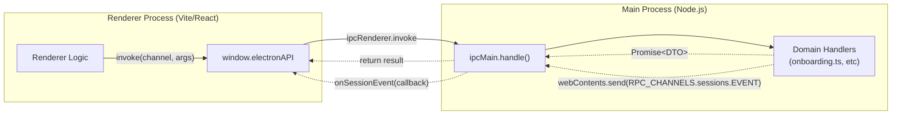
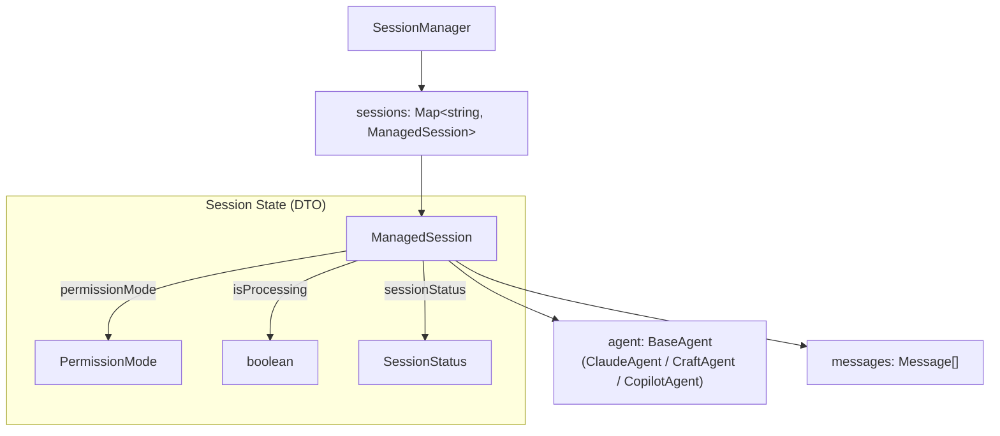

# API Reference

Relevant source files

The following files were used as context for generating this wiki page:

- [packages/shared/src/protocol/channels.ts](packages/shared/src/protocol/channels.ts)
- [packages/shared/src/protocol/dto.ts](packages/shared/src/protocol/dto.ts)

This document provides a technical reference for developers integrating with or extending Craft Agents internals. It covers the IPC communication layer, the central `SessionManager` orchestrator, configuration schemas, deep link protocols, session-scoped tools, and MCP server binaries.

For architectural context on how these APIs fit into the overall system, see [Architecture](#2). For development setup and build processes, see [Development Guide](#5).

---

## IPC Channels

The Electron application exposes a type-safe IPC API via the preload bridge. All channels are organized by domain namespace in `RPC_CHANNELS`.

### Communication Pattern

**Sources:** [packages/shared/src/protocol/channels.ts:1-205](), [packages/shared/src/protocol/dto.ts:1-200]()

### Domain Namespaces

| Namespace | Purpose | Key Channels |
|-----------|---------|--------------|
| `sessions` | Message flow and state | `CREATE`, `SEND_MESSAGE`, `CANCEL`, `COMMAND` |
| `workspaces` | Workspace lifecycle | `GET`, `CREATE`, `CHECK_SLUG` |
| `llmConnections` | Provider management | `LIST`, `SAVE`, `TEST`, `REFRESH_MODELS` |
| `file` | Secure filesystem access | `READ`, `STORE_ATTACHMENT`, `GENERATE_THUMBNAIL` |
| `onboarding` | First-run setup | `GET_AUTH_STATE`, `START_CLAUDE_OAUTH`, `EXCHANGE_CLAUDE_CODE` |
| `theme` | Visual customization | `GET_COLOR_THEME`, `SET_WORKSPACE_COLOR_THEME` |
| `update` | App updates | `CHECK`, `INSTALL`, `GET_INFO` |

For a complete reference of all constants, parameters, and return types, see the [IPC Channels](#8.1) child page.

**Sources:** [packages/shared/src/protocol/channels.ts:6-205]()

---

## SessionManager API

The `SessionManager` class is the central orchestrator in the main process. It manages the lifecycle of `ManagedSession` objects, handles agent instantiation, and coordinates between the filesystem and the UI.

### Core Structure

**Sources:** [packages/shared/src/protocol/dto.ts:46-104]()

### Key Responsibilities
- **Session Lifecycle**: Creation via `CreateSessionOptions`, lazy-loading from JSONL, branching, and deletion.
- **Agent Orchestration**: Selecting the correct `BaseAgent` implementation based on the session's `llmConnection` and `model`.
- **Event Dispatching**: Converting internal agent events into `SessionEvent` DTOs (e.g., `text_delta`, `tool_start`, `complete`) for the renderer.

For details on public methods and the `ManagedSession` internal structure, see [SessionManager API](#8.2).

**Sources:** [packages/shared/src/protocol/dto.ts:106-131](), [packages/shared/src/protocol/dto.ts:159-181]()

---

## Configuration Files

Craft Agents uses a hierarchical configuration system. Global settings are stored in the user's home directory, while workspace-specific settings live within the workspace folder.

### Configuration Hierarchy

| File | Scope | Primary Schema / Purpose |
|------|-------|-------------------------|
| `config.json` | Global | `StoredConfig`: Workspaces list and `LlmConnection` management. |
| `preferences.json` | Global | UI preferences, telemetry settings, and window state. |
| `automations.json` | Global | Version 2 schema for event-driven agent triggers. |
| `workspace/config.json` | Workspace | Workspace-specific overrides and source activations. |
| `theme.json` | Both | `ThemeOverrides` for custom styling. |

For detailed schema definitions and file locations, see [Configuration Files](#8.3).

**Sources:** [packages/shared/src/protocol/dto.ts:34-40](), [packages/shared/src/protocol/channels.ts:169-181]()

---

## Deep Link URLs

Craft Agents supports a custom URL scheme (`craftagents://`) used for OAuth callbacks and cross-application navigation.

- **OAuth Callbacks**: Used to return authorization codes from providers like Anthropic (`onboarding:exchangeClaudeCode`) or ChatGPT back to the application.
- **Navigation**: Handled via `deeplink:navigate`, allowing external tools to link directly to a specific session or workspace.

For the full URL scheme specification, see [Deep Link URLs](#8.4).

**Sources:** [packages/shared/src/protocol/channels.ts:148-150](), [packages/shared/src/protocol/channels.ts:163-164]()

---

## Session-Scoped Tools

The system includes a set of "Native" tools that are available regardless of the external sources connected. These are managed via the `SessionScopedToolCallbacks` interface.

### Essential Native Tools
- `submit_plan`: Allows the agent to propose a multi-step plan that requires user "Accept & Compact" confirmation.
- `config_validate`: Validates JSON configuration against Zod schemas.
- `call_llm`: A recursive tool allowing an agent to spawn a secondary LLM request (sub-agent) for sub-tasks.

For implementation details and the attachment processing pipeline, see [Session-Scoped Tools](#8.5).

---

## MCP Server Binaries

Craft Agents utilizes Model Context Protocol (MCP) servers to bridge between the LLM and external capabilities.

- **bridge-mcp-server**: A package that translates standard tool calls into specialized actions for specific backends.
- **session-mcp-server**: Exposes the session-scoped tools via a stdio JSON-RPC transport, allowing any MCP-compliant agent to interact with the Craft Agents environment.

For protocol details and subprocess management, see [MCP Server Binaries](#8.6).