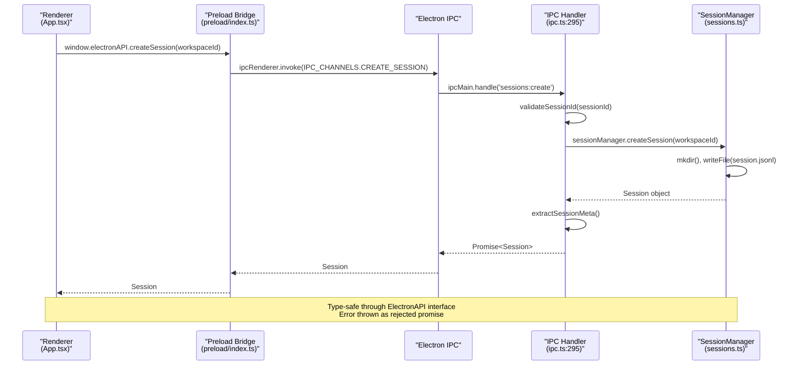
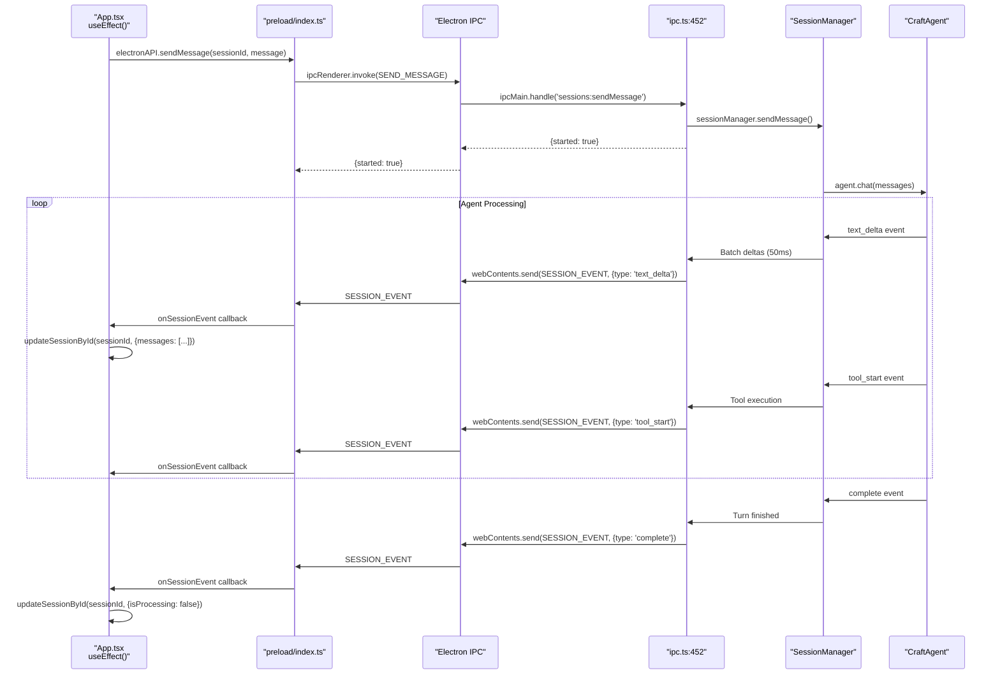
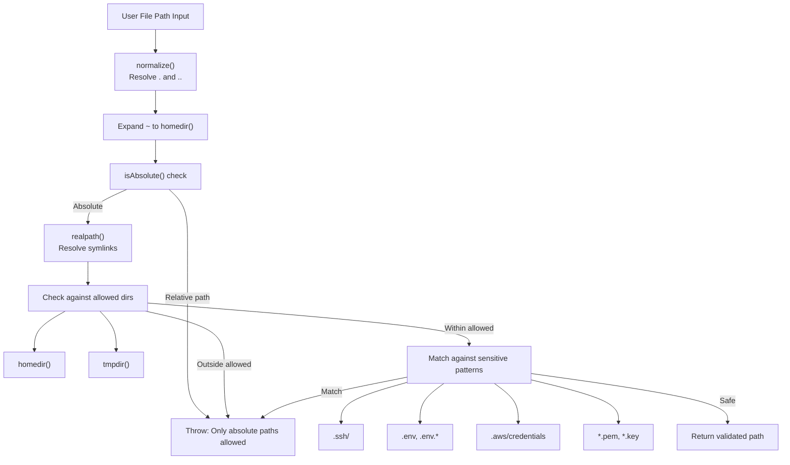

# IPC Channels

<details>
<summary>Relevant source files</summary>

The following files were used as context for generating this wiki page:

- [apps/electron/src/main/ipc.ts](apps/electron/src/main/ipc.ts)
- [apps/electron/src/preload/index.ts](apps/electron/src/preload/index.ts)
- [apps/electron/src/renderer/App.tsx](apps/electron/src/renderer/App.tsx)
- [apps/electron/src/shared/types.ts](apps/electron/src/shared/types.ts)

</details>

Complete technical reference for all Inter-Process Communication (IPC) channels in Craft Agents. Documents channel names, parameters, return types, and implementation details for the Electron IPC layer.

Related pages: [IPC Communication Layer](#2.6) for architecture overview, [Agent System](#2.3) for agent orchestration, [SessionManager API](#8.2) for session management.

## Architecture Overview

IPC channels bridge the renderer process (React UI) and main process (Node.js backend) through Electron's IPC system. The preload script (`apps/electron/src/preload/index.ts`) exposes a type-safe `window.electronAPI` interface using `contextBridge.exposeInMainWorld()`.

**Communication Patterns**:

| Pattern          | Renderer API                           | Main Handler                       | Use Case                                              |
| ---------------- | -------------------------------------- | ---------------------------------- | ----------------------------------------------------- |
| Request/Response | `ipcRenderer.invoke(channel, ...args)` | `ipcMain.handle(channel, handler)` | Synchronous operations returning data                 |
| Event Streaming  | `ipcRenderer.on(channel, callback)`    | `webContents.send(channel, event)` | Asynchronous updates (agent responses, file watching) |

All channel names are defined in `IPC_CHANNELS` constant at [apps/electron/src/shared/types.ts:580-872](). Handlers are registered via `registerIpcHandlers(sessionManager, windowManager)` at [apps/electron/src/main/ipc.ts:295]().

Sources: [apps/electron/src/main/ipc.ts:1-295](), [apps/electron/src/preload/index.ts:1-528](), [apps/electron/src/shared/types.ts:580-872]()

---

## Channel Categories and Code Mapping

IPC channels are organized by functional domain. Each channel maps to a handler in `apps/electron/src/main/ipc.ts` that delegates to domain-specific managers.

**Channel Categories to Code Entities**

```mermaid
graph TB
    subgraph "IPC_CHANNELS Constants"
        GET_SESSIONS["GET_SESSIONS<br/>'sessions:get'"]
        CREATE_SESSION["CREATE_SESSION<br/>'sessions:create'"]
        SEND_MESSAGE["SEND_MESSAGE<br/>'sessions:sendMessage'"]
        SESSION_COMMAND["SESSION_COMMAND<br/>'sessions:command'"]
        SESSION_EVENT["SESSION_EVENT<br/>'session:event'"]

        GET_WORKSPACES["GET_WORKSPACES<br/>'workspaces:get'"]
        CREATE_WORKSPACE["CREATE_WORKSPACE<br/>'workspaces:create'"]
        WORKSPACE_SETTINGS_GET["WORKSPACE_SETTINGS_GET"]

        READ_FILE["READ_FILE<br/>'file:read'"]
        STORE_ATTACHMENT["STORE_ATTACHMENT<br/>'file:storeAttachment'"]
        FS_SEARCH["FS_SEARCH<br/>'fs:search'"]

        SOURCES_GET["SOURCES_GET<br/>'sources:get'"]
        SOURCES_START_OAUTH["SOURCES_START_OAUTH"]

        SKILLS_GET["SKILLS_GET<br/>'skills:get'"]

        LLM_CONNECTION_LIST["LLM_CONNECTION_LIST"]
        SETUP_LLM_CONNECTION["SETUP_LLM_CONNECTION"]

        OPEN_WORKSPACE["OPEN_WORKSPACE"]
        SWITCH_WORKSPACE["SWITCH_WORKSPACE"]

        THEME_GET_APP["THEME_GET_APP"]
        NOTIFICATION_SHOW["NOTIFICATION_SHOW"]
    end

    subgraph "Handler Functions (ipc.ts)"
        GET_SESSIONS --> SessionsHandler["ipcMain.handle()<br/>sessionManager.getSessions()"]
        CREATE_SESSION --> CreateHandler["sessionManager.createSession()"]
        SEND_MESSAGE --> SendHandler["sessionManager.sendMessage()"]
        SESSION_COMMAND --> CommandHandler["switch(command.type)"]
        SESSION_EVENT --> EventBroadcast["webContents.send()"]

        GET_WORKSPACES --> WorkspaceHandler["getWorkspaces()"]
        CREATE_WORKSPACE --> AddWorkspace["addWorkspace()"]
        WORKSPACE_SETTINGS_GET --> SettingsHandler["loadWorkspaceSettings()"]

        READ_FILE --> FileHandler["validateFilePath()<br/>readFile()"]
        STORE_ATTACHMENT --> StoreHandler["sanitizeFilename()<br/>writeFile()<br/>nativeImage.createThumbnail()"]
        FS_SEARCH --> SearchHandler["BFS traversal<br/>readdir()"]

        SOURCES_GET --> SourcesHandler["loadWorkspaceSources()"]
        SOURCES_START_OAUTH --> OAuthHandler["SourceCredentialManager.authenticate()"]

        SKILLS_GET --> SkillsHandler["loadWorkspaceSkills()"]

        LLM_CONNECTION_LIST --> LlmHandler["getLlmConnections()"]
        SETUP_LLM_CONNECTION --> SetupHandler["addLlmConnection()<br/>CredentialManager.set()"]

        OPEN_WORKSPACE --> WindowOpen["windowManager.focusOrCreateWindow()"]
        SWITCH_WORKSPACE --> WindowSwitch["windowManager.updateWindowWorkspace()"]

        THEME_GET_APP --> ThemeHandler["loadAppTheme()"]
        NOTIFICATION_SHOW --> NotifHandler["Notification.show()"]
    end

    subgraph "Backend Managers"
        SessionsHandler --> SM["SessionManager<br/>sessions.ts"]
        EventBroadcast --> SM
        WorkspaceHandler --> Config["@craft-agent/shared/config"]
        FileHandler --> FS["Node.js fs/promises"]
        SourcesHandler --> SourceLoader["@craft-agent/shared/sources"]
        SkillsHandler --> SkillLoader["@craft-agent/shared/skills"]
        LlmHandler --> Config
        WindowOpen --> WM["WindowManager<br/>window-manager.ts"]
        ThemeHandler --> Theme["@craft-agent/shared/config/theme"]
    end
```



Sources: [apps/electron/src/shared/types.ts:580-872](), [apps/electron/src/main/ipc.ts:295-2491]()

---

## Request/Response Pattern

Synchronous request/response pattern for IPC channels. Renderer invokes channel, main process handler validates and executes, returns result.

**Call Flow with Code References**



**Type Safety**: `ElectronAPI` interface at [apps/electron/src/shared/types.ts:886-1189]() defines all method signatures. Preload bridge at [apps/electron/src/preload/index.ts:6-525]() implements interface using `ipcRenderer.invoke()`.

Sources: [apps/electron/src/main/ipc.ts:428-433](), [apps/electron/src/preload/index.ts:10](), [apps/electron/src/shared/types.ts:886-1189]()

---

## Event Streaming Pattern

Asynchronous event streaming for agent responses and live updates. Handler returns immediately while events stream to renderer via `SESSION_EVENT` channel.

**Streaming Flow with Event Types**



**Event Types**: `SessionEvent` union type at [apps/electron/src/shared/types.ts:435-503]() defines all possible events: `text_delta`, `tool_start`, `tool_result`, `complete`, `error`, `permission_request`, etc.

**Error Handling**: Errors caught at [apps/electron/src/main/ipc.ts:458-476]() and sent to calling window only via `SESSION_EVENT` with `{type: 'error'}`.

Sources: [apps/electron/src/main/ipc.ts:452-479](), [apps/electron/src/shared/types.ts:435-503](), [apps/electron/src/renderer/App.tsx:459-626]()

---

## Session Management Channels

### `GET_SESSIONS`

Retrieves all sessions for display in the inbox/sidebar.

**Parameters**: None

**Returns**: `Session[]` - Array of session metadata (no message content for performance)

**Implementation**: [apps/electron/src/main/ipc.ts:121-126]()

**Performance**: Uses `perf.start()` timing wrapper for monitoring. Message content is lazy-loaded via `GET_SESSION_MESSAGES`.

---

### `GET_SESSION_MESSAGES`

Lazy-loads full session content including all messages.

**Parameters**:

- `sessionId: string` - Session identifier

**Returns**: `Session | null` - Full session with messages array

**Implementation**: [apps/electron/src/main/ipc.ts:129-134]()

**Note**: Message content is stored in JSONL format and streamed on-demand to avoid loading all conversations into memory.

---

### `CREATE_SESSION`

Creates a new conversation session.

**Parameters**:

- `workspaceId: string` - Target workspace
- `options?: CreateSessionOptions` - Optional session configuration

**Returns**: `Session` - Created session metadata

**Implementation**: [apps/electron/src/main/ipc.ts:239-244]()

**Side Effects**: Creates session directory at `~/.craft-agent/workspaces/{id}/sessions/{sessionId}/` and initializes `session.jsonl`.

---

### `SEND_MESSAGE`

Sends a user message to the agent. Returns immediately; results stream via `SESSION_EVENT` channel.

**Parameters**:

- `sessionId: string`
- `message: string` - User input text
- `attachments?: FileAttachment[]` - Files with base64 content for Claude API
- `storedAttachments?: StoredAttachment[]` - Files with thumbnails for persistence
- `options?: SendMessageOptions` - Override model, sources, etc.

**Returns**: `{ started: true }` - Immediate acknowledgment

**Event Stream**: Sends events to `SESSION_EVENT` channel:

- `{ type: 'text_delta', text: string }` - Streaming text
- `{ type: 'tool_use', toolName: string, input: any }` - Tool execution
- `{ type: 'permission_request', requestId: string, ... }` - Needs approval
- `{ type: 'complete', sessionId: string }` - Finished
- `{ type: 'error', error: string }` - Error occurred

**Implementation**: [apps/electron/src/main/ipc.ts:255-282]()

**Error Handling**: Errors are caught and sent as events to the calling window, not thrown synchronously.

---

### `SESSION_COMMAND`

Consolidated handler for session operations using discriminated union pattern. Single channel replaces 20+ individual channels for type safety and maintainability.

**Parameters**:

- `sessionId: string`
- `command: SessionCommand` - Discriminated union with `type` field

**Command Types (`SessionCommand` at [apps/electron/src/shared/types.ts:524-557]()**:

| Command Type                | Payload                       | Handler Call                                                              | Return Type                         |
| --------------------------- | ----------------------------- | ------------------------------------------------------------------------- | ----------------------------------- |
| `flag`                      | -                             | `sessionManager.flagSession(sessionId)`                                   | `void`                              |
| `unflag`                    | -                             | `sessionManager.unflagSession(sessionId)`                                 | `void`                              |
| `rename`                    | `name: string`                | `sessionManager.renameSession(sessionId, name)`                           | `void`                              |
| `setTodoState`              | `state: TodoState`            | `sessionManager.setTodoState(sessionId, state)`                           | `void`                              |
| `markRead`                  | -                             | `sessionManager.markSessionRead(sessionId)`                               | `void`                              |
| `markUnread`                | -                             | `sessionManager.markSessionUnread(sessionId)`                             | `void`                              |
| `setActiveViewing`          | `workspaceId: string`         | `sessionManager.setActiveViewingSession(sessionId, workspaceId)`          | `void`                              |
| `setPermissionMode`         | `mode: PermissionMode`        | `sessionManager.setSessionPermissionMode(sessionId, mode)`                | `void`                              |
| `setThinkingLevel`          | `level: ThinkingLevel`        | Validates via `isValidThinkingLevel()`, calls `setSessionThinkingLevel()` | `void`                              |
| `updateWorkingDirectory`    | `dir: string`                 | `sessionManager.updateWorkingDirectory(sessionId, dir)`                   | `void`                              |
| `setSources`                | `sourceSlugs: string[]`       | `sessionManager.setSessionSources(sessionId, sourceSlugs)`                | `void`                              |
| `setLabels`                 | `labels: string[]`            | `sessionManager.setSessionLabels(sessionId, labels)`                      | `void`                              |
| `showInFinder`              | -                             | `shell.showItemInFolder(sessionPath)`                                     | `void`                              |
| `copyPath`                  | -                             | Returns session folder path                                               | `{success: boolean, path?: string}` |
| `shareToViewer`             | -                             | `sessionManager.shareToViewer(sessionId)`                                 | `ShareResult`                       |
| `updateShare`               | -                             | `sessionManager.updateShare(sessionId)`                                   | `ShareResult`                       |
| `revokeShare`               | -                             | `sessionManager.revokeShare(sessionId)`                                   | `ShareResult`                       |
| `startOAuth`                | `requestId: string`           | `sessionManager.startSessionOAuth(sessionId, requestId)`                  | `void`                              |
| `refreshTitle`              | -                             | `sessionManager.refreshTitle(sessionId)`                                  | `RefreshTitleResult`                |
| `setConnection`             | `connectionSlug: string`      | `sessionManager.setSessionConnection(sessionId, connectionSlug)`          | `void`                              |
| `setPendingPlanExecution`   | `planPath: string`            | `sessionManager.setPendingPlanExecution(sessionId, planPath)`             | `void`                              |
| `markCompactionComplete`    | -                             | `sessionManager.markCompactionComplete(sessionId)`                        | `void`                              |
| `clearPendingPlanExecution` | -                             | `sessionManager.clearPendingPlanExecution(sessionId)`                     | `void`                              |
| `getSessionFamily`          | -                             | `sessionManager.getSessionFamily(sessionId)`                              | `SessionFamily`                     |
| `updateSiblingOrder`        | `orderedSessionIds: string[]` | `sessionManager.updateSiblingOrder(orderedSessionIds)`                    | `void`                              |
| `archiveCascade`            | -                             | `sessionManager.archiveSessionCascade(sessionId)`                         | `{count: number}`                   |
| `deleteCascade`             | -                             | `sessionManager.deleteSessionCascade(sessionId)`                          | `{count: number}`                   |

**Implementation**: Switch statement at [apps/electron/src/main/ipc.ts:519-606]() with exhaustiveness checking via `never` type:

```typescript
default: {
  const _exhaustive: never = command
  throw new Error(`Unknown session command: ${JSON.stringify(command)}`)
}
```

**Type Safety**: TypeScript enforces all union members are handled. Adding new command type causes compilation error if not implemented.

Sources: [apps/electron/src/main/ipc.ts:519-606](), [apps/electron/src/shared/types.ts:524-557]()

---

### `CANCEL_PROCESSING`

Cancels an in-progress agent request.

**Parameters**:

- `sessionId: string`
- `silent?: boolean` - If true, doesn't send cancellation message to chat

**Returns**: `void`

**Implementation**: [apps/electron/src/main/ipc.ts:285-287]()

---

### `RESPOND_TO_PERMISSION`

Responds to a permission request dialog (bash command approval).

**Parameters**:

- `sessionId: string`
- `requestId: string` - Request identifier from permission event
- `allowed: boolean` - User's decision
- `alwaysAllow: boolean` - If true, saves pattern to permissions config

**Returns**: `boolean` - True if response was delivered, false if agent/session is gone

**Implementation**: [apps/electron/src/main/ipc.ts:307-309]()

**Permission Persistence**: When `alwaysAllow=true`, the tool/command pattern is saved to workspace or source permissions JSON.

---

Sources: [apps/electron/src/main/ipc.ts:121-400]()

---

## Workspace Management Channels

### `GET_WORKSPACES`

Lists all configured workspaces.

**Parameters**: None

**Returns**: `Workspace[]` - Array of workspace configurations

**Implementation**: [apps/electron/src/main/ipc.ts:137-139]()

---

### `CREATE_WORKSPACE`

Creates a new workspace at a specified folder path.

**Parameters**:

- `folderPath: string` - Absolute path to workspace root
- `name: string` - Display name

**Returns**: `Workspace` - Created workspace config

**Side Effects**:

- Adds workspace to `~/.craft-agent/config.json`
- Sets as active workspace
- Creates subdirectories: `sessions/`, `sources/`, `skills/`, `statuses/`, `permissions/`

**Implementation**: [apps/electron/src/main/ipc.ts:142-149]()

---

### `CHECK_WORKSPACE_SLUG`

Checks if a workspace slug/folder already exists (for validation before creation).

**Parameters**:

- `slug: string` - Proposed workspace identifier

**Returns**: `{ exists: boolean, path: string }`

**Implementation**: [apps/electron/src/main/ipc.ts:152-157]()

---

### `WORKSPACE_SETTINGS_GET`

Retrieves workspace-specific configuration.

**Parameters**:

- `workspaceId: string`

**Returns**: Object with workspace settings:

- `name?: string`
- `model?: string` - Default model for new sessions
- `permissionMode?: 'safe' | 'ask' | 'allow-all'`
- `cyclablePermissionModes?: string[]` - Modes available via Shift+Tab
- `thinkingLevel?: 'off' | 'think' | 'max'`
- `workingDirectory?: string` - Default working directory
- `localMcpEnabled?: boolean` - Whether local MCP servers are enabled

**Implementation**: [apps/electron/src/main/ipc.ts:1434-1454]()

**Storage**: Loads from `{workspaceRoot}/workspace.json`

---

### `WORKSPACE_SETTINGS_UPDATE`

Updates a single workspace setting.

**Parameters**:

- `workspaceId: string`
- `key: string` - Setting key (validated against whitelist)
- `value: unknown` - New value

**Valid Keys**: `'name'`, `'model'`, `'enabledSourceSlugs'`, `'permissionMode'`, `'cyclablePermissionModes'`, `'thinkingLevel'`, `'workingDirectory'`, `'localMcpEnabled'`

**Returns**: `void`

**Implementation**: [apps/electron/src/main/ipc.ts:1458-1489]()

**Side Effects**: Writes updated config to `workspace.json`. ConfigWatcher broadcasts update to all windows.

---

### `GET_WINDOW_WORKSPACE`

Gets the workspace ID for the calling window.

**Parameters**: None (uses `event.sender.id` to identify window)

**Returns**: `string | null` - Workspace ID or null if not set

**Side Effect**: Initializes `ConfigWatcher` for the workspace to enable live updates of labels, sources, statuses, and themes.

**Implementation**: [apps/electron/src/main/ipc.ts:164-174]()

---

### `SWITCH_WORKSPACE`

Changes the workspace for the current window (in-window switching).

**Parameters**:

- `workspaceId: string`

**Returns**: `void`

**Side Effects**:

- Updates WindowManager's window-to-workspace mapping
- Sets up ConfigWatcher for new workspace
- UI must navigate to new workspace's inbox

**Implementation**: [apps/electron/src/main/ipc.ts:214-236]()

---

Sources: [apps/electron/src/main/ipc.ts:137-236](), [apps/electron/src/main/ipc.ts:1434-1489]()

---

## File Operations Channels

### `READ_FILE`

Reads a text file with path validation to prevent traversal attacks.

**Parameters**:

- `path: string` - File path (supports `~` expansion)

**Returns**: `string` - File content as UTF-8

**Security**: Validates path is within `homedir()` or `tmpdir()`, blocks sensitive files (`.ssh/`, `.env`, credentials)

**Implementation**: [apps/electron/src/main/ipc.ts:403-414]()

**Validation Function**: [apps/electron/src/main/ipc.ts:59-117]()

---

### `READ_FILE_DATA_URL`

Reads a file as a data URL for in-app preview (images, PDFs).

**Parameters**:

- `path: string`

**Returns**: `string` - Data URL format: `data:{mime};base64,{content}`

**Supported Types**: PNG, JPG, GIF, WebP, SVG, BMP, ICO, AVIF, PDF

**Excluded Types**: HEIC/HEIF, TIFF (no Chromium codec, opened externally instead)

**Implementation**: [apps/electron/src/main/ipc.ts:419-447]()

**Use Case**: Used by `ImagePreviewOverlay` for in-app image viewing.

---

### `READ_FILE_BINARY`

Reads a file as raw binary (Uint8Array) for react-pdf.

**Parameters**:

- `path: string`

**Returns**: `Uint8Array` (automatically converted to ArrayBuffer over IPC)

**Implementation**: [apps/electron/src/main/ipc.ts:451-462]()

**Use Case**: PDF rendering in `PdfPreviewOverlay`.

---

### `OPEN_FILE_DIALOG`

Opens native file picker dialog.

**Parameters**: None

**Returns**: `string[]` - Array of selected file paths (empty if cancelled)

**Dialog Options**:

- Multi-selection enabled
- Filters: All Files, Images, Documents, Code

**Implementation**: [apps/electron/src/main/ipc.ts:465-477]()

---

### `READ_FILE_ATTACHMENT`

Reads a file and prepares it as a `FileAttachment` with Quick Look thumbnail.

**Parameters**:

- `path: string`

**Returns**: `FileAttachment | null` - File with base64 content, MIME type, and thumbnail

**Process**:

1. Validates path via `validateFilePath()`
2. Detects file type and encoding via `readFileAttachment()` utility
3. Generates Quick Look thumbnail (200x200px) using `nativeImage.createThumbnailFromPath()`
4. Returns null on error (UI shows icon fallback)

**Implementation**: [apps/electron/src/main/ipc.ts:480-505]()

**Thumbnail Generation**: Uses macOS Quick Look or Windows Shell handlers for universal format support (images, PDFs, Office docs).

---

### `STORE_ATTACHMENT`

Persists file attachment to session storage with thumbnail generation, image resizing, and Office-to-Markdown conversion.

**Parameters**:

- `sessionId: string`
- `attachment: FileAttachment` - File with base64 content and metadata

**Returns**: `StoredAttachment` - Metadata with paths, thumbnail, optional resize info

**FileAttachment Type** ([apps/electron/src/shared/types.ts:276-285]()):

```typescript
{
  type: 'image' | 'text' | 'pdf' | 'office' | 'unknown'
  path: string
  name: string
  mimeType: string
  base64?: string     // For binary files
  text?: string       // For text files
  size: number
}
```

**StoredAttachment Type** ([apps/electron/src/shared/types.ts:32-37]()):

```typescript
{
  id: string
  type: FileAttachment['type']
  name: string
  mimeType: string
  size: number
  originalSize?: number      // If resized
  storedPath: string
  thumbnailPath?: string
  thumbnailBase64?: string
  markdownPath?: string      // For Office files
  wasResized?: boolean
  resizedBase64?: string     // For Claude API
}
```

**Processing Pipeline**:

1. **Validation**: [apps/electron/src/main/ipc.ts:759-777]()
   - Rejects empty files (size === 0)
   - Validates `sessionId` via `validateSessionId()` to prevent path traversal
   - Resolves workspace root from window context

2. **File Storage**: [apps/electron/src/main/ipc.ts:779-792]()
   - Generates UUID for attachment
   - Sanitizes filename via `sanitizeFilename()` (removes path separators, limits length)
   - Writes to `{workspaceRoot}/sessions/{sessionId}/attachments/{uuid}_{name}`

3. **Image Validation & Resizing**: [apps/electron/src/main/ipc.ts:804-869]()
   - Validates via `validateImageForClaudeAPI()` using `nativeImage.createFromBuffer()`
   - Checks against Claude limits: max 8000px dimension, max 5MB size
   - If exceeds: resizes via `image.resize({width, height, quality: 'best'})`
   - Saves resized as JPEG (quality 90) or PNG based on source format
   - Returns `resizedBase64` for API, keeps original on disk

4. **Thumbnail Generation**: [apps/electron/src/main/ipc.ts:882-898]()
   - Uses `nativeImage.createThumbnailFromPath()` (macOS Quick Look / Windows Shell)
   - 200x200px PNG
   - Supports images, PDFs, Office docs
   - Silently fails if generation unsupported (icon fallback in UI)

5. **Office Conversion**: [apps/electron/src/main/ipc.ts:903-923]()
   - For `type === 'office'`: converts via MarkItDown.js
   - Saves markdown to `{uuid}_{name}.md`
   - Required for Claude (can't read binary Office formats)
   - Throws on failure (unusable file)

**Error Handling**: [apps/electron/src/main/ipc.ts:942-952]() - Cleans up all written files on error via `Promise.allSettled()` and `unlink()`.

**Security**: Path validation via `validateSessionId()` at [apps/electron/src/main/ipc.ts:776]() prevents traversal attacks like `../../etc/passwd`.

Sources: [apps/electron/src/main/ipc.ts:753-953](), [apps/electron/src/shared/types.ts:276-285]()

---

### `FS_SEARCH`

Parallel BFS filesystem search for @mention file selection. Optimized for large codebases by skipping ignored directories before traversal.

**Parameters**:

- `basePath: string` - Root directory to search
- `query: string` - Case-insensitive search term

**Returns**: `FileSearchResult[]` (max 50 results)

**FileSearchResult Type** ([apps/electron/src/shared/types.ts:103-108]()):

```typescript
{
  name: string // Filename or directory name
  path: string // Absolute path
  type: 'file' | 'directory'
  relativePath: string // Relative to basePath
}
```

**Algorithm** ([apps/electron/src/main/ipc.ts:1086-1195]()):

1. **BFS Initialization**: Queue starts with empty string (root level)

2. **Level-wise Processing**:
   - Read all directories at current level in parallel via `Promise.all()`
   - Uses `readdir(dir, {withFileTypes: true})` to get entry types without `stat()` calls
   - Filters out ignored directories via `SKIP_DIRS` set before recursion

3. **Ignored Directories** (never traversed):

   ```typescript
   const SKIP_DIRS = new Set([
     'node_modules',
     '.git',
     '.svn',
     '.hg',
     'dist',
     'build',
     '.next',
     '.nuxt',
     '.cache',
     '__pycache__',
     'vendor',
     '.idea',
     '.vscode',
     'coverage',
     '.nyc_output',
     '.turbo',
     'out',
   ])
   ```

4. **Matching**: Case-insensitive substring match on entry name

5. **Sorting**: Directories first, then by name length (shorter = better match)

6. **Limits**:
   - 50 max results (`MAX_RESULTS`)
   - Stops BFS traversal once limit reached

**Performance Optimization**:

- Parallel directory reads at each BFS level (10x faster than sequential)
- Early termination on ignored directories (avoids reading 100k+ node_modules files)
- Single `readdir()` call with `withFileTypes` (no extra `stat()` calls)

**Use Case**: FreeFormInput component's @mention autocomplete at `packages/ui/src/components/FreeFormInput/mentions.tsx`

Sources: [apps/electron/src/main/ipc.ts:1086-1195](), [apps/electron/src/shared/types.ts:103-108]()

---

### `OPEN_FOLDER_DIALOG`

Opens native folder picker dialog.

**Parameters**: None

**Returns**: `string | null` - Selected folder path or null if cancelled

**Implementation**: [apps/electron/src/main/ipc.ts:1421-1427]()

---

Sources: [apps/electron/src/main/ipc.ts:403-918](), [apps/electron/src/main/ipc.ts:1421-1427]()

---

## Source Management Channels

### `SOURCES_GET`

Retrieves all sources for a workspace.

**Parameters**:

- `workspaceId: string`

**Returns**: `LoadedSource[]` - Sources with connection status, metadata, and configuration

**Implementation**: [apps/electron/src/main/ipc.ts:1705-1712]()

**Storage**: Loads from `{workspaceRoot}/sources/{slug}.json`

---

### `SOURCES_CREATE`

Creates a new source.

**Parameters**:

- `workspaceId: string`
- `config: Partial<CreateSourceInput>` - Source configuration

**Config Fields**:

- `name: string` - Display name
- `provider: string` - Provider identifier (e.g., 'linear', 'github', 'custom')
- `type: 'mcp' | 'api' | 'local'` - Source type
- `enabled?: boolean` - Whether source is active
- `mcp?: MCPConfig` - MCP-specific config (transport, command/url, auth)
- `api?: APIConfig` - REST API config (endpoints, auth)
- `local?: LocalConfig` - Local resource config (git repos, directories)

**Returns**: `LoadedSource` - Created source

**Implementation**: [apps/electron/src/main/ipc.ts:1715-1728]()

---

### `SOURCES_START_OAUTH`

Initiates OAuth flow for a source.

**Parameters**:

- `workspaceId: string`
- `sourceSlug: string`

**Returns**: `{ success: boolean, accessToken?: string, error?: string }`

**Process**:

1. Loads source configuration
2. Calls `SourceCredentialManager.authenticate()` with callbacks
3. Stores token in encrypted credentials
4. Returns token to UI for immediate use

**Implementation**: [apps/electron/src/main/ipc.ts:1739-1774]()

**OAuth Callbacks**: Logs status messages and errors via `onStatus` and `onError` handlers.

---

### `SOURCES_SAVE_CREDENTIALS`

Saves credentials for a source (bearer token or API key).

**Parameters**:

- `workspaceId: string`
- `sourceSlug: string`
- `credential: string` - Token or API key

**Returns**: `void`

**Implementation**: [apps/electron/src/main/ipc.ts:1777-1792]()

**Storage**: Credentials are encrypted and stored via `SourceCredentialManager`.

---

### `SOURCES_GET_MCP_TOOLS`

Fetches tools from an MCP server with permission status.

**Parameters**:

- `workspaceId: string`
- `sourceSlug: string`

**Returns**: `{ success: boolean, tools?: Array<{ name: string, description: string, allowed: boolean }>, error?: string }`

**Process**:

1. Validates source type is MCP and connection status is connected
2. Creates `CraftMcpClient` (stdio or HTTP transport based on config)
3. For stdio: spawns local MCP server process with command/args
4. For HTTP/SSE: connects to remote server with bearer token if configured
5. Calls `listTools()` to fetch full tool list with descriptions
6. Loads permissions config and checks each tool against patterns
7. Returns tools annotated with `allowed` flag

**Implementation**: [apps/electron/src/main/ipc.ts:1856-1957]()

**Error Handling**: Provides helpful error messages for 404 (endpoint not found), 401/403 (auth failed).

---

### `SOURCES_GET_PERMISSIONS`

Gets raw permissions JSON for a source (for UI display/editing).

**Parameters**:

- `workspaceId: string`
- `sourceSlug: string`

**Returns**: Raw JSON object or null if file doesn't exist

**Implementation**: [apps/electron/src/main/ipc.ts:1795-1813]()

**File Path**: `{workspaceRoot}/permissions/source-{slug}.json`

---

### `WORKSPACE_GET_PERMISSIONS`

Gets raw workspace-level permissions JSON.

**Parameters**:

- `workspaceId: string`

**Returns**: Raw JSON object or null

**Implementation**: [apps/electron/src/main/ipc.ts:1816-1834]()

**File Path**: `{workspaceRoot}/permissions/workspace-permissions.json`

---

### `DEFAULT_PERMISSIONS_GET`

Gets default app-level permissions JSON.

**Parameters**: None

**Returns**: `{ config: object | null, path: string }`

**Implementation**: [apps/electron/src/main/ipc.ts:1838-1853]()

**File Path**: `~/.craft-agent/permissions/default.json`

---

Sources: [apps/electron/src/main/ipc.ts:1705-1957]()

---

## Skills Management Channels

### `SKILLS_GET`

Retrieves all skills for a workspace.

**Parameters**:

- `workspaceId: string`

**Returns**: `Skill[]` - Array of skills with metadata and content

**Implementation**: [apps/electron/src/main/ipc.ts:2003-2014]()

**Storage**: Loads from `{workspaceRoot}/skills/{slug}/SKILL.md`

---

### `SKILLS_GET_FILES`

Gets recursive file tree for a skill directory.

**Parameters**:

- `workspaceId: string`
- `skillSlug: string`

**Returns**: `SkillFile[]` - Tree structure with directories and files

**File Structure**:

```typescript
interface SkillFile {
  name: string
  type: 'file' | 'directory'
  size?: number // Only for files
  children?: SkillFile[] // Only for directories
}
```

**Implementation**: [apps/electron/src/main/ipc.ts:2017-2072]()

**Filtering**: Skips hidden files (starting with `.`)

---

### `SKILLS_DELETE`

Deletes a skill from a workspace.

**Parameters**:

- `workspaceId: string`
- `skillSlug: string`

**Returns**: `void`

**Side Effects**: Removes skill directory and all contents

**Implementation**: [apps/electron/src/main/ipc.ts:2075-2082]()

---

### `SKILLS_OPEN_EDITOR`

Opens skill's `SKILL.md` in default editor.

**Parameters**:

- `workspaceId: string`
- `skillSlug: string`

**Returns**: `void`

**Implementation**: [apps/electron/src/main/ipc.ts:2084-2096]()

**Uses**: `shell.openPath()` to open with system default for `.md` files

---

### `SKILLS_OPEN_FINDER`

Opens skill folder in Finder/Explorer.

**Parameters**:

- `workspaceId: string`
- `skillSlug: string`

**Returns**: `void`

**Implementation**: [apps/electron/src/main/ipc.ts:2099-2110]()

---

Sources: [apps/electron/src/main/ipc.ts:2003-2110]()

---

## Settings & Preferences Channels

### `SETTINGS_GET_API_SETUP`

Gets current API setup and credential status.

**Parameters**: None

**Returns**: `ApiSetupInfo` object:

```typescript
{
  authType: 'api_key' | 'oauth_token'
  hasCredential: boolean
  apiKey?: string
  anthropicBaseUrl?: string
  customModel?: string
}
```

**Implementation**: [apps/electron/src/main/ipc.ts:1155-1181]()

**Credential Validation**: For `api_key` auth, checks both API key and base URL (keyless providers like Ollama are valid if base URL is set).

---

### `SETTINGS_UPDATE_API_SETUP`

Updates API setup and credentials.

**Parameters**:

- `authType: 'api_key' | 'oauth_token'`
- `credential?: string` - API key or OAuth token
- `anthropicBaseUrl?: string | null` - Custom base URL (null to clear)
- `customModel?: string | null` - Model override (null to clear)

**Returns**: `void`

**Side Effects**:

- Clears old credentials when switching auth types
- Sets new auth type in config
- Updates/clears base URL and custom model
- Stores credential in encrypted storage
- Reinitializes SessionManager auth to pick up new credentials

**Implementation**: [apps/electron/src/main/ipc.ts:1184-1267]()

**OAuth Import**: For `oauth_token`, attempts to import full credentials (access token, refresh token, expiry) from Claude CLI if available, otherwise saves just the access token.

---

### `SETTINGS_TEST_API_CONNECTION`

Tests API connection, validates credentials and model support.

**Parameters**:

- `apiKey: string`
- `baseUrl?: string` - Custom base URL for providers like OpenRouter, Ollama
- `modelName?: string` - Model to test (optional)

**Returns**: `{ success: boolean, error?: string, modelCount?: number }`

**Validation Strategy**:

1. Sends minimal POST to `/v1/messages` with a tool definition
2. Validates connection, auth, model existence, and tool support in one call
3. Works identically for Anthropic, OpenRouter, Vercel AI Gateway, and Ollama (v0.14+)

**Auth Strategy**:

- **Custom base URL**: Uses Bearer auth (`authToken`) for OpenRouter, Vercel, Ollama compatibility
- **Anthropic direct**: Uses x-api-key header (`apiKey`)

**Model Selection**:

- User-specified model takes priority
- Falls back to `SUMMARIZATION_MODEL` (Haiku) for known providers
- Custom endpoints require explicit model specification

**Error Messages**:

- Connection refused/unreachable → "Cannot connect to API server"
- 404 endpoint → "Endpoint not found. Ollama requires v0.14+"
- 401/403 → "Invalid API key"
- Data policy → "Configure privacy settings at openrouter.ai/settings/privacy"
- Tool support → "Model does not support tool/function calling"
- Model not found → "Model not found. Check the model name"

**Implementation**: [apps/electron/src/main/ipc.ts:1270-1387]()

**OpenAI Compatibility**: Sets `max_tokens: 16` to satisfy OpenAI models via OpenRouter.

---

### `SETTINGS_GET_MODEL` / `SETTINGS_SET_MODEL`

Gets/sets global default model.

**Parameters**:

- `SET`: `model: string`
- `GET`: None

**Returns**:

- `SET`: `void`
- `GET`: `string | null`

**Implementation**: [apps/electron/src/main/ipc.ts:1394-1402]()

---

### `SESSION_GET_MODEL` / `SESSION_SET_MODEL`

Gets/sets session-specific model override.

**Parameters**:

- `GET`: `sessionId: string, workspaceId: string`
- `SET`: `sessionId: string, workspaceId: string, model: string | null`

**Returns**:

- `GET`: `string | null`
- `SET`: `void`

**Implementation**: [apps/electron/src/main/ipc.ts:1409-1418]()

**Model Hierarchy**: Session model overrides workspace default, which overrides global default.

---

### `PREFERENCES_READ` / `PREFERENCES_WRITE`

Reads/writes user preferences file.

**Parameters**:

- `READ`: None
- `WRITE`: `content: string` - JSON string

**Returns**:

- `READ`: `{ content: string, exists: boolean, path: string }`
- `WRITE`: `{ success: boolean, error?: string }`

**Implementation**: [apps/electron/src/main/ipc.ts:1496-1515]()

**File Path**: `~/.craft-agent/preferences.json`

**Validation**: `WRITE` validates JSON before saving to prevent corruption.

---

### `DRAFTS_GET` / `DRAFTS_SET` / `DRAFTS_DELETE` / `DRAFTS_GET_ALL`

Manages persisted session input drafts.

**Parameters**:

- `GET/SET/DELETE`: `sessionId: string`
- `SET`: `text: string` (empty string to clear)
- `GET_ALL`: None

**Returns**:

- `GET`: `string | null`
- `SET/DELETE`: `void`
- `GET_ALL`: `Record<sessionId, text>`

**Implementation**: [apps/electron/src/main/ipc.ts:1522-1539]()

**Use Case**: Preserves input text when navigating away from a session, restored on return.

---

Sources: [apps/electron/src/main/ipc.ts:1155-1539]()

---

## Window Management Channels

### `OPEN_WORKSPACE`

Opens workspace in a new window or focuses existing window.

**Parameters**:

- `workspaceId: string`

**Returns**: `void`

**Implementation**: [apps/electron/src/main/ipc.ts:177-179]()

**Behavior**: If workspace is already open in a window, focuses that window. Otherwise creates new window.

---

### `OPEN_SESSION_IN_NEW_WINDOW`

Opens a session in a new window with deep link navigation.

**Parameters**:

- `workspaceId: string`
- `sessionId: string`

**Returns**: `void`

**Deep Link**: Builds `craftagents://allChats/chat/{sessionId}` URL and passes to new window via `initialDeepLink`.

**Implementation**: [apps/electron/src/main/ipc.ts:182-190]()

---

### `CLOSE_WINDOW` / `WINDOW_CONFIRM_CLOSE`

Closes the calling window.

**Parameters**: None (uses `event.sender.id`)

**Returns**: `void`

**Difference**:

- `CLOSE_WINDOW`: Triggers close event which may be intercepted by UI (e.g., for modal cleanup)
- `WINDOW_CONFIRM_CLOSE`: Force closes bypassing interception (called after UI confirms)

**Implementation**: [apps/electron/src/main/ipc.ts:198-206]()

---

### `WINDOW_SET_TRAFFIC_LIGHTS`

Shows/hides macOS traffic light buttons (for fullscreen overlays).

**Parameters**:

- `visible: boolean`

**Returns**: `void`

**Implementation**: [apps/electron/src/main/ipc.ts:209-211]()

**Platform**: macOS only

---

### Menu Action Channels

All menu actions use the calling window from `event.sender`:

| Channel                | Action                                   |
| ---------------------- | ---------------------------------------- |
| `MENU_QUIT`            | Quits application                        |
| `MENU_NEW_WINDOW`      | Creates new window for current workspace |
| `MENU_MINIMIZE`        | Minimizes window                         |
| `MENU_MAXIMIZE`        | Toggles maximize/unmaximize              |
| `MENU_ZOOM_IN`         | Increases zoom (max 3.0x)                |
| `MENU_ZOOM_OUT`        | Decreases zoom (min 0.5x)                |
| `MENU_ZOOM_RESET`      | Resets zoom to 1.0x                      |
| `MENU_TOGGLE_DEVTOOLS` | Opens/closes DevTools                    |
| `MENU_UNDO`            | Triggers undo                            |
| `MENU_REDO`            | Triggers redo                            |
| `MENU_CUT`             | Cuts selection                           |
| `MENU_COPY`            | Copies selection                         |
| `MENU_PASTE`           | Pastes from clipboard                    |
| `MENU_SELECT_ALL`      | Selects all                              |

**Implementation**: [apps/electron/src/main/ipc.ts:1014-1090]()

---

Sources: [apps/electron/src/main/ipc.ts:177-211](), [apps/electron/src/main/ipc.ts:1014-1090]()

---

## System Operations Channels

### `GET_HOME_DIR`

Returns user's home directory path.

**Parameters**: None

**Returns**: `string` - Home directory path

**Implementation**: [apps/electron/src/main/ipc.ts:723-725]()

---

### `IS_DEBUG_MODE`

Checks if running in debug mode (from source, not packaged).

**Parameters**: None

**Returns**: `boolean` - `!app.isPackaged`

**Implementation**: [apps/electron/src/main/ipc.ts:728-730]()

---

### `GET_SYSTEM_THEME`

Gets system theme preference.

**Parameters**: None

**Returns**: `boolean` - True for dark mode, false for light

**Implementation**: [apps/electron/src/main/ipc.ts:718-720]()

**Uses**: `nativeTheme.shouldUseDarkColors`

---

### `GET_GIT_BRANCH`

Gets current git branch for a directory.

**Parameters**:

- `dirPath: string`

**Returns**: `string | null` - Branch name or null if not a git repo

**Implementation**: [apps/electron/src/main/ipc.ts:733-746]()

**Command**: Executes `git rev-parse --abbrev-ref HEAD` with 5s timeout

---

### Git Bash Detection (Windows)

Three channels for Git Bash detection and configuration on Windows:

**`GITBASH_CHECK`**

- Parameters: None
- Returns: `GitBashStatus` - `{ found: boolean, path: string | null, platform: 'win32' | 'darwin' | 'linux' }`
- Non-Windows: Returns `{found: true, path: null, platform}` (not needed)
- Windows: Checks paths: `C:\Program Files\Git\bin\bash.exe`, `C:\Program Files (x86)\Git\bin\bash.exe`, `%LOCALAPPDATA%\Programs\Git\bin\bash.exe`
- Fallback: Runs `where bash` command if not found in standard paths
- Implementation: [apps/electron/src/main/ipc.ts:998-1039]()

**`GITBASH_BROWSE`**

- Parameters: None
- Returns: `string | null` - Selected bash.exe path or null if cancelled
- Opens native file picker dialog with filters: `[{name: 'Executable', extensions: ['exe']}]`
- Default path: `C:\Program Files\Git\bin`
- Implementation: [apps/electron/src/main/ipc.ts:1041-1057]()

**`GITBASH_SET_PATH`**

- Parameters: `bashPath: string`
- Returns: `{success: boolean, error?: string}`
- Validates:
  - Path exists via `stat(bashPath)`
  - Extension is `.exe`
- Does NOT persist (placeholder for future config storage)
- Implementation: [apps/electron/src/main/ipc.ts:1059-1075]()

---

### `OPEN_URL`

Opens URL in external browser or handles deep links.

**Parameters**:

- `url: string`

**Returns**: `void`

**Behavior**:

- `craftagents://` URLs → Handled internally via deep link handler
- `http:`, `https:`, `mailto:`, `craftdocs:` → Opens in default browser
- Other protocols → Rejected for security

**Implementation**: [apps/electron/src/main/ipc.ts:950-976]()

---

### `OPEN_FILE`

Opens file in default application.

**Parameters**:

- `path: string`

**Returns**: `void`

**Security**: Validates path via `validateFilePath()` before opening

**Implementation**: [apps/electron/src/main/ipc.ts:979-996]()

**Example**: `.ts` files open in VS Code, `.pdf` in Preview/Acrobat

---

### `SHOW_IN_FOLDER`

Opens Finder/Explorer with file selected.

**Parameters**:

- `path: string`

**Returns**: `void`

**Implementation**: [apps/electron/src/main/ipc.ts:999-1011]()

---

### `DEBUG_LOG`

Fire-and-forget debug logging from renderer to main process log file. No response expected.

**Parameters**:

- `...args: unknown[]` - Arbitrary log arguments (strings, objects, etc.)

**Returns**: None (one-way channel using `ipcMain.on()`)

**Handler**: [apps/electron/src/main/ipc.ts:1078-1080]()

```typescript
ipcMain.on(IPC_CHANNELS.DEBUG_LOG, (_event, ...args: unknown[]) => {
  ipcLog.info('[renderer]', ...args)
})
```

**Preload Exposure**: [apps/electron/src/preload/index.ts:225-226]()

```typescript
debugLog: (...args: unknown[]) =>
  ipcRenderer.send(IPC_CHANNELS.DEBUG_LOG, ...args),
```

**Use Case**: Centralized logging - renderer console.log() calls routed to main process log file for unified debugging. Renderer logs tagged with `[renderer]` prefix.

Sources: [apps/electron/src/main/ipc.ts:1078-1080](), [apps/electron/src/preload/index.ts:225-226]()

---

Sources: [apps/electron/src/main/ipc.ts:718-831](), [apps/electron/src/main/ipc.ts:950-1011]()

---

## Session Info Panel Channels

### `GET_SESSION_FILES`

Gets recursive file tree for session directory.

**Parameters**:

- `sessionId: string`

**Returns**: `SessionFile[]` - Tree structure

**Filtering**:

- Excludes `session.jsonl` (internal)
- Excludes hidden files (starting with `.`)
- Only includes non-empty directories

**Implementation**: [apps/electron/src/main/ipc.ts:1590-1600]()

**Helper Function**: `scanSessionDirectory()` at [apps/electron/src/main/ipc.ts:1548-1587]()

---

### `WATCH_SESSION_FILES` / `UNWATCH_SESSION_FILES`

Starts/stops watching session directory for file changes.

**Parameters**:

- `WATCH`: `sessionId: string`
- `UNWATCH`: None

**Returns**: `void`

**Behavior**:

- Only one session watched at a time (new watch closes old watcher)
- Debounces changes (100ms) to batch rapid writes
- Broadcasts `SESSION_FILES_CHANGED` event to all windows on change

**Implementation**: [apps/electron/src/main/ipc.ts:1608-1665]()

**Use Case**: Real-time file tree updates in Session Info panel

---

### `GET_SESSION_NOTES` / `SET_SESSION_NOTES`

Gets/sets session notes from `notes.md`.

**Parameters**:

- `GET`: `sessionId: string`
- `SET`: `sessionId: string, content: string`

**Returns**:

- `GET`: `string` (empty if file doesn't exist)
- `SET`: `void`

**Implementation**: [apps/electron/src/main/ipc.ts:1668-1696]()

**File Path**: `{sessionDirectory}/notes.md`

---

Sources: [apps/electron/src/main/ipc.ts:1548-1696]()

---

## Theme & Appearance Channels

### `THEME_GET_APP`

Gets app-level theme configuration.

**Parameters**: None

**Returns**: Theme object with color definitions

**Implementation**: [apps/electron/src/main/ipc.ts:2326-2328]()

---

### `THEME_GET_PRESETS` / `THEME_LOAD_PRESET`

Gets available preset themes or loads a specific preset.

**Parameters**:

- `LOAD_PRESET`: `themeId: string`

**Returns**:

- `GET_PRESETS`: Array of preset metadata
- `LOAD_PRESET`: Theme object

**Implementation**: [apps/electron/src/main/ipc.ts:2331-2339]()

---

### `THEME_GET_COLOR_THEME` / `THEME_SET_COLOR_THEME`

Gets/sets active color theme ID.

**Parameters**:

- `SET`: `themeId: string`

**Returns**:

- `GET`: `string`
- `SET`: `void`

**Implementation**: [apps/electron/src/main/ipc.ts:2341-2349]()

---

### `THEME_BROADCAST_PREFERENCES`

Broadcasts theme preferences to other windows for cross-window sync.

**Parameters**:

- `preferences: { mode: string, colorTheme: string, font: string }`

**Returns**: `void`

**Behavior**: Sends `THEME_PREFERENCES_CHANGED` event to all windows except sender

**Implementation**: [apps/electron/src/main/ipc.ts:2352-2363]()

**Use Case**: When user changes theme in one window, all other windows update immediately

---

### `TOOL_ICONS_GET_MAPPINGS`

Gets tool icon mappings from `tool-icons.json` with resolved data URLs.

**Parameters**: None

**Returns**: Array of `{ id: string, displayName: string, iconDataUrl: string, commands: string[] }`

**Process**:

1. Loads `tool-icons.json` config
2. For each tool, resolves icon path to data URL
3. Filters out tools with missing icons

**Implementation**: [apps/electron/src/main/ipc.ts:2367-2390]()

**Use Case**: Appearance settings page displays tool icons

---

### `LOGO_GET_URL`

Resolves provider logo URL from service URL or provider name.

**Parameters**:

- `serviceUrl: string` - Service URL (e.g., MCP server URL)
- `provider?: string` - Optional provider override

**Returns**: `string | null` - Logo URL or null if not found

**Implementation**: [apps/electron/src/main/ipc.ts:2393-2398]()

**Cache**: Uses Node.js filesystem cache for provider domain mappings

---

### `WORKSPACE_READ_IMAGE` / `WORKSPACE_WRITE_IMAGE`

Generic workspace image loading/writing for icons and assets.

**`READ_IMAGE`**:

- Parameters: `workspaceId: string, relativePath: string`
- Returns: `string | null` - SVG as text or data URL for binary images
- Security: Validates path (no `..`, allowed extensions, within workspace)
- Implementation: [apps/electron/src/main/ipc.ts:2191-2243]()

**`WRITE_IMAGE`**:

- Parameters: `workspaceId: string, relativePath: string, base64: string, mimeType: string`
- Returns: `void`
- Behavior: Resizes images to max 256x256 to keep file sizes small
- Icon Cleanup: Deletes old icon files when uploading new workspace icon
- Implementation: [apps/electron/src/main/ipc.ts:2246-2316]()

**Allowed Extensions**: `.svg`, `.png`, `.jpg`, `.jpeg`, `.webp`, `.ico`, `.gif`

---

Sources: [apps/electron/src/main/ipc.ts:2191-2398]()

---

## Notifications & Badge Channels

### `NOTIFICATION_SHOW`

Shows a notification.

**Parameters**:

- `title: string`
- `body: string`
- `workspaceId: string`
- `sessionId: string`

**Returns**: `void`

**Implementation**: [apps/electron/src/main/ipc.ts:2405-2408]()

**Behavior**: Clicking notification focuses window and navigates to session

---

### `NOTIFICATION_GET_ENABLED` / `NOTIFICATION_SET_ENABLED`

Gets/sets notifications enabled setting.

**Parameters**:

- `SET`: `enabled: boolean`

**Returns**:

- `GET`: `boolean`
- `SET`: `void`

**Side Effect**: When enabling, triggers test notification to request macOS permission

**Implementation**: [apps/electron/src/main/ipc.ts:2411-2426]()

---

### `BADGE_UPDATE` / `BADGE_CLEAR`

Updates or clears app dock/taskbar badge count.

**Parameters**:

- `UPDATE`: `count: number`
- `CLEAR`: None

**Returns**: `void`

**Implementation**: [apps/electron/src/main/ipc.ts:2465-2474]()

**Platform**: macOS dock badge, Windows taskbar badge

---

### `BADGE_SET_ICON`

Sets dock icon with custom badge image.

**Parameters**:

- `dataUrl: string` - Canvas-rendered badge image from renderer

**Returns**: `void`

**Implementation**: [apps/electron/src/main/ipc.ts:2477-2480]()

**Use Case**: Custom badge rendering (e.g., unread count with styling)

---

### `WINDOW_GET_FOCUS_STATE`

Checks if any application window is focused.

**Parameters**: None

**Returns**: `boolean`

**Implementation**: [apps/electron/src/main/ipc.ts:2483-2486]()

**Use Case**: Determine whether to show notifications (only show if app is not focused)

---

### Input Settings

Settings for input behavior:

| Channel                         | Get/Set | Type                     | Description                  |
| ------------------------------- | ------- | ------------------------ | ---------------------------- |
| `INPUT_GET_AUTO_CAPITALISATION` | Get     | `boolean`                | Auto-capitalize first letter |
| `INPUT_SET_AUTO_CAPITALISATION` | Set     | `boolean`                |                              |
| `INPUT_GET_SEND_MESSAGE_KEY`    | Get     | `'enter' \| 'cmd-enter'` | Key to send message          |
| `INPUT_SET_SEND_MESSAGE_KEY`    | Set     | `'enter' \| 'cmd-enter'` |                              |
| `INPUT_GET_SPELL_CHECK`         | Get     | `boolean`                | Enable spell checking        |
| `INPUT_SET_SPELL_CHECK`         | Set     | `boolean`                |                              |

**Implementation**: [apps/electron/src/main/ipc.ts:2429-2462]()

---

Sources: [apps/electron/src/main/ipc.ts:2405-2486]()

---

## Status & Label Management Channels

### `STATUSES_LIST`

Lists all statuses for a workspace.

**Parameters**:

- `workspaceId: string`

**Returns**: Array of status definitions

**Implementation**: [apps/electron/src/main/ipc.ts:2117-2123]()

**Storage**: `{workspaceRoot}/statuses/status-config.json`

---

### `STATUSES_REORDER`

Reorders statuses (drag-and-drop).

**Parameters**:

- `workspaceId: string`
- `orderedIds: string[]` - New order of status IDs

**Returns**: `void`

**Side Effect**: ConfigWatcher detects file change and broadcasts `STATUSES_CHANGED` event

**Implementation**: [apps/electron/src/main/ipc.ts:2126-2133]()

---

### `LABELS_LIST`

Lists all labels for a workspace.

**Parameters**:

- `workspaceId: string`

**Returns**: Array of label definitions

**Implementation**: [apps/electron/src/main/ipc.ts:2140-2146]()

**Storage**: `{workspaceRoot}/labels/labels.json`

---

### `LABELS_CREATE`

Creates a new label in a workspace.

**Parameters**:

- `workspaceId: string`
- `input: CreateLabelInput` - Label configuration

**CreateLabelInput**:

```typescript
{
  name: string
  color: string
  parentId?: string
  autoApplyRules?: Array<{ pattern: string, flags?: string }>
  valueType?: 'boolean' | 'string' | 'number' | 'date'
}
```

**Returns**: Created label

**Side Effect**: Broadcasts `LABELS_CHANGED` event to all windows

**Implementation**: [apps/electron/src/main/ipc.ts:2149-2157]()

---

### `LABELS_DELETE`

Deletes a label and all descendants.

**Parameters**:

- `workspaceId: string`
- `labelId: string`

**Returns**: Deletion result

**Side Effect**: Broadcasts `LABELS_CHANGED` event

**Implementation**: [apps/electron/src/main/ipc.ts:2160-2168]()

---

### `VIEWS_LIST` / `VIEWS_SAVE`

Manages views (dynamic expression-based filters).

**Parameters**:

- `LIST`: `workspaceId: string`
- `SAVE`: `workspaceId: string, views: ViewConfig[]`

**Returns**:

- `LIST`: `ViewConfig[]`
- `SAVE`: `void`

**Side Effect**: `SAVE` broadcasts `LABELS_CHANGED` event (views are displayed alongside labels in sidebar)

**Implementation**: [apps/electron/src/main/ipc.ts:2171-2188]()

**Storage**: `{workspaceRoot}/views/views.json`

---

Sources: [apps/electron/src/main/ipc.ts:2117-2188]()

---

## Search & Auto-Update Channels

### `SEARCH_SESSIONS`

Searches session content using ripgrep.

**Parameters**:

- `workspaceId: string`
- `query: string`
- `searchId?: string` - Optional ID for logging correlation

**Returns**: Array of `{ sessionId: string, matches: Array<{ line: number, text: string, column: number }> }`

**Options**:

- Timeout: 5000ms
- Max matches per session: 3
- Max sessions: 50

**Filtering**: Excludes hidden sessions (e.g., mini edit sessions)

**Implementation**: [apps/electron/src/main/ipc.ts:1964-1996]()

**Search Engine**: Uses `ripgrep` (rg) for fast content search in session JSONL files

---

### Auto-Update Channels

| Channel                | Parameters        | Returns          | Description                                |
| ---------------------- | ----------------- | ---------------- | ------------------------------------------ |
| `UPDATE_CHECK`         | None              | Update info      | Checks for updates (doesn't auto-download) |
| `UPDATE_GET_INFO`      | None              | Update info      | Gets current update state                  |
| `UPDATE_INSTALL`       | None              | `void`           | Installs downloaded update                 |
| `UPDATE_DISMISS`       | `version: string` | `void`           | Dismisses update for this version          |
| `UPDATE_GET_DISMISSED` | None              | `string \| null` | Gets dismissed version                     |

**Implementation**: [apps/electron/src/main/ipc.ts:922-947]()

**Auto-Download**: Manual check doesn't auto-download (user might be on metered connection)

---

Sources: [apps/electron/src/main/ipc.ts:922-1996]()

---

## Authentication & Logout Channels

### `SHOW_LOGOUT_CONFIRMATION`

Shows native logout confirmation dialog.

**Parameters**: None

**Returns**: `boolean` - True if user confirmed logout

**Dialog**:

- Type: Warning
- Buttons: Cancel, Log Out
- Message: "Are you sure you want to log out?"
- Detail: "All conversations will be deleted. This action cannot be undone."

**Implementation**: [apps/electron/src/main/ipc.ts:1093-1107]()

---

### `SHOW_DELETE_SESSION_CONFIRMATION`

Shows native session deletion confirmation.

**Parameters**:

- `name: string` - Session name

**Returns**: `boolean` - True if user confirmed

**Implementation**: [apps/electron/src/main/ipc.ts:1110-1124]()

---

### `LOGOUT`

Clears all credentials and configuration.

**Parameters**: None

**Returns**: `void`

**Process**:

1. Lists all stored credentials
2. Deletes each credential from encrypted storage
3. Deletes `~/.craft-agent/config.json`

**Side Effect**: User must re-authenticate on next launch

**Implementation**: [apps/electron/src/main/ipc.ts:1127-1148]()

---

Sources: [apps/electron/src/main/ipc.ts:1093-1148]()

---

## Security Architecture

IPC layer implements defense-in-depth security via input validation, path restrictions, credential encryption, and context isolation.

### Input Validation Pipeline

**Path Sanitization and Validation**



**`sanitizeFilename()` Function** ([apps/electron/src/main/ipc.ts:26-42]()):

- Removes path separators: `/`, `\` → `_`
- Removes Windows-forbidden: `<`, `>`, `:`, `"`, `|`, `?`, `*` → `_`
- Removes control characters (ASCII 0-31)
- Collapses multiple dots (`..` → `.`)
- Trims leading/trailing dots and spaces
- Limits to 200 chars
- Fallback: `'unnamed'` if empty

**`validateFilePath()` Function** ([apps/electron/src/main/ipc.ts:235-293]()):

- Normalizes path and expands `~`
- Requires absolute path
- Resolves symlinks via `realpath()`
- Restricts to `homedir()` or `tmpdir()`
- Blocks sensitive patterns: `.ssh/`, `.gnupg/`, `.aws/credentials`, `.env*`, `*.pem`, `*.key`, etc.
- Returns validated path or throws

**Enum Validation**: TypeScript enums enforce valid values at compile time. Runtime validation for user-controlled enums (e.g., `PermissionMode`, `ThinkingLevel`).

**Session ID Validation**: `validateSessionId()` at `@craft-agent/shared/sessions` prevents path traversal via crafted session IDs.

Sources: [apps/electron/src/main/ipc.ts:26-293]()

---

### Window Context Validation

All workspace-scoped operations validate calling window's context to prevent cross-workspace data leakage.

**Context Isolation Pattern**:

```typescript
// Example from STORE_ATTACHMENT handler (ipc.ts:764-771)
const workspaceId = windowManager.getWorkspaceForWindow(event.sender.id)
if (!workspaceId) {
  throw new Error('Cannot determine workspace for attachment storage')
}
const workspace = getWorkspaceByNameOrId(workspaceId)
if (!workspace) {
  throw new Error(`Workspace not found: ${workspaceId}`)
}
```

**WindowManager Tracking**: [apps/electron/src/main/window-manager.ts]() maintains mapping of `webContentsId → workspaceId`. Updated on:

- Window creation
- `SWITCH_WORKSPACE` calls
- Window focus changes

**Error Routing for Async Operations**: [apps/electron/src/main/ipc.ts:458-476]()

```typescript
// Capture workspace before async operation starts
const callingWorkspaceId = windowManager.getWorkspaceForWindow(event.sender.id)

// Later, when error occurs in background:
sessionManager.sendMessage(...).catch(err => {
  const window = callingWorkspaceId
    ? windowManager.getWindowByWorkspace(callingWorkspaceId)
    : BrowserWindow.getFocusedWindow()

  // Check mainFrame not null (disposed renderer check)
  if (window && !window.isDestroyed() && !window.webContents.isDestroyed()
      && window.webContents.mainFrame) {
    window.webContents.send(IPC_CHANNELS.SESSION_EVENT, {
      type: 'error',
      sessionId,
      error: err.message
    })
  }
})
```

**Security Benefit**: Prevents Window A from triggering operations that leak data to Window B (different workspace).

Sources: [apps/electron/src/main/ipc.ts:458-476](), [apps/electron/src/main/ipc.ts:764-771]()

---

### Credential Protection

**Encrypted Storage**: All credentials encrypted with AES-256-GCM via `CredentialManager` at `@craft-agent/shared/credentials`. Stored in `~/.craft-agent/credentials.enc`.

**Environment Variable Filtering**: Subprocess execution (bash commands, MCP servers) filters environment variables to prevent credential leakage. Implemented in agent tool execution.

**OAuth Token Management**:

- System keychain integration when available (macOS Keychain, Windows Credential Manager)
- Refresh tokens stored separately from access tokens
- Proactive refresh before API calls (prevents mid-conversation auth failures)

**API Key Handling**:

- Never logged (masked in debug output)
- Never transmitted to renderer process
- Stored only in encrypted credentials file
- Validated before storage

**Credential Access Control**: [apps/electron/src/main/ipc.ts:1184-1267]() - All credential write operations require explicit user action (no automatic credential storage).

Sources: [apps/electron/src/main/ipc.ts:1184-1267]()

---

### URL Validation

`OPEN_URL` handler validates protocols to prevent arbitrary code execution and data exfiltration.

**Protocol Whitelist** ([apps/electron/src/main/ipc.ts:950-976]()):

| Protocol          | Handling               | Security Rationale                           |
| ----------------- | ---------------------- | -------------------------------------------- |
| `http:`, `https:` | `shell.openExternal()` | Safe web URLs                                |
| `mailto:`         | `shell.openExternal()` | Email client launch                          |
| `craftdocs:`      | `shell.openExternal()` | Craft Docs deep links                        |
| `craftagents:`    | Internal routing       | App navigation (handled by deep link system) |
| `file:`           | **Blocked**            | Prevents local file access via URL           |
| `data:`           | **Blocked**            | Prevents data exfiltration                   |
| `javascript:`     | **Blocked**            | XSS prevention                               |
| Custom protocols  | **Blocked**            | Unless explicitly whitelisted                |

**Validation Logic**:

```typescript
// ipc.ts:950-976
const protocol = url.split(':')[0]?.toLowerCase()
const allowedProtocols = ['http', 'https', 'mailto', 'craftdocs']

if (protocol === 'craftagents') {
  // Handle via deep link system (internal)
} else if (!allowedProtocols.includes(protocol)) {
  throw new Error(`Blocked: ${protocol}:// URLs not allowed`)
} else {
  await shell.openExternal(url)
}
```

**Deep Link Handling**: `craftagents://` URLs route to deep link handler at [apps/electron/src/main/deep-links.ts]() for in-app navigation (workspace/session switching).

Sources: [apps/electron/src/main/ipc.ts:950-976]()

---

## Usage Examples

### Creating a Session and Sending a Message

```typescript
// Renderer process
import { ipcRenderer } from 'electron'
import { IPC_CHANNELS } from '../shared/types'

// Create session
const session = await ipcRenderer.invoke(
  IPC_CHANNELS.CREATE_SESSION,
  workspaceId,
  { model: 'claude-3-5-sonnet-20241022' }
)

// Listen for streaming events
ipcRenderer.on(IPC_CHANNELS.SESSION_EVENT, (_event, evt) => {
  if (evt.sessionId !== session.id) return

  switch (evt.type) {
    case 'text_delta':
      appendText(evt.text)
      break
    case 'tool_use':
      showToolExecution(evt.toolName, evt.input)
      break
    case 'complete':
      setLoading(false)
      break
    case 'error':
      showError(evt.error)
      break
  }
})

// Send message (returns immediately, results via events)
await ipcRenderer.invoke(
  IPC_CHANNELS.SEND_MESSAGE,
  session.id,
  'Hello, Claude!',
  [], // attachments
  [], // storedAttachments
  { model: 'claude-3-5-sonnet-20241022' }
)
```

Sources: [apps/electron/src/main/ipc.ts:239-282]()

---

### Uploading and Storing File Attachments

```typescript
// Select files
const filePaths = await ipcRenderer.invoke(IPC_CHANNELS.OPEN_FILE_DIALOG)

// Read each file as attachment (with Quick Look thumbnail)
const attachments: FileAttachment[] = []
for (const path of filePaths) {
  const attachment = await ipcRenderer.invoke(
    IPC_CHANNELS.READ_FILE_ATTACHMENT,
    path
  )
  if (attachment) attachments.push(attachment)
}

// Store attachments to disk (returns StoredAttachment with paths)
const storedAttachments: StoredAttachment[] = []
for (const attachment of attachments) {
  const stored = await ipcRenderer.invoke(
    IPC_CHANNELS.STORE_ATTACHMENT,
    sessionId,
    attachment
  )
  storedAttachments.push(stored)

  // Check if image was resized
  if (stored.wasResized) {
    console.log(`Image resized: ${stored.originalSize} → ${stored.size}`)
  }
}

// Send message with attachments
await ipcRenderer.invoke(
  IPC_CHANNELS.SEND_MESSAGE,
  sessionId,
  'Please analyze these files',
  attachments, // For Claude API (has base64 content)
  storedAttachments // For persistence (has thumbnails, paths)
)
```

Sources: [apps/electron/src/main/ipc.ts:465-715]()

---

### Managing Source OAuth

```typescript
// Start OAuth flow
const result = await ipcRenderer.invoke(
  IPC_CHANNELS.SOURCES_START_OAUTH,
  workspaceId,
  'linear'
)

if (result.success) {
  console.log('OAuth complete, token:', result.accessToken)
} else {
  console.error('OAuth failed:', result.error)
}

// Or save credentials manually
await ipcRenderer.invoke(
  IPC_CHANNELS.SOURCES_SAVE_CREDENTIALS,
  workspaceId,
  'github',
  'ghp_...' // GitHub personal access token
)

// Fetch available tools from MCP server
const toolsResult = await ipcRenderer.invoke(
  IPC_CHANNELS.SOURCES_GET_MCP_TOOLS,
  workspaceId,
  'linear'
)

if (toolsResult.success) {
  for (const tool of toolsResult.tools) {
    console.log(`${tool.name}: ${tool.allowed ? 'allowed' : 'blocked'}`)
  }
}
```

Sources: [apps/electron/src/main/ipc.ts:1739-1957]()

---

### Watching Session Files for Changes

```typescript
// Start watching
await ipcRenderer.invoke(IPC_CHANNELS.WATCH_SESSION_FILES, sessionId)

// Listen for changes
ipcRenderer.on(
  IPC_CHANNELS.SESSION_FILES_CHANGED,
  (_event, changedSessionId) => {
    if (changedSessionId === sessionId) {
      // Refresh file tree
      const files = await ipcRenderer.invoke(
        IPC_CHANNELS.GET_SESSION_FILES,
        sessionId
      )
      updateFileTree(files)
    }
  }
)

// Stop watching when unmounting
await ipcRenderer.invoke(IPC_CHANNELS.UNWATCH_SESSION_FILES)
```

Sources: [apps/electron/src/main/ipc.ts:1608-1665]()

---

## Channel Registration Flow

All IPC channels are registered in a single function to ensure centralized management:

```mermaid
graph TD
    Main["main.ts"] --> Register["registerIpcHandlers()"]

    Register --> Sessions["Session Handlers<br/>GET_SESSIONS, CREATE_SESSION<br/>SEND_MESSAGE, SESSION_COMMAND"]
    Register --> Workspaces["Workspace Handlers<br/>GET_WORKSPACES, CREATE_WORKSPACE<br/>WORKSPACE_SETTINGS_*"]
    Register --> Files["File Handlers<br/>READ_FILE, STORE_ATTACHMENT<br/>FS_SEARCH"]
    Register --> Sources["Source Handlers<br/>SOURCES_GET, SOURCES_CREATE<br/>SOURCES_START_OAUTH"]
    Register --> Skills["Skill Handlers<br/>SKILLS_GET, SKILLS_DELETE"]
    Register --> Settings["Settings Handlers<br/>SETTINGS_GET_API_SETUP<br/>PREFERENCES_READ/WRITE"]
    Register --> Windows["Window Handlers<br/>OPEN_WORKSPACE, CLOSE_WINDOW<br/>SWITCH_WORKSPACE"]
    Register --> System["System Handlers<br/>OPEN_URL, GET_HOME_DIR<br/>MENU_*"]
    Register --> Theme["Theme Handlers<br/>THEME_GET_APP, LOGO_GET_URL"]
    Register --> Notifications["Notification Handlers<br/>NOTIFICATION_SHOW<br/>BADGE_UPDATE"]
    Register --> Search["Search Handlers<br/>SEARCH_SESSIONS"]
    Register --> Updates["Update Handlers<br/>UPDATE_CHECK, UPDATE_INSTALL"]

    Sessions --> SessionManager
    Workspaces --> ConfigStorage
    Files --> FileSystem
    Sources --> SourceLoader
    Skills --> SkillLoader
    Settings --> CredentialManager
    Windows --> WindowManager
    System --> ElectronAPIs
    Theme --> ThemeStorage
    Notifications --> NotificationSystem
    Search --> RipgrepEngine
    Updates --> ElectronUpdater
```



Sources: [apps/electron/src/main/ipc.ts:119-2491]()
