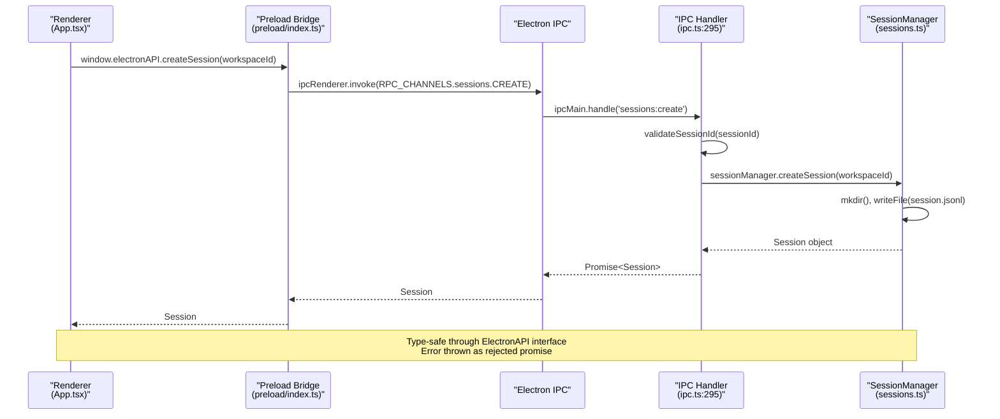
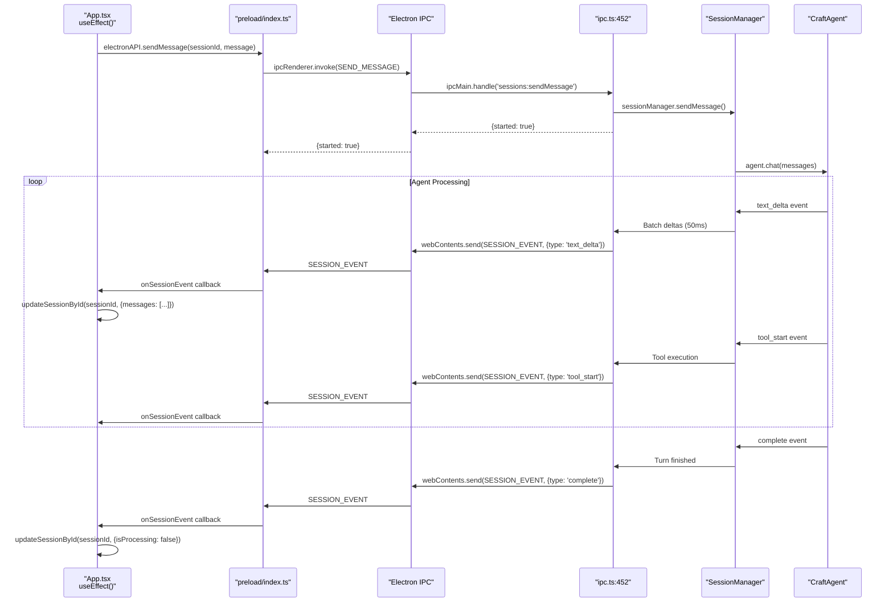

# IPC Channels

Relevant source files

The following files were used as context for generating this wiki page:

- [apps/electron/src/transport/channel-map.ts](apps/electron/src/transport/channel-map.ts)
- [packages/shared/src/protocol/channels.ts](packages/shared/src/protocol/channels.ts)
- [packages/shared/src/protocol/dto.ts](packages/shared/src/protocol/dto.ts)
- [packages/shared/src/protocol/routing.ts](packages/shared/src/protocol/routing.ts)

Complete technical reference for all Inter-Process Communication (IPC) channels in Craft Agents. This page documents the wire-format constants, their request parameters, return types, and the handler functions that process them.

Related pages: [2.6 IPC Communication Layer](), [2.3 Agent System](), [8.2 SessionManager API]().

## Architecture Overview

IPC channels bridge the renderer process (React UI) and main process (Node.js backend) through Electron's IPC system. The preload script at [apps/electron/src/preload/index.ts:1-525]() exposes a type-safe `window.electronAPI` interface using `contextBridge.exposeInMainWorld()`.

**Communication Patterns**:

| Pattern | Renderer API | Main Handler | Use Case |
|---------|-------------|--------------|----------|
| Request/Response | `ipcRenderer.invoke(channel, ...args)` | `ipcMain.handle(channel, handler)` | Synchronous operations returning data |
| Event Streaming | `ipcRenderer.on(channel, callback)` | `webContents.send(channel, event)` | Asynchronous updates (agent responses, file watching) |

All channel names are defined in the `RPC_CHANNELS` constant at [packages/shared/src/protocol/channels.ts:6-215](). Handlers are registered via `registerIpcHandlers()` at [apps/electron/src/main/ipc.ts:295]().

Sources: [apps/electron/src/main/ipc.ts:295-2491](), [apps/electron/src/preload/index.ts:1-525](), [packages/shared/src/protocol/channels.ts:6-215]()

---

## Channel Categories and Code Mapping

IPC channels are organized by functional domain. Each channel maps to a handler in `apps/electron/src/main/ipc.ts` that delegates to domain-specific managers.

**Channel Categories to Code Entities**

```mermaid
graph TB
    subgraph "RPC_CHANNELS Constants (protocol/channels.ts)"
        GET_SESSIONS["sessions.GET<br/>'sessions:get'"]
        CREATE_SESSION["sessions.CREATE<br/>'sessions:create'"]
        SEND_MESSAGE["sessions.SEND_MESSAGE<br/>'sessions:sendMessage'"]
        SESSION_COMMAND["sessions.COMMAND<br/>'sessions:command'"]
        SESSION_EVENT["sessions.EVENT<br/>'session:event'"]
        
        GET_WORKSPACES["workspaces.GET<br/>'workspaces:get'"]
        CREATE_WORKSPACE["workspaces.CREATE<br/>'workspaces:create'"]
        
        READ_FILE["file.READ<br/>'file:read'"]
        STORE_ATTACHMENT["file.STORE_ATTACHMENT<br/>'file:storeAttachment'"]
        FS_SEARCH["fs.SEARCH<br/>'fs:search'"]
        
        LLM_CONNECTION_LIST["llmConnections.LIST<br/>'LLM_Connection:list'"]
        
        OPEN_WORKSPACE["window.OPEN_WORKSPACE<br/>'window:openWorkspace'"]
        SWITCH_WORKSPACE["window.SWITCH_WORKSPACE<br/>'window:switchWorkspace'"]
    end
    
    subgraph "Handler Functions (ipc.ts)"
        GET_SESSIONS --> SessionsHandler["ipcMain.handle()<br/>sessionManager.getSessions()"]
        CREATE_SESSION --> CreateHandler["sessionManager.createSession()"]
        SEND_MESSAGE --> SendHandler["sessionManager.sendMessage()"]
        SESSION_COMMAND --> CommandHandler["switch(command.type)"]
        SESSION_EVENT --> EventBroadcast["webContents.send()"]
        
        GET_WORKSPACES --> WorkspaceHandler["getWorkspaces()"]
        CREATE_WORKSPACE --> AddWorkspace["addWorkspace()"]
        
        READ_FILE --> FileHandler["validateFilePath()<br/>readFile()"]
        STORE_ATTACHMENT --> StoreHandler["sanitizeFilename()<br/>writeFile()"]
        FS_SEARCH --> SearchHandler["BFS traversal<br/>readdir()"]
        
        LLM_CONNECTION_LIST --> LlmHandler["getLlmConnections()"]
        
        OPEN_WORKSPACE --> WindowOpen["windowManager.focusOrCreateWindow()"]
        SWITCH_WORKSPACE --> WindowSwitch["windowManager.updateWindowWorkspace()"]
    end
    
    subgraph "Backend Managers"
        SessionsHandler --> SM["SessionManager<br/>sessions.ts"]
        EventBroadcast --> SM
        WorkspaceHandler --> Config["@craft-agent/shared/config"]
        FileHandler --> FS["Node.js fs/promises"]
        LlmHandler --> Config
        WindowOpen --> WM["WindowManager<br/>window-manager.ts"]
    end
```

Sources: [packages/shared/src/protocol/channels.ts:6-215](), [apps/electron/src/main/ipc.ts:295-2491](), [apps/electron/src/transport/channel-map.ts:19-160]()

---

## Request/Response Pattern

Synchronous request/call pattern for IPC channels. The renderer invokes a channel, and the main process handler validates and executes the request, returning a result.

**Call Flow with Code References**

**Type Safety**: The `CHANNEL_MAP` at [apps/electron/src/transport/channel-map.ts:19-160]() ensures consistency between method names and wire strings. Every channel is classified as either `LOCAL_ONLY_CHANNELS` or `REMOTE_ELIGIBLE_CHANNELS` at [packages/shared/src/protocol/routing.ts:17-200]() to support hybrid local/remote execution.

Sources: [apps/electron/src/main/ipc.ts:428-433](), [apps/electron/src/preload/index.ts:10](), [apps/electron/src/transport/channel-map.ts:19-160](), [packages/shared/src/protocol/routing.ts:1-205]()

---

## Event Streaming Pattern

Asynchronous event streaming for agent responses and live updates. The handler returns immediately while events stream to the renderer via the `SESSION_EVENT` channel.

**Streaming Flow with Event Types**

**Event Types**: The `SessionEvent` union type at [packages/shared/src/protocol/dto.ts:160-192]() defines all possible events: `text_delta`, `tool_start`, `tool_result`, `complete`, `error`, `permission_request`, etc.

Sources: [apps/electron/src/main/ipc.ts:452-479](), [packages/shared/src/protocol/dto.ts:160-192]()

---

## Session Management Channels

### `sessions.GET` (`sessions:get`)
Retrieves all sessions for display in the sidebar.
- **Parameters**: None
- **Returns**: `Session[]` - Array of session metadata defined at [packages/shared/src/protocol/dto.ts:46-104]().
- **Implementation**: [apps/electron/src/main/ipc.ts:121-126]()

### `sessions.GET_MESSAGES` (`sessions:getMessages`)
Lazy-loads full session content including message history.
- **Parameters**: `sessionId: string`
- **Returns**: `Session | null`
- **Implementation**: [apps/electron/src/main/ipc.ts:129-134]()

### `sessions.CREATE` (`sessions:create`)
Creates a new conversation session.
- **Parameters**: `workspaceId: string`, `options?: CreateSessionOptions` at [packages/shared/src/protocol/dto.ts:106-131]()
- **Returns**: `Session`
- **Implementation**: [apps/electron/src/main/ipc.ts:239-244]()

### `sessions.SEND_MESSAGE` (`sessions:sendMessage`)
Sends a user message to the agent.
- **Parameters**: `sessionId: string`, `message: string`, `attachments?: FileAttachment[]`, `options?: SendMessageOptions`
- **Returns**: `{ started: true }`
- **Implementation**: [apps/electron/src/main/ipc.ts:255-282]()

### `sessions.COMMAND` (`sessions:command`)
Consolidated handler for session operations using a discriminated union pattern.
- **Command Types**: `flag`, `unflag`, `rename`, `markRead`, `setPermissionMode`, `setThinkingLevel`, `setLabels`, `shareToViewer`.
- **Implementation**: [apps/electron/src/main/ipc.ts:519-606]()

Sources: [apps/electron/src/main/ipc.ts:121-606](), [packages/shared/src/protocol/dto.ts:46-131](), [packages/shared/src/protocol/channels.ts:20-50]()

---

## File Operations Channels

### `file.READ` (`file:read`)
Reads a text file with security path validation.
- **Parameters**: `path: string`
- **Returns**: `string`
- **Security**: Validates path via `validateFilePath()` at [apps/electron/src/main/ipc.ts:59-117]().

### `file.STORE_ATTACHMENT` (`file:storeAttachment`)
Persists file attachment to session storage with thumbnail generation.
- **Parameters**: `sessionId: string`, `attachment: FileAttachment`
- **Returns**: `StoredAttachment`
- **Implementation**: [apps/electron/src/main/ipc.ts:753-953]()

### `fs.SEARCH` (`fs:search`)
Parallel BFS filesystem search for @mention selection.
- **Parameters**: `basePath: string`, `query: string`
- **Returns**: `FileSearchResult[]`
- **Implementation**: [apps/electron/src/main/ipc.ts:1086-1195]()

Sources: [apps/electron/src/main/ipc.ts:59-1195](), [packages/shared/src/protocol/channels.ts:74-87]()

---

## Workspace & LLM Channels

### `workspaces.GET` (`workspaces:get`)
Lists all configured workspaces.
- **Implementation**: [apps/electron/src/main/ipc.ts:137-139]()

### `llmConnections.LIST` (`LLM_Connection:list`)
Lists all LLM provider connections.
- **Implementation**: [apps/electron/src/main/ipc.ts:1394-1402]()

### `onboarding.GET_AUTH_STATE` (`onboarding:getAuthState`)
Retrieves the current authentication and setup status.
- **Implementation**: [apps/electron/src/main/ipc.ts:1484-1486]()

Sources: [apps/electron/src/main/ipc.ts:137-1486](), [packages/shared/src/protocol/channels.ts:54-181]()

---

## Window & System Channels

### `window.OPEN_WORKSPACE` (`window:openWorkspace`)
Focuses or creates a window for a specific workspace.
- **Implementation**: [apps/electron/src/main/ipc.ts:167-172]()

### `system.VERSIONS` (`system:versions`)
Returns versions of Electron, Chrome, Node, and the App.
- **Implementation**: [apps/electron/src/main/ipc.ts:723-725]()

### `update.CHECK` (`update:check`)
Checks for application updates.
- **Implementation**: [apps/electron/src/main/ipc.ts:922-947]()

Sources: [apps/electron/src/main/ipc.ts:167-947](), [packages/shared/src/protocol/channels.ts:60-121]()