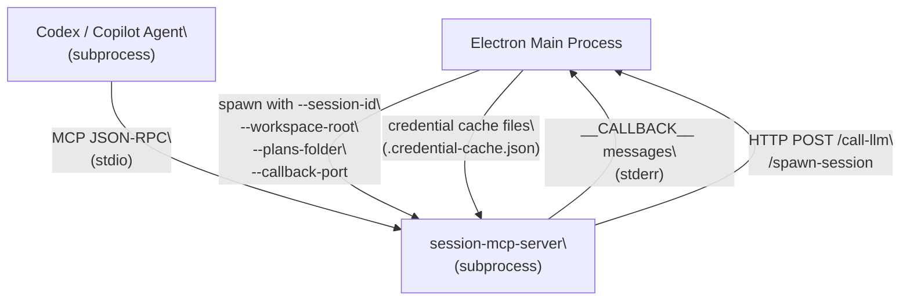
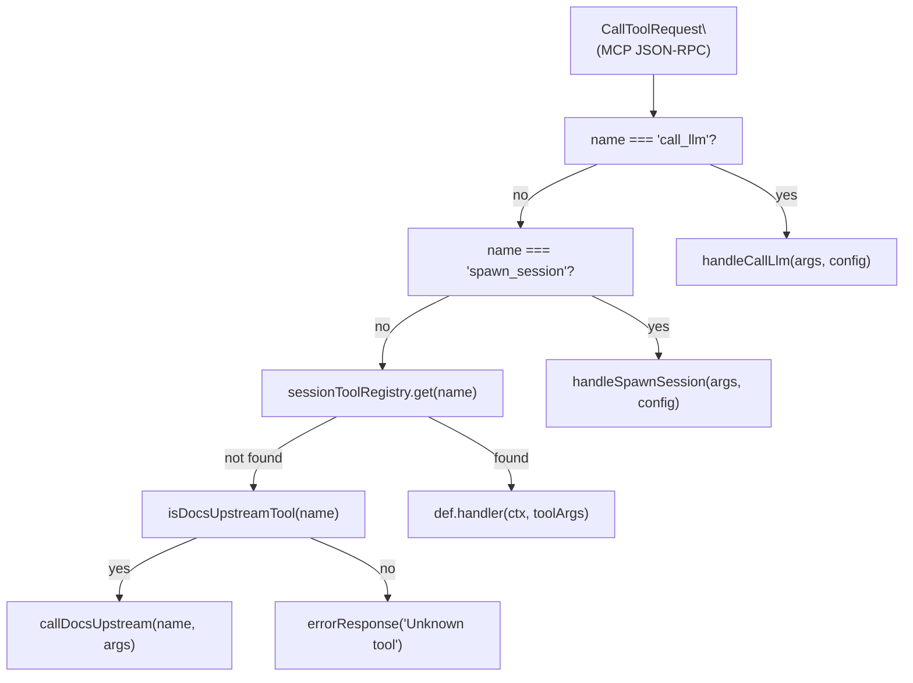

# MCP Server Binaries

<details>
<summary>Relevant source files</summary>

The following files were used as context for generating this wiki page:

- [packages/session-mcp-server/package.json](packages/session-mcp-server/package.json)
- [packages/session-mcp-server/src/index.ts](packages/session-mcp-server/src/index.ts)
- [packages/session-tools-core/package.json](packages/session-tools-core/package.json)

</details>

This page documents the two standalone MCP server binaries shipped with Craft Agents: **`session-mcp-server`** and **`bridge-mcp-server`**. These processes run as stdio subprocesses spawned by the main Electron process. They expose tool sets to agent backends (primarily Codex/OpenAI) that need to communicate with the Craft Agents runtime without direct access to Electron internals.

For the session-scoped tool _handlers themselves_ (the shared logic that both Claude and Codex use), see [Session-Scoped Tools](#8.5). For how sources are configured and connected, see [Sources](#4.3).

---

## Package Overview

| Package                           | Path                          | Transport      | Primary Consumer        |
| --------------------------------- | ----------------------------- | -------------- | ----------------------- |
| `@craft-agent/session-mcp-server` | `packages/session-mcp-server` | stdio JSON-RPC | Codex (OpenAI), Copilot |
| `@craft-agent/bridge-mcp-server`  | `packages/bridge-mcp-server`  | stdio JSON-RPC | External MCP clients    |
| `@craft-agent/session-tools-core` | `packages/session-tools-core` | _(library)_    | Both of the above       |

`session-tools-core` is a shared library (not a binary) that provides the canonical tool registry, handler implementations, and type definitions used by both the MCP servers and by the main Electron process when running Claude sessions.

Sources: [packages/session-mcp-server/package.json:1-24](), [packages/session-tools-core/package.json:1-23]()

---

## `session-mcp-server`

### Purpose

`session-mcp-server` is a Node.js CommonJS binary that implements an MCP server over stdio. It is spawned by the main Electron process once per agent session for Codex and Copilot backends. It provides the same session-scoped tool set that Claude receives via in-process callbacks, ensuring feature parity across all agent backends.

The binary is built to `dist/index.js` via:

```
bun build src/index.ts --outdir=dist --target=node --format=cjs
```

and registered as the `session-mcp-server` bin entry in `package.json`.

Sources: [packages/session-mcp-server/package.json:1-24](), [packages/session-mcp-server/src/index.ts:1-22]()

### CLI Arguments

The server accepts four command-line arguments:

| Argument                  | Required | Description                                        |
| ------------------------- | -------- | -------------------------------------------------- |
| `--session-id <id>`       | Yes      | Unique session identifier                          |
| `--workspace-root <path>` | Yes      | Path to `~/.craft-agent/workspaces/{id}`           |
| `--plans-folder <path>`   | Yes      | Path to the session's plans folder                 |
| `--callback-port <port>`  | No       | HTTP port for `call_llm`/`spawn_session` callbacks |

If `--session-id`, `--workspace-root`, or `--plans-folder` are missing, the process exits with code 1.

The `callbackPort` falls back to the `CRAFT_LLM_CALLBACK_PORT` environment variable when the CLI argument is not supplied.

Sources: [packages/session-mcp-server/src/index.ts:466-503]()

### Architecture

**Process Communication Diagram**



Sources: [packages/session-mcp-server/src/index.ts:66-76](), [packages/session-mcp-server/src/index.ts:343-393]()

### Transport Layer

The server uses `StdioServerTransport` from `@modelcontextprotocol/sdk/server/stdio.js`. The MCP JSON-RPC protocol runs over the process's stdin/stdout. Stderr is reserved for two purposes:

1. Diagnostic log messages (`console.error(...)`)
2. Structured `__CALLBACK__` messages sent back to the Electron main process

The main process must parse stderr line-by-line and distinguish log lines from callback lines by the `__CALLBACK__` prefix.

Sources: [packages/session-mcp-server/src/index.ts:566-570]()

---

### Callback Communication

When a tool needs to trigger a UI action in the Electron process (e.g., displaying a plan, initiating OAuth), the server writes a JSON message to stderr prefixed with `__CALLBACK__`.

The `sendCallback` function [packages/session-mcp-server/src/index.ts:73-76]() serializes a `CallbackMessage` object and writes it as a single line to stderr:

```
__CALLBACK__{"__callback__":"plan_submitted","sessionId":"abc","planPath":"/path/to/plan.md"}
```

The `CallbackMessage` type is defined in `@craft-agent/session-tools-core`. Two callback types are used:

| `__callback__` value | Trigger                     | Payload fields                 |
| -------------------- | --------------------------- | ------------------------------ |
| `plan_submitted`     | `SubmitPlan` tool invoked   | `sessionId`, `planPath`        |
| `auth_request`       | OAuth required for a source | Fields from `AuthRequest` type |

Sources: [packages/session-mcp-server/src/index.ts:66-76](), [packages/session-mcp-server/src/index.ts:176-190]()

---

### Credential Access

Because the server runs as an isolated subprocess without access to the system keychain, it reads credentials from cache files written by the Electron main process.

**Credential cache path resolution:**

```
~/.craft-agent/workspaces/{workspaceId}/sources/{sourceSlug}/.credential-cache.json
```

The `createCredentialManager` function [packages/session-mcp-server/src/index.ts:129-145]() returns a `CredentialManagerInterface` that:

- **`hasValidCredentials`** — checks if the cache file exists and is not expired
- **`getToken`** — reads the token string from `CredentialCacheEntry.value`
- **`refresh`** — always returns `null`; token refresh requires the main process

The `CredentialCacheEntry` format [packages/session-mcp-server/src/index.ts:86-89]():

| Field       | Type      | Description                                       |
| ----------- | --------- | ------------------------------------------------- |
| `value`     | `string`  | The credential token                              |
| `expiresAt` | `number?` | Unix timestamp in ms; entry is invalid after this |

Sources: [packages/session-mcp-server/src/index.ts:82-145]()

---

### Tool Registry and Dispatch

**Tool dispatch flow:**



Sources: [packages/session-mcp-server/src/index.ts:532-564]()

The `sessionToolRegistry` is populated by `getSessionToolRegistry` from `@craft-agent/session-tools-core`, which returns a feature-filtered map of tool name → `{ handler, inputSchema, description }`. The `includeDeveloperFeedback` flag gates the developer feedback tool.

Tools are advertised via `ListToolsRequestSchema` as the union of:

- Session tools from `createSessionTools(includeDeveloperFeedback)` — converts registry definitions to MCP `Tool` objects via `getToolDefsAsJsonSchema`
- Docs upstream tools from `docsTools` (see [Docs Upstream Proxy](#docs-upstream-proxy) below)

Sources: [packages/session-mcp-server/src/index.ts:261-269](), [packages/session-mcp-server/src/index.ts:527-530]()

---

### `call_llm` and `spawn_session` Dispatch

These two tools are handled outside the canonical registry because their execution path varies by backend:

**Primary path (Codex):** The Electron main process intercepts the tool call via `PreToolUse`, executes the LLM call, and injects the result as a `_precomputedResult` string argument before the tool reaches the MCP server. The server reads and returns this precomputed value without making any network calls.

**Fallback path (Copilot):** Copilot's implementation does not fire `PreToolUse` for MCP tools. The server falls back to making an HTTP POST to the Electron main process at:

- `http://127.0.0.1:{callbackPort}/call-llm`
- `http://127.0.0.1:{callbackPort}/spawn-session`

The timeout for these HTTP callbacks is 120 seconds (`CALLBACK_TOOL_TIMEOUT_MS`).

Sources: [packages/session-mcp-server/src/index.ts:343-446](), [packages/session-mcp-server/src/index.ts:63-63]()

---

### Docs Upstream Proxy

On startup, `connectDocsUpstream()` attempts to connect to the remote Craft Agents documentation MCP server at `https://agents.craft.do/docs/mcp` using a `StreamableHTTPClientTransport`. If successful, the fetched tool definitions are merged into the `ListTools` response and routed to `callDocsUpstream()` on invocation.

This connection is best-effort: if the remote server is unreachable, startup continues normally and `docsTools` remains empty.

Sources: [packages/session-mcp-server/src/index.ts:275-337]()

---

### `SessionToolContext` Construction

The `createCodexContext` function [packages/session-mcp-server/src/index.ts:155-255]() assembles the `SessionToolContext` object passed to every tool handler. It provides:

| Context field               | Implementation                                                         |
| --------------------------- | ---------------------------------------------------------------------- |
| `fs`                        | Synchronous Node.js `fs` calls (`readFileSync`, `writeFileSync`, etc.) |
| `callbacks.onPlanSubmitted` | Writes `plan_submitted` callback to stderr                             |
| `callbacks.onAuthRequest`   | Writes `auth_request` callback to stderr                               |
| `credentialManager`         | Reads from `.credential-cache.json` files                              |
| `updatePreferences`         | Directly writes to `~/.craft-agent/preferences.json`                   |
| `submitFeedback`            | Writes JSON files to `~/.craft-agent/feedback/`                        |
| `loadSourceConfig`          | Delegates to `loadSourceConfig` helper from `session-tools-core`       |

Fields _not available_ in the Codex context (require Electron internals): `saveSourceConfig`, validators, `renderMermaid`.

Sources: [packages/session-mcp-server/src/index.ts:155-255]()

---

## `session-tools-core`

`@craft-agent/session-tools-core` is a shared library, not a binary. It is consumed by both `session-mcp-server` and the Electron main process.

Key exports used by `session-mcp-server`:

| Export                       | Role                                                                             |
| ---------------------------- | -------------------------------------------------------------------------------- |
| `getSessionToolRegistry`     | Returns the feature-filtered map of tool name → definition + handler             |
| `getToolDefsAsJsonSchema`    | Converts tool definitions to MCP-compatible JSON Schema objects                  |
| `loadSourceConfig`           | Reads a source's `config.json` from the workspace directory                      |
| `errorResponse`              | Constructs a standard MCP error result object                                    |
| `SessionToolContext`         | Interface defining the context passed to all tool handlers                       |
| `CallbackMessage`            | Union type for `plan_submitted` / `auth_request` callback payloads               |
| `CredentialManagerInterface` | Interface for credential lookup (implemented differently in main vs. subprocess) |

Sources: [packages/session-mcp-server/src/index.ts:36-50](), [packages/session-tools-core/package.json:1-23]()

---

## Startup Sequence Diagram

**`session-mcp-server` startup:**

```mermaid
sequenceDiagram
    participant ElectronMain as "Electron Main Process"
    participant SessionMCP as "session-mcp-server\
(subprocess)"
    participant DocsMCP as "agents.craft.do/docs/mcp"

    ElectronMain->>SessionMCP: "spawn(node session-mcp-server.js --session-id ... --workspace-root ... --plans-folder ... --callback-port ...)"
    SessionMCP->>SessionMCP: "setupSignalHandlers()"
    SessionMCP->>SessionMCP: "parseArgs() → SessionConfig"
    SessionMCP->>SessionMCP: "createCodexContext(config)"
    SessionMCP->>SessionMCP: "getSessionToolRegistry({ includeDeveloperFeedback })"
    SessionMCP->>DocsMCP: "connectDocsUpstream() via StreamableHTTPClientTransport"
    DocsMCP-->>SessionMCP: "tool definitions (or error, non-fatal)"
    SessionMCP->>SessionMCP: "server.connect(StdioServerTransport)"
    SessionMCP-->>ElectronMain: "(stderr) Session MCP Server started for session {id}"
```

Sources: [packages/session-mcp-server/src/index.ts:466-576]()

---

## Signal Handling and Lifecycle

`setupSignalHandlers()` [packages/session-mcp-server/src/index.ts:452-464]() registers handlers for:

- `SIGTERM` — graceful exit (code 0)
- `SIGINT` — graceful exit (code 0)
- `unhandledRejection` — logs to stderr, does not exit

The server has no built-in idle timeout; the Electron main process is responsible for terminating the subprocess when the session ends.

Sources: [packages/session-mcp-server/src/index.ts:452-464]()
