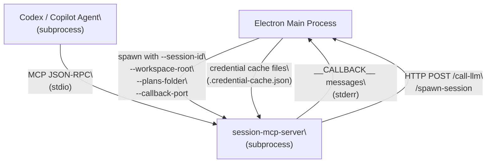
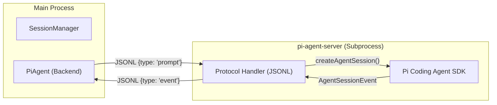
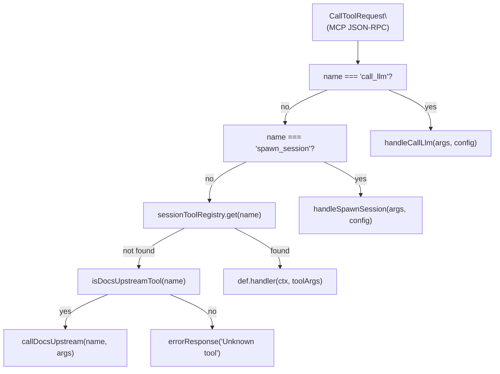

# MCP Server Binaries

Relevant source files

The following files were used as context for generating this wiki page:

- [packages/pi-agent-server/package.json](packages/pi-agent-server/package.json)
- [packages/pi-agent-server/src/index.ts](packages/pi-agent-server/src/index.ts)
- [packages/session-mcp-server/package.json](packages/session-mcp-server/package.json)

This page documents the standalone MCP server binaries and out-of-process agents shipped with Craft Agents: **`session-mcp-server`**, **`bridge-mcp-server`**, and **`pi-agent-server`**. These processes run as stdio subprocesses spawned by the main Electron process. They expose tool sets and agent capabilities to backends that need to communicate with the Craft Agents runtime or isolate heavy dependencies without direct access to Electron internals.

For the session-scoped tool *handlers themselves* (the shared logic that both Claude and Codex use), see [Session-Scoped Tools](8.5). For how sources are configured and connected, see [Sources](4.3).

---

## Package Overview

| Package | Path | Transport | Primary Consumer |
|---|---|---|---|
| `@craft-agent/session-mcp-server` | `packages/session-mcp-server` [packages/session-mcp-server/package.json:1-24]() | stdio JSON-RPC | Codex (OpenAI), Copilot |
| `@craft-agent/pi-agent-server` | `packages/pi-agent-server` [packages/pi-agent-server/package.json:1-30]() | stdio JSONL | Pi Agent (Bedrock/Anthropic) |
| `@craft-agent/bridge-mcp-server` | `packages/bridge-mcp-server` | stdio JSON-RPC | External MCP clients |
| `@craft-agent/session-tools-core` | `packages/session-tools-core` | *(library)* | `session-mcp-server` |

Sources: [packages/session-mcp-server/package.json:1-24](), [packages/pi-agent-server/package.json:1-30]()

---

## `session-mcp-server`

### Purpose

`session-mcp-server` is a Node.js CommonJS binary that implements an MCP server over stdio. It is spawned by the main Electron process once per agent session for Codex and Copilot backends. It provides the same session-scoped tool set that Claude receives via in-process callbacks, ensuring feature parity across all agent backends. [packages/session-mcp-server/package.json:5-10]()

The binary is built to `dist/index.js` via Bun and registered as a bin entry. [packages/session-mcp-server/package.json:8-12]()

### CLI Arguments

The server accepts four command-line arguments:

| Argument | Required | Description |
|---|---|---|
| `--session-id <id>` | Yes | Unique session identifier |
| `--workspace-root <path>` | Yes | Path to `~/.craft-agent/workspaces/{id}` |
| `--plans-folder <path>` | Yes | Path to the session's plans folder |
| `--callback-port <port>` | No | HTTP port for `call_llm`/`spawn_session` callbacks |

If required arguments are missing, the process exits with code 1. [packages/session-mcp-server/src/index.ts:466-503]()

### Architecture

**Process Communication Diagram**

Sources: [packages/session-mcp-server/src/index.ts:66-76](), [packages/session-mcp-server/src/index.ts:343-393]()

### Transport Layer

The server uses `StdioServerTransport` from `@modelcontextprotocol/sdk`. The MCP JSON-RPC protocol runs over the process's stdin/stdout. Stderr is reserved for diagnostic log messages and structured `__CALLBACK__` messages sent back to the Electron main process. [packages/session-mcp-server/src/index.ts:566-570]()

---

## `pi-agent-server`

### Purpose

`pi-agent-server` is an out-of-process agent server that wraps the `@mariozechner/pi-coding-agent` SDK. It communicates with the main Electron process using a line-delimited JSON (JSONL) protocol over stdio. [packages/pi-agent-server/src/index.ts:1-15]()

This design isolates the Pi SDK's ESM and heavy dependencies (like `pdfjs-dist` and `turndown`) into a separate process, avoiding bundling issues and bloat in the Electron main process. [packages/pi-agent-server/src/index.ts:13-15](), [packages/pi-agent-server/package.json:16-25]()

### Protocol and Message Flow

The server receives an `InitMessage` containing session configuration, model details, and credentials. [packages/pi-agent-server/src/index.ts:89-112]()

**Agent Interaction Flow**

Sources: [packages/pi-agent-server/src/index.ts:115-130](), [packages/pi-agent-server/src/index.ts:25-30]()

### Tool Execution

The `pi-agent-server` exposes both built-in Pi tools (e.g., `codingTools`) and proxy tools defined by the main process. [packages/pi-agent-server/src/index.ts:29-30](), [packages/pi-agent-server/src/index.ts:118]()

1. **Local Tools:** Executed directly within the `pi-agent-server` process (e.g., `web-fetch`, `search`). [packages/pi-agent-server/src/index.ts:71-73]()
2. **Proxy Tools:** When the Pi agent invokes a proxy tool, the server sends a `tool_execute_request` to the main process via stdout and waits for a `tool_execute_response` on stdin. [packages/pi-agent-server/src/index.ts:119](), [packages/pi-agent-server/src/index.ts:162]()

### Model Resolution

The server uses a `resolvePiModel` helper to map Craft Agent model strings to Pi SDK provider configurations, supporting Bedrock, Anthropic, and custom OpenAI-compatible endpoints. [packages/pi-agent-server/src/index.ts:62](), [packages/pi-agent-server/src/index.ts:86]()

---

## Tool Registry and Dispatch (MCP)

**Tool dispatch flow for `session-mcp-server`:**

Sources: [packages/session-mcp-server/src/index.ts:532-564]()

### `call_llm` and `spawn_session` Dispatch

These tools are handled specially because their execution path varies:

1. **Precomputed Path:** If the Electron main process intercepts the call via `PreToolUse`, it injects a `_precomputedResult`. The server returns this directly. [packages/session-mcp-server/src/index.ts:343-355]()
2. **Callback Path:** If no precomputed result exists, the server makes an HTTP POST to the Electron process's `callbackPort`. [packages/session-mcp-server/src/index.ts:360-393]()

Sources: [packages/session-mcp-server/src/index.ts:343-446]()

---

## Lifecycle Management

Both `session-mcp-server` and `pi-agent-server` implement signal handlers for graceful shutdown.

- **`session-mcp-server`**: Listens for `SIGTERM` and `SIGINT` to exit cleanly. [packages/session-mcp-server/src/index.ts:452-464]()
- **`pi-agent-server`**: Listens for a `shutdown` message on stdin to perform cleanup before exiting. [packages/pi-agent-server/src/index.ts:130]()

The Electron main process is responsible for spawning these binaries as child processes and monitoring their stderr for logs or lifecycle events.

Sources: [packages/session-mcp-server/src/index.ts:452-464](), [packages/pi-agent-server/src/index.ts:115-130]()