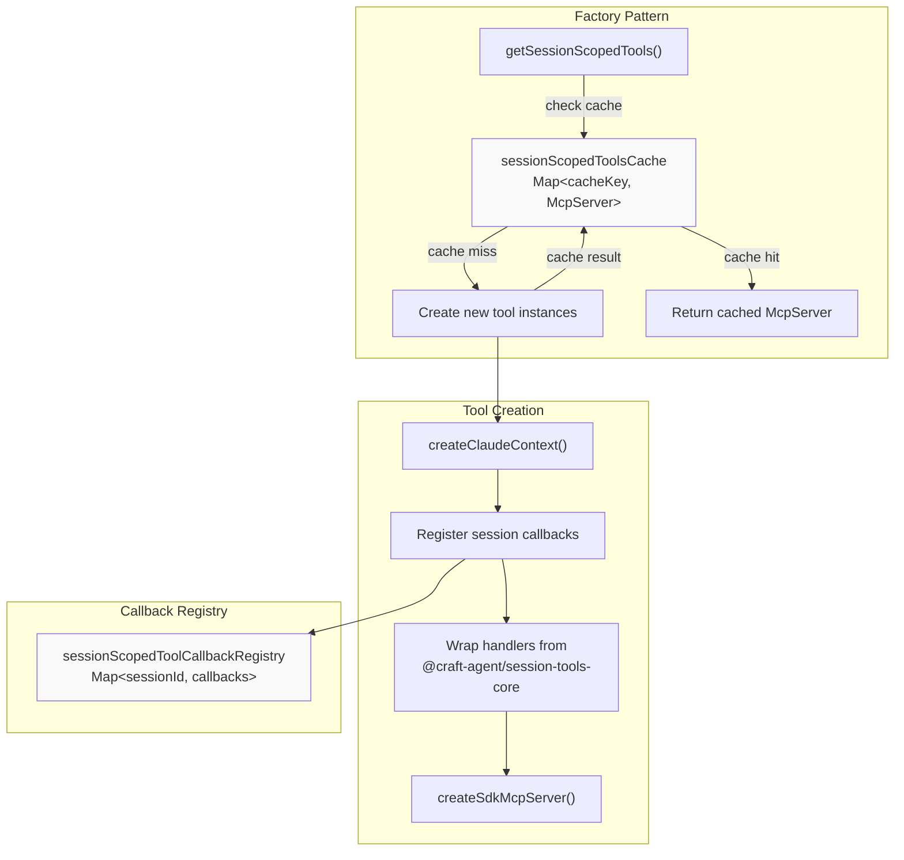
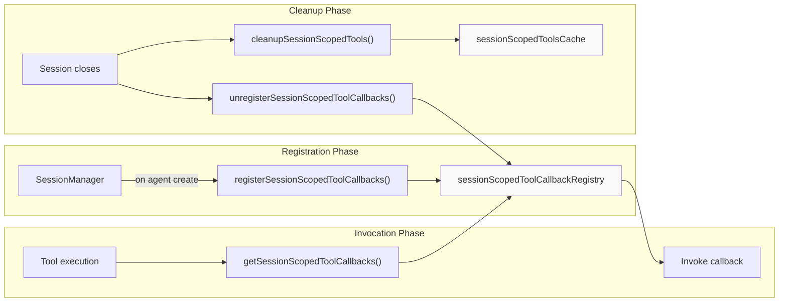
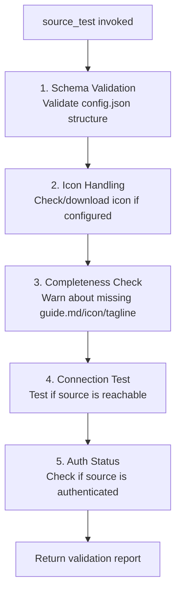
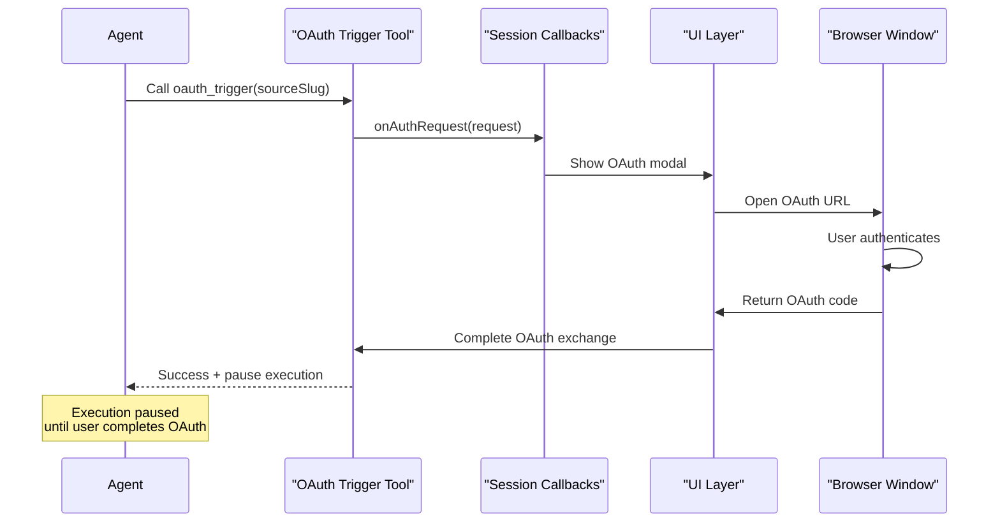
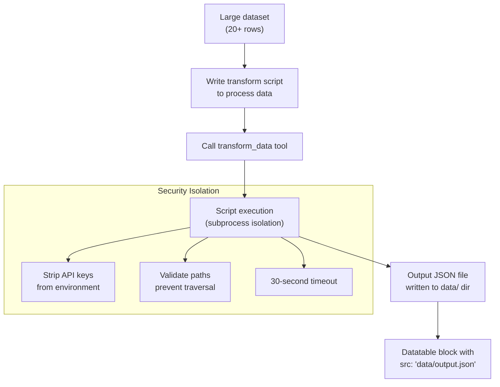
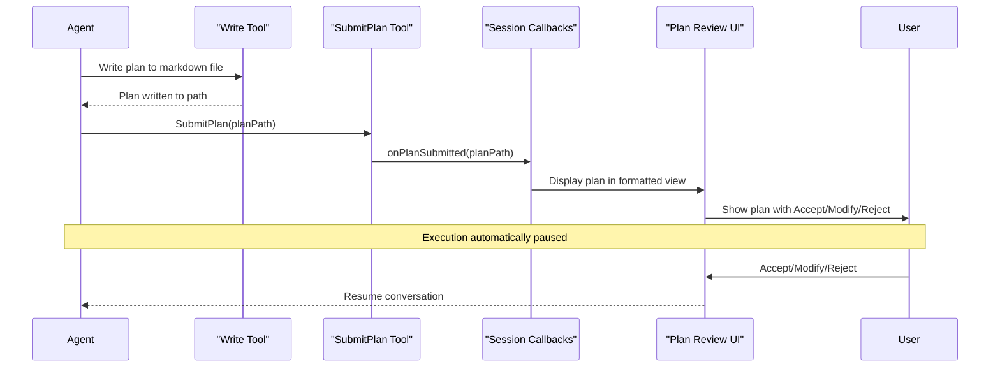
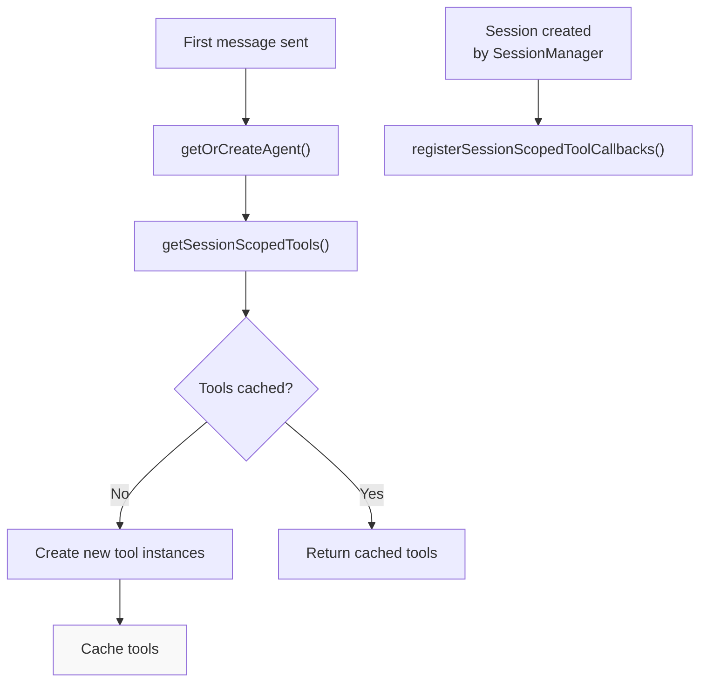
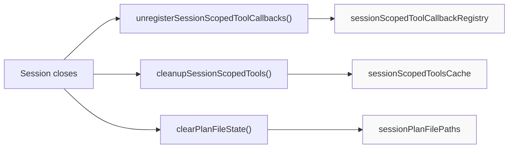
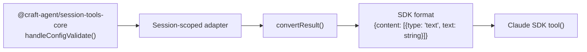

# Session-Scoped Tools

<details>
<summary>Relevant source files</summary>

The following files were used as context for generating this wiki page:

- [apps/electron/src/renderer/components/app-shell/input/FreeFormInput.tsx](apps/electron/src/renderer/components/app-shell/input/FreeFormInput.tsx)
- [bun.lock](bun.lock)
- [packages/session-mcp-server/package.json](packages/session-mcp-server/package.json)
- [packages/session-tools-core/package.json](packages/session-tools-core/package.json)
- [packages/shared/src/agent/llm-tool.ts](packages/shared/src/agent/llm-tool.ts)
- [packages/shared/src/agent/session-scoped-tools.ts](packages/shared/src/agent/session-scoped-tools.ts)

</details>

Session-scoped tools are specialized tools that are created per-session with session-specific state and callbacks. Each session receives its own isolated instance of these tools, allowing them to maintain context and coordinate with the session's lifecycle events.

This document covers the 12 built-in session-scoped tools, their architecture, and integration patterns. For information about tools provided by external sources, see [External Service Integration](#2.4). For general agent system architecture, see [Agent System](#2.3).

---

## Overview

Session-scoped tools provide specialized capabilities that require access to session state, workspace configuration, or user interaction. Unlike standard MCP tools provided by external sources, these tools are built into the agent runtime and have privileged access to the application's internal APIs.

### Tool Categories

| Category                       | Tools                                                                                                                                             | Purpose                                                     |
| ------------------------------ | ------------------------------------------------------------------------------------------------------------------------------------------------- | ----------------------------------------------------------- |
| **Configuration & Validation** | `config_validate`, `skill_validate`, `mermaid_validate`                                                                                           | Validate configuration files before they take effect        |
| **Source Management**          | `source_test`                                                                                                                                     | Test source connectivity and authentication status          |
| **Authentication**             | `source_oauth_trigger`, `source_google_oauth_trigger`, `source_slack_oauth_trigger`, `source_microsoft_oauth_trigger`, `source_credential_prompt` | Trigger OAuth flows and credential input                    |
| **Data Transformation**        | `transform_data`                                                                                                                                  | Execute scripts to transform large datasets for display     |
| **Plan Management**            | `SubmitPlan`                                                                                                                                      | Submit plans for user review with automatic execution pause |

**Sources:** [packages/shared/src/agent/session-scoped-tools.ts:1-22]()

---

## Architecture

### Factory and Caching Pattern



**Cache Key Format:** `${sessionId}::${workspaceRootPath}`

The factory function `getSessionScopedTools()` returns a cached MCP server instance for each unique session-workspace combination. This prevents recreating tool instances on every agent call while maintaining per-session isolation.

**Sources:** [packages/shared/src/agent/session-scoped-tools.ts:530-648]()

---

### Callback Registration System



**Callbacks Interface:**

| Callback          | Signature                        | Trigger                                        |
| ----------------- | -------------------------------- | ---------------------------------------------- |
| `onPlanSubmitted` | `(planPath: string) => void`     | `SubmitPlan` tool completes successfully       |
| `onAuthRequest`   | `(request: AuthRequest) => void` | Any OAuth or credential prompt tool is invoked |

**Sources:** [packages/shared/src/agent/session-scoped-tools.ts:72-116]()

---

## Tool Reference

### Configuration & Validation Tools

#### config_validate

Validates Craft Agent configuration files with structured error reporting.

**Schema:**

```typescript
{
  target: 'config' | 'sources' | 'statuses' | 'preferences' | 'permissions' | 'hooks' | 'tool-icons' | 'all',
  sourceSlug?: string
}
```

**Validation Targets:**

| Target        | File Path                                                     | Validates                                   |
| ------------- | ------------------------------------------------------------- | ------------------------------------------- |
| `config`      | `~/.craft-agent/config.json`                                  | Workspaces, model settings, LLM connections |
| `sources`     | `~/.craft-agent/workspaces/{workspace}/sources/*/config.json` | All source configurations                   |
| `statuses`    | `~/.craft-agent/workspaces/{workspace}/statuses/config.json`  | Status workflow definitions                 |
| `preferences` | `~/.craft-agent/preferences.json`                             | User preference schema                      |
| `permissions` | `permissions.json`                                            | Permission mode settings                    |
| `hooks`       | `hooks.json`                                                  | Hook definitions and matchers               |
| `tool-icons`  | `~/.craft-agent/tool-icons/tool-icons.json`                   | Custom tool icon mappings                   |
| `all`         | Multiple                                                      | All configuration files                     |

**Use Cases:**

- Validate configuration after editing via Write tool
- Check for errors before configuration reload
- Verify source configuration completeness

**Sources:** [packages/shared/src/agent/session-scoped-tools.ts:204-208](), [packages/shared/src/agent/session-scoped-tools.ts:264-278]()

---

#### skill_validate

Validates skill `SKILL.md` files for correct structure and metadata.

**Schema:**

```typescript
{
  skillSlug: string
}
```

**Validation Checks:**

| Check            | Requirement                                                  |
| ---------------- | ------------------------------------------------------------ |
| Slug format      | Lowercase alphanumeric with hyphens only                     |
| File existence   | `SKILL.md` must exist and be readable                        |
| YAML frontmatter | Must contain valid YAML with `name` and `description` fields |
| Content          | Non-empty content after frontmatter                          |
| Icon format      | If present, must be `svg`, `png`, or `jpg`                   |

**Sources:** [packages/shared/src/agent/session-scoped-tools.ts:210-212](), [packages/shared/src/agent/session-scoped-tools.ts:280-289]()

---

#### mermaid_validate

Validates Mermaid diagram syntax before outputting to the user.

**Schema:**

```typescript
{
  code: string,
  render?: boolean
}
```

**Parameters:**

- `code`: The complete Mermaid diagram code
- `render`: If `true`, attempts to render the diagram to catch layout errors

**Use Cases:**

- Validate complex diagrams with many nodes/relationships
- Debug syntax errors before presenting to user
- Verify diagram type compatibility

**Sources:** [packages/shared/src/agent/session-scoped-tools.ts:214-217](), [packages/shared/src/agent/session-scoped-tools.ts:291-300]()

---

### Source Management Tools

#### source_test

Comprehensive source validation and connectivity testing.

**Schema:**

```typescript
{
  sourceSlug: string
}
```

**Test Sequence:**



**Output Format:**

- ✓ Success indicators for passed checks
- ✗ Error messages with specific failure details
- ⚠ Warnings for optional fields (guide.md, icon, tagline)
- Authentication status (authenticated/unauthenticated/expired)

**Sources:** [packages/shared/src/agent/session-scoped-tools.ts:219-221](), [packages/shared/src/agent/session-scoped-tools.ts:302-311]()

---

### Authentication Tools

#### OAuth Trigger Tools

Four specialized OAuth tools for different authentication flows:

| Tool                             | OAuth Flow       | Supported Services                             |
| -------------------------------- | ---------------- | ---------------------------------------------- |
| `source_oauth_trigger`           | OAuth 2.0 + PKCE | MCP servers with OAuth support                 |
| `source_google_oauth_trigger`    | Google OAuth     | Gmail, Calendar, Drive                         |
| `source_slack_oauth_trigger`     | Slack OAuth      | Slack workspaces                               |
| `source_microsoft_oauth_trigger` | Microsoft OAuth  | Outlook, Calendar, OneDrive, Teams, SharePoint |

**Common Schema:**

```typescript
{
  sourceSlug: string
}
```

**Execution Flow:**



**Important:** After calling any OAuth trigger tool, agent execution is automatically paused. The conversation resumes when the user completes authentication or cancels the flow.

**Sources:** [packages/shared/src/agent/session-scoped-tools.ts:223-225](), [packages/shared/src/agent/session-scoped-tools.ts:313-344]()

---

#### source_credential_prompt

Prompts the user to enter credentials for non-OAuth authentication.

**Schema:**

```typescript
{
  sourceSlug: string,
  mode: 'bearer' | 'basic' | 'header' | 'query' | 'multi-header',
  labels?: {
    credential?: string,
    username?: string,
    password?: string
  },
  description?: string,
  hint?: string,
  headerNames?: string[],
  passwordRequired?: boolean
}
```

**Authentication Modes:**

| Mode           | UI Presentation                       | Use Case                                                        |
| -------------- | ------------------------------------- | --------------------------------------------------------------- |
| `bearer`       | Single token field                    | Bearer tokens, API keys                                         |
| `basic`        | Username + Password fields            | Basic HTTP authentication                                       |
| `header`       | API key field with custom header name | Custom header-based auth (e.g., `X-API-Key`)                    |
| `query`        | API key field                         | Query parameter authentication                                  |
| `multi-header` | Multiple header fields                | Multi-key authentication (e.g., Datadog with API Key + App Key) |

**Custom Labels Example:**

```typescript
{
  sourceSlug: 'github',
  mode: 'bearer',
  labels: { credential: 'Personal Access Token' },
  hint: 'Generate at https://github.com/settings/tokens'
}
```

**Sources:** [packages/shared/src/agent/session-scoped-tools.ts:227-239](), [packages/shared/src/agent/session-scoped-tools.ts:362-373]()

---

### Data Transformation Tool

#### transform_data

Executes scripts to transform large datasets for structured display in datatable/spreadsheet blocks.

**Schema:**

```typescript
{
  language: 'python3' | 'node' | 'bun',
  script: string,
  inputFiles: string[],
  outputFile: string
}
```

**Workflow:**



**Script Conventions:**

**Python:**

```python
import sys
import json

# Input files: sys.argv[1:-1]
# Output file: sys.argv[-1]
input_files = sys.argv[1:-1]
output_path = sys.argv[-1]

# Transform data
result = {
    "title": "My Data",
    "columns": ["Col1", "Col2"],
    "rows": [["val1", "val2"]]
}

with open(output_path, 'w') as f:
    json.dump(result, f)
```

**Node/Bun:**

```javascript
import { writeFileSync } from 'fs'

// Input files: process.argv.slice(2, -1)
// Output file: process.argv.at(-1)
const inputFiles = process.argv.slice(2, -1)
const outputPath = process.argv.at(-1)

// Transform data
const result = {
  title: 'My Data',
  columns: ['Col1', 'Col2'],
  rows: [['val1', 'val2']],
}

writeFileSync(outputPath, JSON.stringify(result))
```

**Path Validation:**

- Input files must be within session directory
- Output file must be within `data/` subdirectory
- Path traversal attempts (e.g., `../../`) are rejected

**Sources:** [packages/shared/src/agent/session-scoped-tools.ts:241-246](), [packages/shared/src/agent/session-scoped-tools.ts:346-360](), [packages/shared/src/agent/session-scoped-tools.ts:400-524]()

---

### Plan Management Tool

#### SubmitPlan

Submits a plan file for user review with automatic execution pause.

**Schema:**

```typescript
{
  planPath: string
}
```

**Execution Sequence:**



**Plan Storage:**

- Plans are written to `~/.craft-agent/workspaces/{workspace}/sessions/{sessionId}/plans/`
- Each plan file is tracked via `sessionPlanFilePaths` map
- Retrieved via `getLastPlanFilePath(sessionId)` after submission

**Important:** After calling `SubmitPlan`:

1. Execution is **automatically paused**
2. No further tool calls or text output will be processed
3. The conversation resumes when the user responds

**Sources:** [packages/shared/src/agent/session-scoped-tools.ts:200-202](), [packages/shared/src/agent/session-scoped-tools.ts:252-262](), [packages/shared/src/agent/session-scoped-tools.ts:122-144]()

---

## Security Model

### Environment Variable Filtering

The `transform_data` tool strips sensitive environment variables before spawning subprocesses.

**Blocked Environment Variables:**

| Variable                                                          | Purpose                      |
| ----------------------------------------------------------------- | ---------------------------- |
| `ANTHROPIC_API_KEY`                                               | Anthropic API authentication |
| `CLAUDE_CODE_OAUTH_TOKEN`                                         | Claude OAuth token           |
| `AWS_ACCESS_KEY_ID`, `AWS_SECRET_ACCESS_KEY`, `AWS_SESSION_TOKEN` | AWS credentials              |
| `GITHUB_TOKEN`, `GH_TOKEN`                                        | GitHub authentication        |
| `OPENAI_API_KEY`                                                  | OpenAI API authentication    |
| `GOOGLE_API_KEY`                                                  | Google API authentication    |
| `STRIPE_SECRET_KEY`                                               | Stripe API secret            |
| `NPM_TOKEN`                                                       | npm registry authentication  |

**Implementation:**

```typescript
const env = { ...process.env }
for (const key of BLOCKED_ENV_VARS) {
  delete env[key]
}
```

**Sources:** [packages/shared/src/agent/session-scoped-tools.ts:380-392](), [packages/shared/src/agent/session-scoped-tools.ts:456-460]()

---

### Path Validation

All file operations validate paths to prevent directory traversal attacks.

**Validation Rules:**

| Validation                      | Example Blocked Path                  | Reason               |
| ------------------------------- | ------------------------------------- | -------------------- |
| Must be within session dir      | `../../etc/passwd`                    | Directory traversal  |
| Must be within data/ for output | `../sessions/other-session/data.json` | Cross-session access |
| Must exist for input files      | `nonexistent.txt`                     | File not found       |
| Must use normalized paths       | `/path/./to/../file`                  | Ambiguous paths      |

**Implementation Pattern:**

```typescript
const resolvedPath = resolve(sessionDir, inputFile)
if (!resolvedPath.startsWith(normalize(sessionDir))) {
  return { isError: true, content: 'Path validation failed' }
}
```

**Sources:** [packages/shared/src/agent/session-scoped-tools.ts:413-439]()

---

### Subprocess Isolation

Scripts executed via `transform_data` run in isolated subprocesses with strict limits.

**Isolation Properties:**

| Property          | Value                                         | Purpose                    |
| ----------------- | --------------------------------------------- | -------------------------- |
| Timeout           | 30 seconds                                    | Prevent infinite loops     |
| Working directory | Session `data/` directory                     | Limit filesystem scope     |
| Stdio             | `stdin`: ignored, `stdout`/`stderr`: captured | No interactive input       |
| Environment       | Sanitized (API keys removed)                  | Prevent credential leakage |

**Subprocess Spawn Configuration:**

```typescript
spawn(cmd, spawnArgs, {
  cwd: dataDir,
  env: sanitizedEnv,
  stdio: ['ignore', 'pipe', 'pipe'],
  timeout: TRANSFORM_DATA_TIMEOUT_MS,
})
```

**Sources:** [packages/shared/src/agent/session-scoped-tools.ts:398](), [packages/shared/src/agent/session-scoped-tools.ts:462-469]()

---

## Lifecycle Management

### Tool Creation and Caching



**Cache Key:** `${sessionId}::${workspaceRootPath}`

This ensures:

- Tools are created once per session-workspace pair
- Multiple agents for the same session share tool instances
- Workspace-specific state is isolated

**Sources:** [packages/shared/src/agent/session-scoped-tools.ts:539-545]()

---

### Cleanup on Session Close



**Cleanup Functions:**

| Function                                 | Clears            | Purpose                    |
| ---------------------------------------- | ----------------- | -------------------------- |
| `unregisterSessionScopedToolCallbacks()` | Callback registry | Remove event listeners     |
| `cleanupSessionScopedTools()`            | Tool cache        | Free MCP server instances  |
| `clearPlanFileState()`                   | Plan file paths   | Remove plan tracking state |

**Sources:** [packages/shared/src/agent/session-scoped-tools.ts:106-109](), [packages/shared/src/agent/session-scoped-tools.ts:189-191](), [packages/shared/src/agent/session-scoped-tools.ts:142-144]()

---

## Integration with Claude SDK

### Handler Wrapping Pattern

Session-scoped tools wrap shared handlers from `@craft-agent/session-tools-core` for use with the Claude SDK:



**Result Conversion:**

```typescript
function convertResult(result: ToolResult) {
  return {
    content: result.content.map((c) => ({
      type: 'text' as const,
      text: c.text,
    })),
    ...(result.isError ? { isError: true } : {}),
  }
}
```

This pattern allows:

- Core tool logic to be shared across SDK backends
- Easy migration to new SDK versions
- Consistent error handling across all tools

**Sources:** [packages/shared/src/agent/session-scoped-tools.ts:35-50](), [packages/shared/src/agent/session-scoped-tools.ts:169-177](), [packages/shared/src/agent/session-scoped-tools.ts:564-636]()

---

## Claude Context Integration

### Context Creation

Session-scoped tools receive a full Claude context with session-specific state:

```typescript
const ctx = createClaudeContext({
  sessionId,
  workspacePath: workspaceRootPath,
  workspaceId: workspaceId || basename(workspaceRootPath) || '',
  onPlanSubmitted: (planPath: string) => {
    setLastPlanFilePath(sessionId, planPath)
    callbacks?.onPlanSubmitted?.(planPath)
  },
  onAuthRequest: (request: AuthRequest) => {
    callbacks?.onAuthRequest?.(request)
  },
})
```

**Context Properties:**

| Property          | Type     | Usage                                   |
| ----------------- | -------- | --------------------------------------- |
| `sessionId`       | `string` | Identify session for storage operations |
| `workspacePath`   | `string` | Resolve workspace-relative file paths   |
| `workspaceId`     | `string` | Look up workspace configuration         |
| `onPlanSubmitted` | Callback | Notify UI when plan is submitted        |
| `onAuthRequest`   | Callback | Trigger authentication UI               |

The context is passed to all shared handlers, providing access to:

- Configuration file paths
- Storage directories
- Credential management
- Event callbacks

**Sources:** [packages/shared/src/agent/session-scoped-tools.ts:548-561]()
