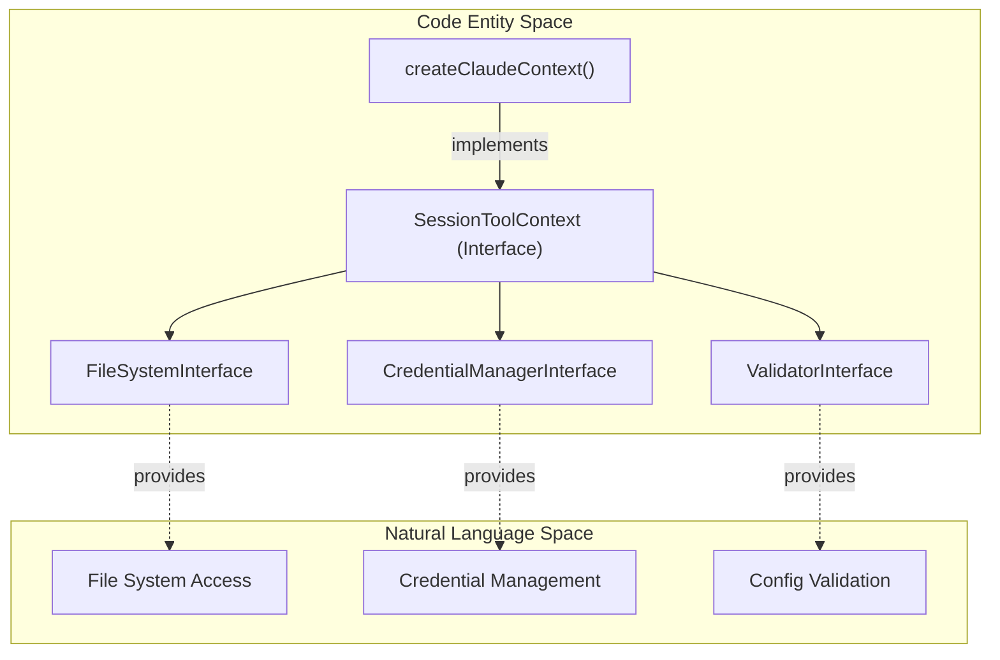

# Session-Scoped Tools

<details>
<summary>Relevant source files</summary>

The following files were used as context for generating this wiki page:

- [apps/electron/src/renderer/components/app-shell/ChatDisplay.tsx](apps/electron/src/renderer/components/app-shell/ChatDisplay.tsx)
- [packages/session-tools-core/package.json](packages/session-tools-core/package.json)
- [packages/session-tools-core/src/context.ts](packages/session-tools-core/src/context.ts)
- [packages/shared/src/agent/claude-context.ts](packages/shared/src/agent/claude-context.ts)
- [packages/shared/src/agent/session-scoped-tools.ts](packages/shared/src/agent/session-scoped-tools.ts)
- [packages/shared/src/prompts/system.ts](packages/shared/src/prompts/system.ts)
- [packages/ui/src/components/chat/TurnCard.tsx](packages/ui/src/components/chat/TurnCard.tsx)

</details>


Session-scoped tools are specialized tools created per-session with session-specific state and callbacks. Each session receives its own isolated instance of these tools, allowing them to maintain context and coordinate with the session's lifecycle events, such as user approval for plans or authentication requests.

---

## Overview

Session-scoped tools provide capabilities that require access to session state, workspace configuration, or user interaction. Unlike standard MCP tools provided by external sources, these tools are built into the agent runtime and have privileged access to the application's internal APIs via the `SessionToolContext` interface [packages/session-tools-core/src/context.ts:144-151]().

### Tool Categories

| Category | Tools | Purpose |
|----------|-------|---------|
| **LLM Orchestration** | `call_llm` | Invoke secondary LLM calls for specialized subtasks (summarization, etc.) [packages/shared/src/agent/llm-tool.ts:1-15](). |
| **Session Control** | `spawn_session` | Create independent sub-sessions for parallel tasks [packages/shared/src/agent/session-scoped-tools.ts:159-160](). |
| **Browser Interaction** | `browser_tool` | Interact with the built-in session browser pane [packages/shared/src/agent/session-scoped-tools.ts:160-161](). |
| **Configuration** | `config_validate` | Validate configuration files with structured error reporting [packages/session-tools-core/src/context.ts:120-138](). |
| **Plan Management** | `SubmitPlan` | Submit plans for user review with automatic execution pause [packages/shared/src/agent/session-scoped-tools.ts:69-72](). |

**Sources:** [packages/shared/src/agent/session-scoped-tools.ts:1-16](), [packages/shared/src/agent/llm-tool.ts:1-15](), [packages/session-tools-core/src/context.ts:144-190]()

---

## Architecture

### Session Tool Context
The system uses a "Context" pattern to bridge the platform-specific Electron/Node.js environment with portable tool handlers. The `SessionToolContext` provides abstract interfaces for file system access, credential management, and validation [packages/session-tools-core/src/context.ts:151-210]().



**Sources:** [packages/shared/src/agent/claude-context.ts:103-146](), [packages/session-tools-core/src/context.ts:144-190]()

### Callback Registry
The `SessionScopedToolCallbacks` interface defines how tools communicate back to the session manager. These are stored in the `sessionScopedToolCallbackRegistry` Map [packages/shared/src/agent/session-scoped-tools.ts:114-114]().

| Callback | Code Entity | Purpose |
|----------|-------------|---------|
| `onPlanSubmitted` | `SessionScopedToolCallbacks.onPlanSubmitted` | Triggered by `SubmitPlan` to show the plan UI [packages/shared/src/agent/session-scoped-tools.ts:68-72](). |
| `onAuthRequest` | `SessionScopedToolCallbacks.onAuthRequest` | Triggered by OAuth tools to show login prompts [packages/shared/src/agent/session-scoped-tools.ts:74-78](). |
| `queryFn` | `SessionScopedToolCallbacks.queryFn` | Implementation of `call_llm` provided by the agent backend [packages/shared/src/agent/session-scoped-tools.ts:80-84](). |
| `spawnSessionFn` | `SessionScopedToolCallbacks.spawnSessionFn` | Implementation for creating sub-sessions [packages/shared/src/agent/session-scoped-tools.ts:86-90](). |
| `browserPaneFns` | `SessionScopedToolCallbacks.browserPaneFns` | Functions to control the session browser [packages/shared/src/agent/session-scoped-tools.ts:92-97](). |

**Sources:** [packages/shared/src/agent/session-scoped-tools.ts:63-111](), [packages/shared/src/agent/session-scoped-tools.ts:114-125]()

---

## The `call_llm` Tool

The `call_llm` tool allows an agent to delegate specialized tasks (like summarizing large logs or extracting entities) to a secondary LLM call [packages/shared/src/agent/llm-tool.ts:1-15]().

### Attachment Processing Pipeline
The tool features a pipeline for processing file attachments before they are sent to the secondary LLM. It supports reading specific line ranges and validates file sizes [packages/shared/src/agent/llm-tool.ts:176-220]().

```mermaid
sequenceDiagram
    participant Agent as Main Agent
    participant Tool as call_llm (llm-tool.ts)
    participant FS as File System
    participant Backend as Agent Backend (queryFn)

    Agent->>Tool: call_llm(prompt, attachments: ["file.txt\