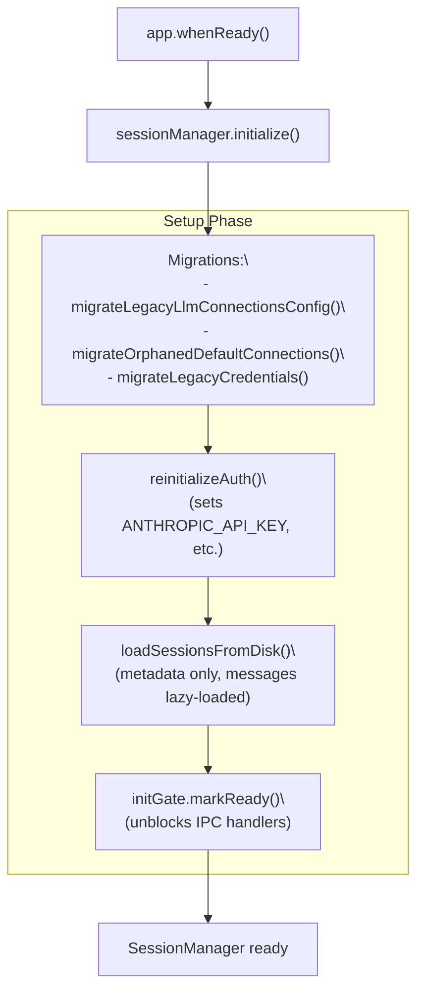
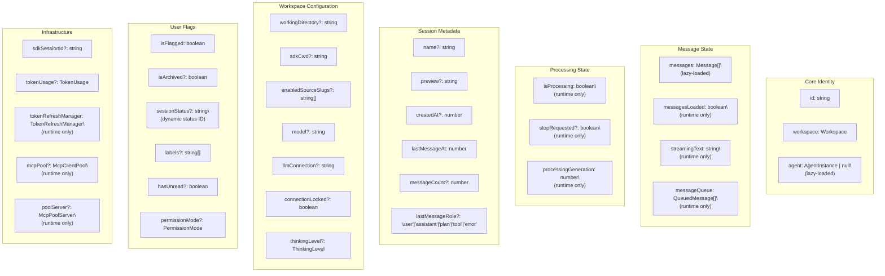
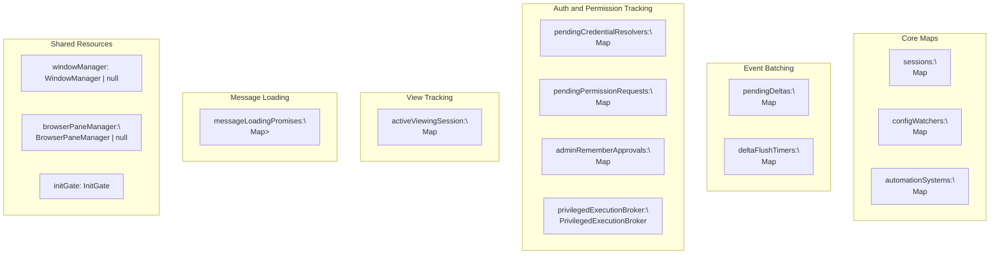
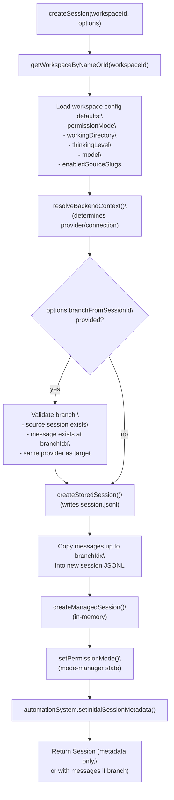
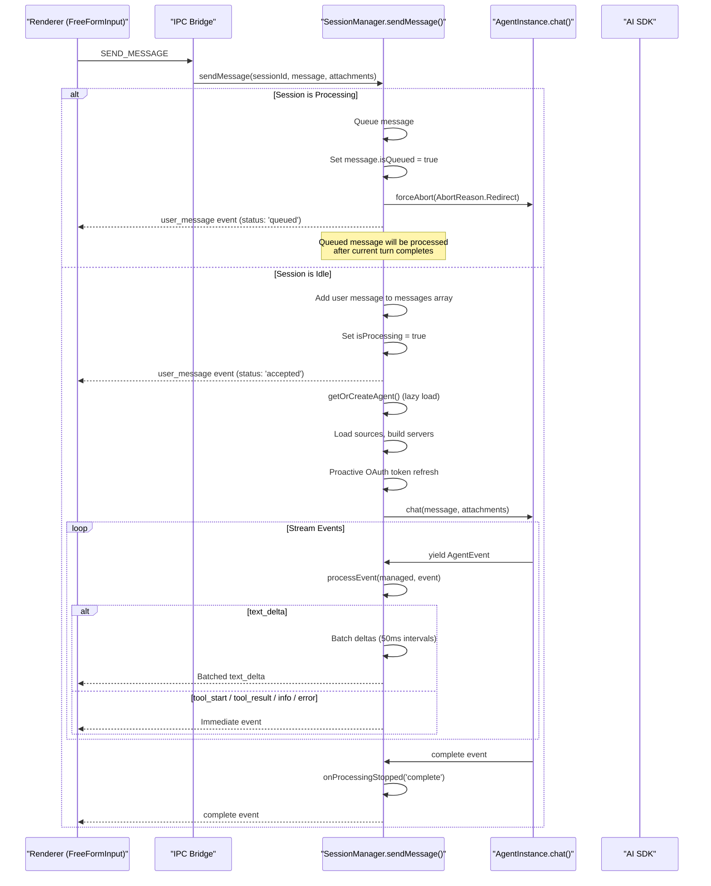
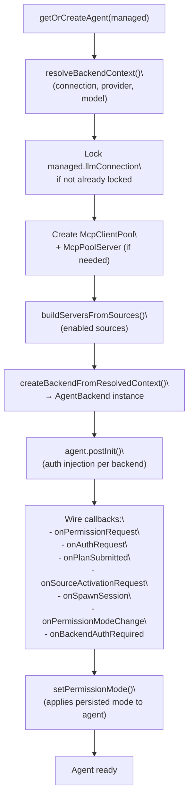
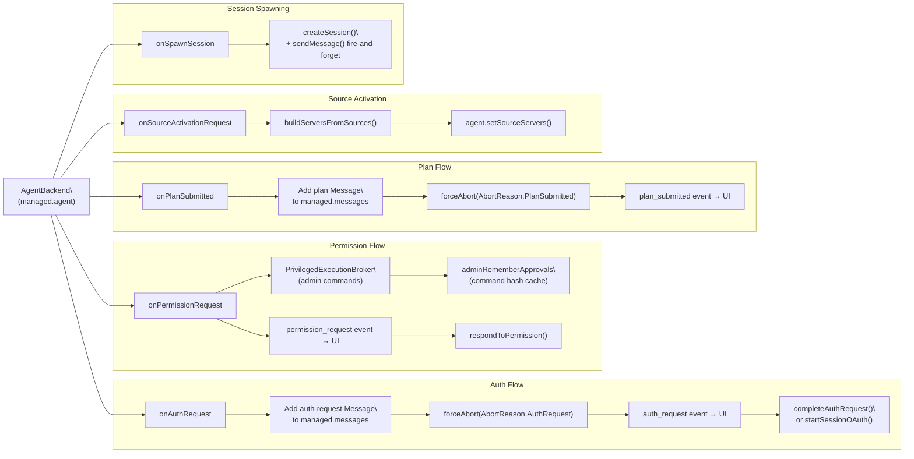
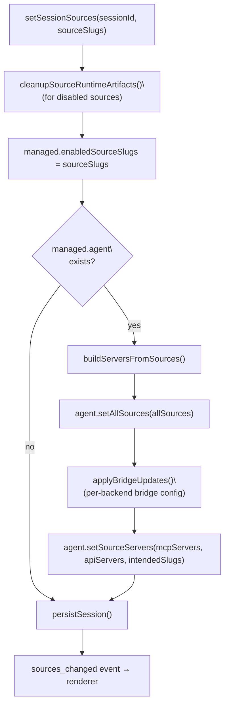
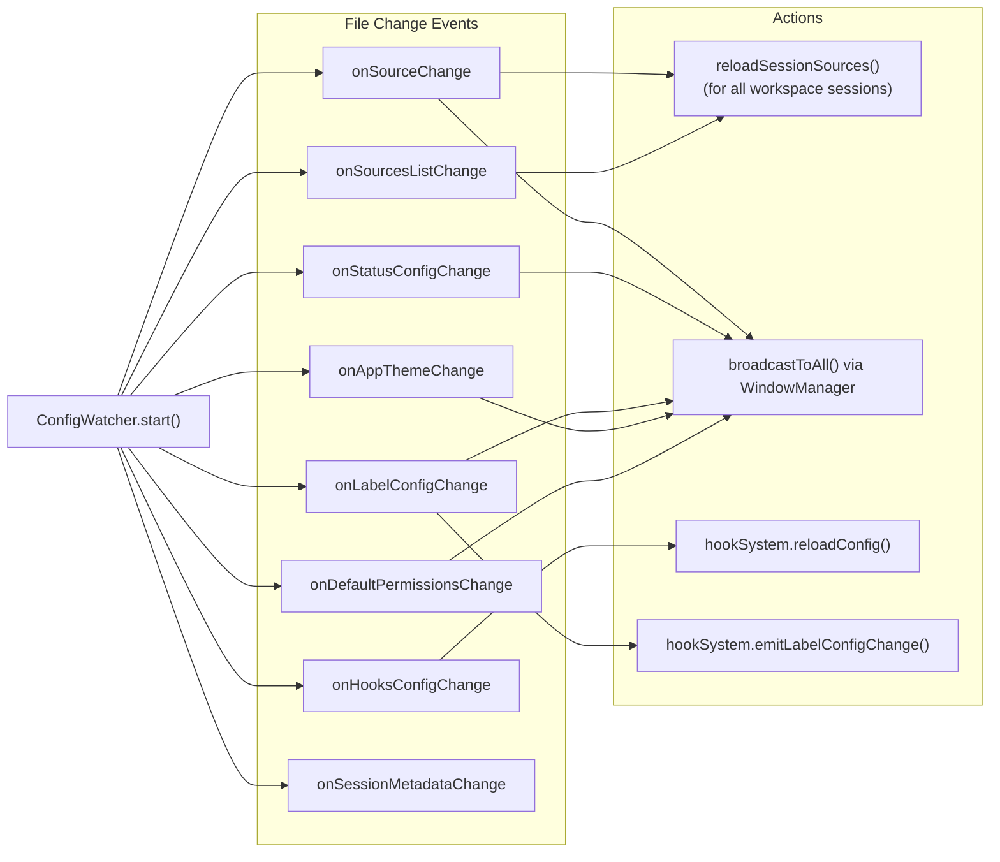
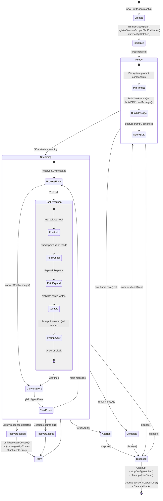

# SessionManager API

<details>
<summary>Relevant source files</summary>

The following files were used as context for generating this wiki page:

- [apps/electron/src/main/sessions.ts](apps/electron/src/main/sessions.ts)

</details>

This document provides a technical reference for the `SessionManager` class, the main process controller that manages session lifecycle, message processing, agent orchestration, and state persistence. The `SessionManager` sits in the Electron main process and coordinates between the UI (renderer process), agent backends (CraftAgent, CodexBackend, CopilotAgent), and persistent storage.

For information about IPC channels that invoke `SessionManager` methods, see page 8.1. For session file formats and configuration files, see page 8.3. For the overall session lifecycle architecture, see page 2.7.

## Overview

The `SessionManager` class ([apps/electron/src/main/sessions.ts:861-4786]()) is the central orchestrator in the Electron main process. It manages:

- Session lifecycle (create, load, persist, delete)
- Message queueing and processing with interruption handling
- Lazy-loaded agent instances per session
- Real-time event streaming to renderer processes via IPC
- OAuth token refresh and authentication flows
- Source and skill hot-reloading via ConfigWatcher
- Session sharing to web viewer
- Permission mode management
- Background shell tracking and cleanup

The `SessionManager` maintains an in-memory map of all sessions with metadata-only loading (messages are lazy-loaded on demand to reduce startup memory usage).

## Class Architecture

### SessionManager Initialization Flow

**Title: `SessionManager.initialize()` sequence**



Sources: [apps/electron/src/main/sessions.ts:1343-1431]()

### ManagedSession Structure

Each session in `SessionManager.sessions` is a `ManagedSession` object. Runtime-only fields are not persisted to disk; all other fields round-trip through the JSONL header.

**Title: `ManagedSession` field groups**



Sources: [apps/electron/src/main/sessions.ts:553-697]()

### Core Data Structures

#### ManagedSession Interface

The `ManagedSession` interface ([apps/electron/src/main/sessions.ts:553-697]()) contains:

| Property              | Type                         | Description                                                    |
| --------------------- | ---------------------------- | -------------------------------------------------------------- |
| `id`                  | `string`                     | Unique session ID (UUID v4)                                    |
| `workspace`           | `Workspace`                  | Workspace context with root path and metadata                  |
| `agent`               | `AgentInstance \| null`      | Lazy-loaded backend agent                                      |
| `messages`            | `Message[]`                  | Message array (lazy-loaded from disk)                          |
| `isProcessing`        | `boolean`                    | Whether agent is currently processing                          |
| `messageQueue`        | `QueuedMessage[]`            | Pending messages during processing                             |
| `lastMessageAt`       | `number`                     | Timestamp of last message (ms since epoch)                     |
| `tokenUsage`          | `TokenUsage`                 | Cumulative token usage from SDK                                |
| `permissionMode`      | `PermissionMode`             | Session permission level: `'safe'` \| `'ask'` \| `'allow-all'` |
| `enabledSourceSlugs`  | `string[]`                   | Active source slugs for this session                           |
| `tokenRefreshManager` | `TokenRefreshManager`        | OAuth token refresh with rate limiting (runtime only)          |
| `sdkSessionId`        | `string \| undefined`        | SDK session ID for conversation continuity                     |
| `sessionStatus`       | `string \| undefined`        | Dynamic status ID referencing workspace status config          |
| `mcpPool`             | `McpClientPool \| undefined` | Centralized MCP client pool (runtime only)                     |
| `poolServer`          | `McpPoolServer \| undefined` | HTTP MCP server for external SDK subprocesses (runtime only)   |

`ManagedSession` objects are constructed via `createManagedSession()` ([apps/electron/src/main/sessions.ts:704-734]()), which spreads all session-like fields from the source so new persistent fields automatically propagate without manual copying.

Sources: [apps/electron/src/main/sessions.ts:553-734]()

#### Message Conversion

Messages are converted between runtime format (`Message`) and storage format (`StoredMessage`):

- `messageToStored(msg: Message): StoredMessage` ([apps/electron/src/main/sessions.ts:780-783]())
- `storedToMessage(stored: StoredMessage): Message` ([apps/electron/src/main/sessions.ts:786-789]())

The key difference is `role` (runtime) ↔ `type` (stored). Transient fields like `isStreaming` and `isPending` are excluded from persistence.

Sources: [apps/electron/src/main/sessions.ts:778-789]()

### SessionManager State

The `SessionManager` maintains several maps and state objects:

**Title: `SessionManager` private state maps**



Sources: [apps/electron/src/main/sessions.ts:800-836]()

## Core Methods

### Session Lifecycle

#### createSession()

Creates a new session with workspace defaults and optional overrides.

**Signature:**

```typescript
async createSession(
  workspaceId: string,
  options?: CreateSessionOptions
): Promise<Session>
```

**Options:**

- `permissionMode`: Override workspace default permission mode
- `workingDirectory`: 'user_default' | 'none' | absolute path
- `enabledSourceSlugs`: Initial enabled sources
- `model`: Session-specific model override
- `llmConnection`: LLM connection slug
- `hidden`: Hide from session list (for mini agents)
- `todoState`: Initial todo state
- `labels`: Initial label assignments
- `isFlagged`: Initial flagged state
- `systemPromptPreset`: 'default' | 'mini'

**Flow:**

**Title: `createSession()` flow**



Sources: [apps/electron/src/main/sessions.ts:1966-2229]()

#### deleteSession()

Deletes a single session and cleans up all resources.

**Signature:**

```typescript
async deleteSession(sessionId: string): Promise<void>
```

**Cleanup sequence:**

1. Force-abort agent if processing (with 100ms drain wait)
2. Clear delta flush timers
3. Cancel pending persistence (`sessionPersistenceQueue.cancel()`)
4. Unregister session-scoped tool callbacks (`unregisterSessionScopedToolCallbacks()`)
5. Destroy browser pane instances (`browserPaneManager.destroyForSession()`)
6. Dispose agent instance (`agent.dispose()`)
7. Stop HTTP pool server (`poolServer.stop()`)
8. Remove from `sessions` map
9. Remove from `automationSystem` metadata
10. Delete from disk (`deleteStoredSession()`)
11. Broadcast `session_deleted` event
12. Update unread badge

Sources: [apps/electron/src/main/sessions.ts:3921-3989]()

### Message Processing

#### sendMessage()

Sends a message to the agent and streams responses back to the UI.

**Signature:**

```typescript
async sendMessage(
  sessionId: string,
  message: string,
  attachments?: FileAttachment[],
  storedAttachments?: StoredAttachment[],
  options?: SendMessageOptions,
  existingMessageId?: string,
  _isAuthRetry?: boolean
): Promise<void>
```

**Message Flow:**



**Sources:** [apps/electron/src/main/sessions.ts:3734-4134]()

#### Message Queueing

When a message arrives during processing, the SessionManager:

1. Creates user message with `isQueued: true` flag
2. Adds to `messageQueue` array
3. Calls `forceAbort(AbortReason.Redirect)` on agent
4. Emits `user_message` event with `status: 'queued'`
5. After current turn completes, `onProcessingStopped()` calls `processNextQueuedMessage()`

**Queue Recovery:** On startup, orphaned queued messages (from crash/restart) are detected via `isQueued: true` flag and automatically re-queued.

**Sources:** [apps/electron/src/main/sessions.ts:3746-3783](), [apps/electron/src/main/sessions.ts:1952-1974](), [apps/electron/src/main/sessions.ts:4260-4309]()

#### cancelProcessing()

Cancels the current message processing.

**Signature:**

```typescript
async cancelProcessing(sessionId: string, silent = false): Promise<void>
```

**Silent mode:** Skips injecting a "Response interrupted" status message but still forces abort. Used when redirecting (sending a new message while processing).

Sources: [apps/electron/src/main/sessions.ts:4136-4183]() _(approximate; adjust based on latest file)_

#### Event Processing

The `processEvent()` method handles events from the agent:

| Event Type      | `SessionManager` Action                                                                                  |
| --------------- | -------------------------------------------------------------------------------------------------------- |
| `text_delta`    | Batch deltas for 50ms, then flush via `flushPendingDeltas()`                                             |
| `text_complete` | Create assistant message, emit to UI                                                                     |
| `tool_start`    | Resolve tool metadata via `resolveToolDisplayMeta()`, create tool message with `toolStatus: 'executing'` |
| `tool_result`   | Update tool message with result, set `toolStatus: 'completed'`                                           |
| `task_progress` | Update tool message with elapsed time                                                                    |
| `usage_update`  | Update `managed.tokenUsage` with cumulative totals                                                       |
| `complete`      | Handled in `sendMessage()` try-catch, triggers `onProcessingStopped()`                                   |

**Delta Batching:** Text deltas are batched at `DELTA_BATCH_INTERVAL_MS = 50` ms ([apps/electron/src/main/sessions.ts:792]()) to reduce IPC overhead from 50+ events/sec to ~20 events/sec.

Sources: [apps/electron/src/main/sessions.ts:792-797]()

#### onProcessingStopped()

Central handler for when processing stops (any reason). Single source of truth for cleanup and queue processing.

**Signature:**

```typescript
private async onProcessingStopped(
  sessionId: string,
  reason: 'complete' | 'interrupted' | 'error' | 'timeout'
): Promise<void>
```

**Actions:**

1. Clear `isProcessing` and `stopRequested` flags
2. Notify power manager (may allow display sleep)
3. Handle unread state based on `isSessionBeingViewed()`
4. Apply any pending external metadata updates (`pendingExternalMetadata`)
5. Check queue: call `processNextQueuedMessage()` if items remain, otherwise emit `complete` event
6. Persist session to disk

### Session Querying

#### getSessions()

Returns metadata-only list of sessions (messages not included).

**Signature:**

```typescript
getSessions(workspaceId?: string): Session[]
```

Filters by workspace if specified. Sessions are sorted by `lastMessageAt` descending. Returns computed fields from JSONL header: `preview`, `lastMessageRole`, `tokenUsage`, `messageCount`.

Sources: [apps/electron/src/main/sessions.ts:1783-1796]()

#### getSession()

Loads a single session with all messages (lazy loading).

**Signature:**

```typescript
async getSession(sessionId: string): Promise<Session | null>
```

Uses `ensureMessagesLoaded()` to load messages from disk on first access. Promise deduplication prevents race conditions when multiple concurrent calls occur.

Sources: [apps/electron/src/main/sessions.ts:1871-1879](), [apps/electron/src/main/sessions.ts:1887-1904]()

#### getSessionPath()

Returns the filesystem path to a session's storage folder.

**Signature:**

```typescript
getSessionPath(sessionId: string): string | null
```

Sources: [apps/electron/src/main/sessions.ts:1960-1964]()

#### getUnreadSummary()

Aggregates unread state across all workspaces, excluding hidden and archived sessions.

**Signature:**

```typescript
getUnreadSummary(): UnreadSummary
```

Returns `{ totalUnreadSessions, byWorkspace, hasUnreadByWorkspace }`. Called by `emitUnreadSummaryChanged()` and `refreshBadge()`.

Sources: [apps/electron/src/main/sessions.ts:1802-1827]()

### Persistence

#### persistSession()

Enqueues a session for async persistence with debouncing.

**Implementation:**

```typescript
private persistSession(managed: ManagedSession): void
```

Filters out transient `status` messages before persisting. Skips persistence if `messagesLoaded` is false (avoids overwriting JSONL messages with an empty array). Uses `sessionPersistenceQueue` which debounces writes per session to batch rapid updates.

Sources: [apps/electron/src/main/sessions.ts:1434-1462]()

#### flushSession() / flushAllSessions()

Immediately flushes pending writes, bypassing the debounce.

**Signatures:**

```typescript
async flushSession(sessionId: string): Promise<void>
async flushAllSessions(): Promise<void>
```

`flushSession()` is called on session close/switch; `flushAllSessions()` on app quit.

Sources: [apps/electron/src/main/sessions.ts:1465-1472]()

## State Management

### Session Metadata

#### renameSession()

Updates session name and persists to disk.

**Signature:**

```typescript
async renameSession(sessionId: string, name: string): Promise<void>
```

Emits `title_generated` event to UI.

Sources: [apps/electron/src/main/sessions.ts:3698-3706]()

#### refreshTitle()

Regenerates session title using AI based on recent messages.

**Signature:**

```typescript
async refreshTitle(sessionId: string): Promise<{ success: boolean; title?: string; error?: string }>
```

**Flow:**

1. Ensure messages are loaded
2. Get last 3 user messages + last assistant response
3. Use session's agent or create temporary agent from `llmConnection`
4. Call `agent.regenerateTitle(userMessages, assistantResponse)`
5. Update `managed.name` and persist
6. Emit `title_generated` event

Sets `isAsyncOperationOngoing` flag for shimmer effect during regeneration.

Sources: [apps/electron/src/main/sessions.ts:3713-3817]()

#### flagSession() / unflagSession()

Toggles flagged state (pin to top of session list).

**Signatures:**

```typescript
async flagSession(sessionId: string): Promise<void>
async unflagSession(sessionId: string): Promise<void>
```

Persists immediately via `flushSession()` to avoid race conditions with the debounced queue.

Sources: [apps/electron/src/main/sessions.ts:3162-3184]()

#### archiveSession() / unarchiveSession()

Toggles archived state (hidden from active session list).

**Signatures:**

```typescript
async archiveSession(sessionId: string): Promise<void>
async unarchiveSession(sessionId: string): Promise<void>
```

Sets `archivedAt` timestamp for retention policy. Both methods emit `emitUnreadSummaryChanged()` after persisting.

Sources: [apps/electron/src/main/sessions.ts:3186-3212]()

#### setSessionStatus()

Updates session's dynamic status (references workspace status config by ID).

**Signature:**

```typescript
async setSessionStatus(sessionId: string, sessionStatus: SessionStatus): Promise<void>
```

Emits `session_status_changed` event. Persists immediately.

Sources: [apps/electron/src/main/sessions.ts:3214-3224]()

### Working Directory

#### updateWorkingDirectory()

Updates working directory for bash commands. Also updates `sdkCwd` if no messages have been sent yet.

**Signature:**

```typescript
updateWorkingDirectory(sessionId: string, path: string): void
```

**Conditions for updating `sdkCwd`:**

- `messages.length === 0` (no messages sent)
- `!sdkSessionId` (no SDK session)
- `!agent` (no agent created)

This prevents the "bash shell runs from a different directory" warning when a user changes working directory before their first message.

Sources: [apps/electron/src/main/sessions.ts:3827-3858]()

### Model and Connection

#### updateSessionModel()

Updates model for a session. Pass `null` to clear (falls back to global config).

**Signature:**

```typescript
async updateSessionModel(
  sessionId: string,
  workspaceId: string,
  model: string | null,
  connection?: string
): Promise<void>
```

Also updates `llmConnection` if provided and not already locked. If agent already exists, calls `agent.setModel()` immediately.

Sources: [apps/electron/src/main/sessions.ts:3865-3895]()

#### updateMessageContent()

Updates the content of a specific message in a session (used by preview window to save edits).

**Signature:**

```typescript
updateMessageContent(sessionId: string, messageId: string, content: string): void
```

Sources: [apps/electron/src/main/sessions.ts:3901-3919]()

#### setSessionConnection()

Sets LLM connection for a session. Can only be changed before the first message (connection is locked after).

**Signature:**

```typescript
async setSessionConnection(sessionId: string, connectionSlug: string): Promise<void>
```

Throws if session has already started. Emits `connection_changed` event.

Sources: [apps/electron/src/main/sessions.ts:3231-3265]()

### Read/Unread State

#### setActiveViewingSession()

Sets which session the user is actively viewing (per workspace).

**Signature:**

```typescript
setActiveViewingSession(sessionId: string | null, workspaceId: string): void
```

When user starts viewing a session that's not processing and has `hasUnread`, automatically calls `markSessionRead()`.

Sources: [apps/electron/src/main/sessions.ts:3592-3603]()

#### markSessionRead() / markSessionUnread()

Explicitly marks a session as read or unread.

**Signatures:**

```typescript
async markSessionRead(sessionId: string): Promise<void>
async markSessionUnread(sessionId: string): Promise<void>
```

`markSessionRead()` updates `lastReadMessageId` to the last final assistant message and clears the `hasUnread` flag — but only if the session is not currently processing. Both methods call `emitUnreadSummaryChanged()`.

Sources: [apps/electron/src/main/sessions.ts:3624-3674]()

#### markAllSessionsRead()

Marks all non-hidden, non-archived, non-processing sessions in a workspace as read.

**Signature:**

```typescript
async markAllSessionsRead(workspaceId: string): Promise<void>
```

Sources: [apps/electron/src/main/sessions.ts:3680-3696]()

### Labels

Session labels are managed via `updateSessionMetadata()` calls. The SessionManager doesn't have dedicated label methods, but labels are persisted to disk and tracked by HookSystem for event triggers.

**Label Format:** `"labelId::value"` strings in `managed.labels` array.

**Auto-labeling:** `evaluateAutoLabels()` runs on every user message ([apps/electron/src/main/sessions.ts:3855-3877]()) to match regex patterns and automatically apply labels.

## Agent Management

### Lazy Agent Creation

Agents are only instantiated when the first message is sent. `getOrCreateAgent()` is the single entry point.

#### getOrCreateAgent()

Creates the appropriate agent backend based on the session's LLM connection.

**Signature:**

```typescript
private async getOrCreateAgent(managed: ManagedSession): Promise<AgentInstance>
```

**Provider Resolution Order:**

1. `managed.llmConnection` (locked after first message)
2. `workspace.defaults.defaultLlmConnection`
3. Global `defaultLlmConnection`
4. Fallback: default Anthropic provider

**Connection Locking:** After first resolution, `managed.llmConnection` is stored and `connectionLocked = true` is set. A `connection_changed` event is emitted to keep the renderer in sync.

**Backend Factory:** The unified `createBackendFromResolvedContext()` function ([apps/electron/src/main/sessions.ts:2365-2413]()) selects the backend implementation from `resolveBackendContext()` results. There is no per-provider setup branching in `getOrCreateAgent()` itself.

**Title: `getOrCreateAgent()` setup sequence**



Sources: [apps/electron/src/main/sessions.ts:2241-3160]()

### Agent Callbacks

The `SessionManager` wires callbacks on each `AgentBackend` instance during `getOrCreateAgent()`:

**Title: `AgentBackend` callback wiring in `SessionManager`**



Sources: [apps/electron/src/main/sessions.ts:2766-3049]()

## Source Management

### setSessionSources()

Updates enabled sources for a session and rebuilds servers if agent exists.

**Signature:**

```typescript
async setSessionSources(sessionId: string, sourceSlugs: string[]): Promise<void>
```

**Title: `setSessionSources()` flow**



**Credential Cleanup:** When sources are disabled, `cleanupSourceRuntimeArtifacts()` removes decrypted tokens from disk for security.

Sources: [apps/electron/src/main/sessions.ts:3497-3558]()

### getSessionSources()

Returns enabled source slugs for a session.

**Signature:**

```typescript
getSessionSources(sessionId: string): string[]
```

Sources: [apps/electron/src/main/sessions.ts:3564-3567]()

### Source Server Building

#### buildServersFromSources()

Module-level helper that builds MCP and API servers from source configurations.

**Signature:**

```typescript
async function buildServersFromSources(
  sources: LoadedSource[],
  sessionPath?: string,
  tokenRefreshManager?: TokenRefreshManager,
  summarize?: SummarizeCallback
): Promise<{ mcpServers; apiServers; errors }>
```

**Steps:**

1. Load credentials for all sources via `getSourceCredentialManager()`
2. Build token getter for OAuth sources (uses `TokenRefreshManager` if provided)
3. Call `serverBuilder.buildAll()` with credentials and token getters
4. Update source configs for auth errors — marks sources as needing re-auth via `credManager.markSourceNeedsReauth()`

Sources: [apps/electron/src/main/sessions.ts:166-219]()

### OAuth Token Refresh

#### refreshOAuthTokensIfNeeded()

Proactively refreshes expired OAuth tokens before each `agent.chat()` call.

**Signature:**

```typescript
async function refreshOAuthTokensIfNeeded(
  agent: AgentInstance,
  sources: LoadedSource[],
  sessionPath: string,
  tokenRefreshManager: TokenRefreshManager,
  options?: { sessionId?; workspaceRootPath?; poolServerUrl? }
): Promise<OAuthTokenRefreshResult>
```

**Flow:**

1. `tokenRefreshManager.getSourcesNeedingRefresh(sources)` — rate-limited check
2. `tokenRefreshManager.refreshSources(needRefresh)`
3. Rebuild server configs with fresh tokens via `buildServersFromSources()`
4. `agent.setSourceServers()` to apply updated configs
5. `applyBridgeUpdates()` to sync bridge-mcp-server config

Handles both MCP OAuth sources (Linear, Notion) and API OAuth sources (Gmail, Slack, Microsoft).

Sources: [apps/electron/src/main/sessions.ts:247-296]()

## Permission System

### respondToPermission()

Delivers the user's permission decision to the agent.

**Signature:**

```typescript
respondToPermission(
  sessionId: string,
  requestId: string,
  allowed: boolean,
  alwaysAllow: boolean
): boolean
```

Returns `true` if delivered, `false` if agent/session is gone. For `admin_approval` type requests, resolves through `PrivilegedExecutionBroker` before forwarding.

### setSessionPermissionMode()

Sets permission mode for a session.

**Signature:**

```typescript
setSessionPermissionMode(sessionId: string, mode: PermissionMode): void
```

Updates `managed.permissionMode` and applies to agent via the global `setPermissionMode(sessionId, mode)` function from `@craft-agent/shared/agent`.

**Permission Modes:**

| Mode        | Enforcement                                  | Use Case                       |
| ----------- | -------------------------------------------- | ------------------------------ |
| `safe`      | Read-only tools only, blocks all mutations   | Exploring unfamiliar codebases |
| `ask`       | Prompts for file writes, bash, MCP mutations | Normal development             |
| `allow-all` | Auto-approves with restrictions              | Trusted automations            |

Enforcement logic lives in the agent's `PreToolUse` hook in `packages/shared/src/agent/mode-manager.ts`.

## Authentication Management

### reinitializeAuth()

Reinitializes authentication environment variables after credential changes.

**Signature:**

```typescript
async reinitializeAuth(connectionSlug?: string): Promise<void>
```

**Steps:**

1. Clear all auth env vars (`ANTHROPIC_API_KEY`, `CLAUDE_CODE_OAUTH_TOKEN`, `ANTHROPIC_BASE_URL`)
2. Load connection (explicit parameter or default)
3. Call `resolveAuthEnvVars(connection, slug, manager, getValidClaudeOAuthToken)` — provider-agnostic env resolution
4. Apply resolved env vars to `process.env`
5. Call `resetSummarizationClient()` to pick up new credentials

**Security Note:** These env vars propagate to the SDK subprocess. Bun's automatic `.env` loading is disabled in the subprocess (`--env-file=/dev/null`) to prevent a project's `.env` from injecting `ANTHROPIC_API_KEY` and overriding OAuth auth.

Sources: [apps/electron/src/main/sessions.ts:1298-1341]()

### Unified Auth Flow

#### Auth Request Handling

When an agent fires `onAuthRequest`:

1. Create `auth-request` `Message` with request details
2. Store in `managed.pendingAuthRequestId` and `managed.pendingAuthRequest`
3. `forceAbort(AbortReason.AuthRequest)` — pauses conversation
4. Emit `auth_request` event to UI
5. Persist session state
6. OAuth flow is user-initiated: UI calls `startSessionOAuth()` when user clicks "Sign in"

**Auth Request Types:**

| Type              | Trigger                  | UI Action                                               |
| ----------------- | ------------------------ | ------------------------------------------------------- |
| `oauth`           | MCP OAuth source         | Show "Sign in" button → `startSessionOAuth()`           |
| `oauth-google`    | Gmail/Calendar/Drive     | Show Google OAuth dialog                                |
| `oauth-slack`     | Slack integration        | Show Slack OAuth dialog                                 |
| `oauth-microsoft` | Microsoft 365            | Show Microsoft OAuth dialog                             |
| `credential`      | API key / bearer / basic | Show inline credential form → `handleCredentialInput()` |

Sources: [apps/electron/src/main/sessions.ts:2939-2999]()

#### completeAuthRequest()

Completes an auth request and resumes conversation.

**Signature:**

```typescript
async completeAuthRequest(sessionId: string, result: AuthResult): Promise<void>
```

**Steps:**

1. Find and update pending `auth-request` message `authStatus`
2. Emit `auth_completed` event
3. Auto-enable source in session (`enabledSourceSlugs`) on success
4. Clear `tokenRefreshManager` cooldown for the source
5. Persist session
6. Rebuild bridge-mcp-server config if needed
7. Send result as a new user message (resumes conversation)

Sources: [apps/electron/src/main/sessions.ts:1607-1682]()

#### handleCredentialInput()

Handles credential input from UI (for non-OAuth auth).

**Signature:**

```typescript
async handleCredentialInput(
  sessionId: string,
  requestId: string,
  response: CredentialResponse
): Promise<void>
```

**Supported Modes:**

| Mode               | Storage Key Type | Value Format                                      |
| ------------------ | ---------------- | ------------------------------------------------- |
| `basic`            | `source_basic`   | `JSON.stringify({ username, password })`          |
| `bearer`           | `source_bearer`  | token string                                      |
| `multi-header`     | `source_apikey`  | `JSON.stringify({ "Header-Name": "value", ... })` |
| `header` / `query` | `source_apikey`  | single API key string                             |

After storing, calls `markSourceAuthenticated()` and `agent.markSourceUnseen()`, then `completeAuthRequest()`.

Sources: [apps/electron/src/main/sessions.ts:1688-1769]()

## Configuration Watching

### setupConfigWatcher()

Sets up ConfigWatcher for a workspace to broadcast live updates.

**Signature:**

```typescript
setupConfigWatcher(workspaceRootPath: string, workspaceId: string): void
```

Called during window init and workspace switch. One ConfigWatcher per workspace.

**Watched Files:**

- `sources/*/config.json`: Source configuration
- `sources/*/guide.md`: Source documentation
- `statuses/status-config.json`: Status workflow
- `labels/label-config.json`: Label hierarchy
- `hooks/hooks.json`: Hook definitions
- `~/.craft-agent/theme.json`: App theme
- `~/.craft-agent/permissions/default.json`: Default permissions

**Callbacks:**



**Sources:** [apps/electron/src/main/sessions.ts:906-1111]()

### HookSystem Integration

The SessionManager initializes a `HookSystem` for each workspace to handle event-driven automation:

**Features:**

- Scheduler for cron-based triggers
- Event diffing for metadata changes
- Command and prompt hook execution

**Hooks Triggered:**

- `LabelAdd` / `LabelRemove` / `LabelValueChange`
- `LabelConfigChange` (when label config file changes)
- `FlagAdd` / `FlagRemove`
- `PermissionModeChange`
- `TodoStateChange`
- `SessionNameChange`
- Scheduled cron jobs

**Sources:** [apps/electron/src/main/sessions.ts:1076-1110]()

## Session Sharing

### shareToViewer()

Uploads session to web viewer and returns shareable URL.

**Signature:**

```typescript
async shareToViewer(sessionId: string): Promise<ShareResult>
```

**Flow:**

1. Load session directly from disk (StoredSession format)
2. POST to `${VIEWER_URL}/s/api` with session data
3. Store returned `{ id, url }` in `managed.sharedUrl` and `managed.sharedId`
4. Update session metadata on disk
5. Emit `session_shared` event

Sets `isAsyncOperationOngoing` flag for shimmer effect during upload.

**Sources:** [apps/electron/src/main/sessions.ts:3102-3158]()

### updateShare()

Re-uploads session data to existing shared URL.

**Signature:**

```typescript
async updateShare(sessionId: string): Promise<ShareResult>
```

Uses PUT request to `${VIEWER_URL}/s/api/${sharedId}` with updated session data.

**Sources:** [apps/electron/src/main/sessions.ts:3164-3209]()

### revokeShare()

Deletes shared session from viewer and clears local state.

**Signature:**

```typescript
async revokeShare(sessionId: string): Promise<ShareResult>
```

**Steps:**

1. DELETE request to `${VIEWER_URL}/s/api/${sharedId}`
2. Clear `sharedUrl` and `sharedId` from managed session
3. Update session metadata on disk
4. Emit `session_unshared` event

**Sources:** [apps/electron/src/main/sessions.ts:3215-3261]()

## Plan Mode

### Pending Plan Execution

The SessionManager tracks pending plan execution state for "Accept & Compact" flow.

#### setPendingPlanExecution()

Persists plan path for execution after compaction.

**Signature:**

```typescript
async setPendingPlanExecution(sessionId: string, planPath: string): Promise<void>
```

Called when user clicks "Accept & Compact" button.

**Sources:** [apps/electron/src/main/sessions.ts:3050-3056]()

#### markCompactionComplete()

Marks compaction as complete (allows reload recovery to know execution can proceed).

**Signature:**

```typescript
async markCompactionComplete(sessionId: string): Promise<void>
```

Called when `compaction_complete` event fires from SDK.

**Sources:** [apps/electron/src/main/sessions.ts:3064-3070]()

#### clearPendingPlanExecution()

Clears pending plan state (after execution or on new message).

**Signature:**

```typescript
async clearPendingPlanExecution(sessionId: string): Promise<void>
```

Acts as safety valve - if user sends new message, old plan is no longer relevant.

**Sources:** [apps/electron/src/main/sessions.ts:3077-3083](), [apps/electron/src/main/sessions.ts:3741]()

#### getPendingPlanExecution()

Retrieves pending plan state (for reload recovery).

**Signature:**

```typescript
getPendingPlanExecution(sessionId: string): { planPath: string; awaitingCompaction: boolean } | null
```

**Sources:** [apps/electron/src/main/sessions.ts:3089-3093]()

## Shell Management

### killShell()

Terminates a background shell by ID.

**Signature:**

```typescript
async killShell(sessionId: string, shellId: string): Promise<{ success: boolean; error?: string }>
```

**Flow:**

1. Get stored command from `managed.backgroundShellCommands`
2. Use `pgrep -f` to find process PIDs matching command
3. Send `SIGTERM` to each PID
4. Clean up stored command
5. Emit `shell_killed` event (removes from UI regardless of kill success)

**Sources:** [apps/electron/src/main/sessions.ts:4311-4378]()

### getTaskOutput()

Placeholder for retrieving background task output (not yet implemented).

**Signature:**

```typescript
async getTaskOutput(taskId: string): Promise<string | null>
```

Returns informational message explaining limitation. Current workaround: users view task output in main chat panel where tool results are displayed inline.

**Sources:** [apps/electron/src/main/sessions.ts:4396-4410]()

## Global Permission System

For MCP tools that execute outside the agent instance (e.g., in MCP server processes), a global permission system is provided.

### Global Functions

```typescript
// Set the global permission handler (called by application)
setGlobalPermissionHandler(
  handler: ((request: {
    requestId: string;
    toolName: string;
    command: string;
    description: string;
  }) => void) | null
): void

// Request permission for a tool operation (used by MCP tools)
requestToolPermission(
  toolName: string,
  command: string,
  description: string
): Promise<boolean>

// Resolve a pending global permission request
resolveGlobalPermission(requestId: string, allowed: boolean): void

// Clear all pending global permissions
clearGlobalPermissions(): void
```

**Usage Pattern:**

```typescript
// In MCP tool implementation:
const allowed = await requestToolPermission(
  'example_tool',
  'rm -rf /important/data',
  'Delete important data'
)
if (!allowed) {
  return {
    content: [{ type: 'text', text: 'Permission denied' }],
    isError: true,
  }
}
```

**Sources:** [packages/shared/src/agent/craft-agent.ts:151-216]()

## Configuration Watcher

In non-headless mode, the agent starts a `ConfigWatcher` that monitors workspace config files for changes and triggers hot-reloads.

### Watched Files

- `sources/*/config.json`: Source configuration changes
- `skills/*/SKILL.md`: Skill content changes
- `permissions/permissions.json`: Permission pattern changes
- `statuses/status-config.json`: Status workflow changes

### Watcher Callbacks

```typescript
interface ConfigWatcherCallbacks {
  onSourceChange?: (slug: string, source: LoadedSource | null) => void
  onSourcesListChange?: (sources: LoadedSource[]) => void
  onValidationError?: (file: string, errors: ValidationIssue[]) => void
  onError?: (file: string, error: Error) => void
}
```

**Sources:** [packages/shared/src/agent/craft-agent.ts:514-549](), [packages/shared/src/config/watcher.ts]()

## Diagram: Complete Agent Lifecycle



**Sources:** [packages/shared/src/agent/craft-agent.ts:459-509](), [packages/shared/src/agent/craft-agent.ts:770-2009](), [packages/shared/src/agent/craft-agent.ts:3196-3234]()
