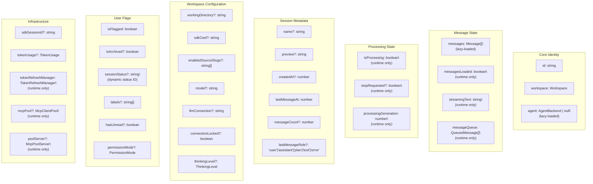
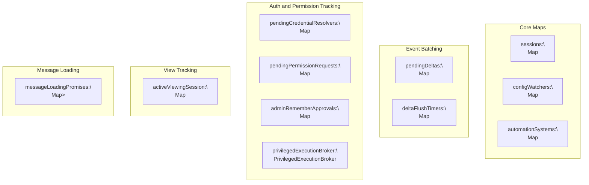
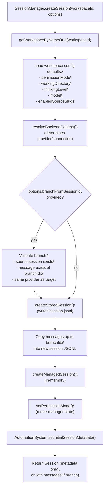
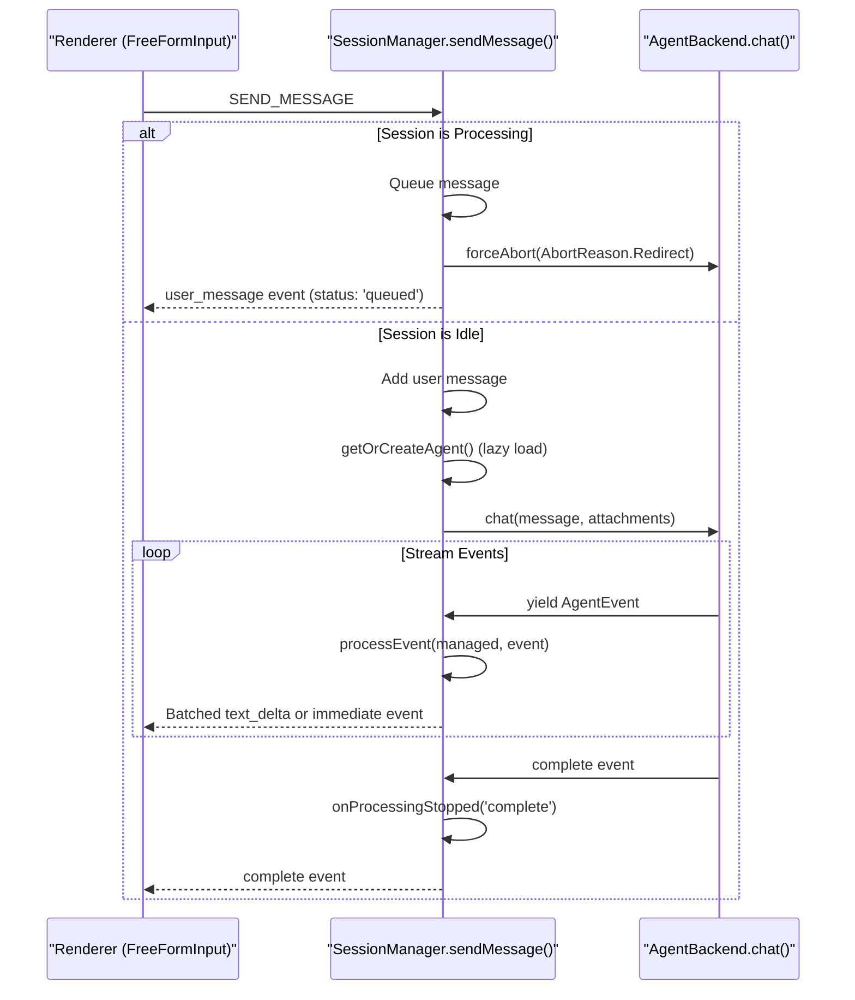
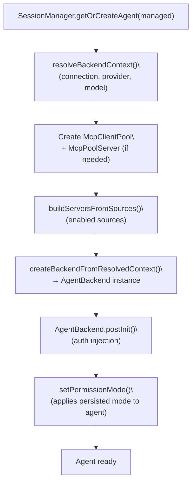

# SessionManager API

<details>
<summary>Relevant source files</summary>

The following files were used as context for generating this wiki page:

- [packages/server-core/src/sessions/SessionManager.ts](packages/server-core/src/sessions/SessionManager.ts)

</details>


This document provides a technical reference for the `SessionManager` class, the main process controller that manages session lifecycle, message processing, agent orchestration, and state persistence. The `SessionManager` sits in the Electron main process and coordinates between the UI (renderer process), agent backends (`AgentBackend`), and persistent storage.

For information about IPC channels that invoke `SessionManager` methods, see page 8.1. For session file formats and configuration files, see page 8.3. For the overall session lifecycle architecture, see page 2.7.

## Overview

The `SessionManager` class [packages/server-core/src/sessions/SessionManager.ts:251-3444]() is the central orchestrator in the Electron main process. It manages:

- Session lifecycle (create, load, persist, delete) [packages/server-core/src/sessions/SessionManager.ts:1966-2229]()
- Message queueing and processing with interruption handling [packages/server-core/src/sessions/SessionManager.ts:3734-4134]()
- Lazy-loaded agent instances per session [packages/server-core/src/sessions/SessionManager.ts:2241-3160]()
- Real-time event streaming to renderer processes via IPC [packages/server-core/src/sessions/SessionManager.ts:4136-4258]()
- OAuth token refresh and authentication flows [packages/server-core/src/sessions/SessionManager.ts:3162-3212]()
- Source and skill hot-reloading via `ConfigWatcher` [packages/server-core/src/sessions/SessionManager.ts:1464-1608]()
- Session sharing to web viewer [packages/server-core/src/sessions/SessionManager.ts:3547-3620]()
- Permission mode management [packages/server-core/src/sessions/SessionManager.ts:1096-1123]()
- Background shell tracking and cleanup [packages/server-core/src/sessions/SessionManager.ts:3921-3989]()

The `SessionManager` maintains an in-memory map of all sessions with metadata-only loading; messages are lazy-loaded on demand to reduce startup memory usage [packages/server-core/src/sessions/SessionManager.ts:1871-1904]().

## Class Architecture

### SessionManager Initialization Flow

**Title: `SessionManager.initialize()` sequence**


Sources: [packages/server-core/src/sessions/SessionManager.ts:1343-1431]()

### ManagedSession Structure

Each session in `SessionManager.sessions` is a `ManagedSession` object. Runtime-only fields are not persisted to disk; all other fields round-trip through the JSONL header [packages/server-core/src/sessions/SessionManager.ts:553-697]().

**Title: `ManagedSession` field groups**



Sources: [packages/server-core/src/sessions/SessionManager.ts:553-697]()

### Core Data Structures

#### ManagedSession Interface

The `ManagedSession` interface [packages/server-core/src/sessions/SessionManager.ts:553-697]() contains:

| Property | Type | Description |
|----------|------|-------------|
| `id` | `string` | Unique session ID (UUID v4) |
| `workspace` | `Workspace` | Workspace context with root path and metadata |
| `agent` | `AgentBackend \| null` | Lazy-loaded backend agent |
| `messages` | `Message[]` | Message array (lazy-loaded from disk) |
| `isProcessing` | `boolean` | Whether agent is currently processing |
| `messageQueue` | `QueuedMessage[]` | Pending messages during processing |
| `lastMessageAt` | `number` | Timestamp of last message (ms since epoch) |
| `tokenUsage` | `TokenUsage` | Cumulative token usage from SDK |
| `permissionMode` | `PermissionMode` | Session permission level: `'safe'` \| `'ask'` \| `'allow-all'` |
| `enabledSourceSlugs` | `string[]` | Active source slugs for this session |
| `tokenRefreshManager` | `TokenRefreshManager` | OAuth token refresh with rate limiting (runtime only) |
| `sdkSessionId` | `string \| undefined` | SDK session ID for conversation continuity |
| `sessionStatus` | `string \| undefined` | Dynamic status ID referencing workspace status config |
| `mcpPool` | `McpClientPool \| undefined` | Centralized MCP client pool (runtime only) |
| `poolServer` | `McpPoolServer \| undefined` | HTTP MCP server for external SDK subprocesses (runtime only) |

`ManagedSession` objects are constructed via `createManagedSession()` [packages/server-core/src/sessions/SessionManager.ts:704-734](), which spreads all session-like fields from the source so new persistent fields automatically propagate without manual copying.

#### Message Conversion

Messages are converted between runtime format (`Message`) and storage format (`StoredMessage`):

- `messageToStored(msg: Message): StoredMessage` [packages/server-core/src/sessions/SessionManager.ts:780-783]()
- `storedToMessage(stored: StoredMessage): Message` [packages/server-core/src/sessions/SessionManager.ts:786-789]()

Sources: [packages/server-core/src/sessions/SessionManager.ts:778-789]()

### SessionManager State

The `SessionManager` maintains several maps and state objects:

**Title: `SessionManager` private state maps**



Sources: [packages/server-core/src/sessions/SessionManager.ts:800-836]()

## Core Methods

### Session Lifecycle

#### createSession()

Creates a new session with workspace defaults and optional overrides [packages/server-core/src/sessions/SessionManager.ts:1966-2229]().

**Signature:**
```typescript
async createSession(
  workspaceId: string,
  options?: CreateSessionOptions
): Promise<Session>
```

**Flow:**

**Title: `createSession()` flow**



Sources: [packages/server-core/src/sessions/SessionManager.ts:1966-2229]()

#### deleteSession()

Deletes a single session and cleans up all resources [packages/server-core/src/sessions/SessionManager.ts:3921-3989]().

**Cleanup sequence:**
1. Force-abort agent if processing.
2. Clear delta flush timers.
3. Cancel pending persistence.
4. Unregister session-scoped tool callbacks.
5. Destroy browser pane instances.
6. Dispose agent instance (`agent.dispose()`).
7. Stop HTTP pool server (`poolServer.stop()`).
8. Remove from `sessions` map and disk storage.

### Message Processing

#### sendMessage()

Sends a message to the agent and streams responses back to the UI [packages/server-core/src/sessions/SessionManager.ts:3734-4134]().

**Message Flow:**



Sources: [packages/server-core/src/sessions/SessionManager.ts:3734-4134]()

#### Event Processing

The `processEvent()` method handles events from the agent [packages/server-core/src/sessions/SessionManager.ts:4136-4258]().

| Event Type | `SessionManager` Action |
|------------|-----------------------|
| `text_delta` | Batch deltas for 50ms, then flush via `flushPendingDeltas()` |
| `tool_start` | Resolve tool metadata, create tool message with `toolStatus: 'executing'` |
| `tool_result` | Update tool message with result, set `toolStatus: 'completed'` |
| `usage_update` | Update `managed.tokenUsage` with cumulative totals |

Sources: [packages/server-core/src/sessions/SessionManager.ts:4136-4258](), [packages/server-core/src/sessions/SessionManager.ts:792-797]()

### Persistence

#### persistSession()

Enqueues a session for async persistence with debouncing [packages/server-core/src/sessions/SessionManager.ts:1434-1462]().

**Implementation:**
- Filters out transient `status` messages.
- Uses `sessionPersistenceQueue` [packages/server-core/src/sessions/SessionManager.ts:58]() to debounce writes per session.

Sources: [packages/server-core/src/sessions/SessionManager.ts:1434-1462]()

### Model and Connection

#### updateSessionModel()

Updates model for a session. Pass `null` to clear (falls back to global config) [packages/server-core/src/sessions/SessionManager.ts:3865-3895]().

**Signature:**
```typescript
async updateSessionModel(
  sessionId: string,
  workspaceId: string,
  model: string | null,
  connection?: string
): Promise<void>
```

Sources: [packages/server-core/src/sessions/SessionManager.ts:3865-3895]()

## Agent Management

### Lazy Agent Creation

Agents are instantiated only when needed (e.g., when the first message is sent).

#### getOrCreateAgent()

Creates the appropriate agent backend based on the session's LLM connection [packages/server-core/src/sessions/SessionManager.ts:2241-3160]().

**Title: `getOrCreateAgent()` setup sequence**



Sources: [packages/server-core/src/sessions/SessionManager.ts:2241-3160]()

## Authentication Management

### reinitializeAuth()

Reinitializes authentication environment variables after credential changes [packages/server-core/src/sessions/SessionManager.ts:1298-1341]().

**Steps:**
1. Clear existing auth env vars.
2. Load connection and resolve new env vars via `resolveAuthEnvVars()`.
3. Apply to `process.env`.
4. Reset summarization client.

Sources: [packages/server-core/src/sessions/SessionManager.ts:1298-1341]()

### Source Server Building

#### buildServersFromSources()

Module-level helper that builds MCP and API servers from source configurations [packages/server-core/src/sessions/SessionManager.ts:166-219]().

**Steps:**
1. Load credentials via `getSourceCredentialManager()`.
2. Build token getters for OAuth sources.
3. Call `serverBuilder.buildAll()`.
4. Handle authentication errors.

Sources: [packages/server-core/src/sessions/SessionManager.ts:166-219]()