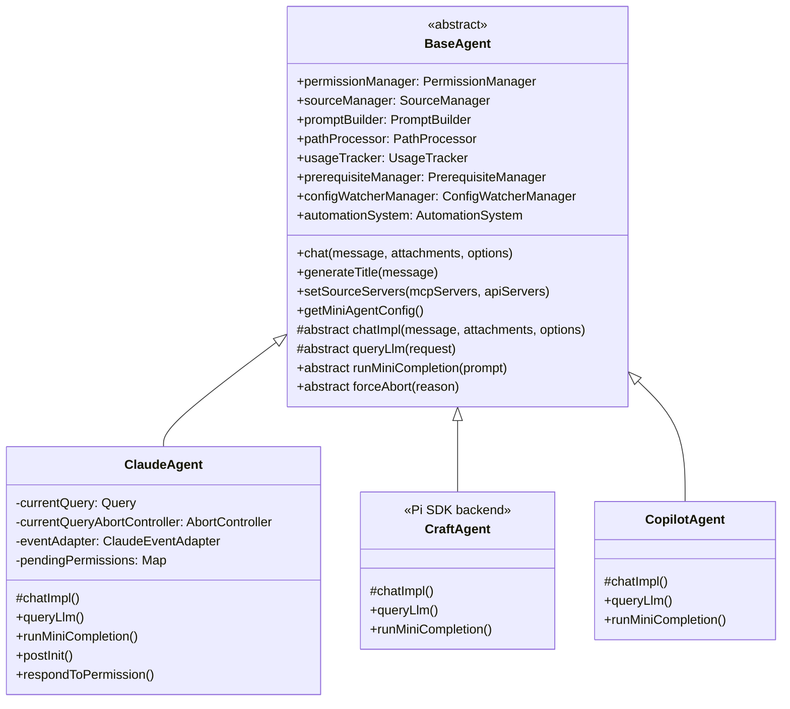
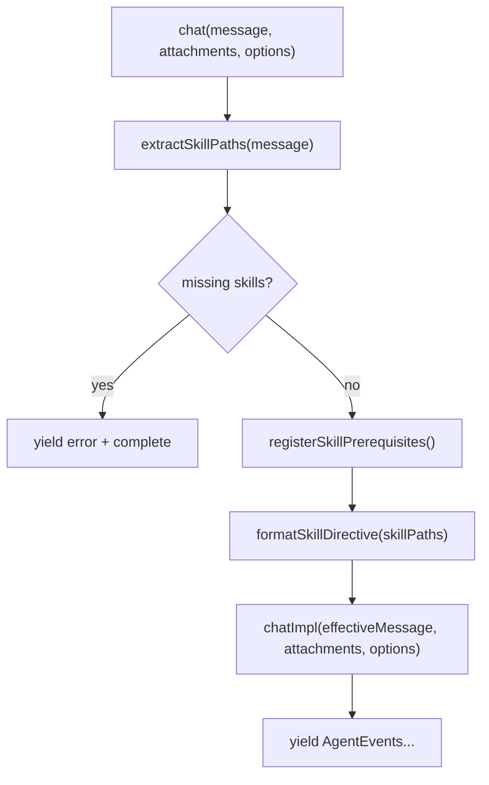
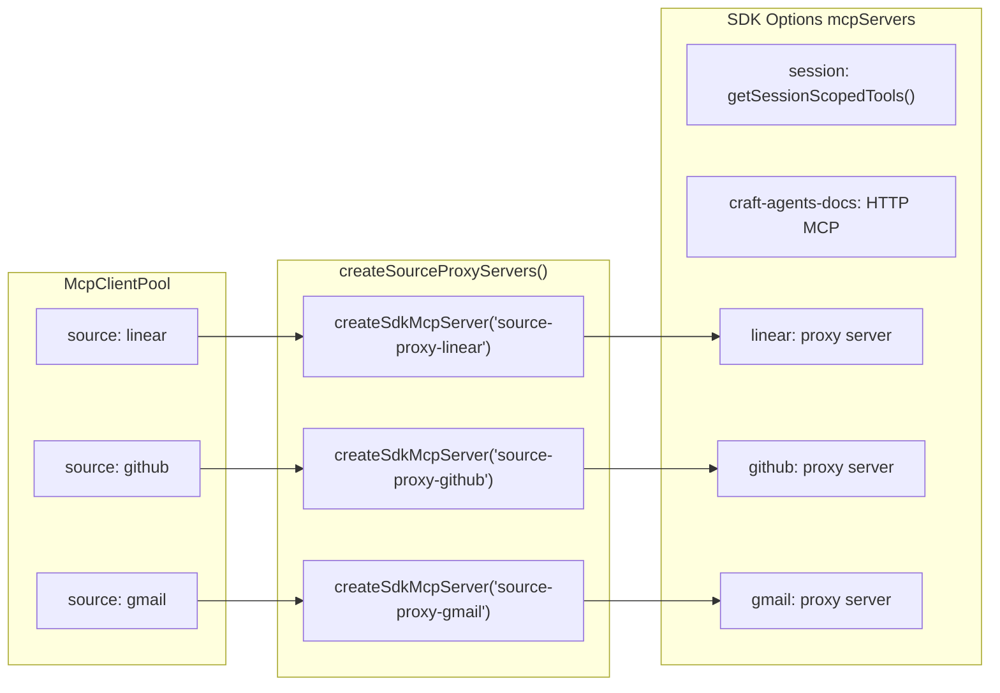
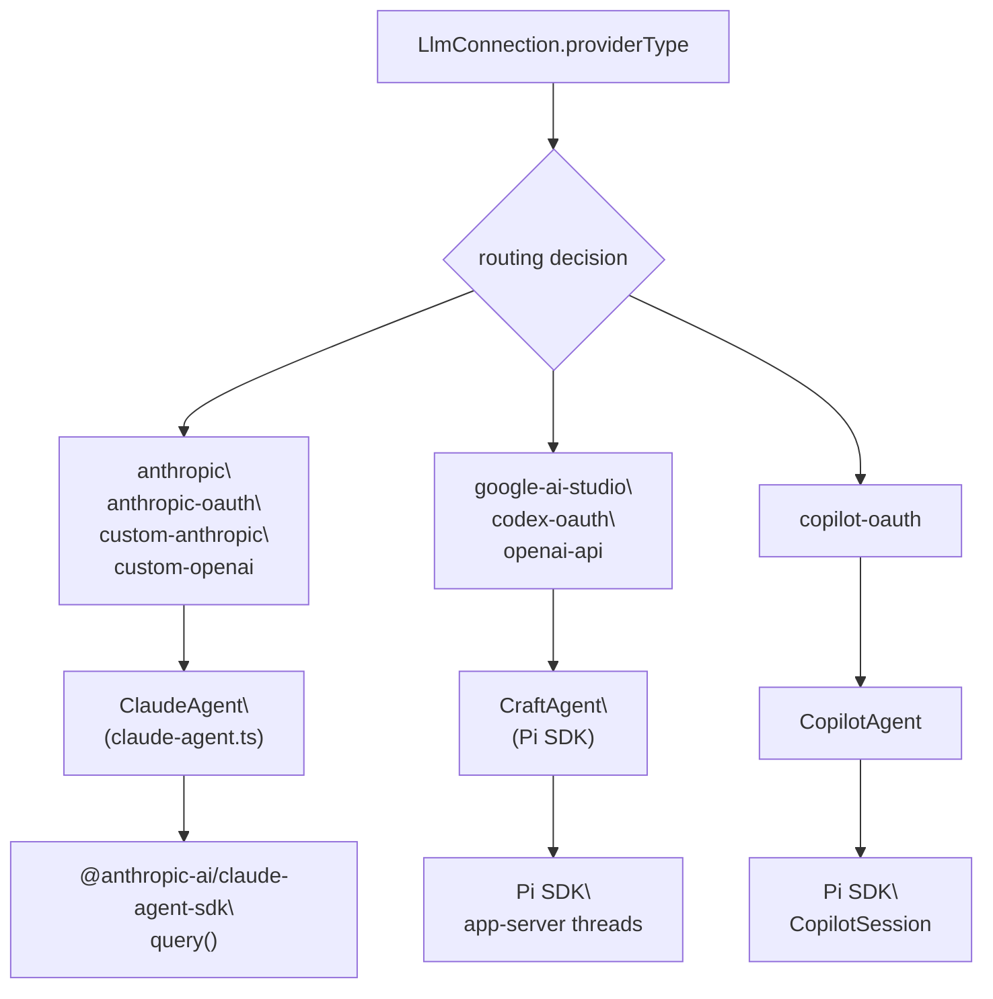
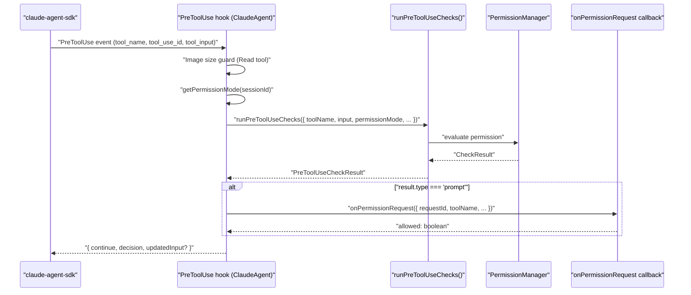
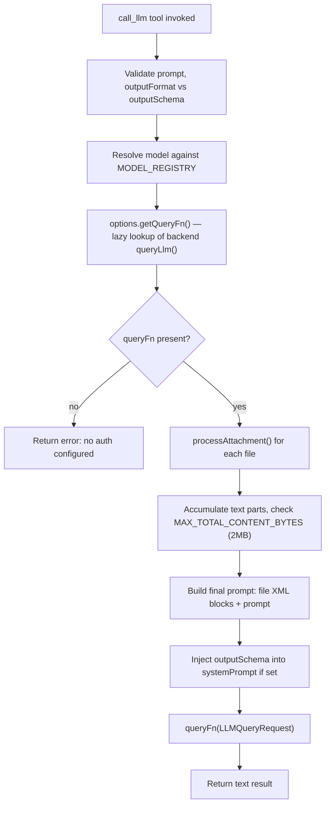
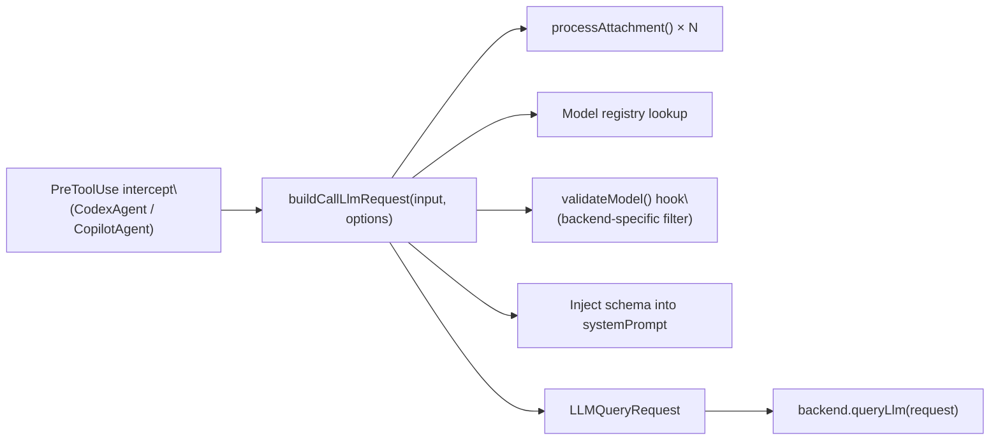

# Agent System

Relevant source files

The following files were used as context for generating this wiki page:

- [README.md](README.md)
- [packages/shared/src/agent/base-agent.ts](packages/shared/src/agent/base-agent.ts)
- [packages/shared/src/agent/claude-agent.ts](packages/shared/src/agent/claude-agent.ts)
- [packages/shared/src/agent/llm-tool.ts](packages/shared/src/agent/llm-tool.ts)

This page documents the agent layer in `packages/shared/src/agent/`: the `BaseAgent` abstraction, the concrete backend implementations (`ClaudeAgent`, `CraftAgent`/Pi, `CopilotAgent`), LLM provider routing, the `PreToolUse` check pipeline, and the `call_llm` secondary-LLM tool. For how the Electron main process creates and manages agent instances per session, see [Session Lifecycle](#2.7). For how external MCP sources and REST API sources are connected and routed to agents, see [External Service Integration](#2.4).

---

## Backend Architecture

The agent system uses a layered hierarchy. `BaseAgent` is the abstract base class that provides all shared infrastructure. Three concrete backends extend it, each responsible for one LLM provider family.

**Agent class hierarchy diagram**

Sources: [packages/shared/src/agent/base-agent.ts:1-170](), [packages/shared/src/agent/claude-agent.ts:327-500]()

---

### BaseAgent

`BaseAgent` is defined in [packages/shared/src/agent/base-agent.ts]() and implements the `AgentBackend` interface. Its constructor initialises all core module instances — subclasses receive these via `protected` references rather than constructing them independently.

**Core modules initialised by BaseAgent**

| Module                | Class                  | Purpose                                                                         |
| --------------------- | ---------------------- | ------------------------------------------------------------------------------- |
| Permission evaluation | `PermissionManager`    | Evaluates tool permissions, manages `PermissionMode`, tracks command whitelists |
| Source state tracking | `SourceManager`        | Tracks which sources are active, formats source context for prompts             |
| Prompt construction   | `PromptBuilder`        | Builds context blocks prepended to each user message                            |
| Path normalization    | `PathProcessor`        | Expands `~`, resolves relative paths                                            |
| Token accounting      | `UsageTracker`         | Tracks input/output token counts, fires `onUsageUpdate`                         |
| Skill prerequisites   | `PrerequisiteManager`  | Blocks source tool calls until `guide.md` files are read                        |
| File watching         | `ConfigWatcherManager` | Watches workspace config files and hot-reloads changes                          |

Sources: [packages/shared/src/agent/base-agent.ts:218-270]()

`BaseAgent.chat()` is the public entry point for all agent interactions. It is a template method that handles skill `@mention` parsing and directive injection before delegating to `chatImpl()`.

**`chat()` template method flow diagram**

Sources: [packages/shared/src/agent/base-agent.ts:929-953]()

**Key callbacks on `BaseAgent`** (wired by `SessionManager` in the Electron main process):

| Callback                 | Fired when                                           |
| ------------------------ | ---------------------------------------------------- |
| `onPermissionRequest`    | A tool needs user approval                           |
| `onPlanSubmitted`        | Agent calls `SubmitPlan` session tool                |
| `onAuthRequest`          | A source needs authentication                        |
| `onSourceChange`         | Config watcher detects source file change            |
| `onSourcesListChange`    | Source list changes (add/remove)                     |
| `onPermissionModeChange` | User cycles through `safe` / `ask` / `allow-all`     |
| `onUsageUpdate`          | Token counts updated                                 |
| `onSpawnSession`         | Agent requests a new sub-session via `spawn_session` |

---

### ClaudeAgent

`ClaudeAgent` (in [packages/shared/src/agent/claude-agent.ts]()) powers all **Anthropic-family** sessions: direct Anthropic API key, Claude Max/Pro OAuth, and any third-party OpenAI-compatible or Anthropic-compatible endpoint (OpenRouter, Ollama, Vercel AI Gateway, etc.).

It uses `@anthropic-ai/claude-agent-sdk` — specifically the `query()` function — to drive the agentic loop.

**Key responsibilities unique to `ClaudeAgent`:**

- Calls `postInit()` to inject `ANTHROPIC_API_KEY` / `CLAUDE_CODE_OAUTH_TOKEN` into `process.env` before the SDK subprocess spawns. The credentials are fetched from the `CredentialManager` via `resolveAuthEnvVars()`.
- Constructs `Options` passed to the SDK's `query()` call, including `mcpServers`, `tools`, `hooks`, `systemPrompt`, `maxThinkingTokens`, `cwd`, and `permissionMode: 'bypassPermissions'`.
- Builds per-source proxy MCP servers via `createSourceProxyServers()`, which wraps each connected source from `McpClientPool` as an in-process `createSdkMcpServer()` instance.
- Registers the `PreToolUse` hook (see [Pre-tool-use Check Pipeline](#pre-tool-use-check-pipeline) below).
- Converts raw SDK messages to `AgentEvent` objects via `ClaudeEventAdapter` ([packages/shared/src/agent/backend/claude/event-adapter.ts]()).
- Supports session resumption: passes `resume: this.sessionId` to SDK options when continuing an existing session, or `resume + forkSession: true` for branched sessions.

**Source proxy server creation diagram**

Sources: [packages/shared/src/agent/claude-agent.ts:288-322](), [packages/shared/src/agent/claude-agent.ts:693-719]()

---

### CraftAgent and CopilotAgent (Pi Backend)

These backends power non-Anthropic providers:

| Backend               | Providers                                                    |
| --------------------- | ------------------------------------------------------------ |
| `CraftAgent` (Pi SDK) | Google AI Studio, ChatGPT Plus (Codex OAuth), OpenAI API key |
| `CopilotAgent`        | GitHub Copilot OAuth (device code flow)                      |

Both extend `BaseAgent` and implement the same `chatImpl()` / `queryLlm()` / `runMiniCompletion()` contract. Because they use external MCP server subprocesses (via `bridge-mcp-server`), they rely on `handleSessionMcpToolCompletion()` (inherited from `BaseAgent`) to detect when session-scoped tools like `SubmitPlan` complete and fire the appropriate callbacks. `ClaudeAgent` does not need this because its session tools run in-process via the SDK.

Sources: [packages/shared/src/agent/base-agent.ts:351-422]()

---

## LLM Provider Routing

The LLM connection used for a session is determined at session creation time. The main process reads `StoredConfig.llmConnections` and selects the appropriate backend class based on `providerType`.

**Provider routing diagram**

Sources: [packages/shared/src/agent/claude-agent.ts:413-443](), [README.md:287-291]()

**Custom base URL routing (Claude backend only):** When a connection has a `baseUrl` set (e.g., `https://openrouter.ai/api`), `resolveAuthEnvVars()` sets `ANTHROPIC_BASE_URL` in the environment and `ClaudeAgent` passes it through `getDefaultOptions(this.config.envOverrides)` to the SDK subprocess. This enables OpenRouter, Ollama, and other third-party providers without a separate backend class.

Sources: [packages/shared/src/agent/claude-agent.ts:506-536](), [packages/shared/src/agent/claude-agent.ts:726-731]()

---

## Pre-tool-use Check Pipeline

Before any tool executes, `ClaudeAgent` runs a centralized pipeline via `runPreToolUseChecks()` from [packages/shared/src/agent/core/pre-tool-use.ts](). This is registered as the SDK's `PreToolUse` hook.

Non-Claude backends implement the same logical checks via their own PreToolUse intercept mechanism — they call `buildCallLlmRequest()` for `call_llm` and route other checks through equivalent logic.

**`PreToolUseCheckResult` types and their effects**

| Result type                | SDK hook response                                | Effect                                                                |
| -------------------------- | ------------------------------------------------ | --------------------------------------------------------------------- |
| `allow`                    | `{ continue: true }`                             | Tool proceeds; optional steer message injected as `additionalContext` |
| `modify`                   | `{ continue: true, updatedInput }`               | Tool proceeds with modified input (e.g. path substitution)            |
| `block`                    | `{ continue: false, decision: 'block', reason }` | Tool is blocked; model receives explanation                           |
| `prompt`                   | Async: waits for `onPermissionRequest` callback  | User shown permission dialog; result awaited                          |
| `source_activation_needed` | Async: calls `onSourceActivationRequest`         | Auto-activates inactive source or blocks with explanation             |
| `call_llm_intercept`       | `{ continue: true }`                             | Passes through; tool runs in-process via SDK                          |
| `spawn_session_intercept`  | `{ continue: true }`                             | Passes through; session spawned via `onSpawnSession`                  |

Sources: [packages/shared/src/agent/claude-agent.ts:826-1063]()

**PreToolUse hook execution sequence**

Sources: [packages/shared/src/agent/claude-agent.ts:826-1063]()

**Additional checks run before `runPreToolUseChecks()`:**

1. **Read tool tracking** — `prerequisiteManager.trackReadTool()` records each file read, so the prerequisite system knows when `guide.md` files have been consumed.
2. **Image size guard** — For `Read` tool calls on image files (`.png`, `.jpg`, `.gif`, etc.), the file size is checked against `IMAGE_LIMITS.MAX_RAW_SIZE`. Oversized images trigger `config.onImageResize` or are blocked with an error message. This prevents the session from entering an irrecoverable state if a >5 MB image enters conversation history.

Sources: [packages/shared/src/agent/claude-agent.ts:839-884]()

---

## `call_llm` Secondary LLM Tool

`call_llm` is a session-scoped tool that lets the main agent invoke a secondary, lighter LLM call without polluting the main context window. It is created by `createLLMTool()` in [packages/shared/src/agent/llm-tool.ts]() and registered as part of the `session` MCP server that every `ClaudeAgent` session receives.

**Primary use cases:**

- Cost optimization — use a smaller model (e.g., `haiku`) for summarization or classification
- Structured output — native JSON schema compliance
- Parallel processing — multiple `call_llm` calls in one turn execute simultaneously
- Context isolation — analyse content without adding it to the main conversation history

### Tool Parameters

| Parameter      | Type                                              | Description                                                                                          |
| -------------- | ------------------------------------------------- | ---------------------------------------------------------------------------------------------------- |
| `prompt`       | `string`                                          | Instructions for the secondary LLM                                                                   |
| `attachments`  | `Array<string \| { path, startLine?, endLine? }>` | File paths to load (up to 20, 2 MB total)                                                            |
| `model`        | `string`                                          | Model ID or short name (e.g., `"haiku"`)                                                             |
| `systemPrompt` | `string`                                          | Optional system prompt                                                                               |
| `maxTokens`    | `number`                                          | 1–64000, defaults to 4096                                                                            |
| `temperature`  | `number`                                          | 0–1 sampling temperature                                                                             |
| `outputFormat` | `enum`                                            | Predefined schema: `summary`, `classification`, `extraction`, `analysis`, `comparison`, `validation` |
| `outputSchema` | `object`                                          | Custom JSON Schema for structured output                                                             |

Sources: [packages/shared/src/agent/llm-tool.ts:557-718]()

### Execution Pipeline

Sources: [packages/shared/src/agent/llm-tool.ts:557-718]()

### `buildCallLlmRequest()` — Shared Pre-execution Pipeline

For non-Claude backends (`CraftAgent`, `CopilotAgent`), `call_llm` calls are intercepted during `PreToolUse` before they reach the in-process tool handler. The shared function `buildCallLlmRequest()` handles attachment resolution, model validation, and schema injection, producing an `LLMQueryRequest` ready to pass to `queryLlm()`.

Sources: [packages/shared/src/agent/llm-tool.ts:176-249](), [packages/shared/src/agent/base-agent.ts:1033-1041]()

### `processAttachment()` — File Loading and Validation

`processAttachment()` in [packages/shared/src/agent/llm-tool.ts:340-520]() handles all file ingestion:

| Limit                    | Value  |
| ------------------------ | ------ |
| Max lines per file       | 2,000  |
| Max bytes per file       | 500 KB |
| Max attachments per call | 20     |
| Max total content        | 2 MB   |
| Max image size           | 5 MB   |

For files exceeding the line limit, the function returns an actionable error message that includes a breakdown of the file's four quarters (imports, exports, functions, config patterns) to help the model choose a useful line range.

Sources: [packages/shared/src/agent/llm-tool.ts:84-93](), [packages/shared/src/agent/llm-tool.ts:340-520]()

### Predefined Output Formats

`OUTPUT_FORMATS` in [packages/shared/src/agent/llm-tool.ts:99-153]() provides six ready-made JSON schemas:

| Format           | Required fields                          |
| ---------------- | ---------------------------------------- |
| `summary`        | `summary`, `key_points`                  |
| `classification` | `category`, `confidence`, `reasoning`    |
| `extraction`     | `items`, `count`                         |
| `analysis`       | `findings`                               |
| `comparison`     | `similarities`, `differences`, `verdict` |
| `validation`     | `valid`, `errors`, `warnings`            |

When an `outputFormat` or `outputSchema` is supplied, the schema JSON is appended to the system prompt with an instruction to return only valid JSON. This works for all backends without requiring native structured output support.

---

## Mini Agent Mode

Any agent can run in "mini agent" mode, activated by setting `systemPromptPreset: 'mini'` in `BackendConfig`. This is used for quick configuration edits to reduce token usage significantly.

**Mini agent vs normal agent comparison**

| Aspect               | Normal agent                                         | Mini agent                                          |
| -------------------- | ---------------------------------------------------- | --------------------------------------------------- |
| System prompt        | Claude Code preset + workspace context               | Lean custom prompt via `getMiniAgentSystemPrompt()` |
| Tools (Claude)       | Full Claude Code toolset                             | `['Read', 'Edit', 'Write', 'Glob', 'Grep', 'Bash']` |
| MCP servers (Claude) | `session` + `craft-agents-docs` + all source proxies | `session` only                                      |
| `maxThinkingTokens`  | Per thinking level                                   | `0` (disabled)                                      |

`getMiniAgentConfig()` in `BaseAgent` returns the centralised `MiniAgentConfig` object that each backend reads to apply these constraints. This avoids duplicated detection logic across Claude, Codex, and Copilot implementations.

Sources: [packages/shared/src/agent/base-agent.ts:131-136](), [packages/shared/src/agent/base-agent.ts:660-708]()

---

## Thinking Levels

`ClaudeAgent` supports configurable extended thinking for Claude models via `ThinkingLevel`. The level is stored in `BaseAgent._thinkingLevel` and applied per-message.

| Level   | Behaviour                                                                                 |
| ------- | ----------------------------------------------------------------------------------------- |
| `none`  | Thinking disabled (`maxThinkingTokens: 0`)                                                |
| `think` | Default — moderate thinking budget                                                        |
| `max`   | Maximum budget; also activated for single-turn override via `setUltrathinkOverride(true)` |

Non-Claude models (routed through OpenRouter/Ollama via a custom base URL) receive `maxThinkingTokens: 0` regardless of level, because extended thinking is Anthropic-specific.

Sources: [packages/shared/src/agent/claude-agent.ts:733-738](), [packages/shared/src/agent/base-agent.ts:436-449]()

---

## Session Continuity and Branching

`ClaudeAgent` persists the SDK-internal session ID in `this.sessionId`. On each subsequent `chat()` call, it passes `resume: this.sessionId` to SDK options, enabling the SDK to continue the transcript and apply automatic compaction.

For branched sessions, `branchFromSdkSessionId` is set from `session.branchFromSdkSessionId`. The first `chat()` call passes `{ resume: branchFromSdkSessionId, forkSession: true }`, which causes the SDK to fork the parent transcript into a new session so the branch shares full conversation history without affecting the parent.

Sources: [packages/shared/src/agent/claude-agent.ts:456-464](), [packages/shared/src/agent/claude-agent.ts:1109-1113]()
