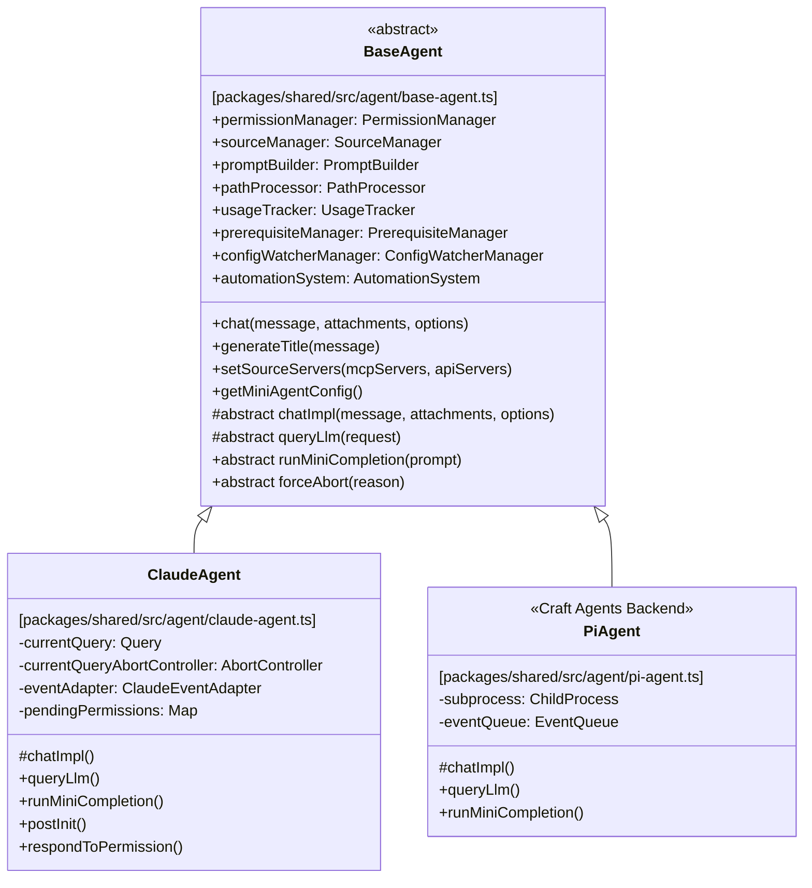
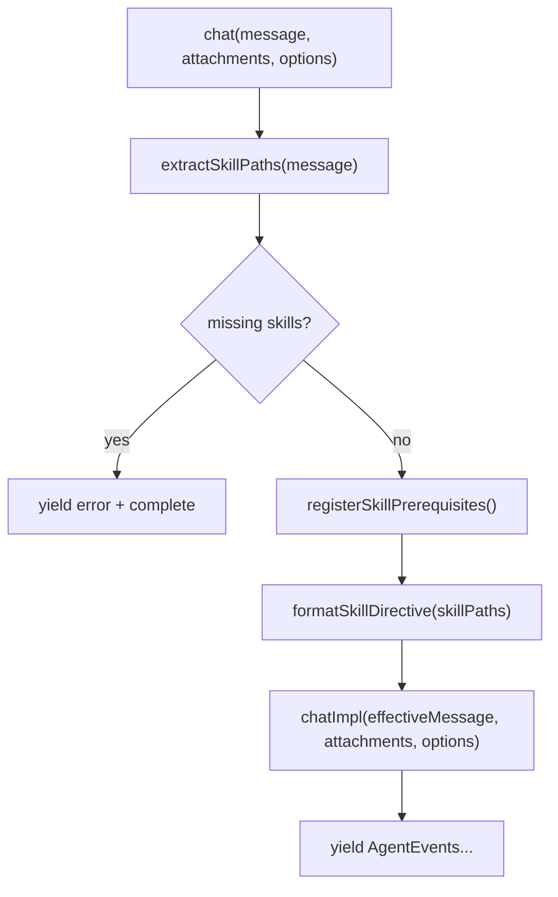
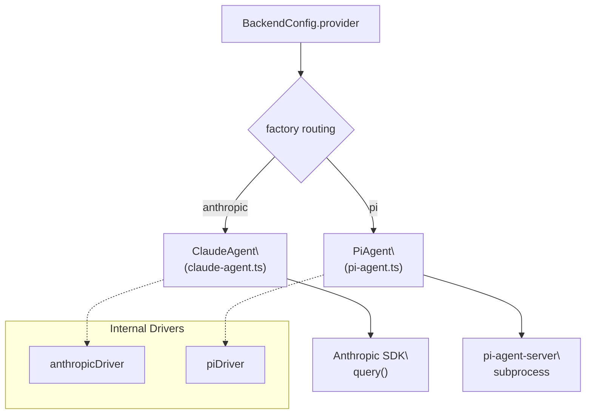
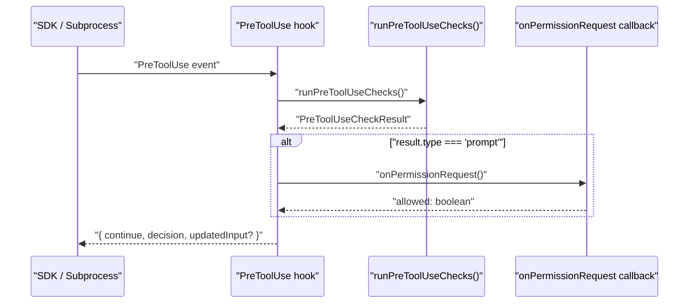

# Agent System

Relevant source files

The following files were used as context for generating this wiki page:

- [packages/shared/src/agent/backend/factory.ts](packages/shared/src/agent/backend/factory.ts)
- [packages/shared/src/agent/backend/internal/drivers/anthropic.ts](packages/shared/src/agent/backend/internal/drivers/anthropic.ts)
- [packages/shared/src/agent/backend/types.ts](packages/shared/src/agent/backend/types.ts)
- [packages/shared/src/agent/claude-agent.ts](packages/shared/src/agent/claude-agent.ts)
- [packages/shared/src/agent/errors.ts](packages/shared/src/agent/errors.ts)
- [packages/shared/src/agent/pi-agent.ts](packages/shared/src/agent/pi-agent.ts)

This page documents the agent layer in `packages/shared/src/agent/`: the `BaseAgent` abstraction, the concrete backend implementations (`ClaudeAgent`, `PiAgent`), LLM provider routing, the `PreToolUse` check pipeline, and the `call_llm` secondary-LLM tool.

---

## Backend Architecture

The agent system uses a layered hierarchy. `BaseAgent` is the abstract base class that provides all shared infrastructure. Concrete backends extend it, each responsible for one LLM provider family or SDK integration.

**Agent class hierarchy diagram**

Sources: [packages/shared/src/agent/base-agent.ts:11-150](), [packages/shared/src/agent/claude-agent.ts:158-200](), [packages/shared/src/agent/pi-agent.ts:118-140]()

---

### BaseAgent

`BaseAgent` is defined in [packages/shared/src/agent/base-agent.ts]() and implements the `AgentBackend` interface. Its constructor initialises core module instances — subclasses receive these via `protected` references.

**Core modules initialised by BaseAgent**

| Module | Class | Purpose |
|--------|-------|---------|
| Permission evaluation | `PermissionManager` | Evaluates tool permissions, manages `PermissionMode`, tracks command whitelists |
| Source state tracking | `SourceManager` | Tracks which sources are active, formats source context for prompts |
| Prompt construction | `PromptBuilder` | Builds context blocks prepended to each user message |
| Path normalization | `PathProcessor` | Expands `~`, resolves relative paths |
| Token accounting | `UsageTracker` | Tracks input/output token counts, fires `onUsageUpdate` |
| Skill prerequisites | `PrerequisiteManager` | Blocks source tool calls until `guide.md` files are read |
| File watching | `ConfigWatcherManager` | Watches workspace config files and hot-reloads changes |

Sources: [packages/shared/src/agent/base-agent.ts:218-270]()

`BaseAgent.chat()` is the public entry point for all agent interactions. It handles skill `@mention` parsing and directive injection before delegating to `chatImpl()`.

**`chat()` template method flow diagram**

Sources: [packages/shared/src/agent/base-agent.ts:929-953]()

---

### ClaudeAgent

`ClaudeAgent` (in [packages/shared/src/agent/claude-agent.ts]()) powers all **Anthropic-family** sessions: direct Anthropic API key, Claude Max/Pro OAuth, and third-party endpoints (OpenRouter, Bedrock, Vertex).

It uses `@anthropic-ai/claude-agent-sdk` — specifically the `query()` function — to drive the agentic loop [packages/shared/src/agent/claude-agent.ts:1-2]().

**Key responsibilities unique to `ClaudeAgent`:**

- **Environment Injection**: Calls `postInit()` to inject `ANTHROPIC_API_KEY` or `CLAUDE_CODE_OAUTH_TOKEN` into `process.env` before the SDK subprocess spawns [packages/shared/src/agent/claude-agent.ts:506-536]().
- **Thinking Options**: Resolves `maxThinkingTokens` or `effort` levels using `resolveClaudeThinkingOptions()` based on model support [packages/shared/src/agent/claude-agent.ts:128-156]().
- **Source Proxying**: Builds per-source proxy MCP servers via `createSourceProxyServers()`, wrapping connected sources from `McpClientPool` as in-process SDK servers [packages/shared/src/agent/claude-agent.ts:693-719]().
- **SDK Lifecycle**: Manages `AbortController` for cancelling active `query()` instances when `forceAbort()` is called [packages/shared/src/agent/claude-agent.ts:1240-1250]().

---

### PiAgent (Craft Agents Backend)

`PiAgent` in [packages/shared/src/agent/pi-agent.ts]() is a thin subprocess client for the Pi coding agent. It spawns a `pi-agent-server` subprocess and communicates via JSONL over stdin/stdout [packages/shared/src/agent/pi-agent.ts:4-9]().

**Key Features:**
- **Proxy Tool Routing**: Routes MCP/API source calls through the subprocess via proxy definitions [packages/shared/src/agent/pi-agent.ts:63-70]().
- **Backend Session Tools**: Explicitly supports `call_llm`, `spawn_session`, and `browser_tool` [packages/shared/src/agent/pi-agent.ts:104-110]().
- **Error Deduplication**: Suppresses identical consecutive subprocess errors to prevent session flooding [packages/shared/src/agent/pi-agent.ts:149-152]().
- **Event Queueing**: Uses an `EventQueue` to manage the asynchronous stream of events coming from the JSONL interface [packages/shared/src/agent/pi-agent.ts:145-146]().

---

## LLM Provider Routing

The `createBackend` factory in `packages/shared/src/agent/backend/factory.ts` selects the backend class based on the provider configuration.

**Provider routing diagram**

Sources: [packages/shared/src/agent/backend/factory.ts:132-146](), [packages/shared/src/agent/backend/factory.ts:63-66](), [packages/shared/src/agent/backend/internal/drivers/anthropic.ts:6-144]()

---

## Pre-tool-use Check Pipeline

`ClaudeAgent` and `PiAgent` both leverage a centralized pipeline via `runPreToolUseChecks()` from [packages/shared/src/agent/core/pre-tool-use.ts](). In `ClaudeAgent`, this is registered as the SDK's `PreToolUse` hook [packages/shared/src/agent/claude-agent.ts:64-68]().

**`PreToolUseCheckResult` types and their effects**

| Result type | Effect |
|-------------|--------|
| `allow` | Tool proceeds; optional steer message injected |
| `modify` | Tool proceeds with modified input (e.g. path substitution) |
| `block` | Tool is blocked; model receives explanation |
| `prompt` | User shown permission dialog; result awaited |
| `source_activation_needed` | Auto-activates inactive source or blocks with explanation |

**PreToolUse hook execution sequence**

Sources: [packages/shared/src/agent/claude-agent.ts:826-1063](), [packages/shared/src/agent/pi-agent.ts:89-91](), [packages/shared/src/agent/core/pre-tool-use.ts:1-100]()

---

## `call_llm` Secondary LLM Tool

`call_llm` enables the main agent to invoke secondary LLM calls for specialized subtasks like summarization or classification [packages/shared/src/agent/llm-tool.ts:4-6]().

### Tool Parameters
| Parameter | Description |
|-----------|-------------|
| `prompt` | Instructions for the secondary LLM |
| `attachments` | File paths to load (up to 20, 2 MB total) |
| `model` | Model ID or short name (e.g., `"haiku"`) |
| `outputFormat` | Predefined schema: `summary`, `classification`, `extraction`, `analysis`, `comparison`, `validation` |

Sources: [packages/shared/src/agent/llm-tool.ts:91-153]()

### Execution Pipeline
1. **Validation**: Checks prompt and attachment limits [packages/shared/src/agent/llm-tool.ts:180-185]().
2. **Attachment Processing**: `processAttachment()` loads file content, handles line ranges, and checks size limits [packages/shared/src/agent/llm-tool.ts:340-520]().
3. **Prompt Building**: `buildCallLlmRequest()` assembles the final prompt with XML file blocks [packages/shared/src/agent/llm-tool.ts:176-249]().
4. **Execution**: Backend's `queryLlm()` executes the request [packages/shared/src/agent/llm-tool.ts:38-51]().

Sources: [packages/shared/src/agent/llm-tool.ts:1-249]()

---

## Thinking Levels

`ClaudeAgent` supports configurable thinking levels via `THINKING_TO_EFFORT` and `resolveClaudeThinkingOptions` [packages/shared/src/agent/thinking-levels.ts]().

| Level | Behaviour |
|-------|-----------|
| `none` | Thinking disabled [packages/shared/src/agent/claude-agent.ts:140-144]() |
| `medium` | Adaptive thinking with `medium` effort [packages/shared/src/agent/claude-agent.ts:146-151]() |
| `high` | Adaptive thinking with `high` effort |

Sources: [packages/shared/src/agent/claude-agent.ts:128-156](), [packages/shared/src/agent/thinking-levels.ts:1-20]()

---

## Error Handling & Diagnostics

The agent system uses a structured error mapping system to provide actionable feedback to users.

- **Error Codes**: Mapped in [packages/shared/src/agent/errors.ts:10-29]() (e.g., `rate_limited`, `invalid_api_key`).
- **Recovery Actions**: Errors include suggested actions like `retry`, `settings`, or `reauth` [packages/shared/src/agent/errors.ts:38-51]().
- **Diagnostics**: `ClaudeAgent` runs `runErrorDiagnostics()` upon failure to identify specific causes like expired tokens or unreachable MCP servers [packages/shared/src/agent/claude-agent.ts:16-17]().

Sources: [packages/shared/src/agent/errors.ts:1-72](), [packages/shared/src/agent/claude-agent.ts:14-16]()