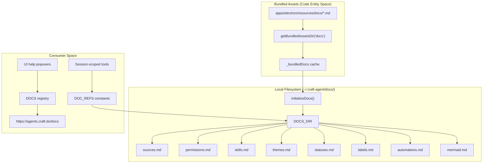
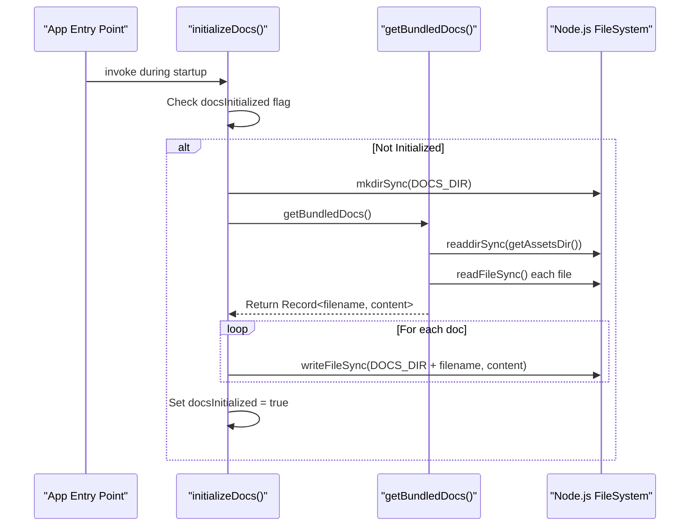
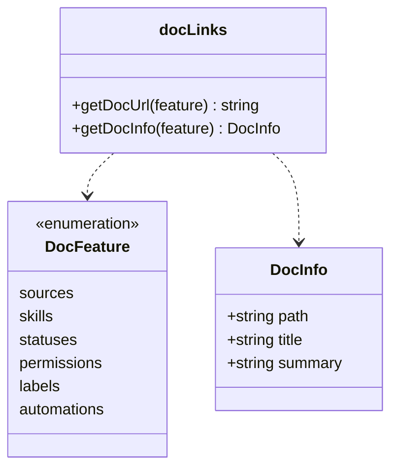

# Documentation System

Relevant source files

The following files were used as context for generating this wiki page:

- [packages/shared/src/docs/doc-links.ts](packages/shared/src/docs/doc-links.ts)
- [packages/shared/src/docs/index.ts](packages/shared/src/docs/index.ts)

## Purpose and Scope

The Documentation System provides built-in reference material that agents use when performing configuration tasks, along with contextual help links for users in the UI. The system manages two types of documentation: (1) markdown files bundled as assets and synced to `~/.craft-agent/docs/` via `initializeDocs()` [packages/shared/src/docs/index.ts:145-168](), which agents read to understand how to configure sources, skills, permissions, and other features, and (2) online documentation links with summaries defined in a central registry [packages/shared/src/docs/doc-links.ts:32-111]() for UI help popovers.

This page focuses on the technical architecture of documentation storage, bundling, and access. For information about how agents integrate with tools and sources, see [Agent System](#2.3). For details on workspace configuration files, see [Storage & Configuration](#2.8).

---

## Documentation Architecture Overview

The documentation system operates in three layers: bundled assets stored with the application, a synchronized local copy at `~/.craft-agent/docs/`, and remote online documentation for user reference.

### Documentation Data Flow

**Sources:** [packages/shared/src/docs/index.ts:1-124](), [packages/shared/src/docs/doc-links.ts:1-111]()

---

## Documentation File Types

The system maintains several categories of documentation files that serve different purposes for agents and users. The `DOC_REFS` constant [packages/shared/src/docs/index.ts:103-124]() provides a centralized mapping of these files.

| Constant Name | File Path (Relative to `~/.craft-agent/docs/`) | Purpose |
|---------------|-----------------------------------------------|---------|
| `sources` | `sources.md` | Guide for connecting MCP servers, REST APIs, and local filesystems. |
| `permissions` | `permissions.md` | Explanation of permission modes (Safe, Ask, Allow All). |
| `skills` | `skills.md` | How to create and invoke specialized behaviors via `@mention`. |
| `themes` | `themes.md` | Theme customization reference (6-color system). |
| `statuses` | `statuses.md` | Workflow state configuration (Todo, In Progress, Done). |
| `labels` | `labels.md` | Label system, nesting, and auto-apply regex rules. |
| `automations` | `automations.md` | Event-driven automation guide (hooks, tasks). |
| `mermaid` | `mermaid.md` | Mermaid diagram syntax reference for agent output. |
| `llmTool` | `llm-tool.md` | Documentation for the `call_llm` tool. |
| `craftCli` | `craft-cli.md` | CLI client usage and terminal integration. |

**Sources:** [packages/shared/src/docs/index.ts:103-124]()

---

## Documentation Initialization Process

Documentation files are synchronized from bundled assets to the local filesystem on every application launch. This ensures that the documentation available to the agent is always in sync with the current version of the software.

### Initialization Sequence

The initialization process uses several key functions:

- **`initializeDocs()`** [packages/shared/src/docs/index.ts:145-168]() - Main entry point. It ensures the directory exists and writes all bundled content to disk.
- **`getBundledDocs()`** [packages/shared/src/docs/index.ts:72-77]() - Lazy-loads bundled docs. This is critical because it must wait until `setBundledAssetsRoot()` is called at startup to resolve the correct asset path [packages/shared/src/docs/index.ts:64-65]().
- **`loadBundledDocs()`** [packages/shared/src/docs/index.ts:37-61]() - Performs the actual discovery of files in the bundled resources directory.
- **`getAssetsDir()`** [packages/shared/src/docs/index.ts:26-30]() - Resolves the bundled docs path for all environments (dev, bundled, packaged) using `getBundledAssetsDir('docs')`.

**Sources:** [packages/shared/src/docs/index.ts:20-77](), [packages/shared/src/docs/index.ts:145-168]()

---

## UI Documentation Links

While agents read local markdown files, the UI uses the `doc-links.ts` system to provide contextual "Learn More" links to the hosted documentation site.

### Documentation Registry (Code Entity Space)

The `DOCS` constant [packages/shared/src/docs/doc-links.ts:32-111]() maps `DocFeature` keys to `DocInfo` objects.

**Key API Functions:**
- **`getDocUrl(feature)`** [packages/shared/src/docs/doc-links.ts:116-118]() - Constructs the full URL by appending the feature path to `https://agents.craft.do/docs` [packages/shared/src/docs/doc-links.ts:6]().
- **`getDocInfo(feature)`** [packages/shared/src/docs/doc-links.ts:123-125]() - Returns the title and a 1-2 sentence summary for display in help popovers.

**Sources:** [packages/shared/src/docs/doc-links.ts:8-125]()

---

## Source Guides System

Source guides are specialized documentation files used by agents to understand how to configure specific third-party integrations (e.g., GitHub, Linear). They include structured frontmatter for domain matching.

**Parsing and Retrieval:**
- **`parseSourceGuide(content)`** [packages/shared/src/docs/index.ts:175]() - Extracts `SourceGuideFrontmatter` (slug, name, domain, authTypes) and the markdown body.
- **`getSourceGuideForDomain(url)`** [packages/shared/src/docs/index.ts:177]() - Allows the system to find the correct configuration guide based on a URL provided by the user.
- **`getSourceKnowledge()`** [packages/shared/src/docs/index.ts:178]() - Aggregates information from all available source guides to provide the agent with a "menu" of possible integrations.

**Sources:** [packages/shared/src/docs/index.ts:174-183]()