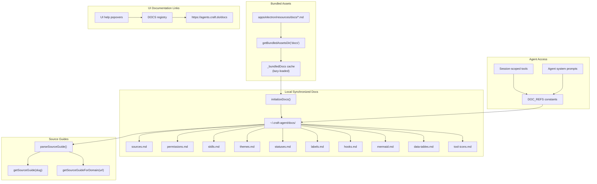
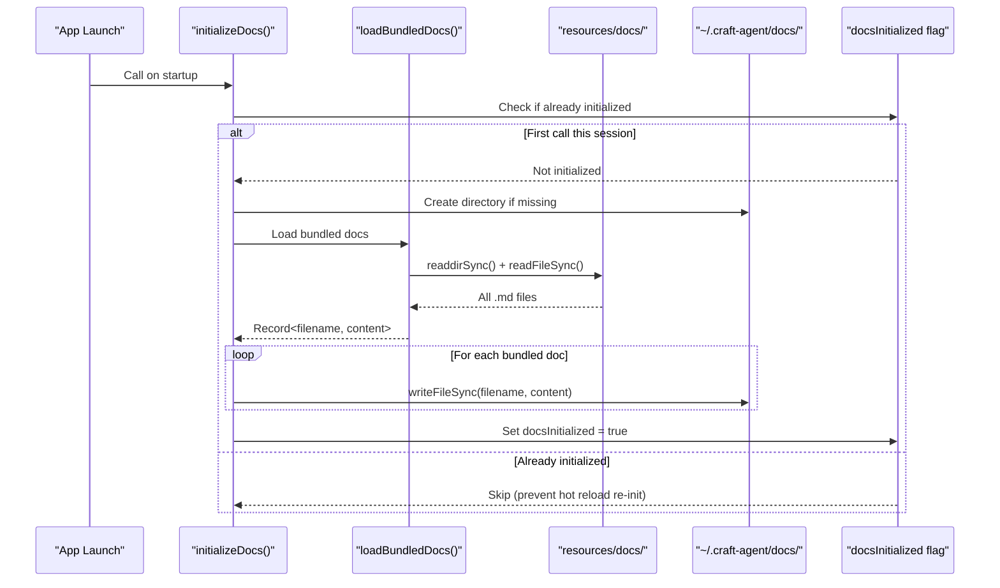
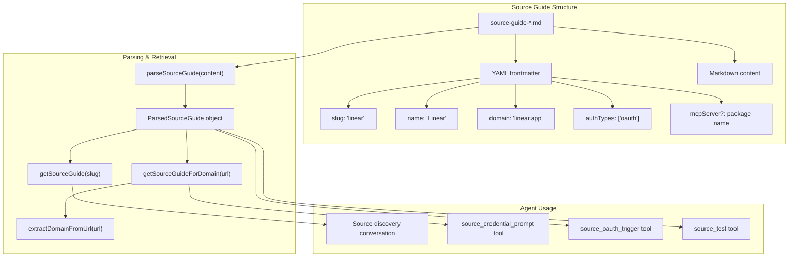
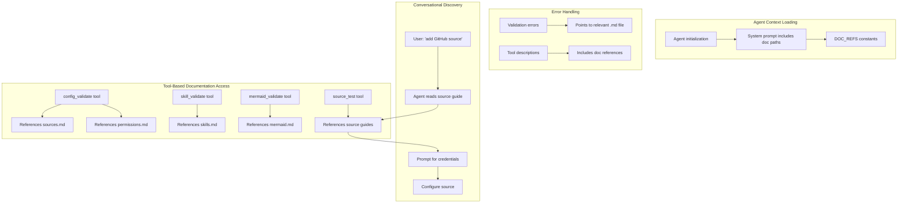
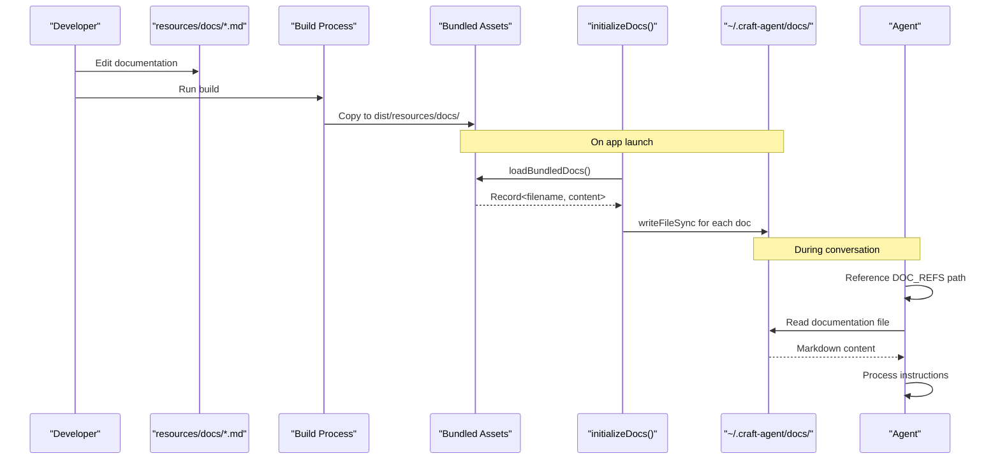

# Documentation System

<details>
<summary>Relevant source files</summary>

The following files were used as context for generating this wiki page:

- [packages/shared/src/docs/doc-links.ts](packages/shared/src/docs/doc-links.ts)
- [packages/shared/src/docs/index.ts](packages/shared/src/docs/index.ts)

</details>

## Purpose and Scope

The Documentation System provides built-in reference material that agents use when performing configuration tasks, along with contextual help links for users in the UI. The system manages two types of documentation: (1) markdown files stored at `~/.craft-agent/docs/` that agents can read to understand how to configure sources, skills, permissions, and other features, and (2) online documentation links with summaries displayed in UI help popovers.

This page focuses on the technical architecture of documentation storage, bundling, and access. For information about how agents integrate with tools and sources, see [Agent System](#2.3). For details on workspace configuration files, see [Storage & Configuration](#2.8).

---

## Documentation Architecture Overview

The documentation system operates in three layers: bundled assets stored with the application, a synchronized local copy at `~/.craft-agent/docs/`, and remote online documentation for user reference.



**Sources:** [packages/shared/src/docs/index.ts:1-183]()

---

## Documentation File Types

The system maintains several categories of documentation files that serve different purposes for agents and users.

| File Name        | Purpose                                     | Referenced By                          | Key Content                                                       |
| ---------------- | ------------------------------------------- | -------------------------------------- | ----------------------------------------------------------------- |
| `sources.md`     | Guide for connecting external data sources  | `config_validate`, `source_test` tools | MCP server setup, REST API configuration, local filesystem access |
| `permissions.md` | Explanation of permission modes             | Agent system prompts                   | Safe mode, Ask to Edit, Allow All behavior                        |
| `skills.md`      | How to create and use reusable instructions | `skill_validate` tool                  | SKILL.md format, @mention syntax, parameter binding               |
| `themes.md`      | Theme customization reference               | UI settings, agents                    | 6-color system, theme.json structure, preset themes               |
| `statuses.md`    | Status workflow configuration               | Agents, UI                             | Open/closed states, custom status definitions                     |
| `labels.md`      | Label system and auto-apply rules           | Agents, UI                             | Hierarchical labels, regex matchers, typed values                 |
| `hooks.md`       | Event-driven automation guide               | Agents                                 | Hook configuration, event types, command/prompt actions           |
| `mermaid.md`     | Mermaid diagram syntax reference            | `mermaid_validate` tool                | Supported diagram types, syntax examples                          |
| `data-tables.md` | Data table formatting guide                 | Agents                                 | Structured data presentation                                      |
| `tool-icons.md`  | Custom tool icon configuration              | Agents, UI                             | Icon mapping for MCP tools                                        |

**Sources:** [packages/shared/src/docs/index.ts:101-114]()

---

## Documentation Initialization Process

Documentation files are synchronized from bundled assets to the local filesystem on every application launch, ensuring consistency between the running version and available documentation.



The initialization process uses several key functions:

- **`initializeDocs()`** [packages/shared/src/docs/index.ts:135-158]() - Main entry point, called once per application launch
- **`getBundledDocs()`** [packages/shared/src/docs/index.ts:72-77]() - Lazy-loads bundled docs cache after `setBundledAssetsRoot()` is called
- **`loadBundledDocs()`** [packages/shared/src/docs/index.ts:37-61]() - Auto-discovers and reads all files from the bundled docs directory
- **`getAssetsDir()`** [packages/shared/src/docs/index.ts:26-30]() - Resolves the bundled docs path for all environments (dev, bundled, packaged)

The lazy loading pattern is critical: bundled docs must not be loaded at module initialization because `setBundledAssetsRoot()` hasn't been called yet. Loading eagerly would result in empty documentation on fresh installations.

**Sources:** [packages/shared/src/docs/index.ts:20-77](), [packages/shared/src/docs/index.ts:135-158]()

---

## Documentation Path References

The system provides typed constants for documentation paths used throughout the codebase, ensuring consistency when agents reference documentation in error messages and tool descriptions.

```typescript
// From packages/shared/src/docs/index.ts
export const APP_ROOT = '~/.craft-agent'

export const DOC_REFS = {
  appRoot: APP_ROOT,
  sources: `${APP_ROOT}/docs/sources.md`,
  permissions: `${APP_ROOT}/docs/permissions.md`,
  skills: `${APP_ROOT}/docs/skills.md`,
  themes: `${APP_ROOT}/docs/themes.md`,
  statuses: `${APP_ROOT}/docs/statuses.md`,
  labels: `${APP_ROOT}/docs/labels.md`,
  toolIcons: `${APP_ROOT}/docs/tool-icons.md`,
  hooks: `${APP_ROOT}/docs/hooks.md`,
  mermaid: `${APP_ROOT}/docs/mermaid.md`,
  dataTables: `${APP_ROOT}/docs/data-tables.md`,
  docsDir: `${APP_ROOT}/docs/`,
} as const
```

These constants are used in:

- **Tool descriptions** - Session-scoped tools reference specific docs when prompting agents
- **Error messages** - Validation failures point users to relevant documentation
- **System prompts** - Agent initialization includes references to available docs
- **UI components** - Settings panels link to appropriate documentation

**Utility functions:**

| Function               | Purpose                         | Returns                |
| ---------------------- | ------------------------------- | ---------------------- |
| `getDocsDir()`         | Get the docs directory path     | `~/.craft-agent/docs`  |
| `getDocPath(filename)` | Get path to a specific doc file | Full path to file      |
| `docsExist()`          | Check if docs directory exists  | boolean                |
| `listDocs()`           | List available doc files        | Array of .md filenames |

**Sources:** [packages/shared/src/docs/index.ts:93-130]()

---

## Source Guides System

Source guides are specialized documentation files that provide agents with instructions for connecting to specific external services. These guides are stored alongside other documentation and include structured frontmatter for metadata.



**Key types and interfaces:**

```typescript
interface SourceGuideFrontmatter {
  slug: string // Unique identifier (e.g., 'linear')
  name: string // Display name (e.g., 'Linear')
  domain?: string // Primary domain for URL matching
  authTypes?: string[] // Supported auth methods
  mcpServer?: string // MCP package name if applicable
}

interface ParsedSourceGuide {
  frontmatter: SourceGuideFrontmatter
  content: string // Full markdown content
}
```

**Parsing and retrieval functions:**

- **`parseSourceGuide(content)`** - Extracts YAML frontmatter and markdown content from a source guide
- **`getSourceGuide(slug)`** - Retrieves a guide by its slug identifier
- **`getSourceGuideForDomain(url)`** - Finds the appropriate guide based on a URL's domain
- **`getSourceKnowledge()`** - Returns aggregated knowledge about all available source guides
- **`extractDomainFromSource(source)`** - Extracts domain from a source configuration
- **`extractDomainFromUrl(url)`** - Parses domain from a URL string

Agents use source guides during conversational source discovery. When a user says "add Linear as a source," the agent reads the Linear guide to understand authentication requirements, MCP server setup, and configuration options.

**Sources:** [packages/shared/src/docs/index.ts:163-173]()

---

## UI Documentation Links

The UI documentation system provides contextual help throughout the interface with summaries and links to online documentation.

```mermaid
graph TB
    subgraph "Documentation Registry"
        DocsRegistry["DOCS: Record<DocFeature, DocInfo>"]

        DocsRegistry --> Sources["sources: overview"]
        DocsRegistry --> SourcesAPI["sources-api: APIs"]
        DocsRegistry --> SourcesMCP["sources-mcp: MCP Servers"]
        DocsRegistry --> SourcesLocal["sources-local: Local Folders"]
        DocsRegistry --> Skills["skills: overview"]
        DocsRegistry --> Statuses["statuses: overview"]
        DocsRegistry --> Permissions["permissions: core-concepts"]
        DocsRegistry --> Labels["labels: overview"]
        DocsRegistry --> Workspaces["workspaces: go-further"]
        DocsRegistry --> Themes["themes: go-further"]
        DocsRegistry --> AppSettings["app-settings: config"]
        DocsRegistry --> Preferences["preferences: config"]
    end

    subgraph "DocInfo Structure"
        DocInfo["DocInfo interface"]

        DocInfo --> Path["path: string"]
        DocInfo --> Title["title: string"]
        DocInfo --> Summary["summary: string (1-2 sentences)"]
    end

    subgraph "UI Components"
        HelpButton["Help button/icon"]
        Popover["Help popover"]
        LearnMore["Learn more link"]

        HelpButton --> Popover
        Popover --> Summary
        Popover --> LearnMore
        LearnMore --> OnlineDocs["https://agents.craft.do/docs"]
    end

    subgraph "API Functions"
        GetDocUrl["getDocUrl(feature)"]
        GetDocInfo["getDocInfo(feature)"]

        DocsRegistry --> GetDocUrl
        DocsRegistry --> GetDocInfo
        GetDocUrl --> FullURL["Full URL string"]
        GetDocInfo --> DocInfo
    end
```



**DocFeature types:**

| Feature         | Path                            | Use Case                        |
| --------------- | ------------------------------- | ------------------------------- |
| `sources`       | `/sources/overview`             | Main sources configuration page |
| `sources-api`   | `/sources/apis/overview`        | REST API configuration          |
| `sources-mcp`   | `/sources/mcp-servers/overview` | MCP server setup                |
| `sources-local` | `/sources/local-filesystems`    | Local folder access             |
| `skills`        | `/skills/overview`              | Skill creation and usage        |
| `statuses`      | `/statuses/overview`            | Status workflow configuration   |
| `permissions`   | `/core-concepts/permissions`    | Permission mode explanation     |
| `labels`        | `/labels/overview`              | Label system and auto-apply     |
| `workspaces`    | `/go-further/workspaces`        | Workspace isolation             |
| `themes`        | `/go-further/themes`            | Theme customization             |
| `app-settings`  | `/reference/config/config-file` | Global settings                 |
| `preferences`   | `/reference/config/preferences` | User preferences                |

**Example usage in UI:**

```typescript
import { getDocUrl, getDocInfo } from '@craft-agent/shared/docs'

// Display help popover
const info = getDocInfo('sources')
// info.title: "Sources"
// info.summary: "Connect external data like MCP servers..."

// Open documentation
const url = getDocUrl('sources')
// url: "https://agents.craft.do/docs/sources/overview"
```

The online documentation is separate from the bundled markdown files. Bundled docs are for agent reference, while online docs provide comprehensive user guides with examples, screenshots, and detailed explanations.

**Sources:** [packages/shared/src/docs/doc-links.ts:1-119]()

---

## Agent Usage Patterns

Agents reference documentation through multiple mechanisms during conversations.



**Documentation reference patterns:**

1. **System Prompts** - Agent initialization includes references to `DOC_REFS.docsDir` and specific documentation files
2. **Tool Descriptions** - Session-scoped tools include phrases like "See ~/.craft-agent/docs/sources.md for details"
3. **Error Messages** - Validation failures return messages that reference specific documentation paths
4. **Conversational Discovery** - Agents read source guides to understand how to configure new integrations
5. **Validation Tools** - Tools like `config_validate` check configurations against documentation-defined schemas

**Example: Source Configuration Flow**

When an agent configures a new source, it:

1. Reads `DOC_REFS.sources` to understand source types (MCP, REST, local)
2. Calls `getSourceGuide(slug)` to retrieve service-specific instructions
3. Uses `source_credential_prompt` to gather authentication details (references doc for auth types)
4. Calls `source_test` to validate the configuration (references doc for expected results)
5. If validation fails, error messages point to specific sections of the documentation

**Sources:** [packages/shared/src/docs/index.ts:93-114](), [packages/shared/src/docs/index.ts:163-173]()

---

## Documentation Update Flow

Documentation updates follow a specific path from source files to agent access.



**Key characteristics:**

- **Source of truth:** Documentation source files live in [apps/electron/resources/docs/]() for easier editing during development
- **Build-time copying:** Build process copies docs to `dist/resources/docs/`
- **Launch-time sync:** Every app launch syncs bundled docs to `~/.craft-agent/docs/`
- **No hot reload:** Documentation changes require app restart (controlled by `docsInitialized` flag)
- **Version consistency:** Syncing on launch ensures docs match the running app version

This approach prevents stale documentation when users update the application, while maintaining a stable local path (`~/.craft-agent/docs/`) that agents can reference consistently.

**Sources:** [packages/shared/src/docs/index.ts:1-9](), [packages/shared/src/docs/index.ts:135-158]()
