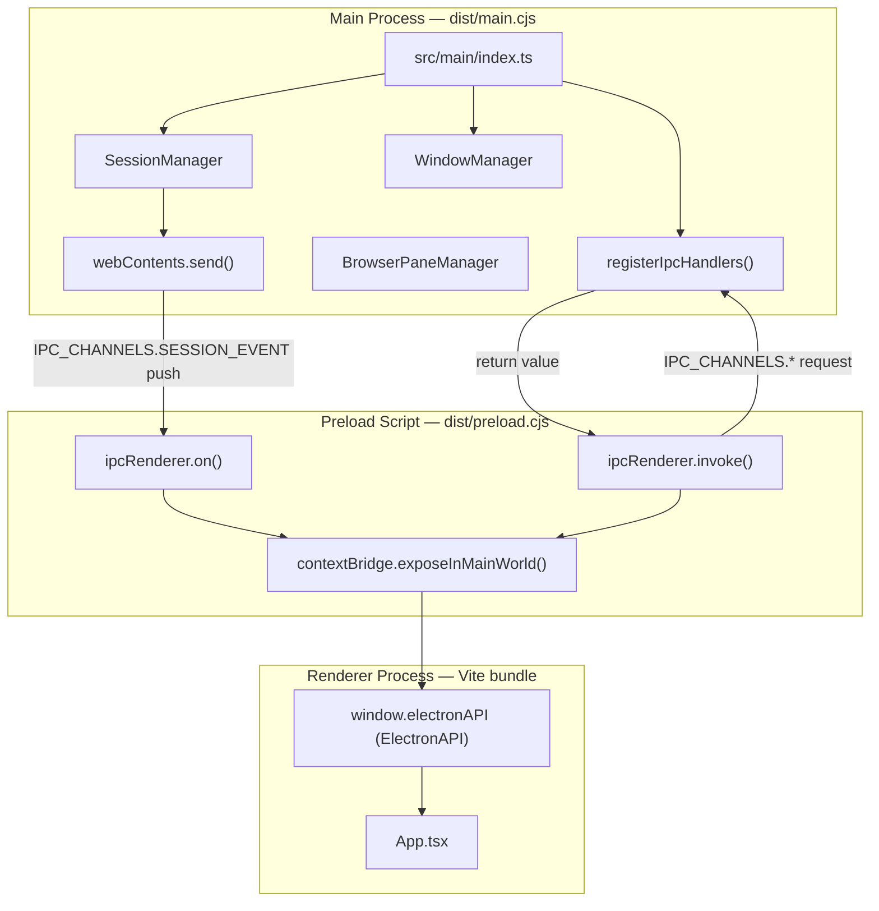
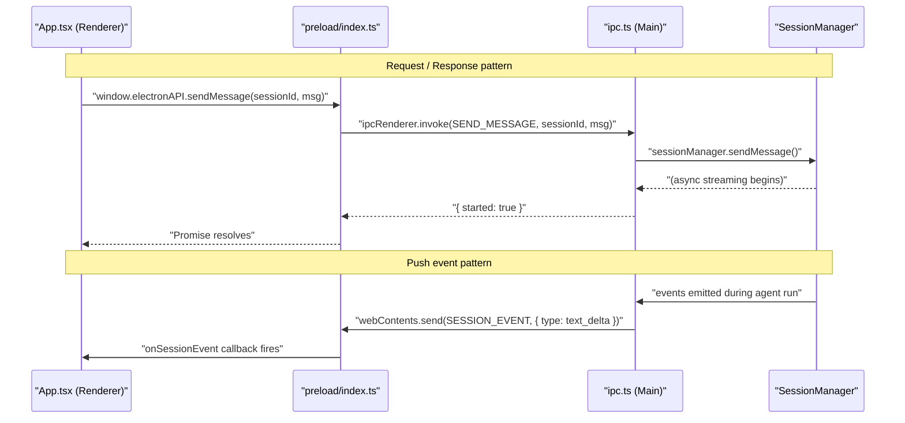
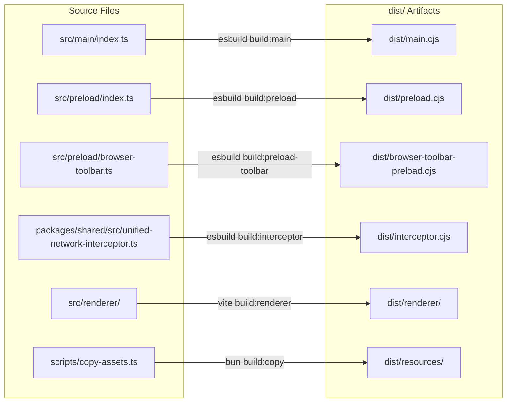

# Electron Application Architecture

<details>
<summary>Relevant source files</summary>

The following files were used as context for generating this wiki page:

- [apps/electron/package.json](apps/electron/package.json)
- [apps/electron/src/main/ipc.ts](apps/electron/src/main/ipc.ts)
- [apps/electron/src/preload/index.ts](apps/electron/src/preload/index.ts)
- [apps/electron/src/renderer/App.tsx](apps/electron/src/renderer/App.tsx)
- [apps/electron/src/shared/types.ts](apps/electron/src/shared/types.ts)

</details>

This page describes the internal structure of the `@craft-agent/electron` application: how its three Electron processes are organized, which code runs in each, how the preload `contextBridge` bridges them, the role of the network interceptor, and how the build pipeline produces each artifact.

For the complete IPC channel reference, see [IPC Communication Layer](#2.6). For the React UI components rendered inside the renderer process, see [UI Components & Layout](#2.5). For the monorepo package layout that `@craft-agent/electron` depends on, see [Package Structure](#2.1).

---

## The Three-Process Model

Electron isolates application code across three distinct OS process types, each with different capabilities.

| Process  | Source Entry Point     | Compiled Artifact       | Runtime Context            |
| -------- | ---------------------- | ----------------------- | -------------------------- |
| Main     | `src/main/index.ts`    | `dist/main.cjs`         | Full Node.js               |
| Preload  | `src/preload/index.ts` | `dist/preload.cjs`      | Sandboxed Node.js (no DOM) |
| Renderer | `src/renderer/`        | `dist/renderer/` (Vite) | Chromium (no Node.js)      |

A second preload script, `src/preload/browser-toolbar.ts` → `dist/browser-toolbar-preload.cjs`, is attached specifically to embedded browser pane `WebContentsView` instances managed by `BrowserPaneManager`.

**Diagram: Three-process model and key code entities**



Sources: [apps/electron/package.json:5-36](), [apps/electron/src/preload/index.ts:1-627](), [apps/electron/src/main/ipc.ts:138-143]()

---

### Main Process

The main process has full Node.js and native Electron API access. It is the only process that can touch the filesystem directly, spawn subprocesses, or manage OS-level resources.

Key responsibilities:

- **Window management**: `WindowManager` creates and tracks `BrowserWindow` instances, mapping each window to a workspace ID. It handles workspace switching and multi-window coordination.
- **Session orchestration**: `SessionManager` is the central hub — it loads JSONL session history, routes user messages to AI agent backends, and streams events back to renderer windows via `webContents.send()`.
- **IPC handling**: `registerIpcHandlers()` in `src/main/ipc.ts` registers all `ipcMain.handle()` listeners, delegating to `SessionManager`, `WindowManager`, and `BrowserPaneManager` as needed.
- **Browser pane management**: `BrowserPaneManager` manages embedded `WebContentsView` instances for the in-app browser feature.

The main process entry point is `src/main/index.ts`; Electron finds it via `"main": "dist/main.cjs"` in `package.json`.

Sources: [apps/electron/package.json:5-6](), [apps/electron/src/main/ipc.ts:138-143]()

---

### Preload Script

The preload script runs before the renderer page loads. It has access to Node.js APIs (in Electron's isolated world) but shares the same origin as the web page. Its sole job is constructing a safe, typed bridge between the main process and the renderer.

The critical line is at [apps/electron/src/preload/index.ts:627]():

```
contextBridge.exposeInMainWorld('electronAPI', api)
```

This places the `api` object on `window.electronAPI` in the renderer. The `api` object is typed as `ElectronAPI` (declared in `src/shared/types.ts`). Only explicitly listed methods are exposed; no Node.js APIs leak into the renderer.

Every method in `api` is one of two patterns:

- **Request/Response**: calls `ipcRenderer.invoke(IPC_CHANNELS.*)`, returns a `Promise` resolved by the main process handler.
- **Subscription**: calls `ipcRenderer.on(IPC_CHANNELS.*)`, invokes a callback on each push event, and returns a cleanup function.

Sources: [apps/electron/src/preload/index.ts:1-627]()

---

### Renderer Process

The renderer is a standard Chromium process running a React application. It has no Node.js access whatsoever and imports no Node.js modules. All system interaction flows through `window.electronAPI`.

The root component is `App` in `src/renderer/App.tsx`. On mount it:

1. Calls `window.electronAPI.getWindowWorkspace()` to learn which workspace this window is associated with.
2. Calls `window.electronAPI.getSessions()` to load session metadata (waiting until initialized).
3. Subscribes to `window.electronAPI.onSessionEvent(callback)` to receive streaming agent events.
4. Uses Jotai atoms — `sessionAtomFamily`, `sessionMetaMapAtom`, `backgroundTasksAtomFamily` — to distribute session state to descendant components without prop drilling.

Sources: [apps/electron/src/renderer/App.tsx:145-490](), [apps/electron/src/renderer/App.tsx:527-770]()

---

## The `contextBridge` and `ElectronAPI`

The `ElectronAPI` interface in `src/shared/types.ts` is the complete typed contract between the renderer and the main process. It declares every callable method and subscribable event.

**Diagram: Request/response and push-event IPC flows**



Sources: [apps/electron/src/preload/index.ts:14](), [apps/electron/src/main/ipc.ts:313-340](), [apps/electron/src/renderer/App.tsx:634-756]()

---

### Request/Response Channels

These use `ipcMain.handle()` (main) paired with `ipcRenderer.invoke()` (preload). The renderer awaits a typed `Promise`; the handler's return value resolves it.

| Category                 | Key `IPC_CHANNELS` Constants                                                                  | Delegated To                       |
| ------------------------ | --------------------------------------------------------------------------------------------- | ---------------------------------- |
| Session management       | `GET_SESSIONS`, `CREATE_SESSION`, `SEND_MESSAGE`, `CANCEL_PROCESSING`, `GET_SESSION_MESSAGES` | `SessionManager` methods           |
| Consolidated session ops | `SESSION_COMMAND` (dispatched on `command.type`)                                              | `SessionManager` methods           |
| Workspace management     | `GET_WORKSPACES`, `CREATE_WORKSPACE`, `SWITCH_WORKSPACE`, `CHECK_WORKSPACE_SLUG`              | Config functions + `WindowManager` |
| Window control           | `GET_WINDOW_WORKSPACE`, `CLOSE_WINDOW`, `WINDOW_CONFIRM_CLOSE`, `OPEN_SESSION_IN_NEW_WINDOW`  | `WindowManager`                    |
| File I/O                 | `READ_FILE`, `READ_FILE_DATA_URL`, `READ_FILE_BINARY`, `STORE_ATTACHMENT`, `OPEN_FILE_DIALOG` | Inline in `ipc.ts`                 |
| Onboarding & auth        | `ONBOARDING_GET_AUTH_STATE`, `SETUP_LLM_CONNECTION`, `LLM_CONNECTION_TEST`                    | `registerOnboardingHandlers`       |
| System utilities         | `GET_HOME_DIR`, `IS_DEBUG_MODE`, `GET_SYSTEM_THEME`, `GET_GIT_BRANCH`                         | Inline in `ipc.ts`                 |
| Auto-update              | `UPDATE_CHECK`, `UPDATE_INSTALL`, `UPDATE_DISMISS`                                            | `auto-update` module               |

All channel name constants live in the `IPC_CHANNELS` object declared at [apps/electron/src/shared/types.ts:595-931]().

Sources: [apps/electron/src/main/ipc.ts:138-1062](), [apps/electron/src/shared/types.ts:595-931]()

### Push Event Channels

These use `webContents.send()` from the main process and `ipcRenderer.on()` in the preload. The renderer registers callbacks via `window.electronAPI.on*()` methods, each returning a cleanup function.

| `IPC_CHANNELS` Constant                     | Payload Type                    | Triggering Condition                                                  |
| ------------------------------------------- | ------------------------------- | --------------------------------------------------------------------- |
| `SESSION_EVENT`                             | `SessionEvent` (30+ variants)   | Agent streaming, tool use, completion, permission/credential requests |
| `SESSIONS_UNREAD_SUMMARY_CHANGED`           | `UnreadSummary`                 | Unread session count changes                                          |
| `SOURCES_CHANGED`                           | `(workspaceId, LoadedSource[])` | Source config file changes on disk                                    |
| `SKILLS_CHANGED`                            | `(workspaceId, LoadedSkill[])`  | Skill file changes on disk                                            |
| `STATUSES_CHANGED`                          | `workspaceId`                   | Status config or icon files change                                    |
| `LABELS_CHANGED`                            | `workspaceId`                   | Labels config changes                                                 |
| `AUTOMATIONS_CHANGED`                       | `workspaceId`                   | `automations.json` changes                                            |
| `THEME_APP_CHANGED`                         | `ThemeOverrides \| null`        | App-level `theme.json` changes                                        |
| `LLM_CONNECTIONS_CHANGED`                   | —                               | Connections modified or models refreshed                              |
| `MENU_NEW_CHAT`, `MENU_OPEN_SETTINGS`, etc. | —                               | Native menu bar item clicks                                           |
| `DEEP_LINK_NAVIGATE`                        | `DeepLinkNavigation`            | External `craftagents://` URL received                                |
| `WINDOW_CLOSE_REQUESTED`                    | —                               | Window close button or Cmd+W intercepted                              |

`SessionEvent` is a large discriminated union covering text deltas, tool lifecycle events, metadata changes, permission requests, compaction status, and more, defined at [apps/electron/src/shared/types.ts:480-532]().

Sources: [apps/electron/src/shared/types.ts:480-532](), [apps/electron/src/shared/types.ts:636-930](), [apps/electron/src/preload/index.ts:57-76]()

### `SESSION_COMMAND` Consolidation

Many per-session operations are routed through a single `SESSION_COMMAND` channel rather than individual channels. The `SessionCommand` discriminated union at [apps/electron/src/shared/types.ts:554-582]() defines every supported command type. The main-process handler at [apps/electron/src/main/ipc.ts:390-468]() switches on `command.type` and delegates to the appropriate `SessionManager` method.

Selected command types: `flag`, `unflag`, `archive`, `unarchive`, `rename`, `setSessionStatus`, `markRead`, `markUnread`, `setActiveViewing`, `setPermissionMode`, `setThinkingLevel`, `setSources`, `setLabels`, `shareToViewer`, `revokeShare`, `setConnection`, `refreshTitle`.

Sources: [apps/electron/src/shared/types.ts:554-582](), [apps/electron/src/main/ipc.ts:390-468]()

---

## Network Interceptor

The `unified-network-interceptor` is compiled as a self-contained standalone bundle, distinct from both the main and preload bundles:

```
packages/shared/src/unified-network-interceptor.ts → dist/interceptor.cjs
```

The build uses esbuild targeting Node.js CJS format without `--external:electron`, so all dependencies are bundled inline. This allows it to be loaded dynamically by the main process independently of the main bundle lifecycle.

Sources: [apps/electron/package.json:22]()

---

## Build Pipeline

The full build is orchestrated by the `build` script in `apps/electron/package.json`, which chains seven ordered steps. On Windows, `build:win` substitutes `build:main:win` (without OAuth env injection) for the main process step.

**Diagram: Build pipeline — source files to dist artifacts**



Sources: [apps/electron/package.json:17-36]()

### Step Reference

| Script                  | Tool    | Input                            | Output                             | Notable Flags                                                                              |
| ----------------------- | ------- | -------------------------------- | ---------------------------------- | ------------------------------------------------------------------------------------------ |
| `build:main`            | esbuild | `src/main/index.ts`              | `dist/main.cjs`                    | `--platform=node --format=cjs --external:electron`; OAuth env vars injected via `--define` |
| `build:main:win`        | esbuild | `src/main/index.ts`              | `dist/main.cjs`                    | Same as above but without `--define` flags (Windows)                                       |
| `build:preload`         | esbuild | `src/preload/index.ts`           | `dist/preload.cjs`                 | `--platform=node --format=cjs --external:electron`                                         |
| `build:preload-toolbar` | esbuild | `src/preload/browser-toolbar.ts` | `dist/browser-toolbar-preload.cjs` | Same as preload                                                                            |
| `build:interceptor`     | esbuild | `unified-network-interceptor.ts` | `dist/interceptor.cjs`             | No `--external:electron`; fully self-contained                                             |
| `build:renderer`        | Vite    | `src/renderer/`                  | `dist/renderer/`                   | Standard React/TypeScript SPA                                                              |
| `build:copy`            | Bun     | Asset sources                    | `dist/resources/`                  | Copies bundled docs, native binaries, etc.                                                 |
| `build:validate`        | Bun     | `dist/`                          | —                                  | Asserts all required artifacts exist                                                       |

### OAuth Credential Injection

The `build:main` script injects OAuth secrets at compile time using esbuild `--define` flags, replacing `process.env.*` references in the source with literal string values from the build environment:

- `GOOGLE_OAUTH_CLIENT_ID` / `GOOGLE_OAUTH_CLIENT_SECRET`
- `SLACK_OAUTH_CLIENT_ID` / `SLACK_OAUTH_CLIENT_SECRET`
- `MICROSOFT_OAUTH_CLIENT_ID`

Values are read from the shell environment (sourced from `.env` if present). On Windows (`build:main:win`), these flags are absent and OAuth credentials must be supplied by other means. See [Build System](#5.2) for platform-specific packaging details.

Sources: [apps/electron/package.json:18-19]()

### Development Mode

During development, `vite dev` runs a hot-reloading dev server for the renderer only. The main and preload scripts must be rebuilt manually. Electron loads the dev server URL instead of the static `dist/renderer/` directory.

Sources: [apps/electron/package.json:30]()

---

## Internal Package Dependencies

The `@craft-agent/electron` package declares three internal workspace packages as dependencies:

| Package               | Role in Electron App                                                                                        |
| --------------------- | ----------------------------------------------------------------------------------------------------------- |
| `@craft-agent/core`   | Core types (`Message`, `SessionMetadata`, `Workspace`, `ToolDisplayMeta`, etc.) shared across all processes |
| `@craft-agent/shared` | Config management, credential handling, agent logic, source/skill loading — used by the main process        |
| `@craft-agent/ui`     | Shared React component library used exclusively in the renderer                                             |

The `src/shared/types.ts` file at [apps/electron/src/shared/types.ts:1-44]() re-exports types from `@craft-agent/core` and `@craft-agent/shared` into a single module used by both the main process and renderer, keeping the IPC contract in one place.

For a full breakdown of all packages and their interdependencies, see [Package Structure](#2.1).

Sources: [apps/electron/package.json:38-41](), [apps/electron/src/shared/types.ts:1-61]()
