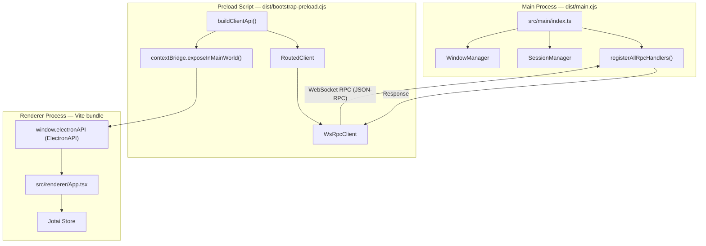
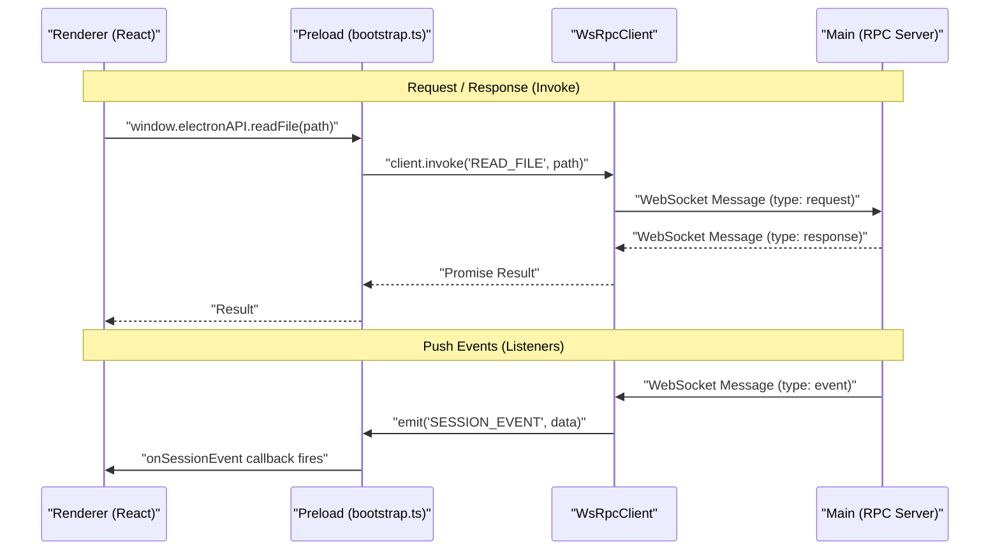
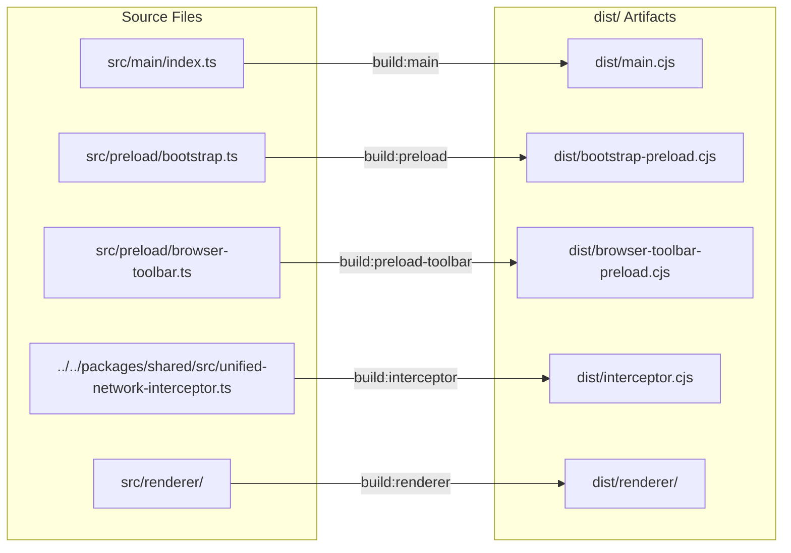

# Electron Application Architecture

<details>
<summary>Relevant source files</summary>

The following files were used as context for generating this wiki page:

- [apps/electron/package.json](apps/electron/package.json)
- [apps/electron/src/preload/bootstrap.ts](apps/electron/src/preload/bootstrap.ts)
- [apps/electron/src/renderer/App.tsx](apps/electron/src/renderer/App.tsx)

</details>


This page describes the internal structure of the `@craft-agent/electron` application: how its three Electron processes are organized, which code runs in each, how the preload `contextBridge` bridges them, the role of the network interceptor, and how the build pipeline produces each artifact.

For the complete IPC channel reference, see [IPC Communication Layer](#2.6). For the React UI components rendered inside the renderer process, see [UI Components & Layout](#2.5). For the monorepo package layout that `@craft-agent/electron` depends on, see [Package Structure](#2.1).

---

## The Three-Process Model

Electron isolates application code across three distinct OS process types, each with different capabilities. The architecture supports both a local mode (where the main process handles requests) and a thin-client mode (where the renderer connects to a remote server via WebSockets).

| Process | Source Entry Point | Compiled Artifact | Runtime Context |
|---|---|---|---|
| Main | `src/main/index.ts` | `dist/main.cjs` | Full Node.js |
| Preload | `src/preload/bootstrap.ts` | `dist/bootstrap-preload.cjs` | Sandboxed Node.js (no DOM) |
| Renderer | `src/renderer/App.tsx` | `dist/renderer/` (Vite) | Chromium (no Node.js) |

A second preload script, `src/preload/browser-toolbar.ts` → `dist/browser-toolbar-preload.cjs`, is attached specifically to embedded browser pane `WebContentsView` instances.

**Diagram: Three-process model and key code entities**



Sources: [apps/electron/package.json:5-36](), [apps/electron/src/preload/bootstrap.ts:1-180](), [apps/electron/src/renderer/App.tsx:11-66]()

---

### Main Process

The main process has full Node.js and native Electron API access. It is the only process that can touch the filesystem directly, spawn subprocesses, or manage OS-level resources. It initializes the local RPC server and manages the lifecycle of the application.

Key responsibilities:
- **Window management**: Orchestrates `BrowserWindow` instances and handles workspace-specific window states.
- **Session orchestration**: Uses `SessionManager` to load JSONL session history and route user messages to AI agent backends.
- **RPC handling**: Registers the logic that responds to renderer requests via WebSocket-based JSON-RPC.
- **Native Capabilities**: Provides the renderer with access to OS dialogs and shell operations (e.g., `shell.openExternal`, `shell.showItemInFolder`) via `ipcRenderer.invoke` calls in the preload [apps/electron/src/preload/bootstrap.ts:160-177]().

The main process entry point is `src/main/index.ts`; Electron finds it via `"main": "dist/main.cjs"` in `package.json` [apps/electron/package.json:5-6]().

Sources: [apps/electron/package.json:5-6](), [apps/electron/src/preload/bootstrap.ts:160-177]()

---

### Preload Script

The preload script (`src/preload/bootstrap.ts`) runs before the renderer page loads. It constructs a safe, typed bridge between the main process and the renderer using `contextBridge`. 

In this architecture, the preload script initializes a `WsRpcClient` or a `RoutedClient` [apps/electron/src/preload/bootstrap.ts:58-154](). 
- **Local Mode**: Uses `RoutedClient` to route `LOCAL_ONLY` channels to the local Electron server and `REMOTE_ELIGIBLE` channels to the workspace owner (local or remote) [apps/electron/src/preload/bootstrap.ts:94-154]().
- **Thin-client Mode**: Uses a single `WsRpcClient` connected directly to a remote `CRAFT_SERVER_URL` [apps/electron/src/preload/bootstrap.ts:60-91]().

The `buildClientApi` function uses the `CHANNEL_MAP` to proxy calls from `window.electronAPI` into the underlying transport client [apps/electron/src/preload/bootstrap.ts:180-184]().

Sources: [apps/electron/src/preload/bootstrap.ts:1-184]()

---

### Renderer Process

The renderer is a standard Chromium process running a React application. It has no Node.js access and interacts with the system via `window.electronAPI`.

The renderer maintains application state using **Jotai atoms**. For example, `sessionAtomFamily` and `backgroundTasksAtomFamily` manage the lifecycle and progress of active sessions and agent tools [apps/electron/src/renderer/App.tsx:34-47](). The `handleBackgroundTaskEvent` function specifically updates these atoms based on events like `task_backgrounded` or `task_progress` received from the agent [apps/electron/src/renderer/App.tsx:79-150]().

Sources: [apps/electron/src/renderer/App.tsx:34-150]()

---

## The `contextBridge` and `ElectronAPI`

The `ElectronAPI` interface is the typed contract between the renderer and the main process. The `CHANNEL_MAP` defines how each method in `ElectronAPI` maps to an RPC channel.

**Diagram: Request/response and push-event RPC flows**



Sources: [apps/electron/src/preload/bootstrap.ts:157-184]()

---

## Network Interceptor

The `unified-network-interceptor` is compiled as a self-contained standalone bundle:

```
packages/shared/src/unified-network-interceptor.ts → dist/interceptor.cjs
```

It is built with `esbuild` targeting the Node.js platform. Unlike the main and preload builds, it does not mark `electron` as external because it functions as a standalone utility used for monitoring or modifying network traffic across the application [apps/electron/package.json:22]().

Sources: [apps/electron/package.json:22]()

---

## Build Pipeline

The build is orchestrated by scripts in `apps/electron/package.json`. It produces multiple artifacts required for the application to function.

**Diagram: Build pipeline — source files to dist artifacts**



Sources: [apps/electron/package.json:17-27]()

### Step Reference

| Script | Tool | Input | Output | Notable Flags |
|---|---|---|---|---|
| `build:main` | esbuild | `src/main/index.ts` | `dist/main.cjs` | `--platform=node --format=cjs --external:electron`; Injects OAuth secrets via `--define` [apps/electron/package.json:18]() |
| `build:preload` | esbuild | `src/preload/bootstrap.ts` | `dist/bootstrap-preload.cjs` | `--platform=node --format=cjs --external:electron` [apps/electron/package.json:20]() |
| `build:interceptor` | esbuild | `unified-network-interceptor.ts` | `dist/interceptor.cjs` | Self-contained Node.js bundle [apps/electron/package.json:22]() |
| `build:renderer` | Vite | `src/renderer/` | `dist/renderer/` | Standard Vite build [apps/electron/package.json:23]() |
| `build:copy` | Bun | Assets | `dist/` | Copies required resources and vendor binaries [apps/electron/package.json:24]() |

### OAuth Credential Injection

The `build:main` script injects OAuth client IDs and secrets at compile time using `esbuild`'s `--define` feature. This bakes sensitive credentials directly into the `main.cjs` bundle for Google, Slack, and Microsoft OAuth flows, ensuring they are available to the `CredentialManager` in the main process [apps/electron/package.json:18]().

Sources: [apps/electron/package.json:18-19]()