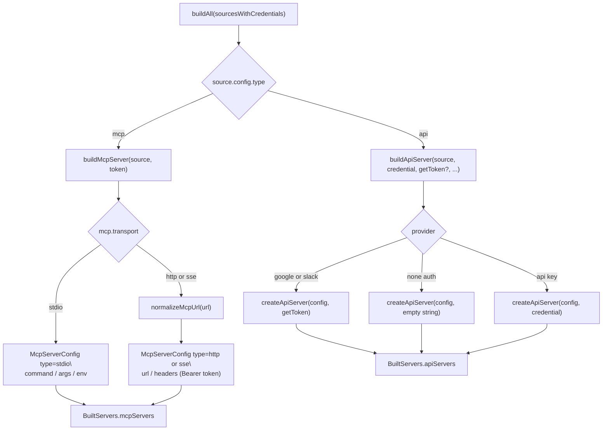
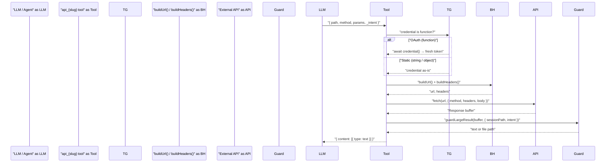
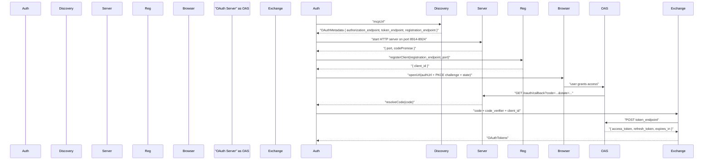
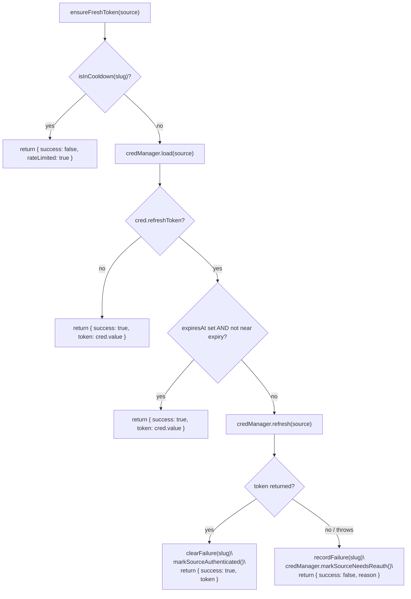
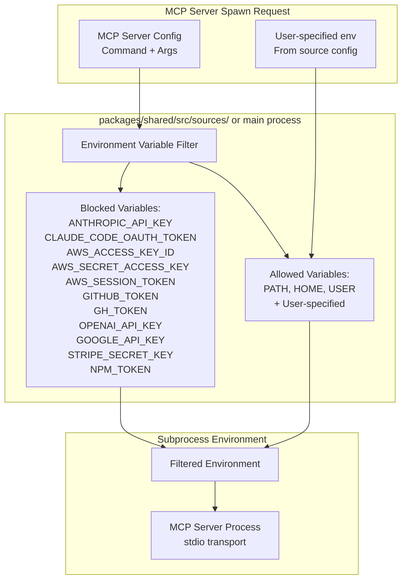

# External Service Integration

<details>
<summary>Relevant source files</summary>

The following files were used as context for generating this wiki page:

- [README.md](README.md)
- [packages/shared/src/auth/oauth.ts](packages/shared/src/auth/oauth.ts)
- [packages/shared/src/sources/api-tools.ts](packages/shared/src/sources/api-tools.ts)
- [packages/shared/src/sources/server-builder.ts](packages/shared/src/sources/server-builder.ts)
- [packages/shared/src/sources/token-refresh-manager.ts](packages/shared/src/sources/token-refresh-manager.ts)
- [packages/shared/src/sources/types.ts](packages/shared/src/sources/types.ts)

</details>

This page documents how Craft Agents connects to external services at the code level: source types and transports, the `SourceServerBuilder` that assembles MCP and API server configurations, the dynamic API tool factory (`createApiTool` / `createApiServer`), the `CraftOAuth` class and its RFC-compliant discovery, and the `TokenRefreshManager` that handles the token refresh lifecycle.

For user-facing source configuration, see page 4.3. For credential encryption details, see page 7.2. For the agent system that consumes these servers, see page 2.3.

---

## Overview

External services are modeled as _sources_, each with a `SourceType`:

| `SourceType` | Transport                 | Authentication                                           |
| ------------ | ------------------------- | -------------------------------------------------------- |
| `mcp`        | `http`, `sse`, or `stdio` | `oauth`, `bearer`, or `none`                             |
| `api`        | HTTP/REST (in-process)    | `bearer`, `header`, `query`, `basic`, `oauth`, or `none` |
| `local`      | Filesystem path           | None                                                     |

The primary code path for turning a `LoadedSource` into something usable by the agent runs through `SourceServerBuilder` (`packages/shared/src/sources/server-builder.ts`). For MCP sources it produces a `McpServerConfig` consumed by the Claude Agent SDK. For API sources it creates an in-process MCP server wrapping a single flexible tool built by the dynamic API tool factory.

OAuth-authenticated sources (MCP OAuth, and the Google/Slack/Microsoft API providers) are managed by `TokenRefreshManager`, which keeps tokens fresh before each agent turn.

Sources: [packages/shared/src/sources/types.ts:16-27](), [packages/shared/src/sources/server-builder.ts:1-58](), [packages/shared/src/sources/api-tools.ts:1-20](), [packages/shared/src/sources/token-refresh-manager.ts:1-20]()

---

## Source Server Builder

`SourceServerBuilder` (`packages/shared/src/sources/server-builder.ts`) is the central class that converts `LoadedSource` objects into live server configurations. It is consumed by the agent system before each session turn.

**Class: `SourceServerBuilder`**

| Method                                                                           | Returns                         | Description                                                                         |
| -------------------------------------------------------------------------------- | ------------------------------- | ----------------------------------------------------------------------------------- |
| `buildMcpServer(source, token)`                                                  | `McpServerConfig \| null`       | Produces an HTTP, SSE, or stdio config for MCP sources                              |
| `buildApiServer(source, credential, getToken?, sessionPath?, summarize?)`        | `Promise<SdkMcpServer \| null>` | Creates an in-process MCP server wrapping a REST API tool                           |
| `buildApiConfig(source)`                                                         | `ApiConfig`                     | Maps `ApiSourceConfig` fields to the `ApiConfig` shape consumed by the tool factory |
| `buildAll(sourcesWithCredentials, getTokenForSource?, sessionPath?, summarize?)` | `Promise<BuiltServers>`         | Builds all MCP and API servers for a set of sources in one call                     |

`buildAll()` returns a `BuiltServers` object with three fields: `mcpServers` (configs keyed by source slug), `apiServers` (in-process SDK MCP servers keyed by slug), and `errors` (sources that failed to build).

A module-level singleton is available via `getSourceServerBuilder()`.

### MCP Server Configuration

`McpServerConfig` is a discriminated union. The `transport` field on the source's `McpSourceConfig` drives which variant is produced:

```
McpServerConfig =
  | { type: 'http' | 'sse'; url: string; headers?: Record<string, string> }
  | { type: 'stdio'; command: string; args?: string[]; env?: Record<string, string> }
```

The helper `normalizeMcpUrl(url)` ensures URLs end with `/mcp` for HTTP transport and preserves the `/sse` suffix for SSE transport detection.

**Diagram: `SourceServerBuilder.buildAll()` flow**



Sources: [packages/shared/src/sources/server-builder.ts:77-325]()

---

## Dynamic API Tool Factory

For `api`-type sources, the system creates a single flexible MCP tool per API rather than mapping individual endpoints. This tool is built by `createApiTool()` in `packages/shared/src/sources/api-tools.ts` and exposed through an in-process MCP server via `createApiServer()`.

### Tool Schema

Every API tool is named `api_{sourceSlug}` and accepts four arguments:

| Argument  | Type                                              | Description                                                        |
| --------- | ------------------------------------------------- | ------------------------------------------------------------------ |
| `path`    | `string`                                          | API endpoint path, e.g. `/v1/messages`                             |
| `method`  | `'GET' \| 'POST' \| 'PUT' \| 'DELETE' \| 'PATCH'` | HTTP method                                                        |
| `params`  | `Record<string, unknown>` (optional)              | Body for non-GET, query params for GET                             |
| `_intent` | `string` (optional)                               | Describes the goal — used for large-response summarization context |

### Authentication Injection

`buildHeaders()` and `buildUrl()` are responsible for injecting credentials into requests. The auth type determines the injection point:

| `ApiAuthType` | Injection point                 | Notes                                                                                                                              |
| ------------- | ------------------------------- | ---------------------------------------------------------------------------------------------------------------------------------- |
| `bearer`      | `Authorization` header          | `buildAuthorizationHeader(authScheme, token)` — defaults to `"Bearer"` prefix, supports custom schemes or empty string (raw token) |
| `header`      | Named header (e.g. `x-api-key`) | Supports single and multi-header credentials via `isMultiHeaderCredential()`                                                       |
| `query`       | URL query parameter             | `buildUrl()` appends `?{queryParam}={token}`                                                                                       |
| `basic`       | `Authorization: Basic` header   | Requires `BasicAuthCredential` with `username`/`password`                                                                          |
| `none`        | No injection                    | Public APIs                                                                                                                        |

### `ApiCredentialSource`

The credential passed to `createApiTool()` is typed as `ApiCredentialSource`:

```
ApiCredentialSource = ApiCredential | (() => Promise<string>)
```

The function variant is used for OAuth sources (Google, Slack) where the token must be fetched fresh before each request. The type guard `isTokenGetter()` distinguishes the two at call time.

### Large Response Handling

When a `sessionPath` is provided, responses exceeding the threshold are routed through `guardLargeResult()`, which either summarizes the content using a `SummarizeCallback` (typically `agent.runMiniCompletion`) or saves binary content to the session downloads folder. The `_intent` field is passed to the summarizer as context. Responses that exceed `MAX_DOWNLOAD_SIZE` are rejected before loading into memory.

**Diagram: `createApiTool` request execution**



Sources: [packages/shared/src/sources/api-tools.ts:35-331](), [packages/shared/src/sources/server-builder.ts:141-202]()

---

## MCP OAuth Flow — `CraftOAuth`

The `CraftOAuth` class (`packages/shared/src/auth/oauth.ts`) handles the full OAuth 2.0 authorization code flow for MCP servers that require OAuth (e.g., Linear, GitHub, Notion). It implements PKCE and supports dynamic client registration.

### Flow Steps



The callback server listens on the first available port in the range 8914–8924 and has a 5-minute timeout. PKCE is always used (`code_challenge_method: S256`). If the MCP server provides a `registration_endpoint`, the client registers dynamically; otherwise, `"craft-agent"` is used as the default `client_id`.

### OAuth Metadata Discovery

`discoverOAuthMetadata(mcpUrl)` implements a three-stage progressive discovery strategy:

1. **RFC 9728 — Protected resource discovery:** Issues a `HEAD` (or `GET`) to the MCP URL, expects a `401` response with a `WWW-Authenticate: Bearer resource_metadata="..."` header, fetches the protected resource metadata to find `authorization_servers`, then fetches the authorization server's `/.well-known/oauth-authorization-server`.

2. **RFC 8414 — Origin root:** Fetches `{origin}/.well-known/oauth-authorization-server` directly.

3. **RFC 8414 — Path-scoped:** Fetches `{origin}/.well-known/oauth-authorization-server{pathname}`.

The function returns an `OAuthMetadata` object with `authorization_endpoint`, `token_endpoint`, and optionally `registration_endpoint`.

### SSRF Protection

`isUrlSafeToFetch(url)` is applied to all URLs fetched during discovery. It rejects non-HTTPS URLs, `localhost`, `127.0.0.1`, `::1`, and the private IP ranges `10.x.x.x`, `172.16-31.x.x`, `192.168.x.x`, `169.254.x.x` (which includes the AWS metadata endpoint).

Sources: [packages/shared/src/auth/oauth.ts:42-444](), [packages/shared/src/auth/oauth.ts:508-788]()

---

## Token Refresh Lifecycle — `TokenRefreshManager`

`TokenRefreshManager` (`packages/shared/src/sources/token-refresh-manager.ts`) handles proactive OAuth token refresh for all sources that use OAuth. It is intended to be instantiated per session, not as a module-level singleton, so rate-limiting state is isolated.

### Core Methods

| Method                                      | Description                                                                                                                                                            |
| ------------------------------------------- | ---------------------------------------------------------------------------------------------------------------------------------------------------------------------- |
| `needsRefresh(source)`                      | Returns `true` if the stored token is expired or within 5 minutes of expiry; also returns `true` if no `expiresAt` is present (forces a refresh to populate the field) |
| `ensureFreshToken(source)`                  | Single entry point for token refresh: checks cooldown, loads credential, refreshes if needed, returns `TokenRefreshResult`                                             |
| `getSourcesNeedingRefresh(sources)`         | Filters `sources` to OAuth sources (via `isOAuthSource()`) that need refresh and are not in cooldown                                                                   |
| `refreshSources(sources)`                   | Refreshes multiple sources in parallel, returns `{ refreshed, failed }`                                                                                                |
| `createTokenGetter(refreshManager, source)` | Returns `() => Promise<string>` suitable for use as `ApiCredentialSource`                                                                                              |

### Rate Limiting

Failed refresh attempts are recorded in a per-instance `Map<sourceSlug, timestamp>`. A source that fails to refresh enters a 5-minute cooldown (configurable via `RefreshManagerOptions.cooldownMs`). `ensureFreshToken()` returns `{ success: false, rateLimited: true }` during cooldown instead of retrying.

### State Mutations on Refresh

When `ensureFreshToken()` succeeds, it calls `markSourceAuthenticated(workspaceRootPath, slug)` from `packages/shared/src/sources/storage.ts` to clear any `needsReauth` flag that may have been set at startup, and updates `source.config.connectionStatus` to `'connected'`.

**Diagram: Token refresh decision path in `ensureFreshToken()`**



Sources: [packages/shared/src/sources/token-refresh-manager.ts:39-255]()

---

## Provider-Specific OAuth Integrations

Three REST API providers use OAuth: Google, Slack, and Microsoft. They are identified by the `provider` field on `FolderSourceConfig`. The constant `API_OAUTH_PROVIDERS = ['google', 'microsoft', 'slack']` is used by `isApiOAuthProvider()` and `isOAuthSource()` to identify them.

| Provider      | `ApiSourceConfig` fields                                                                                               | Scopes                                                              |
| ------------- | ---------------------------------------------------------------------------------------------------------------------- | ------------------------------------------------------------------- |
| **Google**    | `googleService` (gmail/calendar/drive/docs/sheets), `googleScopes[]`, `googleOAuthClientId`, `googleOAuthClientSecret` | Determined by `googleService` or explicit `googleScopes`            |
| **Slack**     | `slackService`, `slackUserScopes[]`                                                                                    | User-scoped (`user_scope`) so actions appear as the user, not a bot |
| **Microsoft** | `microsoftService` (outlook/microsoft-calendar/onedrive/teams/sharepoint), `microsoftScopes[]`                         | Microsoft Graph scopes                                              |

`inferGoogleServiceFromUrl()`, `inferSlackServiceFromUrl()`, and `inferMicrosoftServiceFromUrl()` in `packages/shared/src/sources/types.ts` can infer the service enum from the `baseUrl` for sources configured without an explicit `googleService`/`slackService`/`microsoftService` field.

For Google and Slack, `SourceServerBuilder.buildApiServer()` requires `isAuthenticated` to be true and a `getToken` function (produced by `createTokenGetter()`). The token getter is called before every request so the tool always uses a fresh token.

**Note on Google OAuth credentials:** Google credentials are _not_ bundled into the build. Users must supply their own `googleOAuthClientId` and `googleOAuthClientSecret` in the source's `api` config block, obtained by creating an OAuth 2.0 Desktop App credential in Google Cloud Console. Slack and Microsoft client IDs/secrets are baked into the build at compile time via environment variables.

Sources: [packages/shared/src/sources/types.ts:157-199](), [packages/shared/src/sources/server-builder.ts:158-202](), [README.md:199-253]()

---

## Credential Storage Architecture

All external service credentials are stored encrypted in `~/.craft-agent/credentials.enc` using AES-256-GCM. For source OAuth credentials, they are stored under connection-scoped keys of the form `source_oauth::{workspaceId}::{sourceSlug}`. The `SourceCredentialManager` in `packages/shared/src/sources/credential-manager.ts` handles load, store, and refresh operations for source credentials.

OAuth tokens include `expiresAt` timestamps to enable automatic refresh. When a token has no `expiresAt` (credentials stored before the field was added), `TokenRefreshManager.needsRefresh()` treats it as requiring refresh so the new credential gains a proper `expiresAt`.

For full details on the encryption implementation and key management, see page 7.2.

### Encryption Properties

| Property            | Value                            |
| ------------------- | -------------------------------- |
| **Algorithm**       | AES-256-GCM                      |
| **Key Size**        | 256 bits                         |
| **IV**              | Random per encryption operation  |
| **Credential file** | `~/.craft-agent/credentials.enc` |

Sources: [packages/shared/src/sources/token-refresh-manager.ts:95-104](), [README.md:295-301]()

---

## Environment Variable Filtering

To prevent credential leakage to MCP server subprocesses, the system implements environment variable filtering when spawning local MCP servers using stdio transport.

### Filter Implementation



### Blocked Variables

The following environment variables are **always filtered** from MCP subprocess environments:

| Category               | Variables                                                         |
| ---------------------- | ----------------------------------------------------------------- |
| **Craft Agents Auth**  | `ANTHROPIC_API_KEY`, `CLAUDE_CODE_OAUTH_TOKEN`                    |
| **AWS Credentials**    | `AWS_ACCESS_KEY_ID`, `AWS_SECRET_ACCESS_KEY`, `AWS_SESSION_TOKEN` |
| **Third-Party APIs**   | `GITHUB_TOKEN`, `GH_TOKEN`, `OPENAI_API_KEY`, `GOOGLE_API_KEY`    |
| **Payment/Publishing** | `STRIPE_SECRET_KEY`, `NPM_TOKEN`                                  |

### Explicit Variable Passing

To explicitly pass an environment variable to a specific MCP server, use the `env` field in the source configuration:

```json
{
  "type": "mcp",
  "command": "npx",
  "args": ["-y", "my-mcp-server"],
  "env": {
    "CUSTOM_API_KEY": "value-here"
  }
}
```

Variables specified in the `env` field are passed to the subprocess regardless of the blocklist. This allows controlled credential passing when necessary while maintaining security by default.

**Sources:** [README.md:225-233]()

---

## Service Integration Summary

The following table summarizes authentication and credential handling for each external service:

| Service       | Auth Type          | Credentials Stored                         | Token Refresh      | Environment Variables |
| ------------- | ------------------ | ------------------------------------------ | ------------------ | --------------------- |
| **Anthropic** | API Key            | `apiKey`                                   | N/A (static key)   | `ANTHROPIC_API_KEY`   |
| **Craft MCP** | Bearer Token       | `url`, `token`                             | N/A (static token) | None (HTTP headers)   |
| **Google**    | OAuth 2.0 Desktop  | `accessToken`, `refreshToken`, `expiresAt` | Automatic          | None (API clients)    |
| **Slack**     | OAuth 2.0 Standard | `accessToken`, `refreshToken`, `expiresAt` | Automatic          | None (API clients)    |
| **Microsoft** | OAuth 2.0 PKCE     | `accessToken`, `refreshToken`, `expiresAt` | Automatic          | None (API clients)    |

All credentials are:

1. Encrypted with AES-256-GCM before storage
2. Stored in `~/.craft-agent/credentials.enc`
3. Retrieved by `getAuthState()` during session initialization
4. Filtered from MCP subprocess environments (where applicable)

OAuth tokens are automatically refreshed when they expire, ensuring seamless authentication without user intervention.

**Sources:** [.env.example:1-26](), [README.md:145-175](), Diagram 3 from high-level architecture
