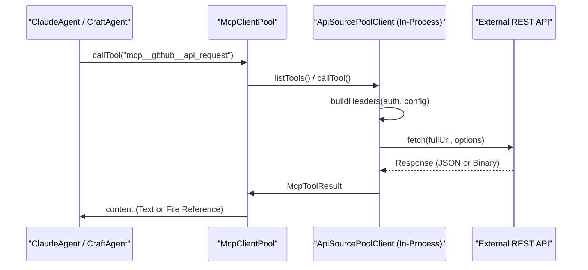
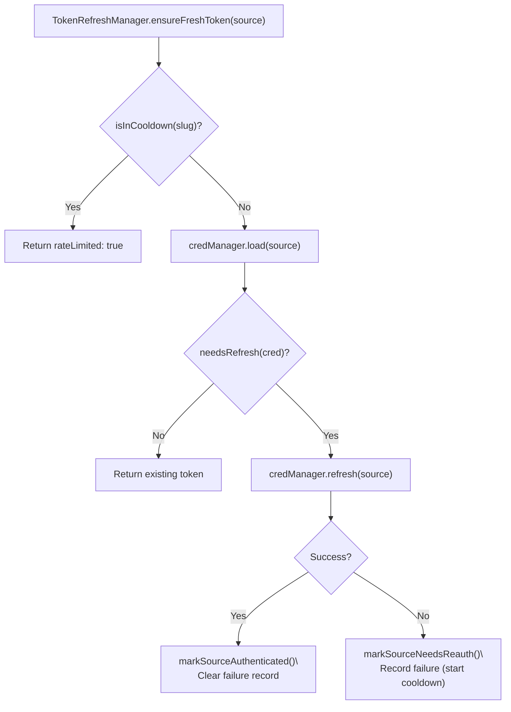

# External Service Integration

Relevant source files

The following files were used as context for generating this wiki page:

- [packages/shared/src/mcp/mcp-pool.ts](packages/shared/src/mcp/mcp-pool.ts)
- [packages/shared/src/sources/credential-manager.ts](packages/shared/src/sources/credential-manager.ts)
- [packages/shared/src/sources/token-refresh-manager.ts](packages/shared/src/sources/token-refresh-manager.ts)

This page documents how Craft Agents connects to external services at the code level: source types and transports, the `McpClientPool` for managing active connections, the `SourceCredentialManager` for unified credential CRUD, the dynamic API tool factory, and the `TokenRefreshManager` that handles the OAuth token refresh lifecycle.

For user-facing source configuration, see page 4.3. For credential encryption details, see page 7.2. For the agent system that consumes these services, see page 2.3.

---

## Overview

External services are modeled as *sources*, each with a `SourceType` [packages/shared/src/sources/types.ts:16-16](). The system supports three primary integration patterns:

| `SourceType` | Transport | Authentication | Implementation |
|---|---|---|---|
| `mcp` | `http`, `sse`, or `stdio` | `oauth`, `bearer`, or `none` | `CraftMcpClient` [packages/shared/src/mcp/client.ts:14-14]() |
| `api` | HTTP/REST (in-process) | `bearer`, `header`, `query`, `basic`, `oauth` | `ApiSourcePoolClient` [packages/shared/src/mcp/api-source-pool-client.ts:13-13]() |
| `local` | Filesystem path | None | Workspace-local file indexing |

The `McpClientPool` serves as the central owner of all source connections in the main Electron process [packages/shared/src/mcp/mcp-pool.ts:4-7](). It abstracts away whether a tool comes from a remote MCP server or a dynamically generated REST API wrapper.

Sources: [packages/shared/src/sources/types.ts:16-27](), [packages/shared/src/mcp/mcp-pool.ts:1-14]()

---

## MCP Client Pool

The `McpClientPool` [packages/shared/src/mcp/mcp-pool.ts:101-101]() manages the lifecycle of all active MCP connections. It allows backends (Claude, CraftAgent) to receive proxy tool definitions and route calls through a single unified path [packages/shared/src/mcp/mcp-pool.ts:5-7]().

### Connection Lifecycle

1.  **Syncing:** The `sync()` method [packages/shared/src/mcp/mcp-pool.ts:223-223]() reconciles the pool state with a list of `SdkMcpServerConfig` and `ApiServerConfig` objects.
2.  **Registration:** `registerClient()` [packages/shared/src/mcp/mcp-pool.ts:155-155]() connects to the server, caches its tool list, and builds proxy mappings using the `mcp__{slug}__{toolName}` convention [packages/shared/src/mcp/mcp-pool.ts:162-162]().
3.  **Tool Execution:** When `callTool()` is invoked with a proxy name, the pool resolves the correct client and original tool name to execute the request [packages/shared/src/mcp/mcp-pool.ts:316-335]().

### Large Response Handling
The pool integrates with `guardLargeResult()` to prevent LLM context overflow [packages/shared/src/mcp/mcp-pool.ts:22-22](). If a tool returns a massive payload, the pool can:
*   Save binary data (images, PDFs) to the session directory [packages/shared/src/mcp/mcp-pool.ts:24-27]().
*   Invoke a `summarizeCallback` to condense large text responses before returning them to the agent [packages/shared/src/mcp/mcp-pool.ts:139-141]().

Sources: [packages/shared/src/mcp/mcp-pool.ts:101-340](), [packages/shared/src/mcp/client.ts:14-80]()

---

## Credential Management

`SourceCredentialManager` [packages/shared/src/sources/credential-manager.ts:116-116]() provides a unified interface for managing API keys and OAuth tokens.

### Unified CRUD
The manager resolves a `CredentialId` based on the source's workspace and slug [packages/shared/src/sources/credential-manager.ts:129-129](). It handles:
*   **API Credentials:** Supports simple strings, `BasicAuthCredential` (username/password), and `MultiHeaderCredential` for services like Datadog [packages/shared/src/sources/credential-manager.ts:71-82]().
*   **MCP Fallback:** For MCP sources, it tries to load OAuth credentials first, falling back to bearer tokens if necessary [packages/shared/src/sources/credential-manager.ts:164-187]().

### OAuth Integration
The manager coordinates complex OAuth flows for Google, Slack, and Microsoft services [packages/shared/src/sources/credential-manager.ts:32-54](). It uses `pendingRefreshes` to prevent race conditions during concurrent token refreshes, which is critical for providers that rotate refresh tokens [packages/shared/src/sources/credential-manager.ts:118-119]().

**Diagram: Natural Language to Code Entity Space (Credentials)**

| System Concept | Code Entity | File |
|---|---|---|
| Encrypted Storage | `getCredentialManager()` | [packages/shared/src/credentials/index.ts]() |
| Auth Identifier | `CredentialId` | [packages/shared/src/credentials/types.ts:25-25]() |
| Token Refresh Logic | `SourceCredentialManager.refresh()` | [packages/shared/src/sources/credential-manager.ts:216-216]() |
| Multi-key Auth | `isMultiHeaderCredential()` | [packages/shared/src/sources/credential-manager.ts:88-88]() |

Sources: [packages/shared/src/sources/credential-manager.ts:1-220](), [packages/shared/src/credentials/types.ts:1-30]()

---

## Dynamic API Tool Factory

For `api`-type sources, the system creates a single flexible MCP tool per API. This is handled by `createApiServer()` [packages/shared/src/sources/api-tools.ts:208-208](), which wraps a REST API in an in-process `McpServer`.

### Request Construction
The factory dynamically builds HTTP requests based on the `ApiConfig` [packages/shared/src/sources/api-tools.ts:181-181]():
*   **`buildHeaders()`**: Injects authentication headers (Bearer, Basic, or custom) and merges them with user-defined headers [packages/shared/src/sources/api-tools.ts:69-122]().
*   **`buildUrl()`**: Appends the requested path to the base URL and injects query-based credentials if configured [packages/shared/src/sources/api-tools.ts:124-150]().

### Response Processing
The factory handles various content types. If a response is binary (e.g., an image), it uses `saveBinaryResponse()` to store the file and returns a reference to the agent [packages/shared/src/sources/api-tools.ts:303-315]().

**Diagram: API Request Execution Flow**

Sources: [packages/shared/src/sources/api-tools.ts:35-331](), [packages/shared/src/mcp/api-source-pool-client.ts:13-50]()

---

## Token Refresh Lifecycle

### `TokenRefreshManager`
The `TokenRefreshManager` [packages/shared/src/sources/token-refresh-manager.ts:39-39]() orchestrates the proactive refresh of OAuth tokens before they expire.

| Method | Description |
|---|---|
| `needsRefresh(source)` | Returns `true` if the token is expired or within 5 minutes of expiry [packages/shared/src/sources/token-refresh-manager.ts:95-104]() |
| `ensureFreshToken(source)` | The primary entry point. It checks for cooldowns (to prevent spamming failing endpoints), refreshes the token via `credManager`, and updates the source's authentication status [packages/shared/src/sources/token-refresh-manager.ts:113-176]() |

### Rate Limiting and Cooldown
To protect against infinite loops of failing refreshes, the manager maintains `failedAttempts` [packages/shared/src/sources/token-refresh-manager.ts:40-40](). If a refresh fails, the source enters a cooldown period (default 5 minutes) during which further refresh attempts are skipped [packages/shared/src/sources/token-refresh-manager.ts:18-19]().

**Diagram: Token Refresh Decision Path**

Sources: [packages/shared/src/sources/token-refresh-manager.ts:39-176](), [packages/shared/src/sources/credential-manager.ts:216-240]()