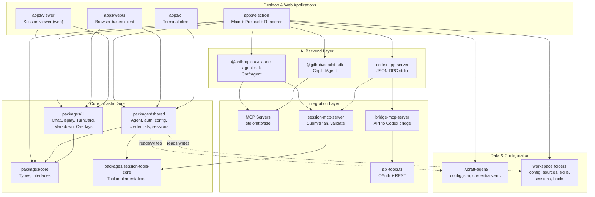
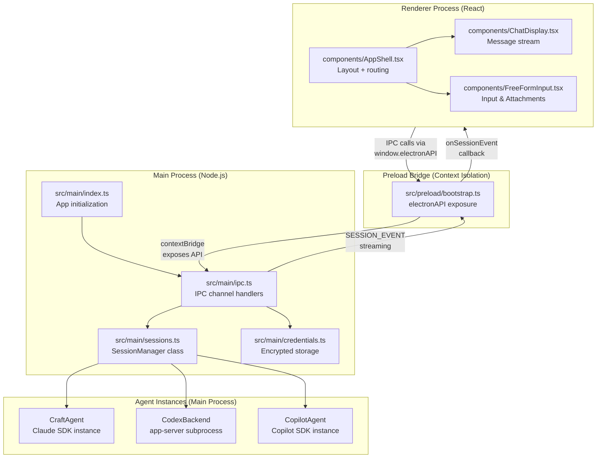
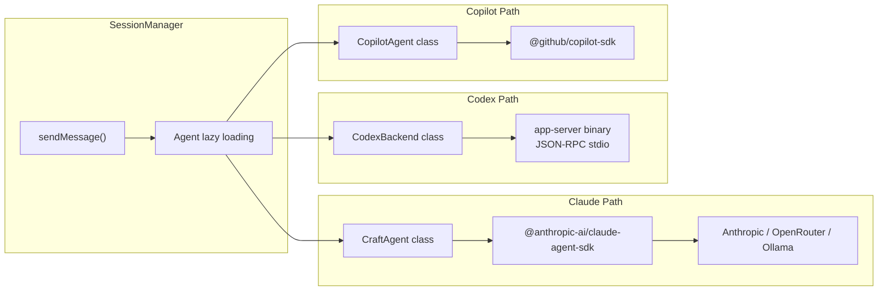
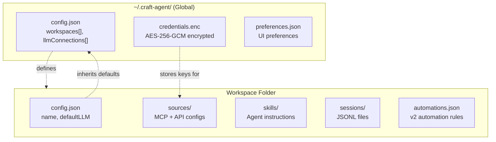

# Architecture

<details>
<summary>Relevant source files</summary>

The following files were used as context for generating this wiki page:

- [apps/electron/package.json](apps/electron/package.json)
- [package.json](package.json)
- [packages/shared/package.json](packages/shared/package.json)

</details>


## Purpose and Scope

This document provides a high-level overview of the Craft Agents OSS system architecture, covering the monorepo structure, Electron multi-process design, agent backend integration, and core data flow patterns. It serves as an entry point to understand how the major components of the system fit together.

For detailed information about specific subsystems, see:
- Package dependencies and workspace structure: [Package Structure](#2.1)
- Electron process communication and window management: [Electron Application Architecture](#2.2)
- Agent backend implementations and tool execution: [Agent System](#2.3)
- External API and MCP server integration: [External Service Integration](#2.4)
- UI components and application shell layout: [UI Components & Layout](#2.5)
- IPC channel definitions and communication: [IPC Communication Layer](#2.6)
- Session persistence and lifecycle: [Session Lifecycle](#2.7)
- Storage hierarchy and configuration management: [Storage & Configuration](#2.8)
- In-app documentation management: [Documentation System](#2.9)
- Standalone web viewer application: [Web Viewer Application](#2.10)
- Mermaid diagram rendering pipeline: [Mermaid Diagram Rendering](#2.11)
- Browser-based thin client: [Web UI Application](#2.12)

**Sources:** [package.json:1-21](), [apps/electron/package.json:1-6]()

---

## System Overview

Craft Agents is an Electron desktop application that provides a multi-session AI agent interface with support for three primary agent backends: **Claude** (via `@anthropic-ai/claude-agent-sdk`), **Codex** (via OpenAI app-server), and **Copilot** (via `@github/copilot-sdk`). The application is built as a monorepo using Bun workspaces, with shared business logic extracted into reusable packages.

The system architecture follows a layered design:

| Layer | Purpose | Primary Components |
|-------|---------|-------------------|
| **Desktop Application** | User interface and window management | `apps/electron` (main, preload, renderer) |
| **Web Clients** | Browser-based access and sharing | `apps/webui`, `apps/viewer` |
| **AI Backend** | Agent execution and streaming responses | Claude SDK, Codex app-server, Copilot SDK |
| **Integration** | External data sources and tool execution | MCP servers, API bridges, OAuth flows |
| **Core Infrastructure** | Shared types, business logic, UI components | `packages/core`, `packages/shared`, `packages/ui` |
| **Data & Configuration** | Persistent storage and workspace management | `~/.craft-agent/`, workspace folders |

**Sources:** [package.json:17-21](), [apps/electron/package.json:38-42](), [packages/shared/package.json:2-5]()

---

## Architectural Layers Diagram

**Figure 1: System Layers and Component Relationships**



**Sources:** [package.json:17-21](), [apps/electron/package.json:38-42](), [packages/shared/package.json:64-66]()

---

## Monorepo Organization

The repository uses Bun workspaces to organize code into applications and reusable packages. The monorepo structure is defined in the root `package.json`:

```json
"workspaces": [
  "packages/*",
  "apps/*",
  "!apps/online-docs"
]
```

### Workspace Layout

| Type | Path | Purpose |
|------|------|---------|
| **Applications** | `apps/electron` | Primary Electron desktop application |
| | `apps/webui` | Browser-based client connecting to a remote server |
| | `apps/viewer` | Standalone web viewer for session transcripts |
| | `apps/cli` | Terminal client for interacting with the server |
| **Core Packages** | `packages/core` | Shared TypeScript types and interfaces |
| | `packages/shared` | Business logic (agent, auth, config, sessions, sources) |
| | `packages/ui` | React components (ChatDisplay, TurnCard, AppShell) |
| **Tool Packages** | `packages/session-tools-core` | Built-in tools (SubmitPlan, validate) |
| | `packages/mermaid` | Mermaid diagram rendering integration |
| **MCP Servers** | `packages/bridge-mcp-server` | API-to-Codex protocol bridge |
| | `packages/session-mcp-server` | Session tools MCP server binary |

**Dependency Pattern:** Applications depend on packages via `workspace:*` references. Packages declare AI SDKs as peer dependencies to ensure version consistency across the monorepo.

For detailed package dependency graphs, see [Package Structure](#2.1).

**Sources:** [package.json:17-21](), [apps/electron/package.json:39-42](), [packages/shared/package.json:64-66]()

---

## Electron Multi-Process Architecture

The Electron desktop application follows a three-process architecture with strict isolation between the UI and system-level operations.

**Figure 2: Electron Process Architecture and IPC Communication**



### Process Responsibilities

| Process | Runtime | Primary Responsibilities | Key Scripts |
|---------|---------|-------------------------|-----------|
| **Main** | Node.js | System integration, session management, agent lifecycle | `build:main` |
| **Preload** | Node.js (isolated) | Secure IPC bridge via `contextBridge` | `build:preload` |
| **Renderer** | Chromium | React UI, user interactions, markdown rendering | `build:renderer` |

For detailed IPC channel definitions and communication patterns, see [IPC Communication Layer](#2.6). For the build pipeline details, see [Electron Application Architecture](#2.2).

**Sources:** [apps/electron/package.json:18-23](), [apps/electron/package.json:5-6]()

---

## Agent System Architecture

Craft Agents supports multiple AI backend systems through a unified `BaseAgent` abstraction, allowing the application to route requests to different providers based on user configuration.

**Figure 3: Agent Backend Implementations and Communication Protocols**



### Agent Backend Comparison

| Backend | SDK | Primary Transport | Custom Providers |
|---------|-----|-------------------|------------------|
| **Claude** | `@anthropic-ai/claude-agent-sdk` | HTTP | Anthropic, OpenRouter, Ollama |
| **Codex** | Custom app-server fork | JSON-RPC stdio | OpenAI |
| **Copilot** | `@github/copilot-sdk` | HTTP | GitHub |

For detailed agent lifecycle management, tool execution flow, and permission system integration, see [Agent System](#2.3).

**Sources:** [packages/shared/package.json:16-19](), [packages/shared/package.json:74-81]()

---

## Configuration & Storage Architecture

The system uses a hierarchical configuration model with global settings at `~/.craft-agent/` and workspace-specific overrides in project folders.

**Figure 4: Configuration Hierarchy and Storage Locations**



### Storage Locations

| File | Location | Format | Purpose |
|------|----------|--------|---------|
| `config.json` | `~/.craft-agent/` | JSON | Workspace registry, LLM connections |
| `credentials.enc` | `~/.craft-agent/` | Encrypted binary | API keys, OAuth tokens (AES-256-GCM) |
| `sessions/*.jsonl` | Workspace folder | JSONL | Complete session transcripts |
| `automations.json` | Workspace folder | JSON | Event-driven automation rules |

For detailed configuration file schemas and credential encryption, see [Storage & Configuration](#2.8). For session persistence details, see [Session Lifecycle](#2.7).

**Sources:** [packages/shared/package.json:23-27](), [packages/shared/package.json:60-62]()

---

## Build and Distribution

The application uses a multi-stage build process producing artifacts for macOS, Windows, and Linux.

### Build Scripts

| Script | Purpose |
|--------|---------|
| `electron:build` | Runs full build pipeline (main, preload, renderer, resources, assets) |
| `electron:dist` | Packages the application for distribution using `electron-builder` |
| `server:build` | Produces a headless server bundle for remote deployments |
| `webui:build` | Builds the browser-based client application |

**Sources:** [package.json:50-55](), [package.json:66-69](), [package.json:80-83]()

For detailed build configuration and platform-specific packaging, see [Building & Distribution](#6). For server deployment details, see [Server Deployment](#6.4).