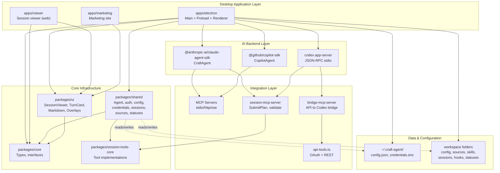
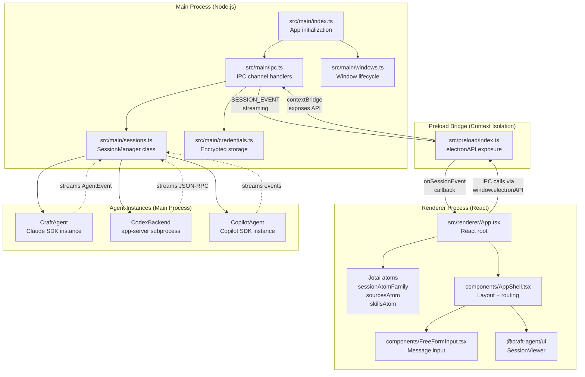
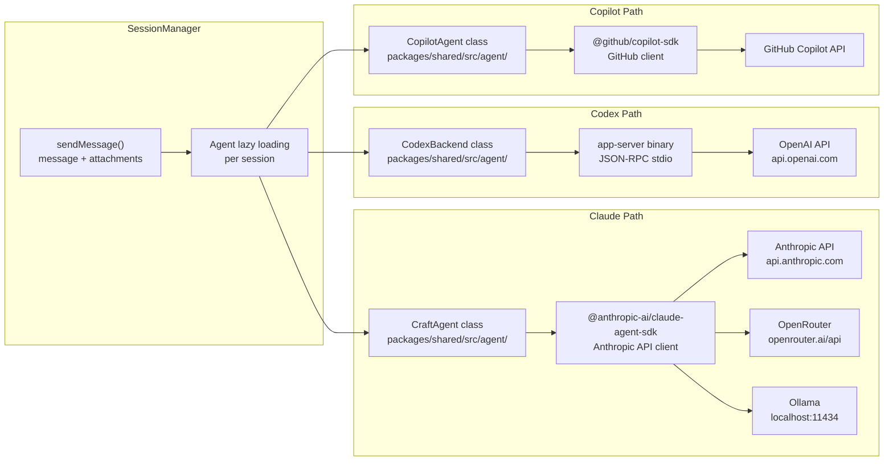
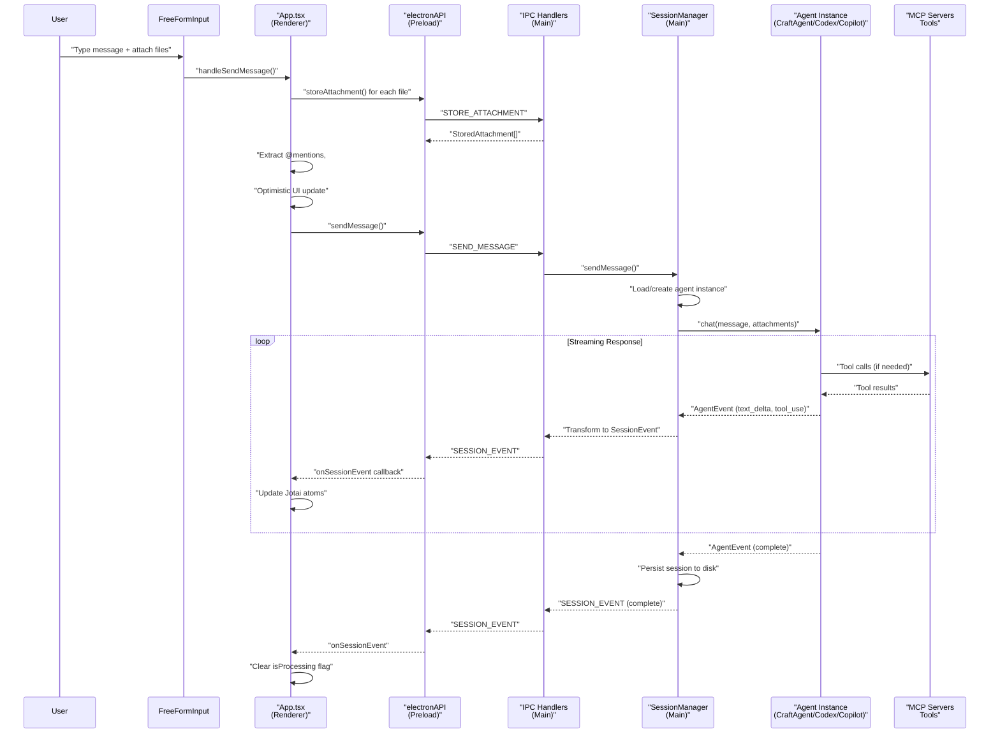
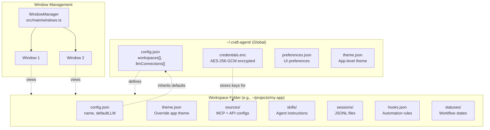
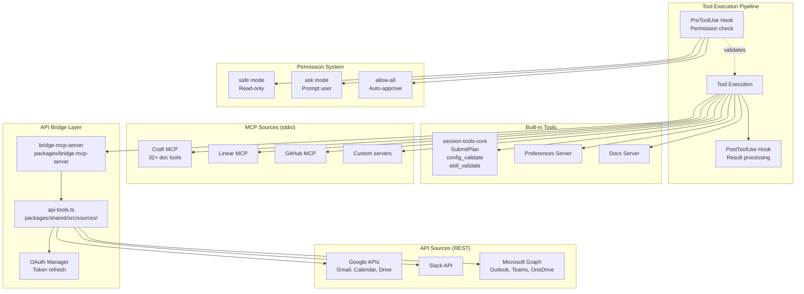

# Architecture

<details>
<summary>Relevant source files</summary>

The following files were used as context for generating this wiki page:

- [README.md](README.md)
- [apps/electron/package.json](apps/electron/package.json)
- [package.json](package.json)

</details>

## Purpose and Scope

This document provides a high-level overview of the Craft Agents OSS system architecture, covering the monorepo structure, Electron multi-process design, agent backend integration, and core data flow patterns. It serves as an entry point to understand how the major components of the system fit together.

For detailed information about specific subsystems, see:

- Package dependencies and workspace structure: [Package Structure](#2.1)
- Electron process communication and window management: [Electron Application Architecture](#2.2)
- Agent backend implementations and tool execution: [Agent System](#2.3)
- External API and MCP server integration: [External Service Integration](#2.4)
- Storage hierarchy and configuration management: [Storage & Configuration](#2.8)

**Sources:** [README.md:150-171]()

---

## System Overview

Craft Agents is an Electron desktop application that provides a multi-session AI agent interface with support for three agent backends: **Claude** (via `@anthropic-ai/claude-agent-sdk`), **Codex** (via OpenAI app-server), and **Copilot** (via `@github/copilot-sdk`). The application is built as a monorepo using Bun workspaces, with shared business logic extracted into reusable packages.

The system architecture follows a layered design:

| Layer                    | Purpose                                     | Primary Components                                |
| ------------------------ | ------------------------------------------- | ------------------------------------------------- |
| **Desktop Application**  | User interface and window management        | `apps/electron` (main, preload, renderer)         |
| **AI Backend**           | Agent execution and streaming responses     | Claude SDK, Codex app-server, Copilot SDK         |
| **Integration**          | External data sources and tool execution    | MCP servers, API bridges, OAuth flows             |
| **Core Infrastructure**  | Shared types, business logic, UI components | `packages/core`, `packages/shared`, `packages/ui` |
| **Data & Configuration** | Persistent storage and workspace management | `~/.craft-agent/`, workspace folders              |

**Sources:** [README.md:1-26](), [README.md:150-171](), [package.json:1-128]()

---

## Architectural Layers Diagram

**Figure 1: System Layers and Component Relationships**



**Sources:** [README.md:150-171](), [package.json:7-10](), [apps/electron/package.json:37-41]()

---

## Monorepo Organization

The repository uses Bun workspaces to organize code into applications and reusable packages. The monorepo structure is defined in the root `package.json`:

```typescript
// From package.json:7-11
"workspaces": [
  "packages/*",
  "apps/*",
  "!apps/online-docs"
]
```

### Workspace Layout

| Type              | Path                          | Purpose                                                 |
| ----------------- | ----------------------------- | ------------------------------------------------------- |
| **Applications**  | `apps/electron`               | Primary Electron desktop application                    |
|                   | `apps/viewer`                 | Standalone web viewer for session transcripts           |
|                   | `apps/marketing`              | Marketing website                                       |
| **Core Packages** | `packages/core`               | Shared TypeScript types and interfaces                  |
|                   | `packages/shared`             | Business logic (agent, auth, config, sessions, sources) |
|                   | `packages/ui`                 | React components (SessionViewer, TurnCard, overlays)    |
| **Tool Packages** | `packages/session-tools-core` | Built-in tools (SubmitPlan, validate)                   |
|                   | `packages/mermaid`            | Mermaid diagram rendering with custom theme             |
| **MCP Servers**   | `packages/bridge-mcp-server`  | API-to-Codex protocol bridge                            |
|                   | `packages/session-mcp-server` | Session tools MCP server binary                         |
| **Generated**     | `packages/codex-types`        | TypeScript types from Codex protocol                    |

**Dependency Pattern:** Applications depend on packages but do not export anything. Packages declare AI SDKs (`@anthropic-ai/claude-agent-sdk`, `@anthropic-ai/sdk`, `@modelcontextprotocol/sdk`) as peer dependencies to avoid version conflicts across the monorepo.

For detailed package dependency graphs and import patterns, see [Package Structure](#2.1).

**Sources:** [package.json:7-11](), [README.md:150-171](), [apps/electron/package.json:37-41]()

---

## Electron Multi-Process Architecture

The Electron desktop application follows the standard three-process architecture with strict separation of concerns:

**Figure 2: Electron Process Architecture and IPC Communication**



### Process Responsibilities

| Process      | Runtime            | Primary Responsibilities                                | Key Files                                                                   |
| ------------ | ------------------ | ------------------------------------------------------- | --------------------------------------------------------------------------- |
| **Main**     | Node.js            | System integration, session management, agent lifecycle | [apps/electron/src/main/index.ts](), [apps/electron/src/main/sessions.ts]() |
| **Preload**  | Node.js (isolated) | Secure IPC bridge via `contextBridge`                   | [apps/electron/src/preload/index.ts]()                                      |
| **Renderer** | Chromium           | React UI, user interactions, optimistic updates         | [apps/electron/src/renderer/App.tsx]()                                      |

The preload script exposes a restricted `electronAPI` object to the renderer via `contextBridge`, providing type-safe IPC communication. All agent instances run in the main process to avoid exposing credentials and API keys to the renderer.

For detailed IPC channel definitions and communication patterns, see [IPC Communication Layer](#2.6). For window management and multi-workspace support, see [Electron Application Architecture](#2.2).

**Sources:** [README.md:152-161](), [apps/electron/package.json:5-6]()

---

## Agent System Architecture

Craft Agents supports three AI backend systems, each with distinct integration patterns:

**Figure 3: Agent Backend Implementations and Communication Protocols**



### Agent Backend Comparison

| Backend     | SDK                              | Transport      | Authentication | Custom Providers                | Tool Protocol             |
| ----------- | -------------------------------- | -------------- | -------------- | ------------------------------- | ------------------------- |
| **Claude**  | `@anthropic-ai/claude-agent-sdk` | HTTP           | API key, OAuth | OpenRouter, Ollama, custom URLs | Native MCP, session tools |
| **Codex**   | Custom app-server fork           | JSON-RPC stdio | API key, OAuth | OpenAI only                     | MCP via bridge-mcp-server |
| **Copilot** | `@github/copilot-sdk`            | HTTP           | OAuth (GitHub) | GitHub only                     | Native MCP                |

### Agent Event Streaming

All three agent backends stream events back to the main process during execution:

```typescript
// Event types from packages/core
type SessionEvent = {
  type: 'text_delta' | 'tool_use' | 'tool_result' | 'error' | 'complete'
  sessionId: string
  messageId?: string
  data: unknown
}
```

The `SessionManager` transforms agent-specific events into normalized `SessionEvent` objects and broadcasts them via the `SESSION_EVENT` IPC channel for real-time UI updates.

For detailed agent lifecycle management, tool execution flow, and permission system integration, see [Agent System](#2.3). For tool registration and execution patterns, see [External Service Integration](#2.4).

**Sources:** [README.md:88-89](), [README.md:261-279](), [package.json:89-92]()

---

## Data Flow: Message to Response

**Figure 4: Complete Message Lifecycle from User Input to Agent Response**



### Key Flow Characteristics

1. **Optimistic UI Updates:** The renderer immediately displays the user's message before receiving confirmation from the main process
2. **File Preprocessing:** Attachments are processed (thumbnails, Office→markdown conversion) before sending
3. **Agent Lazy Loading:** Agent instances are created on-demand per session and cached for subsequent messages
4. **Streaming Events:** Agent responses stream incrementally via the `SESSION_EVENT` IPC channel
5. **Tool Execution:** MCP tool calls are executed synchronously within the streaming flow
6. **Persistent Storage:** Complete sessions are written to JSONL files in the workspace directory after completion

For detailed session lifecycle management, see [Session Lifecycle](#2.7). For IPC channel definitions, see [IPC Communication Layer](#2.6).

**Sources:** [README.md:150-171]()

---

## Configuration & Storage Architecture

The system uses a hierarchical configuration model with global settings at `~/.craft-agent/` and workspace-specific overrides in project folders.

**Figure 5: Configuration Hierarchy and Storage Locations**



### Storage Locations

| File                    | Location          | Format           | Purpose                              |
| ----------------------- | ----------------- | ---------------- | ------------------------------------ |
| `config.json`           | `~/.craft-agent/` | JSON             | Workspace registry, LLM connections  |
| `credentials.enc`       | `~/.craft-agent/` | Encrypted binary | API keys, OAuth tokens (AES-256-GCM) |
| `preferences.json`      | `~/.craft-agent/` | JSON             | UI preferences, window positions     |
| `sessions/*.jsonl`      | Workspace folder  | JSONL            | Complete session transcripts         |
| `sources/*/config.json` | Workspace folder  | JSON             | Source configurations (MCP, API)     |
| `skills/*/skill.json`   | Workspace folder  | JSON             | Agent instruction prompts            |
| `hooks.json`            | Workspace folder  | JSON             | Event-driven automation rules        |
| `statuses/*.json`       | Workspace folder  | JSON             | Custom workflow states               |

### Configuration Cascading

Workspace-level configuration files inherit defaults from the global `~/.craft-agent/config.json` and can override specific settings. For example, a workspace can define its own `defaultLLMConnection` while inheriting global permission mode defaults.

**Platform-Specific Paths:**

- **macOS:** `~/Library/Logs/@craft-agent/electron/`
- **Windows:** `%APPDATA%\@craft-agent\electron\`
- **Linux:** `~/.config/@craft-agent/electron/`

For detailed configuration file schemas and credential encryption, see [Storage & Configuration](#2.8). For workspace management and multi-window support, see [Electron Application Architecture](#2.2).

**Sources:** [README.md:282-300](), [README.md:400-404]()

---

## External Service Integration Architecture

Craft Agents integrates external data sources and tools through three primary mechanisms: **MCP servers** (stdio/HTTP), **REST APIs** (with OAuth), and **built-in session tools**.

**Figure 6: Source Integration and Tool Execution Pipeline**



### Source Type Comparison

| Type               | Transport        | Authentication | Examples                   | Configuration                            |
| ------------------ | ---------------- | -------------- | -------------------------- | ---------------------------------------- |
| **MCP (stdio)**    | Local subprocess | None (local)   | Filesystem, Linear, GitHub | `sources/*/config.json` with `mcp` field |
| **MCP (HTTP/SSE)** | Remote server    | API key        | Remote MCP servers         | `sources/*/config.json` with `mcp` field |
| **API (REST)**     | HTTP + OAuth     | OAuth 2.0      | Google, Slack, Microsoft   | `sources/*/config.json` with `api` field |

### Tool Execution Flow

1. **PreToolUse Hook:** Validates tool call against permission mode (`safe`, `ask`, `allow-all`)
2. **Permission Check:** If mode is `ask`, displays dialog in UI; if `safe`, blocks write operations
3. **Tool Execution:** Routes to appropriate backend (MCP server, API bridge, built-in tool)
4. **Response Handling:** Large responses (>60KB) are auto-summarized using Claude Haiku
5. **PostToolUse Hook:** Triggers automation hooks if configured

### API Bridge Layer

The `bridge-mcp-server` package translates MCP protocol calls into REST API requests for services that don't provide native MCP servers. It handles:

- OAuth token refresh and storage
- Request construction from MCP tool schemas
- Response transformation to MCP format
- Error handling and retry logic

For detailed tool schemas and permission system configuration, see [External Service Integration](#2.4). For session-scoped tool implementations, see the API reference at [Session-Scoped Tools](#8.5).

**Sources:** [README.md:119-128](), [README.md:129-137](), [README.md:90-91](), [README.md:351-354]()

---

## Build System and Distribution

The application uses a multi-stage build process with platform-specific outputs:

### Build Scripts

| Script                     | Purpose                      | Output                           |
| -------------------------- | ---------------------------- | -------------------------------- |
| `electron:build:main`      | Bundle main process          | `apps/electron/dist/main.cjs`    |
| `electron:build:preload`   | Bundle preload script        | `apps/electron/dist/preload.cjs` |
| `electron:build:renderer`  | Build React UI               | `apps/electron/dist/renderer/`   |
| `electron:build:resources` | Copy static assets           | `apps/electron/dist/resources/`  |
| `electron:dist:mac`        | Package macOS app (DMG)      | `dist/Craft Agents.dmg`          |
| `electron:dist:win`        | Package Windows app          | `dist/Craft Agents Setup.exe`    |
| `electron:dist:linux`      | Package Linux app (AppImage) | `dist/Craft Agents.AppImage`     |

**Build Tools:**

- **Main process:** esbuild (CJS bundle)
- **Preload script:** esbuild (CJS bundle)
- **Renderer:** Vite + React + Tailwind CSS v4
- **Packaging:** electron-builder

### Environment Variable Injection

OAuth credentials for Microsoft and Slack are baked into the build via environment variables:

```bash
# From .env file (not committed)
MICROSOFT_OAUTH_CLIENT_ID=your-client-id
SLACK_OAUTH_CLIENT_ID=your-slack-client-id
SLACK_OAUTH_CLIENT_SECRET=your-slack-client-secret
```

Google OAuth credentials are **not** baked in; users provide their own credentials per workspace via source configuration.

For detailed build configuration and platform-specific packaging, see [Building & Distribution](#6).

**Sources:** [package.json:20-39](), [apps/electron/package.json:18-28](), [README.md:189-198]()

---

## Technology Stack Summary

| Component                 | Technology                     | Version        |
| ------------------------- | ------------------------------ | -------------- |
| **Runtime**               | Bun                            | Latest         |
| **Desktop Framework**     | Electron                       | 39.2.7         |
| **UI Framework**          | React 18                       | 18.3.1         |
| **UI Components**         | shadcn/ui + Radix UI           | -              |
| **Styling**               | Tailwind CSS                   | 4.1.18         |
| **State Management**      | Jotai                          | 2.16.0         |
| **Build (Main)**          | esbuild                        | 0.25.0         |
| **Build (Renderer)**      | Vite                           | 6.2.4          |
| **Type System**           | TypeScript                     | 5.0.0          |
| **Claude Integration**    | @anthropic-ai/claude-agent-sdk | 0.2.37         |
| **Copilot Integration**   | @github/copilot-sdk            | 0.1.23         |
| **MCP Protocol**          | @modelcontextprotocol/sdk      | 1.24.3         |
| **Credential Encryption** | AES-256-GCM                    | Node.js crypto |
| **Markdown Rendering**    | react-markdown + shiki         | -              |
| **Diagram Rendering**     | Custom mermaid package         | -              |

**Sources:** [package.json:53-127](), [apps/electron/package.json:37-70](), [README.md:368-378]()

---

## Summary

The Craft Agents architecture is designed around three core principles:

1. **Multi-Process Isolation:** Electron's process separation keeps credentials and agent logic in the secure main process while the UI runs in an isolated renderer
2. **Agent Flexibility:** Support for three agent backends (Claude, Codex, Copilot) with pluggable provider support for Claude
3. **Extensible Integration:** MCP protocol and REST API bridges enable connection to any external service or tool

The monorepo structure cleanly separates concerns with reusable packages (`core`, `shared`, `ui`) consumed by multiple applications (`electron`, `viewer`, `marketing`). Configuration cascades from global to workspace level, enabling per-project customization while maintaining sensible defaults.

For implementation details of specific subsystems, refer to the child pages under Architecture (sections 2.1 through 2.11).

**Sources:** [README.md:1-438](), [package.json:1-128]()
