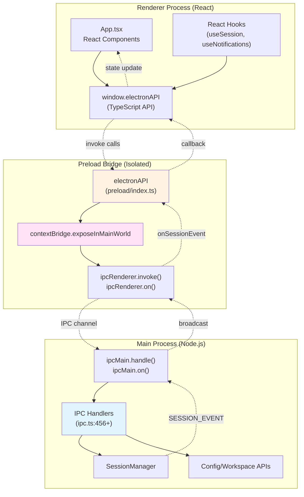
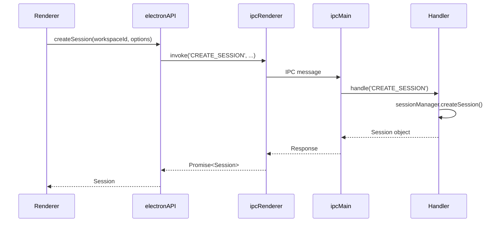
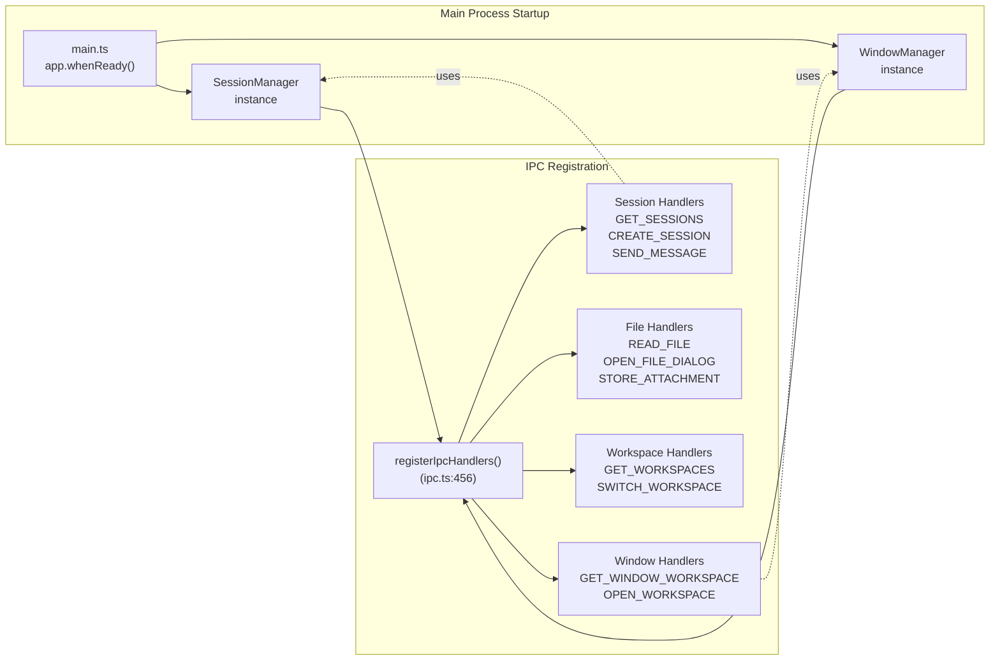
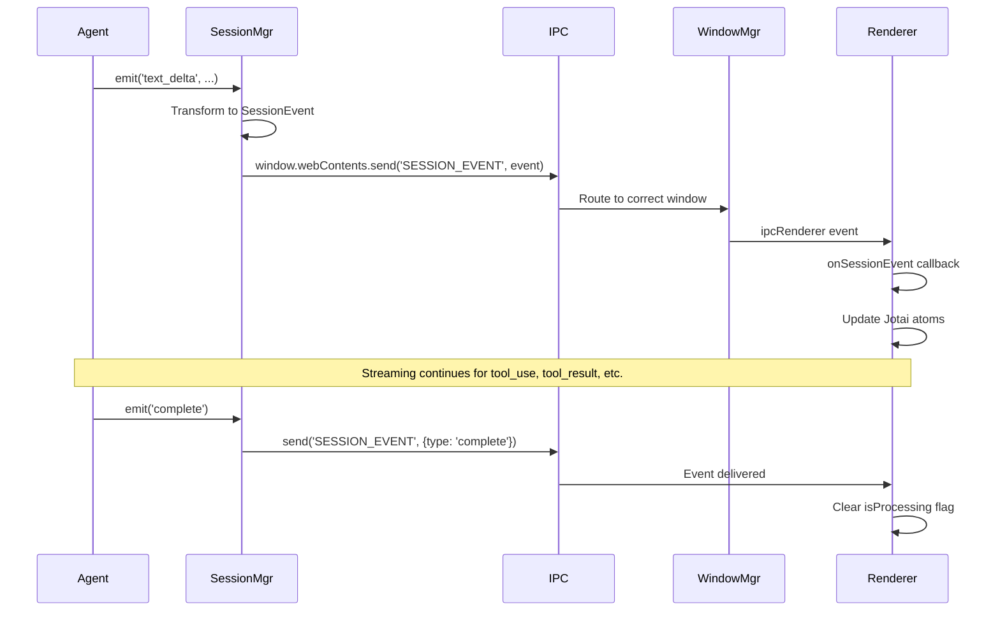
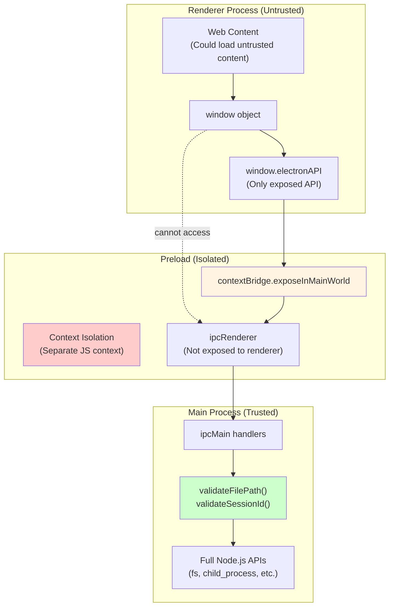
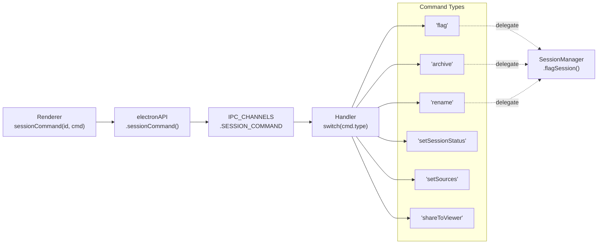

# IPC Communication Layer

<details>
<summary>Relevant source files</summary>

The following files were used as context for generating this wiki page:

- [apps/electron/src/main/ipc.ts](apps/electron/src/main/ipc.ts)
- [apps/electron/src/preload/index.ts](apps/electron/src/preload/index.ts)
- [apps/electron/src/renderer/App.tsx](apps/electron/src/renderer/App.tsx)
- [apps/electron/src/shared/types.ts](apps/electron/src/shared/types.ts)

</details>

The IPC Communication Layer is the bidirectional message passing system that connects Electron's isolated processes (main, preload, renderer) in a secure, type-safe manner. This layer enables the React UI to invoke backend operations and receive real-time streaming updates from AI agents without breaking Electron's security model.

This page covers the IPC channel definitions, handler registration, the preload bridge, and event streaming patterns. For the broader Electron application architecture, see [Electron Application Architecture](#2.2). For session lifecycle and message processing details, see [Session Lifecycle](#2.7).

---

## Architecture Overview

The IPC layer implements a three-tier architecture separating concerns across process boundaries:

**IPC Architecture**



Sources: [apps/electron/src/main/ipc.ts:1-456](), [apps/electron/src/preload/index.ts:1-537](), [apps/electron/src/renderer/App.tsx:456-634]()

---

## IPC Channel Types

All IPC channels are defined in the `IPC_CHANNELS` constant and fall into two categories:

### Request/Response Channels

Request/response channels use `ipcMain.handle()` in the main process and `ipcRenderer.invoke()` in the renderer. They return a Promise that resolves with the result.

**Common Request/Response Patterns**

| Pattern    | Example Channel          | Handler Location                          | Return Type         |
| ---------- | ------------------------ | ----------------------------------------- | ------------------- |
| Data fetch | `GET_SESSIONS`           | [apps/electron/src/main/ipc.ts:459-470]() | `Session[]`         |
| Command    | `CREATE_SESSION`         | [apps/electron/src/main/ipc.ts:595-600]() | `Session`           |
| File I/O   | `READ_FILE`              | [apps/electron/src/main/ipc.ts:784-795]() | `string`            |
| Settings   | `WORKSPACE_SETTINGS_GET` | Config APIs                               | `WorkspaceSettings` |

**Example: Session Creation Flow**



Sources: [apps/electron/src/preload/index.ts:10-11](), [apps/electron/src/main/ipc.ts:595-600]()

### Event Channels

Event channels use `ipcMain` send methods in the main process and `ipcRenderer.on()` in the renderer. They enable one-way broadcasts without response.

**Event Channel Types**

| Event Type       | Channel Name             | Trigger             | Payload          |
| ---------------- | ------------------------ | ------------------- | ---------------- |
| Agent streaming  | `SESSION_EVENT`          | Agent message delta | `SessionEvent`   |
| Config changes   | `SOURCES_CHANGED`        | File watcher        | `LoadedSource[]` |
| Theme updates    | `THEME_APP_CHANGED`      | File watcher        | `ThemeOverrides` |
| Menu actions     | `MENU_NEW_CHAT`          | Menu click          | `void`           |
| Window lifecycle | `WINDOW_CLOSE_REQUESTED` | Close button        | `void`           |

Sources: [apps/electron/src/shared/types.ts]() (IPC_CHANNELS definition), [apps/electron/src/main/ipc.ts:456+]()

---

## Handler Registration

The `registerIpcHandlers` function ([apps/electron/src/main/ipc.ts:456]()) sets up all IPC handlers during application initialization. It receives `SessionManager` and `WindowManager` instances to delegate operations.

**Handler Registration Structure**



Sources: [apps/electron/src/main/ipc.ts:456](), [apps/electron/src/main/index.ts]()

### Handler Categories

**Session Operations** ([apps/electron/src/main/ipc.ts:459-773]())

- `GET_SESSIONS` - List all sessions for window's workspace
- `GET_SESSION_MESSAGES` - Lazy-load individual session
- `CREATE_SESSION` / `CREATE_SUB_SESSION` - Session creation
- `DELETE_SESSION` - Session deletion with confirmation
- `SEND_MESSAGE` - Initiate agent processing (async, returns immediately)
- `SESSION_COMMAND` - Consolidated handler for session mutations (flag, archive, rename, etc.)

**File Operations** ([apps/electron/src/main/ipc.ts:784-916]())

- `READ_FILE` - Read text files with path validation
- `READ_FILE_DATA_URL` - Read images as base64 data URLs
- `READ_FILE_BINARY` - Read PDFs as binary for react-pdf
- `OPEN_FILE_DIALOG` - Native file picker
- `READ_FILE_ATTACHMENT` - Read file + generate Quick Look thumbnail
- `STORE_ATTACHMENT` - Persist attachment with thumbnail and Office→markdown conversion

**Workspace Operations** ([apps/electron/src/main/ipc.ts:481-593]())

- `GET_WORKSPACES` - List all configured workspaces
- `CREATE_WORKSPACE` - Create new workspace folder
- `SWITCH_WORKSPACE` - In-window workspace switching
- `GET_WINDOW_WORKSPACE` - Get current window's workspace ID

**Window Management** ([apps/electron/src/main/ipc.ts:508-593]())

- `GET_WINDOW_WORKSPACE` - Workspace for calling window
- `OPEN_WORKSPACE` - Open/focus workspace in new window
- `CLOSE_WINDOW` / `WINDOW_CONFIRM_CLOSE` - Window lifecycle
- `WINDOW_SET_TRAFFIC_LIGHTS` - macOS traffic light visibility (for fullscreen overlays)

Sources: [apps/electron/src/main/ipc.ts:456-1500]()

---

## The electronAPI Bridge

The preload script ([apps/electron/src/preload/index.ts]()) exposes a typed API to the renderer using `contextBridge.exposeInMainWorld`. This is the only mechanism for renderer→main communication, enforcing security boundaries.

**Bridge Definition Pattern**

```typescript
// preload/index.ts
const api: ElectronAPI = {
  // Request/response methods
  getSessions: () => ipcRenderer.invoke(IPC_CHANNELS.GET_SESSIONS),
  createSession: (workspaceId, options) =>
    ipcRenderer.invoke(IPC_CHANNELS.CREATE_SESSION, workspaceId, options),

  // Event listeners with cleanup
  onSessionEvent: (callback) => {
    const handler = (_event, sessionEvent) => callback(sessionEvent)
    ipcRenderer.on(IPC_CHANNELS.SESSION_EVENT, handler)
    return () => ipcRenderer.removeListener(IPC_CHANNELS.SESSION_EVENT, handler)
  },
}

contextBridge.exposeInMainWorld('electronAPI', api)
```

Sources: [apps/electron/src/preload/index.ts:6-536]()

### Method Categories

The `electronAPI` surface is organized into logical groups:

**Session Management** ([apps/electron/src/preload/index.ts:8-28]())

- CRUD operations: `getSessions`, `createSession`, `deleteSession`
- Messaging: `sendMessage`, `cancelProcessing`
- Commands: `sessionCommand` (consolidated handler)
- Event stream: `onSessionEvent`

**File Operations** ([apps/electron/src/preload/index.ts:65-72]())

- Reading: `readFile`, `readFileDataUrl`, `readFileBinary`
- Dialogs: `openFileDialog`
- Attachments: `readFileAttachment`, `storeAttachment`, `generateThumbnail`

**Configuration** ([apps/electron/src/preload/index.ts:213-292]())

- Workspaces: `getWorkspaces`, `createWorkspace`, `switchWorkspace`
- Sources: `getSources`, `createSource`, `startSourceOAuth`
- Skills: `getSkills`, `deleteSkill`, `openSkillInEditor`
- Theme: `getAppTheme`, `getWorkspaceColorTheme`, `loadPresetTheme`

**Authentication** ([apps/electron/src/preload/index.ts:170-196]())

- Onboarding: `getSetupNeeds`, `startClaudeOAuth`, `exchangeClaudeCode`
- ChatGPT: `startChatGptOAuth`, `getChatGptAuthStatus`, `chatGptLogout`
- Copilot: `startCopilotOAuth`, `getCopilotAuthStatus`, `onCopilotDeviceCode`

**Live Update Events** ([apps/electron/src/preload/index.ts:53-62, 294-428]())
All event listeners return cleanup functions for component unmount:

- `onSessionEvent` - Agent streaming and session updates
- `onSourcesChanged` - Sources config file watcher
- `onSkillsChanged` - Skills file watcher
- `onThemePreferencesChange` - Theme sync across windows
- `onLlmConnectionsChanged` - Model list updates

Sources: [apps/electron/src/preload/index.ts:6-537]()

---

## Event Streaming System

The `SESSION_EVENT` channel is the primary real-time streaming mechanism. It delivers agent events from the main process to all renderer windows.

**SESSION_EVENT Flow**



Sources: [apps/electron/src/main/sessions.ts](), [apps/electron/src/renderer/App.tsx:467-634]()

### SessionEvent Types

The `SessionEvent` union type covers all streaming event variants:

**Agent Events** (during processing)

- `user_message` - User message confirmed
- `text_delta` - Streaming text content
- `tool_use` - Tool execution started
- `tool_result` - Tool execution completed
- `permission_request` - Bash command approval needed
- `credential_request` - OAuth/API key needed

**Lifecycle Events**

- `complete` - Turn finished successfully
- `error` - Error occurred
- `interrupted` - User cancelled
- `typed_error` - Structured error with type

**Metadata Events**

- `name_changed` - Session auto-renamed
- `session_status_changed` - Status workflow update
- `session_flagged` / `session_unflagged` - Flag toggled
- `title_generated` - Background title generation complete

Sources: [apps/electron/src/shared/types.ts]() (SessionEvent type definition)

### Event Processing in Renderer

The renderer subscribes to `SESSION_EVENT` and routes events through the centralized event processor:

```typescript
// App.tsx event subscription
useEffect(() => {
  const cleanup = window.electronAPI.onSessionEvent((event: SessionEvent) => {
    if (!('sessionId' in event)) return

    const sessionId = event.sessionId
    const agentEvent = event as unknown as AgentEvent

    // Check if session is streaming (atom is source of truth)
    const atomSession = store.get(sessionAtomFamily(sessionId))
    const isStreaming = atomSession?.isProcessing === true

    // Process event through pure function
    const { session: updatedSession, effects } = processAgentEvent(
      agentEvent,
      atomSession ?? null,
      workspaceId
    )

    // Update atom directly
    updateSessionDirect(sessionId, () => updatedSession)

    // Handle side effects (permission requests, etc.)
    handleEffects(effects, sessionId, event.type)
  })

  return cleanup
}, [processAgentEvent, windowWorkspaceId, store])
```

Sources: [apps/electron/src/renderer/App.tsx:467-634]()

---

## Security Model

The IPC layer enforces Electron's security best practices through context isolation and explicit API exposure.

**Security Boundaries**



Sources: [apps/electron/src/preload/index.ts:1-537](), [apps/electron/src/main/ipc.ts:396-454]()

### Key Security Mechanisms

**1. Context Isolation** ([apps/electron/src/main/index.ts]())
The preload script runs in an isolated context. The renderer cannot access `ipcRenderer` or `require()` directly.

**2. Explicit API Surface** ([apps/electron/src/preload/index.ts:536]())
Only the `electronAPI` object is exposed to the renderer via `contextBridge.exposeInMainWorld`. No other Node.js APIs are accessible.

**3. Path Validation** ([apps/electron/src/main/ipc.ts:396-454]())
All file operations validate paths through `validateFilePath()`:

- Blocks path traversal (`..` components)
- Restricts to allowed directories (home, tmpdir)
- Blocks sensitive files (`.ssh/`, `.aws/credentials`, etc.)

**4. Session ID Validation** ([apps/electron/src/main/ipc.ts:943]())
Session IDs are validated before any filesystem operations to prevent path traversal attacks.

**5. Sanitized Filenames** ([apps/electron/src/main/ipc.ts:29-45]())
User-provided filenames are sanitized to remove path separators, control characters, and Windows-forbidden characters.

Sources: [apps/electron/src/main/ipc.ts:29-454]()

---

## Common IPC Patterns

### Pattern 1: Fire-and-Forget with Event Stream

Used for operations that complete asynchronously and stream progress updates.

**Example: sendMessage**

```typescript
// Renderer: Initiate (returns immediately)
await window.electronAPI.sendMessage(sessionId, message, attachments)

// Renderer: Subscribe to events
window.electronAPI.onSessionEvent((event) => {
  if (event.type === 'text_delta') {
    // Update UI with streaming text
  } else if (event.type === 'complete') {
    // Mark processing complete
  }
})
```

**Main process implementation:**

```typescript
// ipc.ts:619
ipcMain.handle(IPC_CHANNELS.SEND_MESSAGE, async (event, sessionId, message, ...) => {
  // Start processing in background (don't await)
  sessionManager.sendMessage(sessionId, message, ...).catch(err => {
    // Send error via SESSION_EVENT
    window.webContents.send(IPC_CHANNELS.SESSION_EVENT, {
      type: 'error',
      sessionId,
      error: err.message
    })
  })

  // Return immediately
  return { started: true }
})
```

Sources: [apps/electron/src/main/ipc.ts:619-646](), [apps/electron/src/renderer/App.tsx:765-927]()

### Pattern 2: Optimistic UI Updates

UI updates immediately, then backend confirms or reverts.

**Example: Session Flag Toggle**

```typescript
// Renderer: Optimistic update
const handleFlagSession = (sessionId: string) => {
  updateSessionById(sessionId, { isFlagged: true }) // Immediate UI update
  window.electronAPI.sessionCommand(sessionId, { type: 'flag' }) // Backend sync
}

// Backend sends confirmation via SESSION_EVENT
window.electronAPI.onSessionEvent((event) => {
  if (event.type === 'session_flagged') {
    // UI already updated, no action needed
  }
})
```

Sources: [apps/electron/src/renderer/App.tsx:702-710](), [apps/electron/src/main/ipc.ts:692-694]()

### Pattern 3: Event Listener with Cleanup

All event subscriptions return cleanup functions for React component unmount.

**Example: Theme Change Subscription**

```typescript
// Renderer component
useEffect(() => {
  const cleanup = window.electronAPI.onAppThemeChange((theme) => {
    setAppTheme(theme)
  })

  // Cleanup on unmount
  return () => {
    cleanup()
  }
}, [])
```

**Preload implementation:**

```typescript
// preload/index.ts:395
onAppThemeChange: (callback) => {
  const handler = (_event, theme) => callback(theme)
  ipcRenderer.on(IPC_CHANNELS.THEME_APP_CHANGED, handler)
  // Return cleanup function
  return () =>
    ipcRenderer.removeListener(IPC_CHANNELS.THEME_APP_CHANGED, handler)
}
```

Sources: [apps/electron/src/preload/index.ts:395-403](), [apps/electron/src/renderer/App.tsx:432-439]()

### Pattern 4: Window-Specific Routing

Events are routed to the correct window using WindowManager.

**Example: SESSION_EVENT Routing**

```typescript
// Main process: Get calling window's workspace
const workspaceId = windowManager.getWorkspaceForWindow(event.sender.id)

// Route event to correct window
const window = windowManager.getWindowByWorkspace(workspaceId)
if (window && !window.isDestroyed()) {
  window.webContents.send(IPC_CHANNELS.SESSION_EVENT, event)
}
```

Sources: [apps/electron/src/main/ipc.ts:621-642](), [apps/electron/src/main/window-manager.ts]()

---

## IPC Handler Consolidation

The `SESSION_COMMAND` handler consolidates 20+ session operations into a single discriminated union pattern, reducing IPC surface area and improving type safety.

**SESSION_COMMAND Pattern**



**Supported Commands:**

- `flag` / `unflag` - Toggle session flag
- `archive` / `unarchive` - Archive/restore session
- `rename` - Update session name
- `setSessionStatus` - Update workflow status
- `markRead` / `markUnread` - Read state tracking
- `setPermissionMode` - Permission tier (safe/ask/allow-all)
- `setThinkingLevel` - Thinking mode (off/think/max)
- `setSources` - Active sources for session
- `setLabels` - Label assignment
- `shareToViewer` / `updateShare` / `revokeShare` - Web viewer sharing
- `getSessionFamily` / `updateSiblingOrder` - Sub-session hierarchy
- `archiveCascade` / `deleteCascade` - Cascade operations

Sources: [apps/electron/src/main/ipc.ts:686-773](), [apps/electron/src/shared/types.ts]() (SessionCommand type)

---

## Performance Considerations

**1. Lazy Session Loading** ([apps/electron/src/main/ipc.ts:459-470]())
`GET_SESSIONS` returns lightweight session metadata without messages. Individual sessions are loaded on-demand via `GET_SESSION_MESSAGES`.

**2. Async Fire-and-Forget** ([apps/electron/src/main/ipc.ts:619]())
`SEND_MESSAGE` returns immediately (`{ started: true }`) and processes in the background, preventing renderer blocking.

**3. Debounced Persistence** ([apps/electron/src/renderer/App.tsx:954-988]())
Draft input saves to disk are debounced (500ms) to avoid excessive IPC calls during typing.

**4. Per-Session Atoms** ([apps/electron/src/renderer/atoms/sessions.ts]())
Jotai's `sessionAtomFamily` prevents re-renders of unrelated sessions when streaming updates arrive.

**5. Window-Specific Routing** ([apps/electron/src/main/window-manager.ts]())
Events are only sent to windows viewing the affected workspace, reducing unnecessary cross-window IPC.

Sources: [apps/electron/src/main/ipc.ts:459-646](), [apps/electron/src/renderer/App.tsx:954-988]()
