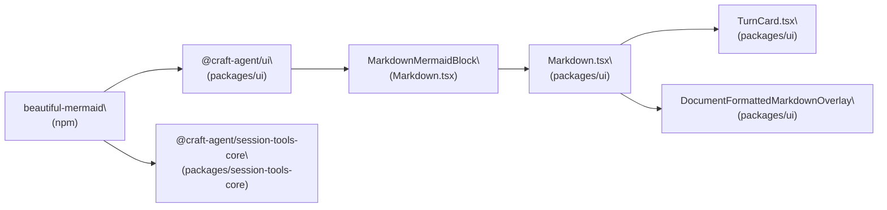
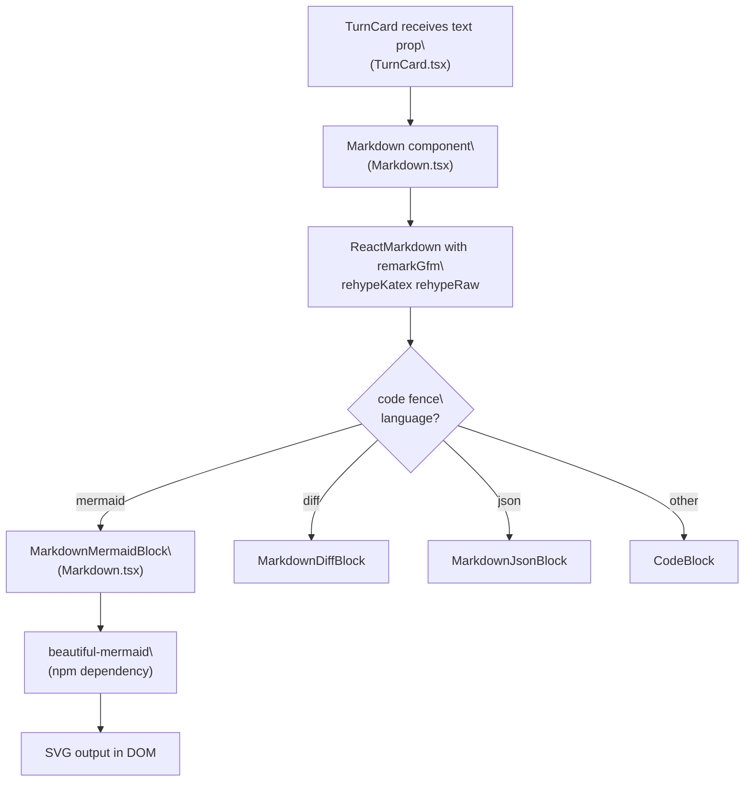
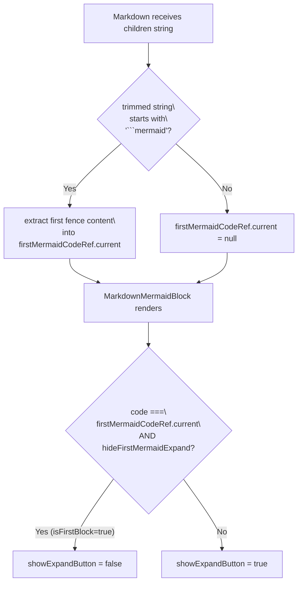
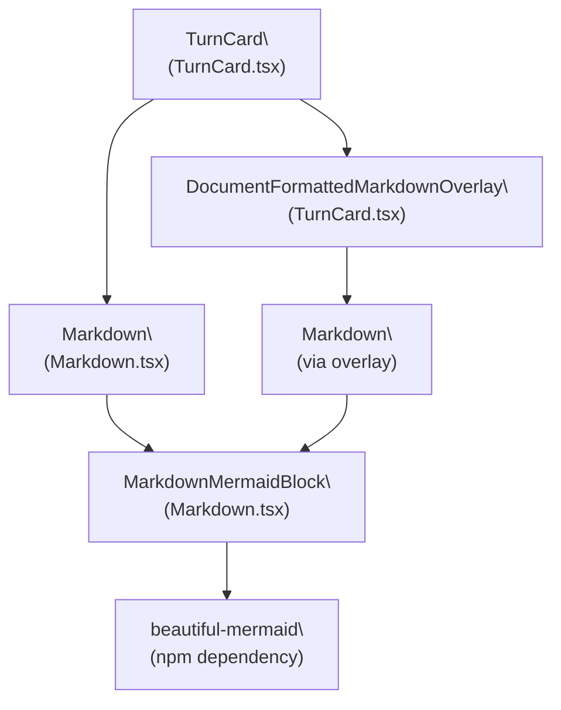

# Mermaid Diagram Rendering

<details>
<summary>Relevant source files</summary>

The following files were used as context for generating this wiki page:

- [packages/session-tools-core/package.json](packages/session-tools-core/package.json)
- [packages/ui/package.json](packages/ui/package.json)

</details>


This page covers how Mermaid diagrams are rendered inside session chat outputs — specifically the `packages/mermaid` workspace package, the `beautiful-mermaid` npm dependency it wraps, the `MarkdownMermaidBlock` component in `packages/ui`, and how `TurnCard` surfaces them.

---

## Overview

When an AI agent response includes a fenced code block tagged as `mermaid`, the markdown rendering pipeline intercepts it and routes it through a dedicated Mermaid rendering component instead of showing raw code. The rendered output is an SVG diagram that integrates with the rest of the response card's layout.

The rendering path involves three layers:

| Layer | Package | Key Symbol |
|---|---|---|
| Raw mermaid engine + theming | `packages/mermaid` + `beautiful-mermaid` | `packages/mermaid` |
| React component wrapper | `packages/ui` | `MarkdownMermaidBlock` |
| Markdown dispatcher | `packages/ui` | `Markdown` (in `Markdown.tsx`) |
| Chat surface | `packages/ui` | `TurnCard` |

Sources: [packages/session-tools-core/package.json:16](), [packages/ui/package.json:22](), [packages/ui/src/components/chat/TurnCard.tsx:1517-1523]()

---

## Package Structure

**`packages/mermaid`** is a workspace-internal package. It wraps the `beautiful-mermaid` npm dependency to produce styled, themed SVG output. Consumers import from this package rather than calling `beautiful-mermaid` or `mermaid` directly.

**`packages/ui`** declares a dependency on `beautiful-mermaid` and `@craft-agent/core`. The `MarkdownMermaidBlock` component in `packages/ui` calls into the mermaid rendering logic to perform the actual rendering.

**Dependency Flow**



Sources: [packages/session-tools-core/package.json:16](), [packages/ui/package.json:20-22](), [packages/ui/src/components/chat/TurnCard.tsx:1517-1523]()

---

## Rendering Pipeline

The following diagram maps the full code path from a raw markdown string containing a mermaid fence to a rendered diagram in the UI.

**Mermaid Block Render Path**



Sources: [packages/ui/src/components/markdown/Markdown.tsx:196-242](), [packages/ui/src/components/chat/TurnCard.tsx:1516-1524]()

---

## `Markdown.tsx` — Dispatch Logic

`Markdown.tsx` defines `createComponents`, which builds a map of custom renderers keyed by HTML element name. For the `code` element, it reads the fenced language tag and dispatches to a specialized block component.

The mermaid dispatch appears in both `minimal` and `full` render modes:

[packages/ui/src/components/markdown/Markdown.tsx:230-241]()

```typescript
if (match?.[1] === 'mermaid') {
  const isFirstBlock = hideFirstMermaidExpand &&
                      firstMermaidCodeRef?.current != null &&
                      code === firstMermaidCodeRef.current
  return <MarkdownMermaidBlock code={code} className="my-2" showExpandButton={!isFirstBlock} />
}
```

`code` is the raw diagram source string extracted from the fence. `showExpandButton` controls whether an inline expand/fullscreen button appears on the block.

Sources: [packages/ui/src/components/markdown/Markdown.tsx:94-101](), [packages/ui/src/components/markdown/Markdown.tsx:230-241](), [packages/ui/src/components/markdown/Markdown.tsx:334-340]()

---

## First-Block Expand Button Suppression

`TurnCard` includes its own fullscreen button in the top-right corner (`Maximize2` icon). When a message begins directly with a mermaid fence, `MarkdownMermaidBlock`'s own inline expand button would overlap that same corner.

To prevent the overlap, `Markdown.tsx` tracks whether the current mermaid block is the *first content* of the message:

[packages/ui/src/components/markdown/Markdown.tsx:449-456]()

```typescript
const firstMermaidCodeRef = React.useRef<string | null>(null)
const trimmed = children.trimStart()
if (trimmed.startsWith('```mermaid')) {
  const m = trimmed.match(/^```mermaid\
([\s\S]*?)```/)
  firstMermaidCodeRef.current = m?.[1] ? m[1].replace(/\
$/, '') : null
} else {
  firstMermaidCodeRef.current = null
}
```

A `ref` (not state) is used deliberately: storing this in state would add `children` to the `createComponents` memo dependencies, causing every component registered in the map to remount on every streaming character — destroying internal state in all rendered blocks.

The `hideFirstMermaidExpand` prop on `Markdown` (default `true`) controls this behavior. `TurnCard` uses this default, so the suppression is active in all normal chat usage.

**First-Block Detection Logic**



Sources: [packages/ui/src/components/markdown/Markdown.tsx:444-460](), [packages/ui/src/components/markdown/Markdown.tsx:72-74](), [packages/ui/src/components/chat/TurnCard.tsx:1477-1491]()

---

## `MarkdownMermaidBlock` Props

Based on all call sites in `Markdown.tsx`, `MarkdownMermaidBlock` accepts the following props:

| Prop | Type | Description |
|---|---|---|
| `code` | `string` | Raw Mermaid diagram source |
| `className` | `string` | Tailwind class applied to the wrapper (`"my-2"` at all call sites) |
| `showExpandButton` | `boolean` | Whether to render an inline expand/fullscreen button |

Sources: [packages/ui/src/components/markdown/Markdown.tsx:240](), [packages/ui/src/components/markdown/Markdown.tsx:340]()

---

## Integration with `TurnCard`

`TurnCard` renders message content using the `Markdown` component. The call passes `mode="minimal"` and forwards the `onOpenUrl` / `onOpenFile` callbacks:

[packages/ui/src/components/chat/TurnCard.tsx:1516-1524]()

The fullscreen overlay (`DocumentFormattedMarkdownOverlay`) also uses `Markdown` internally to render the full document view when the user clicks the `Maximize2` button. Mermaid blocks inside that overlay go through the same pipeline.

**Component Ownership Diagram**



Sources: [packages/ui/src/components/chat/TurnCard.tsx:1383-1642](), [packages/ui/src/components/chat/TurnCard.tsx:1593-1601](), [packages/ui/src/components/markdown/Markdown.tsx:1-18]()

---

## Render Mode Behaviour

The `Markdown` component supports three modes (`terminal`, `minimal`, `full`). Mermaid rendering is **skipped in `terminal` mode** — that mode provides no special `code` handler and falls back to a plain `<code>` element. Both `minimal` and `full` modes invoke `MarkdownMermaidBlock`.

| Mode | Mermaid rendered? | Notes |
|---|---|---|
| `terminal` | No | Plain monospace `<code>` output |
| `minimal` | Yes | Used by `TurnCard` in chat |
| `full` | Yes | Used in document/overlay contexts |

Sources: [packages/ui/src/components/markdown/Markdown.tsx:161-184](), [packages/ui/src/components/markdown/Markdown.tsx:187-289](), [packages/ui/src/components/markdown/Markdown.tsx:292-420]()