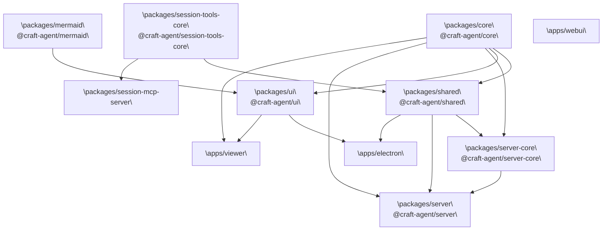
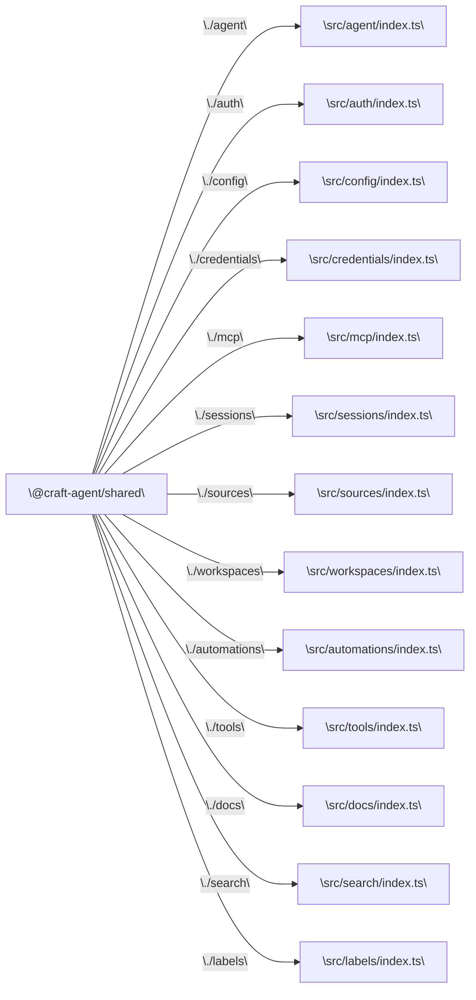

# Package Structure

<details>
<summary>Relevant source files</summary>

The following files were used as context for generating this wiki page:

- [package.json](package.json)
- [packages/core/package.json](packages/core/package.json)
- [packages/session-tools-core/package.json](packages/session-tools-core/package.json)
- [packages/shared/package.json](packages/shared/package.json)
- [packages/ui/package.json](packages/ui/package.json)

</details>


This page documents the monorepo workspace layout — all packages and apps, their declared purposes, and the dependency relationships between them. For how the Electron application itself is structured internally, see [Electron Application Architecture](). For build pipeline details, see [Build System]().

---

## Repository Layout

The repository is a Bun monorepo. Workspace membership is declared in the root [package.json:17-21]():

```json
"workspaces": [
  "packages/*",
  "apps/*",
  "!apps/online-docs"
]
```

`apps/online-docs` is excluded because it uses npm and Mintlify rather than the Bun toolchain, and is not cross-referenced by any other workspace package [package.json:20-20]().

**Workspace layout overview:**

```
craft-agent/
├── packages/
│   ├── core/                   @craft-agent/core
│   ├── shared/                 @craft-agent/shared
│   ├── ui/                     @craft-agent/ui
│   ├── session-tools-core/     @craft-agent/session-tools-core
│   ├── server-core/            @craft-agent/server-core
│   ├── server/                 @craft-agent/server
│   ├── mermaid/                @craft-agent/mermaid
│   ├── codex-types/            @craft-agent/codex-types
│   ├── bridge-mcp-server/
│   └── session-mcp-server/
├── apps/
│   ├── electron/
│   ├── viewer/
│   ├── webui/
│   ├── marketing/
│   └── online-docs/            (excluded from workspaces)
├── scripts/
└── package.json
```

Sources: [package.json:17-21]()

---

## Packages

The `packages/` directory contains shared libraries consumed by one or more apps. All packages use `"type": "module"` and point their `main` and `types` fields directly to TypeScript source — they are not pre-compiled; consumers (Vite, esbuild, or Bun itself) handle transpilation.

| npm name | Path | Description |
|---|---|---|
| `@craft-agent/core` | `packages/core` | Core types, storage primitives, and agent logic. [packages/core/package.json:5-5]() |
| `@craft-agent/shared` | `packages/shared` | Business logic: agent backends, auth, config, credentials, MCP integration, sessions, sources, workspaces. [packages/shared/package.json:5-5]() |
| `@craft-agent/ui` | `packages/ui` | Shared React component library: session viewer, chat display, markdown rendering. [packages/ui/package.json:5-5]() |
| `@craft-agent/session-tools-core` | `packages/session-tools-core` | Shared utilities for session-scoped tools (Claude and Codex). [packages/session-tools-core/package.json:5-5]() |
| `@craft-agent/server-core` | `packages/server-core` | Reusable headless server infrastructure: RPC handlers, transport, and runtime. |
| `@craft-agent/server` | `packages/server` | Standalone headless Craft Agent server optimized for the Bun runtime. |
| `@craft-agent/mermaid` | `packages/mermaid` | Mermaid diagram rendering wrapper used by the UI. |
| `@craft-agent/codex-types` | `packages/codex-types` | Type definitions for Codex integration. |
| `bridge-mcp-server` | `packages/bridge-mcp-server` | Stdio JSON-RPC MCP server binary. |
| `session-mcp-server` | `packages/session-mcp-server` | MCP server that exposes session-scoped tools via stdio transport. |

Sources: [packages/core/package.json:1-21](), [packages/shared/package.json:1-86](), [packages/ui/package.json:1-68](), [packages/session-tools-core/package.json:1-24]()

---

## Apps

| Path | Description | Build tool |
|---|---|---|
| `apps/electron` | Main Electron desktop application (main process + preload + renderer). | esbuild (main/preload), Vite (renderer) [package.json:50-52]() |
| `apps/viewer` | Standalone web app for viewing and sharing session transcripts. | Vite [package.json:76-76]() |
| `apps/webui` | Browser-based thin client for remote server connection. | Vite [package.json:80-80]() |
| `apps/marketing` | Marketing website. | Vite [package.json:86-86]() |
| `apps/online-docs` | Mintlify-based documentation site. Excluded from Bun workspaces. | npm + Mintlify [package.json:88-88]() |

Sources: [package.json:74-88]()

---

## Package Dependency Graph

**Inter-package dependency graph (`workspace:*` references):**



Sources: [packages/shared/package.json:65-66](), [packages/ui/package.json:20-20]()

---

## Package Details

### `@craft-agent/core`

The base layer. Contains no workspace dependencies. Exposes three subpath exports [packages/core/package.json:9-13]():

| Export path | Entry file |
|---|---|
| `.` | `src/index.ts` |
| `./types` | `src/types/index.ts` |
| `./utils` | `src/utils/index.ts` |

Peer dependencies: `@anthropic-ai/claude-agent-sdk >=0.2.19`, `@modelcontextprotocol/sdk >=1.0.0` [packages/core/package.json:14-17]().

Sources: [packages/core/package.json:1-21]()

---

### `@craft-agent/shared`

The largest shared package. Depends on `@craft-agent/core` and `@craft-agent/session-tools-core` via `workspace:*` [packages/shared/package.json:65-66](). Exposes a large surface of named subpath exports grouped by domain [packages/shared/package.json:14-62]():

| Export path | Domain |
|---|---|
| `./agent` | Agent backends, mode types, thinking levels |
| `./auth` | OAuth flows, callback page, provider types |
| `./config` | `StoredConfig`, config types |
| `./credentials` | `CredentialManager` |
| `./mcp` | MCP client integration |
| `./sessions` | Session persistence and management |
| `./sources` | Source types and configuration |
| `./workspaces` | Workspace management |
| `./automations` | Automation schema and scheduling |
| `./tools` | Tool definitions |
| `./docs` | Documentation file management |

Sources: [packages/shared/package.json:1-86]()

---

### `@craft-agent/ui`

The shared React component library. Depends on `@craft-agent/core` and `beautiful-mermaid` [packages/ui/package.json:20-22](). Exposes [packages/ui/package.json:9-18]():

| Export path | Contents |
|---|---|
| `.` | All public components and hooks |
| `./chat` | `SessionViewer`, turn utilities |
| `./chat/SessionViewer` | `SessionViewer` component |
| `./chat/TurnCard` | `TurnCard` component |
| `./markdown` | Markdown rendering components |
| `./context` | React context providers |
| `./styles` | `src/styles/index.css` (Tailwind entrypoint) |

Sources: [packages/ui/package.json:1-68]()

---

### `@craft-agent/session-tools-core`

Provides common utilities for tools that operate within a session context, such as `beautiful-mermaid` integration and Zod-to-JSON schema conversion for LLM tool calling [packages/session-tools-core/package.json:16-18]().

Sources: [packages/session-tools-core/package.json:1-24]()

---

## Subpath Export Surface (Code Entity Map)

The diagram below maps the declared subpath exports of `@craft-agent/shared` to their source file paths, providing a quick orientation for finding code:



Sources: [packages/shared/package.json:14-62]()

---

## Root-Level Scripts

The root `package.json` provides the primary developer entry points. Key script groups:

| Script prefix | Purpose |
|---|---|
| `electron:build:*` | Step-by-step build of main, preload, renderer, resources, and assets [package.json:50-54]() |
| `electron:build` | Full sequential build of all Electron artifacts [package.json:55-55]() |
| `electron:dev` | Dev mode launcher (watches and rebuilds) [package.json:57-57]() |
| `server:build` | Produces a server bundle via `scripts/build-server.ts` [package.json:30-30]() |
| `server:prod` | Runs the production server with WebUI assets [package.json:83-83]() |
| `typecheck:all` | Type checking across all workspace packages [package.json:27-27]() |
| `lint` | Runs ESLint and IPC check scripts [package.json:47-47]() |
| `sync-secrets` | Injects OAuth credentials from secrets store [package.json:61-61]() |

Sources: [package.json:22-92]()