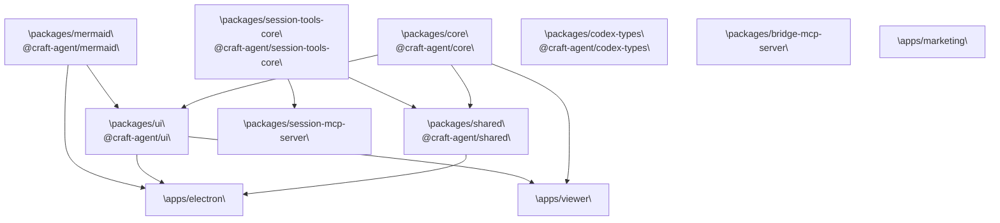
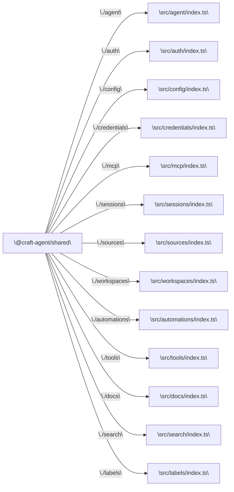

# Package Structure

<details>
<summary>Relevant source files</summary>

The following files were used as context for generating this wiki page:

- [package.json](package.json)
- [packages/core/package.json](packages/core/package.json)
- [packages/session-tools-core/package.json](packages/session-tools-core/package.json)
- [packages/shared/package.json](packages/shared/package.json)
- [packages/ui/package.json](packages/ui/package.json)

</details>

This page documents the monorepo workspace layout — all packages and apps, their declared purposes, and the dependency relationships between them. For how the Electron application itself is structured internally, see [Electron Application Architecture](#2.2). For build pipeline details, see [Build System](#5.2).

---

## Repository Layout

The repository is a Bun monorepo. Workspace membership is declared in the root [package.json:7-11]():

```json
"workspaces": [
  "packages/*",
  "apps/*",
  "!apps/online-docs"
]
```

`apps/online-docs` is excluded because it uses npm and Mintlify rather than the Bun toolchain, and is not cross-referenced by any other workspace package.

**Workspace layout overview:**

```
craft-agent/
├── packages/
│   ├── core/                   @craft-agent/core
│   ├── shared/                 @craft-agent/shared
│   ├── ui/                     @craft-agent/ui
│   ├── session-tools-core/     @craft-agent/session-tools-core
│   ├── mermaid/                @craft-agent/mermaid
│   ├── codex-types/            @craft-agent/codex-types
│   ├── bridge-mcp-server/
│   └── session-mcp-server/
├── apps/
│   ├── electron/
│   ├── viewer/
│   ├── marketing/
│   └── online-docs/            (excluded from workspaces)
├── scripts/
└── package.json
```

Sources: [package.json:7-11]()

---

## Packages

The `packages/` directory contains shared libraries consumed by one or more apps. All packages use `"type": "module"` and point their `main` and `types` fields directly to TypeScript source — they are not pre-compiled; consumers (Vite, esbuild, or Bun itself) handle transpilation.

| npm name                          | Path                          | Description                                                                                                |
| --------------------------------- | ----------------------------- | ---------------------------------------------------------------------------------------------------------- |
| `@craft-agent/core`               | `packages/core`               | Core types, storage primitives, and agent event types. No workspace dependencies.                          |
| `@craft-agent/shared`             | `packages/shared`             | Business logic: agent backends, auth, config, credentials, MCP integration, sessions, sources, workspaces. |
| `@craft-agent/ui`                 | `packages/ui`                 | Shared React component library: session viewer, chat display, markdown rendering.                          |
| `@craft-agent/session-tools-core` | `packages/session-tools-core` | Shared utilities and Zod schemas for session-scoped tools (used by both Claude and Codex paths).           |
| `@craft-agent/mermaid`            | `packages/mermaid`            | Mermaid diagram rendering wrapper used by the UI.                                                          |
| `@craft-agent/codex-types`        | `packages/codex-types`        | Type definitions for Codex integration.                                                                    |
| `bridge-mcp-server`               | `packages/bridge-mcp-server`  | Stdio JSON-RPC MCP server binary. See [MCP Server Binaries](#8.6).                                         |
| `session-mcp-server`              | `packages/session-mcp-server` | MCP server that exposes session-scoped tools via stdio transport. See [MCP Server Binaries](#8.6).         |

Sources: [packages/core/package.json:1-21](), [packages/shared/package.json:1-80](), [packages/ui/package.json:1-67](), [packages/session-tools-core/package.json:1-23]()

---

## Apps

| Path               | Description                                                            | Build tool                              |
| ------------------ | ---------------------------------------------------------------------- | --------------------------------------- |
| `apps/electron`    | Main Electron desktop application (main process + preload + renderer). | esbuild (main/preload), Vite (renderer) |
| `apps/viewer`      | Standalone web app for viewing and sharing session transcripts.        | Vite                                    |
| `apps/marketing`   | Marketing website.                                                     | Vite                                    |
| `apps/online-docs` | Mintlify-based documentation site. Excluded from Bun workspaces.       | npm + Mintlify                          |

Sources: [package.json:28-48]()

---

## Package Dependency Graph

**Inter-package dependency graph (`workspace:*` references):**



Sources: [packages/core/package.json:14-17](), [packages/shared/package.json:60-75](), [packages/ui/package.json:19-52](), [packages/session-tools-core/package.json:1-23]()

---

## Package Details

### `@craft-agent/core`

The base layer. Contains no workspace dependencies. Exposes three subpath exports:

| Export path | Entry file           |
| ----------- | -------------------- |
| `.`         | `src/index.ts`       |
| `./types`   | `src/types/index.ts` |
| `./utils`   | `src/utils/index.ts` |

Peer dependencies: `@anthropic-ai/claude-agent-sdk >=0.2.19`, `@modelcontextprotocol/sdk >=1.0.0`.

Sources: [packages/core/package.json:1-21]()

---

### `@craft-agent/shared`

The largest shared package. Depends on `@craft-agent/core` and `@craft-agent/session-tools-core` via `workspace:*`. Exposes a large surface of named subpath exports grouped by domain:

| Export path     | Domain                                      |
| --------------- | ------------------------------------------- |
| `./agent`       | Agent backends, mode types, thinking levels |
| `./auth`        | OAuth flows, callback page, provider types  |
| `./config`      | `StoredConfig`, config types                |
| `./credentials` | `CredentialManager`                         |
| `./mcp`         | MCP client integration                      |
| `./sessions`    | Session persistence and management          |
| `./sources`     | Source types and configuration              |
| `./workspaces`  | Workspace management                        |
| `./automations` | Automation schema and scheduling            |
| `./tools`       | Tool definitions                            |
| `./mentions`    | @mention parsing                            |
| `./search`      | Fuzzy search                                |
| `./docs`        | Documentation file management               |

Peer dependencies: `@anthropic-ai/claude-agent-sdk ^0.2.19`, `@modelcontextprotocol/sdk >=1.0.0`, `zod >=3.0.0`.

Sources: [packages/shared/package.json:1-80]()

---

### `@craft-agent/ui`

The shared React component library. Depends on `@craft-agent/core` and `beautiful-mermaid`. Has a large set of peer dependencies (Radix UI primitives, Tailwind, Shiki, react-markdown, KaTeX) that are satisfied by the consuming app. Exposes:

| Export path            | Contents                                     |
| ---------------------- | -------------------------------------------- |
| `.`                    | All public components and hooks              |
| `./chat`               | `SessionViewer`, turn utilities              |
| `./chat/SessionViewer` | `SessionViewer` component                    |
| `./chat/TurnCard`      | `TurnCard` component                         |
| `./chat/turn-utils`    | Turn data utilities                          |
| `./markdown`           | Markdown rendering components                |
| `./context`            | React context providers                      |
| `./styles`             | `src/styles/index.css` (Tailwind entrypoint) |

Sources: [packages/ui/package.json:1-67]()

---

### `@craft-agent/session-tools-core`

A focused utility package with no workspace dependencies. Provides Zod schemas and shared logic for session-scoped tools consumed by both `@craft-agent/shared` and `packages/session-mcp-server`. Runtime dependencies are `zod`, `zod-to-json-schema`, `beautiful-mermaid`, and `gray-matter`.

See [Session-Scoped Tools](#8.5) for more on how this package is used at runtime.

Sources: [packages/session-tools-core/package.json:1-23]()

---

## Subpath Export Surface (Code Entity Map)

The diagram below maps the declared subpath exports of `@craft-agent/shared` to their source file paths, providing a quick orientation for finding code:



Sources: [packages/shared/package.json:13-58]()

---

## Root-Level Scripts

The root `package.json` provides the primary developer entry points. Key script groups:

| Script prefix                 | Purpose                                                              |
| ----------------------------- | -------------------------------------------------------------------- |
| `electron:build:*`            | Step-by-step build of main, preload, renderer, resources, and assets |
| `electron:build`              | Full sequential build of all Electron artifacts                      |
| `electron:dev`                | Dev mode launcher (watches and rebuilds)                             |
| `electron:dist*`              | Packaged distribution builds (all platforms or specific platform)    |
| `viewer:*`                    | Vite dev/build/preview for `apps/viewer`                             |
| `marketing:*`                 | Vite dev/build/preview for `apps/marketing`                          |
| `typecheck` / `typecheck:all` | Type checking across packages                                        |
| `lint` / `lint:*`             | ESLint per package                                                   |
| `sync-secrets`                | Injects OAuth credentials from secrets store                         |

Sources: [package.json:12-54]()
