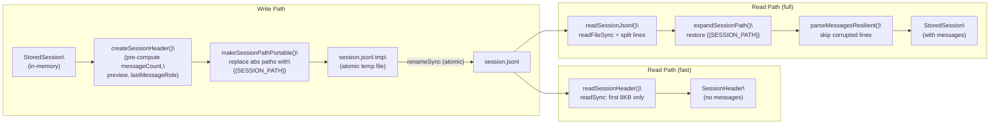
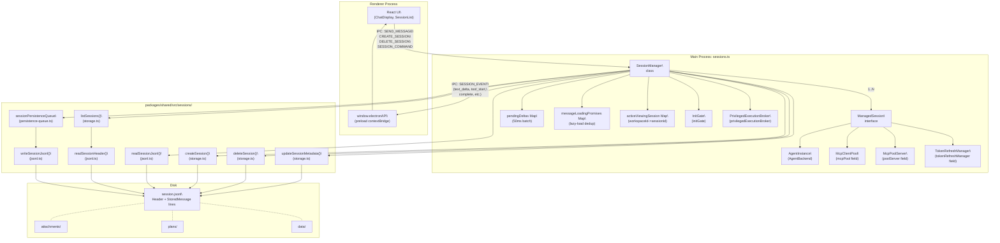

# Session Lifecycle

<details>
<summary>Relevant source files</summary>

The following files were used as context for generating this wiki page:

- [apps/electron/src/main/ipc.ts](apps/electron/src/main/ipc.ts)
- [apps/electron/src/main/sessions.ts](apps/electron/src/main/sessions.ts)
- [apps/electron/src/shared/types.ts](apps/electron/src/shared/types.ts)
- [packages/shared/src/sessions/jsonl.ts](packages/shared/src/sessions/jsonl.ts)
- [packages/shared/src/sessions/storage.ts](packages/shared/src/sessions/storage.ts)

</details>

## Purpose and Scope

This page covers the complete lifecycle of a session: creation, initialization, message flow, agent event processing, JSONL persistence, lazy loading, branching, sharing, and deletion. The central orchestrator is the `SessionManager` class in `apps/electron/src/main/sessions.ts`.

For the IPC channels used to trigger these operations, see [2.6](#2.6). For the on-disk directory layout under `~/.craft-agent/`, see [2.8](#2.8). For the agent backends that process messages, see [2.3](#2.3). For the web viewer used in sharing, see [2.10](#2.10).

---

## Core Data Structures

Three session representations exist at different layers of the stack:

| Representation   | Defined In                                | Purpose                                                        |
| ---------------- | ----------------------------------------- | -------------------------------------------------------------- |
| `ManagedSession` | `apps/electron/src/main/sessions.ts:553`  | Runtime state: agent instance, message queue, processing flags |
| `StoredSession`  | `packages/shared/src/sessions/storage.ts` | Persisted format, written to JSONL                             |
| `Session`        | `apps/electron/src/shared/types.ts:349`   | Renderer-visible subset, transmitted over IPC                  |
| `SessionHeader`  | `packages/shared/src/sessions/jsonl.ts`   | First JSONL line: pre-computed metadata for fast list loading  |

**`ManagedSession`** ([`apps/electron/src/main/sessions.ts:553-697`]()) is the authoritative in-memory object. Persistent fields (`name`, `labels`, `permissionMode`, `model`, etc.) overlap with disk storage; runtime-only fields are never written to disk:

| Field                  | Type                    | Notes                                                      |
| ---------------------- | ----------------------- | ---------------------------------------------------------- |
| `agent`                | `AgentInstance \| null` | Lazy-created on first `sendMessage()`                      |
| `isProcessing`         | `boolean`               | `true` while agent turn is running                         |
| `stopRequested`        | `boolean?`              | Set by `cancelProcessing()` to drain event loop gracefully |
| `processingGeneration` | `number`                | Monotonic counter; detects stale requests                  |
| `messageQueue`         | `Array<{...}>`          | Messages queued while `isProcessing` is `true`             |
| `messagesLoaded`       | `boolean`               | `false` until messages are lazy-loaded from JSONL          |
| `streamingText`        | `string`                | Accumulates in-progress `text_delta` chunks                |
| `tokenRefreshManager`  | `TokenRefreshManager`   | Per-session OAuth token refresh with rate limiting         |
| `agentReady`           | `Promise<void>?`        | Resolved when agent instance is initialized                |
| `connectionLocked`     | `boolean?`              | Set after first agent creation; blocks connection changes  |

**`createManagedSession()`** ([`apps/electron/src/main/sessions.ts:704-734`]()) constructs a `ManagedSession` by spreading all fields from any session-like source (metadata, config, or stored session), so new persistent fields propagate automatically.

**`managedToSession()`** ([`apps/electron/src/main/sessions.ts:758-776`]()) converts a `ManagedSession` to the renderer-side `Session` type, using `pickSessionFields()` for persistent fields and adding `workspaceId`, `workspaceName`, and `sessionFolderPath`.

Sources: `apps/electron/src/main/sessions.ts:553-776`, `apps/electron/src/shared/types.ts:349-430`

---

## JSONL Persistence Format

Sessions are stored at:

```
{workspaceRootPath}/sessions/{sessionId}/session.jsonl
```

**File structure:**

- **Line 1** — `SessionHeader`: all metadata plus pre-computed fields (`messageCount`, `preview`, `lastMessageRole`, `lastFinalMessageId`, `tokenUsage`)
- **Lines 2+** — One `StoredMessage` per line (JSON-serialized)

**Portability**: `makeSessionPathPortable()` ([`packages/shared/src/sessions/jsonl.ts:28-39`]()) replaces absolute session directory paths with the `{{SESSION_PATH}}` token before writing. `expandSessionPath()` restores them on read. This makes sessions portable across machines.

**Atomic writes**: `writeSessionJsonl()` ([`packages/shared/src/sessions/jsonl.ts:121-135`]()) writes to `session.jsonl.tmp`, then renames to `session.jsonl`. This prevents corrupt partial files if the process crashes mid-write.

**Fast list loading**: `readSessionHeader()` ([`packages/shared/src/sessions/jsonl.ts:54-70`]()) uses low-level `readSync` to read only the first 8 KB of each file, parsing just the header line. This makes `listSessions()` fast across large workspaces.

**Persistence queue**: `sessionPersistenceQueue` debounces writes during active sessions. `saveSession()` ([`packages/shared/src/sessions/storage.ts:305-308`]()) enqueues and immediately flushes. During streaming, rapid in-turn saves are coalesced via `persistenceQueue.enqueue()`.

**Resilient parsing**: `parseMessagesResilient()` ([`packages/shared/src/sessions/jsonl.ts:257-269`]()) skips corrupted/truncated lines instead of failing the entire session load.

**Session subdirectories** created alongside `session.jsonl`:

| Directory         | Contents                                     |
| ----------------- | -------------------------------------------- |
| `attachments/`    | File attachments (images, PDFs, Office docs) |
| `plans/`          | Plan markdown files (Safe Mode)              |
| `data/`           | `transform_data` tool JSON output            |
| `long_responses/` | Summarized large tool results                |
| `downloads/`      | Binary files from API responses              |

**Diagram: JSONL write and read pipeline**



Sources: `packages/shared/src/sessions/jsonl.ts:1-270`, `packages/shared/src/sessions/storage.ts:296-315`

---

## Session Creation

**IPC flow:** Renderer calls `IPC_CHANNELS.CREATE_SESSION` → `ipcMain.handle` ([`apps/electron/src/main/ipc.ts:297-302`]()) → `sessionManager.createSession(workspaceId, options)`.

`createStoredSession()` ([`packages/shared/src/sessions/storage.ts:177-238`]()) handles the disk side:

1. Ensures the sessions directory exists.
2. Generates a human-readable session ID via `generateUniqueSessionId()` — format: `YYMMDD-adjective-noun` (e.g., `260111-swift-river`), checked against existing IDs for uniqueness.
3. Creates the session directory with all subdirectories (`plans/`, `attachments/`, `long_responses/`, `data/`, `downloads/`).
4. Sets `sdkCwd` — the directory the SDK uses for its transcript store. This is **immutable**: even if `workingDirectory` changes later, `sdkCwd` stays fixed to preserve conversation continuity.
5. Writes an empty `StoredSession` to JSONL.

`sessionManager.createSession()` then wraps the result in `createManagedSession()` and inserts it into `this.sessions`.

**`CreateSessionOptions`** ([`apps/electron/src/shared/types.ts:436-468`]()) key fields:

| Field                                         | Effect                                                     |
| --------------------------------------------- | ---------------------------------------------------------- |
| `name`                                        | Pre-set name (AI-generated after first message if omitted) |
| `permissionMode`                              | Override workspace default (`safe`/`ask`/`allow-all`)      |
| `workingDirectory`                            | Initial CWD for agent Bash commands                        |
| `model`                                       | Per-session model override                                 |
| `llmConnection`                               | LLM connection slug (locked after first message)           |
| `hidden`                                      | Exclude from session list (e.g., mini edit sessions)       |
| `branchFromSessionId` + `branchFromMessageId` | Branch from a point in another session                     |
| `enabledSourceSlugs`                          | Pre-select sources for this session                        |
| `labels`                                      | Initial label set                                          |

Sources: `apps/electron/src/main/ipc.ts:297-302`, `packages/shared/src/sessions/storage.ts:177-238`, `apps/electron/src/shared/types.ts:436-468`

---

## Initialization and Lazy Loading

**Diagram: Startup initialization and lazy-loading flow**

```mermaid
sequenceDiagram
    participant App as "app (main.ts)"
    participant SM as "SessionManager"
    participant LS as "listSessions()\
(storage.ts)"
    participant Disk as "session.jsonl"
    participant Renderer as "Renderer"

    App->>SM: "initialize()"
    SM->>LS: "per workspace"
    LS->>Disk: "readSessionHeader()\
(8KB, first line only)"
    Disk-->>LS: "SessionHeader[]"
    LS-->>SM: "SessionMetadata[]"
    SM->>SM: "createManagedSession() for each\
(messagesLoaded = false)"
    SM->>SM: "initGate.resolve()"

    Renderer->>SM: "IPC: GET_SESSIONS\
(waitForInit() blocks until ready)"
    SM-->>Renderer: "Session[] (no messages)"

    Renderer->>SM: "IPC: GET_SESSION_MESSAGES (sessionId)"
    SM->>SM: "check messageLoadingPromises\
(deduplicate concurrent loads)"
    SM->>Disk: "readSessionJsonl() full file"
    Disk-->>SM: "StoredSession with messages"
    SM->>SM: "storedToMessage() for each\
messagesLoaded = true"
    SM-->>Renderer: "Session with messages"
```

**`initGate`** ([`apps/electron/src/main/sessions.ts:834`]()) is an `InitGate` instance. IPC handlers call `sessionManager.waitForInit()` before returning data, preventing empty session lists during startup races.

**`messageLoadingPromises: Map<string, Promise<void>>`** ([`apps/electron/src/main/sessions.ts:826`]()) deduplicates concurrent lazy-load requests: two simultaneous `GET_SESSION_MESSAGES` calls for the same session share a single disk read.

Sources: `apps/electron/src/main/sessions.ts:800-842`, `apps/electron/src/main/ipc.ts:141-174`, `packages/shared/src/sessions/storage.ts:343-384`

---

## Message Flow

The `SEND_MESSAGE` IPC handler returns immediately with `{ started: true }`; all results stream back via `SESSION_EVENT`.

**Diagram: sendMessage pipeline (renderer → agent → renderer)**

```mermaid
sequenceDiagram
    participant Renderer as "Renderer"
    participant IPC as "ipc.ts\
SEND_MESSAGE handler"
    participant SM as "SessionManager\
.sendMessage()"
    participant Agent as "AgentBackend\
(agent.chat())"
    participant PQ as "sessionPersistenceQueue"
    participant Disk as "session.jsonl"

    Renderer->>IPC: "SEND_MESSAGE\
(sessionId, message, attachments, options)"
    IPC->>SM: "sendMessage() — fire and forget"
    IPC-->>Renderer: "{ started: true } (immediate return)"

    SM->>SM: "lazy-create AgentBackend if agent == null\
buildServersFromSources()\
refreshOAuthTokensIfNeeded()"
    SM->>SM: "append user Message to messages[]\
PQ.enqueue()"
    SM-->>Renderer: "SESSION_EVENT: user_message {status: accepted}"

    SM->>Agent: "agent.chat(messages, options)"

    loop "streaming turn"
        Agent-->>SM: "AgentEvent: text_delta"
        SM->>SM: "batch into pendingDeltas\
(50ms flush timer)"
        SM-->>Renderer: "SESSION_EVENT: text_delta (batched)"
        Agent-->>SM: "AgentEvent: tool_start"
        SM-->>Renderer: "SESSION_EVENT: tool_start"
        Agent-->>SM: "AgentEvent: tool_result"
        SM-->>Renderer: "SESSION_EVENT: tool_result"
    end

    Agent-->>SM: "AgentEvent: complete"
    SM->>SM: "append assistant Message\
PQ.enqueue()\
updateBadgeCount()\
evaluateAutoLabels()\
generateTitle() if needed"
    SM->>PQ: "flush(sessionId)"
    PQ->>Disk: "writeSessionJsonl() (atomic)"
    SM-->>Renderer: "SESSION_EVENT: complete {tokenUsage, hasUnread}"
```

**Delta batching**: `pendingDeltas: Map<string, PendingDelta>` and `deltaFlushTimers` ([`apps/electron/src/main/sessions.ts:803-806`]()) batch `text_delta` events at `DELTA_BATCH_INTERVAL_MS = 50` ms, reducing IPC event frequency from potentially 50+/sec to ~20/sec.

**Monotonic timestamps**: `SessionManager.monotonic()` ([`apps/electron/src/main/sessions.ts:857-860`]()) ensures strictly increasing message timestamps: if `Date.now()` collides with the previous value, it increments by 1.

**Message interruption and queuing**: If a new message arrives while `isProcessing` is `true`, the current turn is interrupted via `cancelProcessing()`, the new message is pushed to `ManagedSession.messageQueue`, and when the interrupted turn completes the queued message is automatically dispatched.

**Agent creation**: The `AgentBackend` is created lazily on the first `sendMessage()`. The `connectionLocked` flag is set after the first agent creation to prevent switching LLM connections mid-session. `agentReady: Promise<void>` lets background operations (e.g., title generation) wait for the agent to be fully initialized.

Sources: `apps/electron/src/main/sessions.ts:792-806`, `apps/electron/src/main/ipc.ts:313-340`, `apps/electron/src/shared/types.ts:481-533`

---

## Session Events Reference

The `SessionEvent` union type ([`apps/electron/src/shared/types.ts:481-533`]()) defines all events pushed from main to renderer over `IPC_CHANNELS.SESSION_EVENT`:

| Event Type                            | Key Fields                                               | Trigger                           |
| ------------------------------------- | -------------------------------------------------------- | --------------------------------- |
| `user_message`                        | `message`, `status: accepted\|queued\|processing`        | User message accepted             |
| `text_delta`                          | `delta`, `turnId`                                        | Streaming text chunk              |
| `text_complete`                       | `text`, `isIntermediate`, `parentToolUseId`, `messageId` | Text block finalized              |
| `tool_start`                          | `toolName`, `toolUseId`, `toolInput`, `toolDisplayMeta`  | Agent invokes tool                |
| `tool_result`                         | `toolUseId`, `result`, `isError`                         | Tool returns result               |
| `complete`                            | `tokenUsage`, `hasUnread`                                | Turn finishes                     |
| `interrupted`                         | `message`, `queuedMessages`                              | Turn cancelled                    |
| `permission_request`                  | `request: PermissionRequest`                             | Agent needs user approval         |
| `credential_request`                  | `request: CredentialRequest`                             | Source needs credentials          |
| `permission_mode_changed`             | `permissionMode`, `previousPermissionMode`               | Mode transition                   |
| `status`                              | `message`, `statusType`                                  | Agent status (e.g., `compacting`) |
| `title_generated`                     | `title`                                                  | AI session name generated         |
| `error` / `typed_error`               | `error`                                                  | Processing error                  |
| `session_created` / `session_deleted` | `sessionId`                                              | Multi-window sync                 |
| `usage_update`                        | `tokenUsage.inputTokens`, `contextWindow`                | Real-time context display         |

Sources: `apps/electron/src/shared/types.ts:481-533`

---

## Read/Unread State

`hasUnread: boolean` is the single source of truth for the "NEW" badge.

- Set to `true` in the `complete` event handler when the user is **not** actively viewing the session.
- Set to `false` when the user navigates to the session (and `isProcessing` is `false`).
- `activeViewingSession: Map<string, string>` ([`apps/electron/src/main/sessions.ts:832`]()) tracks `workspaceId → sessionId` for the currently viewed session.
- Updated via `SESSION_COMMAND { type: 'setActiveViewing', workspaceId }` when the user navigates to a session.
- `markSessionRead()` / `markSessionUnread()` are explicit overrides.
- `getUnreadSummary()` returns `UnreadSummary` ([`apps/electron/src/shared/types.ts:196-203`]()) with `byWorkspace` counts and `hasUnreadByWorkspace` booleans for workspace selector indicators.

Sources: `apps/electron/src/main/sessions.ts:828-832`, `apps/electron/src/shared/types.ts:196-203`

---

## Session Metadata Operations

All metadata changes flow through the `SESSION_COMMAND` IPC handler ([`apps/electron/src/main/ipc.ts:390-468`]()):

| Command Type              | `SessionManager` Method                     | Disk Effect                                  |
| ------------------------- | ------------------------------------------- | -------------------------------------------- |
| `flag` / `unflag`         | `flagSession()` / `unflagSession()`         | `isFlagged` in JSONL header                  |
| `archive` / `unarchive`   | `archiveSession()` / `unarchiveSession()`   | `isArchived`, `archivedAt`                   |
| `rename`                  | `renameSession()`                           | `name` in JSONL header                       |
| `setSessionStatus`        | `setSessionStatus()`                        | `sessionStatus`                              |
| `setLabels`               | `setSessionLabels()`                        | `labels[]`                                   |
| `setPermissionMode`       | `setSessionPermissionMode()`                | `permissionMode`                             |
| `setThinkingLevel`        | `setSessionThinkingLevel()`                 | `thinkingLevel`                              |
| `setSources`              | `setSessionSources()`                       | `enabledSourceSlugs`                         |
| `updateWorkingDirectory`  | `updateWorkingDirectory()`                  | `workingDirectory`                           |
| `setConnection`           | `setSessionConnection()`                    | `llmConnection` (locked after first message) |
| `markRead` / `markUnread` | `markSessionRead()` / `markSessionUnread()` | `hasUnread`, `lastReadMessageId`             |

All methods call `updateSessionMetadata()` ([`packages/shared/src/sessions/storage.ts:524-567`]()) which does: `loadSession()` → mutate fields → `saveSession()`.

Sources: `apps/electron/src/main/ipc.ts:390-468`, `packages/shared/src/sessions/storage.ts:524-603`

---

## Branching

A branch creates a new session as a copy of a source session up to a specific message.

**Creation inputs** via `CreateSessionOptions` ([`apps/electron/src/shared/types.ts:462-467`]()):

- `branchFromSessionId` — source session
- `branchFromMessageId` — copy messages up to and including this ID

**Stored on `ManagedSession`** ([`apps/electron/src/main/sessions.ts:679-683`]()):

- `branchFromMessageId`
- `branchFromSdkSessionId` — SDK-level session ID for conversation continuity fork
- `branchFromSessionPath` — source session's storage path for backends that need it

`resolveSupportsBranching()` ([`apps/electron/src/main/sessions.ts:739-747`]()) returns `agent.supportsBranching` if the agent is live, otherwise defaults to `true`. The renderer uses this to conditionally show the branch UI.

`rollbackFailedBranchCreation()` ([`apps/electron/src/main/session-branch-cleanup.ts`]()) cleans up partially written files if branch creation fails mid-way.

Sources: `apps/electron/src/main/sessions.ts:679-683`, `apps/electron/src/main/sessions.ts:739-747`, `apps/electron/src/shared/types.ts:462-467`

---

## Sharing

Sessions can be shared to the web viewer application ([2.10](#2.10)).

**Flow**:

1. `SESSION_COMMAND { type: 'shareToViewer' }` → `sessionManager.shareToViewer(sessionId)`
2. Full session transcript is uploaded to the viewer service.
3. `sharedUrl` and `sharedId` are stored in `ManagedSession` and persisted via `updateSessionMetadata()`.
4. `SESSION_EVENT { type: 'session_shared', sharedUrl }` is emitted to all windows.

`updateShare()` re-uploads the current state of a shared session. `revokeShare()` deletes it from the viewer and clears `sharedUrl`/`sharedId`, emitting `session_unshared`.

During share/revoke operations, `isAsyncOperationOngoing = true` is set on the managed session, which causes a shimmer effect on the session title in the sidebar.

Sources: `apps/electron/src/shared/types.ts:494-495`, `apps/electron/src/shared/types.ts:207-212`, `apps/electron/src/main/sessions.ts` (shareToViewer/updateShare/revokeShare methods)

---

## Deletion

`IPC_CHANNELS.DELETE_SESSION` → `sessionManager.deleteSession(sessionId)` ([`apps/electron/src/main/ipc.ts:305-307`]()):

1. Calls `cancelProcessing()` if the session is currently active.
2. Removes the entry from `this.sessions: Map<string, ManagedSession>`.
3. Calls `deleteStoredSession()` → `rmSync(sessionDir, { recursive: true })` — removes the entire session folder including all attachments, plans, and data files.
4. Emits `SESSION_EVENT { type: 'session_deleted', sessionId }` to all windows for multi-window sync.

**Archived session pruning**: `deleteOldArchivedSessions()` ([`packages/shared/src/sessions/storage.ts:746-762`]()) is called with a configurable `retentionDays` value. It uses `archivedAt` (falling back to `lastUsedAt`) to determine eligibility.

Sources: `apps/electron/src/main/ipc.ts:305-307`, `packages/shared/src/sessions/storage.ts:429-441`, `packages/shared/src/sessions/storage.ts:746-762`

---

## Session Lifecycle State Machine

```mermaid
stateDiagram-v2
    [*] --> "Idle_NotLoaded" : "createSession()\
messagesLoaded=false"
    "Idle_NotLoaded" --> "Idle_Loaded" : "getSession()\
GET_SESSION_MESSAGES\
readSessionJsonl()"
    "Idle_Loaded" --> "Processing" : "sendMessage()\
isProcessing=true"
    "Processing" --> "Idle_Loaded" : "complete event\
isProcessing=false"
    "Processing" --> "Interrupted" : "cancelProcessing()\
stopRequested=true"
    "Interrupted" --> "Processing" : "messageQueue non-empty\
next message dispatched"
    "Interrupted" --> "Idle_Loaded" : "messageQueue empty"
    "Idle_Loaded" --> "Archived" : "archiveSession()\
isArchived=true"
    "Archived" --> "Idle_Loaded" : "unarchiveSession()"
    "Idle_Loaded" --> "[*]" : "deleteSession()\
rmSync(sessionDir)"
    "Archived" --> "[*]" : "deleteSession() or\
deleteOldArchivedSessions()"
```

Sources: `apps/electron/src/main/sessions.ts:553-697`, `packages/shared/src/sessions/storage.ts:429-441`, `packages/shared/src/sessions/storage.ts:608-624`

---

## Architecture Map

**Diagram: SessionManager and its relationships to key code entities**



Sources: `apps/electron/src/main/sessions.ts:799-837`, `packages/shared/src/sessions/storage.ts:1-115`, `packages/shared/src/sessions/jsonl.ts:1-270`, `apps/electron/src/main/ipc.ts:138-340`
