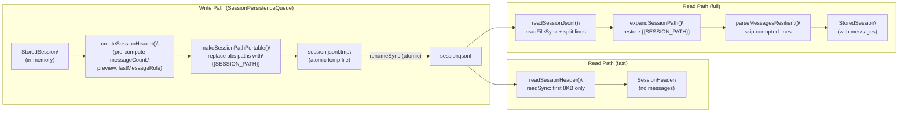
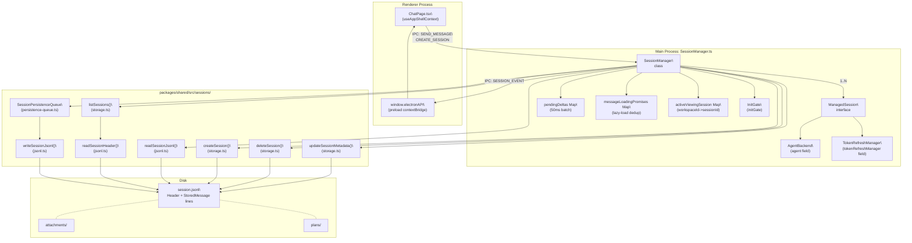

# Session Lifecycle

<details>
<summary>Relevant source files</summary>

The following files were used as context for generating this wiki page:

- [apps/electron/src/renderer/event-processor/handlers/session.ts](apps/electron/src/renderer/event-processor/handlers/session.ts)
- [apps/electron/src/renderer/lib/provider-icons.ts](apps/electron/src/renderer/lib/provider-icons.ts)
- [apps/electron/src/renderer/pages/ChatPage.tsx](apps/electron/src/renderer/pages/ChatPage.tsx)
- [packages/server-core/src/sessions/SessionManager.ts](packages/server-core/src/sessions/SessionManager.ts)
- [packages/shared/src/sessions/persistence-queue.ts](packages/shared/src/sessions/persistence-queue.ts)

</details>


## Purpose and Scope

This page covers the complete lifecycle of a session: creation, initialization, message flow, agent event processing, JSONL persistence, lazy loading, branching, sharing, and deletion. The central orchestrator is the `SessionManager` class.

For the IPC channels used to trigger these operations, see [2.6](). For the on-disk directory layout under `~/.craft-agent/`, see [2.8](). For the agent backends that process messages, see [2.3](). For the web viewer used in sharing, see [2.10]().

---

## Core Data Structures

Three session representations exist at different layers of the stack:

| Representation | Defined In | Purpose |
|---|---|---|
| `ManagedSession` | `packages/server-core/src/sessions/SessionManager.ts` | Runtime state: agent instance, message queue, processing flags |
| `StoredSession` | `packages/shared/src/sessions/storage.ts` | Persisted format, written to JSONL |
| `Session` | `packages/shared/src/protocol/index.ts` | Renderer-visible subset, transmitted over IPC |
| `SessionHeader` | `packages/shared/src/sessions/jsonl.ts` | First JSONL line: pre-computed metadata for fast list loading |

**`ManagedSession`** is the authoritative in-memory object managed by `SessionManager` [packages/server-core/src/sessions/SessionManager.ts:144-190](). Persistent fields (`name`, `labels`, `permissionMode`, `model`, etc.) overlap with disk storage; runtime-only fields are never written to disk:

| Field | Type | Notes |
|---|---|---|
| `agent` | `AgentBackend \| null` | Lazy-created on first `sendMessage()` [packages/server-core/src/sessions/SessionManager.ts:161-161]() |
| `isProcessing` | `boolean` | `true` while agent turn is running [packages/server-core/src/sessions/SessionManager.ts:152-152]() |
| `stopRequested` | `boolean?` | Set by `cancelProcessing()` to drain event loop gracefully [packages/server-core/src/sessions/SessionManager.ts:153-153]() |
| `processingGeneration` | `number` | Monotonic counter; detects stale requests [packages/server-core/src/sessions/SessionManager.ts:154-154]() |
| `messageQueue` | `Array<{...}>` | Messages queued while `isProcessing` is `true` [packages/server-core/src/sessions/SessionManager.ts:155-155]() |
| `messagesLoaded` | `boolean` | `false` until messages are lazy-loaded from JSONL [packages/server-core/src/sessions/SessionManager.ts:151-151]() |
| `streamingText` | `string` | Accumulates in-progress `text_delta` chunks [packages/server-core/src/sessions/SessionManager.ts:158-158]() |
| `tokenRefreshManager` | `TokenRefreshManager` | Per-session OAuth token refresh with rate limiting [packages/server-core/src/sessions/SessionManager.ts:173-173]() |
| `agentReady` | `Promise<void>?` | Resolved when agent instance is initialized [packages/server-core/src/sessions/SessionManager.ts:162-162]() |
| `connectionLocked` | `boolean?` | Set after first agent creation; blocks connection changes [packages/server-core/src/sessions/SessionManager.ts:166-166]() |

**`managedToSession()`** [packages/server-core/src/sessions/SessionManager.ts:356-374]() converts a `ManagedSession` to the renderer-side `Session` type, using `pickSessionFields()` for persistent fields and adding runtime context like `workspaceId` and `sessionFolderPath`.

Sources: [packages/server-core/src/sessions/SessionManager.ts:144-374](), [packages/shared/src/protocol/index.ts:1-100]()

---

## JSONL Persistence Format

Sessions are stored at:
`{workspaceRootPath}/sessions/{sessionId}/session.jsonl`

**File structure:**
- **Line 1** — `SessionHeader`: all metadata plus pre-computed fields (`messageCount`, `preview`, `lastMessageRole`, `lastFinalMessageId`, `tokenUsage`) [packages/shared/src/sessions/jsonl.ts:41-52]()
- **Lines 2+** — One `StoredMessage` per line (JSON-serialized) [packages/shared/src/sessions/jsonl.ts:12-26]()

**Portability**: `makeSessionPathPortable()` [packages/shared/src/sessions/jsonl.ts:28-39]() replaces absolute session directory paths with the `{{SESSION_PATH}}` token before writing. `expandSessionPath()` restores them on read.

**Atomic writes**: `SessionPersistenceQueue` [packages/shared/src/sessions/persistence-queue.ts:59-167]() handles atomic writes by writing to a `.tmp` file and then renaming. This prevents corrupt partial files.

**Fast list loading**: `readSessionHeader()` [packages/shared/src/sessions/jsonl.ts:54-70]() uses low-level `readSync` to read only the first 8 KB of each file, parsing just the header line. This makes `listSessions()` fast across large workspaces.

**Persistence queue**: `sessionPersistenceQueue` [packages/shared/src/sessions/persistence-queue.ts:59-167]() debounces writes during active sessions. It ensures that rapid successive flushes do not write to the same `.tmp` file concurrently [packages/shared/src/sessions/persistence-queue.ts:55-58]().

**Session subdirectories** created alongside `session.jsonl` [packages/shared/src/sessions/storage.ts:211-223]():
- `attachments/`: File attachments (images, PDFs, Office docs)
- `plans/`: Plan markdown files (Safe Mode)
- `data/`: `transform_data` tool JSON output
- `long_responses/`: Summarized large tool results
- `downloads/`: Binary files from API responses

**Diagram: JSONL write and read pipeline**



Sources: [packages/shared/src/sessions/jsonl.ts:1-270](), [packages/shared/src/sessions/storage.ts:296-315](), [packages/shared/src/sessions/persistence-queue.ts:59-167]()

---

## Session Creation

The `SessionManager.createSession(workspaceId, options)` [packages/server-core/src/sessions/SessionManager.ts:488-518]() orchestrates creation.

`createStoredSession()` [packages/shared/src/sessions/storage.ts:177-238]() handles the disk side:
1. Ensures the sessions directory exists.
2. Generates a human-readable session ID via `generateSessionId()` [packages/shared/src/sessions/storage.ts:182-182]().
3. Creates the session directory with all subdirectories (`plans/`, `attachments/`, etc.).
4. Sets `sdkCwd` — the directory the SDK uses for its transcript store. This is **immutable** to preserve conversation continuity.
5. Writes an empty `StoredSession` to JSONL.

`SessionManager` then wraps the result in `createManagedSession()` and inserts it into its internal `sessions` map [packages/server-core/src/sessions/SessionManager.ts:515-515]().

**`CreateSessionOptions`** key fields [packages/shared/src/protocol/index.ts:1-100]():
- `permissionMode`: Override workspace default (`safe`/`ask`/`allow-all`).
- `workingDirectory`: Initial CWD for agent Bash commands.
- `llmConnection`: LLM connection slug (locked after first message).
- `branchFromSessionId` + `branchFromMessageId`: Branch from a point in another session.

Sources: [packages/server-core/src/sessions/SessionManager.ts:488-518](), [packages/shared/src/sessions/storage.ts:177-238](), [packages/shared/src/protocol/index.ts:1-100]()

---

## Initialization and Lazy Loading

**Diagram: Startup initialization and lazy-loading flow**

```mermaid
sequenceDiagram
    participant App as "app (main.ts)"
    participant SM as "SessionManager"
    participant LS as "listSessions()\
(storage.ts)"
    participant Disk as "session.jsonl"
    participant Renderer as "Renderer"

    App->>SM: "initialize()"
    SM->>LS: "per workspace"
    LS->>Disk: "readSessionHeader()\
(8KB, first line only)"
    Disk-->>LS: "SessionHeader[]"
    LS-->>SM: "SessionMetadata[]"
    SM->>SM: "createManagedSession() for each\
(messagesLoaded = false)"
    SM->>SM: "initGate.resolve()"

    Renderer->>SM: "IPC: GET_SESSIONS\
(waitForInit() blocks until ready)"
    SM-->>Renderer: "Session[] (no messages)"

    Renderer->>SM: "IPC: GET_SESSION_MESSAGES (sessionId)"
    SM->>SM: "check messageLoadingPromises\
(deduplicate concurrent loads)"
    SM->>Disk: "readSessionJsonl() full file"
    Disk-->>SM: "StoredSession with messages"
    SM->>SM: "storedToMessage() for each\
messagesLoaded = true"
    SM-->>Renderer: "Session with messages"
```

**`initGate`** [packages/server-core/src/sessions/SessionManager.ts:210-210]() is an `InitGate` instance. IPC handlers call `sessionManager.waitForInit()` before returning data, preventing empty session lists during startup races.

**`messageLoadingPromises: Map<string, Promise<void>>`** [packages/server-core/src/sessions/SessionManager.ts:202-202]() deduplicates concurrent lazy-load requests: two simultaneous `GET_SESSION_MESSAGES` calls for the same session share a single disk read.

Sources: [packages/server-core/src/sessions/SessionManager.ts:192-210](), [packages/shared/src/sessions/storage.ts:343-384]()

---

## Message Flow

The `sendMessage` flow in `SessionManager` [packages/server-core/src/sessions/SessionManager.ts:792-950]() handles the agent turn.

**Diagram: sendMessage pipeline (renderer → agent → renderer)**

```mermaid
sequenceDiagram
    participant Renderer as "Renderer"
    participant SM as "SessionManager\
.sendMessage()"
    participant Agent as "AgentBackend\
(agent.chat())"
    participant PQ as "SessionPersistenceQueue"
    participant Disk as "session.jsonl"

    Renderer->>SM: "sendMessage(sessionId, message, attachments, options)"
    
    SM->>SM: "lazy-create AgentBackend if agent == null\
refreshOAuthTokensIfNeeded()"
    SM->>SM: "append user Message to messages[]\
PQ.enqueue()"
    SM-->>Renderer: "SESSION_EVENT: user_message {status: accepted}"

    SM->>Agent: "agent.chat(messages, options)"

    loop "streaming turn"
        Agent-->>SM: "AgentEvent: text_delta"
        SM->>SM: "batch into pendingDeltas\
(50ms flush timer)"
        SM-->>Renderer: "SESSION_EVENT: text_delta (batched)"
        Agent-->>SM: "AgentEvent: tool_start"
        SM-->>Renderer: "SESSION_EVENT: tool_start"
        Agent-->>SM: "AgentEvent: tool_result"
        SM-->>Renderer: "SESSION_EVENT: tool_result"
    end

    Agent-->>SM: "AgentEvent: complete"
    SM->>SM: "append assistant Message\
PQ.enqueue()\
updateBadgeCount()\
evaluateAutoLabels()"
    SM->>PQ: "flush(sessionId)"
    PQ->>Disk: "write() (atomic temp file)"
    SM-->>Renderer: "SESSION_EVENT: complete {tokenUsage, hasUnread}"
```

**Delta batching**: `pendingDeltas: Map<string, PendingDelta>` and `deltaFlushTimers` [packages/server-core/src/sessions/SessionManager.ts:214-215]() batch `text_delta` events at `DELTA_BATCH_INTERVAL_MS = 50` ms.

**Message interruption and queuing**: If a new message arrives while `isProcessing` is `true`, the current turn is interrupted via `cancelProcessing()` [packages/server-core/src/sessions/SessionManager.ts:1145-1175](), and the new message is pushed to `ManagedSession.messageQueue`.

Sources: [packages/server-core/src/sessions/SessionManager.ts:792-950](), [packages/server-core/src/sessions/SessionManager.ts:214-215](), [packages/server-core/src/sessions/SessionManager.ts:1145-1175]()

---

## Read/Unread State

`hasUnread: boolean` is the single source of truth for the "NEW" badge.

- `activeViewingSession: Map<string, string>` [packages/server-core/src/sessions/SessionManager.ts:208-208]() tracks `workspaceId → sessionId` for the currently viewed session.
- Set to `true` in the `complete` event handler when the user is **not** actively viewing the session [packages/server-core/src/sessions/SessionManager.ts:940-940]().
- `getUnreadSummary()` [packages/server-core/src/sessions/SessionManager.ts:468-486]() returns counts and indicators for workspace selectors.
- The renderer uses `onSetActiveViewingSession` [apps/electron/src/renderer/pages/ChatPage.tsx:125-125]() to inform the main process which session is being viewed, triggering unread state updates.

Sources: [packages/server-core/src/sessions/SessionManager.ts:208-208](), [packages/server-core/src/sessions/SessionManager.ts:468-486](), [packages/server-core/src/sessions/SessionManager.ts:940-940](), [apps/electron/src/renderer/pages/ChatPage.tsx:123-128]()

---

## Branching

A branch creates a new session as a copy of a source session up to a specific message.

**Creation inputs** via `CreateSessionOptions` [packages/shared/src/protocol/index.ts:1-100]():
- `branchFromSessionId`: source session.
- `branchFromMessageId`: copy messages up to and including this ID.

**Stored on `ManagedSession`** [packages/server-core/src/sessions/SessionManager.ts:179-183]():
- `branchFromMessageId`
- `branchFromSdkSessionId`: SDK-level session ID for conversation continuity fork.
- `branchFromSessionPath`: source session's storage path.

`resolveSupportsBranching()` [packages/server-core/src/sessions/SessionManager.ts:337-345]() returns `agent.supportsBranching` if the agent is live.

Sources: [packages/server-core/src/sessions/SessionManager.ts:179-183](), [packages/server-core/src/sessions/SessionManager.ts:337-345](), [packages/shared/src/protocol/index.ts:1-100]()

---

## Deletion

`SessionManager.deleteSession(sessionId)` [packages/server-core/src/sessions/SessionManager.ts:520-542]():
1. Calls `cancelProcessing()` if the session is currently active.
2. Removes the entry from `this.sessions: Map<string, ManagedSession>`.
3. Calls `deleteStoredSession()` [packages/shared/src/sessions/storage.ts:429-441]() → `rmSync(sessionDir, { recursive: true })`.
4. Emits `SESSION_EVENT { type: 'session_deleted', sessionId }` for multi-window sync.

**Archived session pruning**: `deleteOldArchivedSessions()` [packages/shared/src/sessions/storage.ts:746-762]() is called based on `retentionDays`.

Sources: [packages/server-core/src/sessions/SessionManager.ts:520-542](), [packages/shared/src/sessions/storage.ts:429-441](), [packages/shared/src/sessions/storage.ts:746-762]()

---

## Architecture Map

**Diagram: SessionManager and its relationships to key code entities**



Sources: [packages/server-core/src/sessions/SessionManager.ts:144-215](), [packages/shared/src/sessions/storage.ts:1-115](), [packages/shared/src/sessions/jsonl.ts:1-270](), [packages/shared/src/sessions/persistence-queue.ts:59-167]()