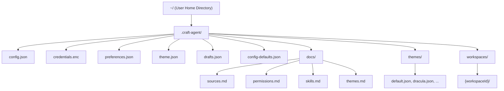
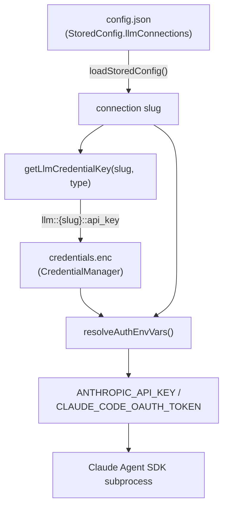
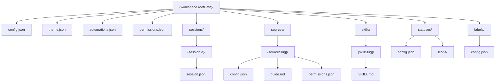
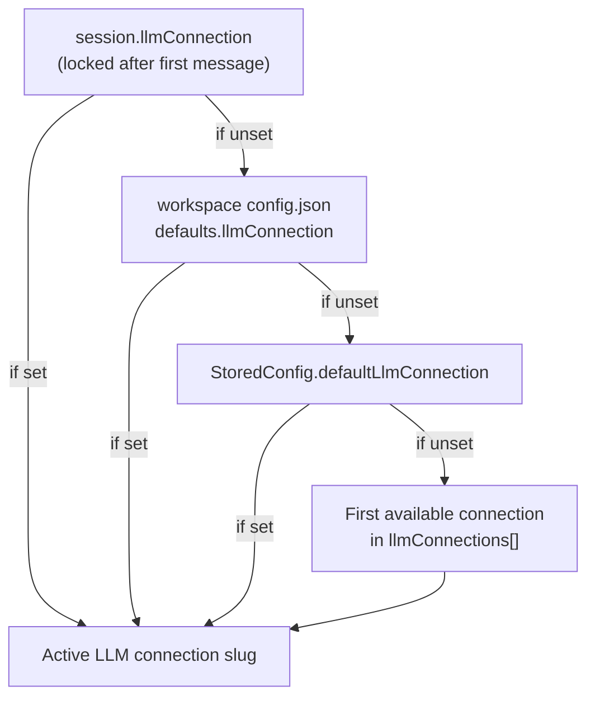
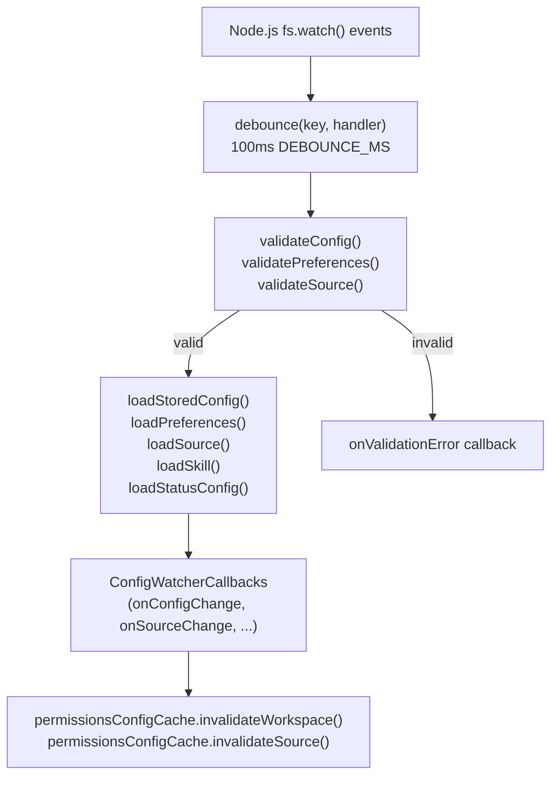
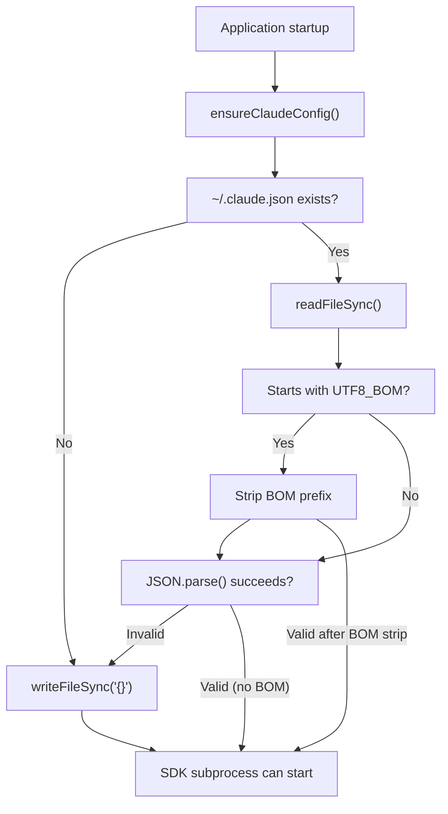

# Storage & Configuration

<details>
<summary>Relevant source files</summary>

The following files were used as context for generating this wiki page:

- [README.md](README.md)
- [apps/electron/src/main/lib/config-watcher.ts](apps/electron/src/main/lib/config-watcher.ts)
- [packages/shared/src/agent/diagnostics.ts](packages/shared/src/agent/diagnostics.ts)
- [packages/shared/src/config/llm-connections.ts](packages/shared/src/config/llm-connections.ts)
- [packages/shared/src/config/storage.ts](packages/shared/src/config/storage.ts)
- [packages/shared/src/utils/summarize.ts](packages/shared/src/utils/summarize.ts)

</details>

This document describes the file-based storage architecture for Craft Agents, including the directory structure, configuration hierarchy, session persistence, and credential encryption. All data is stored in the `~/.craft-agent/` directory using JSON and JSONL formats with AES-256-GCM encryption for sensitive credentials.

For workspace management and creation, see [Workspaces](#4.1). For credential encryption internals and keychain integration, see [Credential Storage & Encryption](#7.2). For session lifecycle and state management, see [Session Lifecycle](#2.7).

---

## Storage Root Directory

All Craft Agents data is stored in a single directory at `~/.craft-agent/` in the user's home directory. This location is used consistently across all platforms (macOS, Windows, Linux) and contains application-level configuration, workspace data, and bundled documentation.



**`~/.craft-agent/` Root Layout**

Sources: [README.md:293-311](), [packages/shared/src/config/storage.ts:72-74](), [packages/shared/src/config/storage.ts:803-804](), [packages/shared/src/config/storage.ts:880-881]()

---

## Application-Level Configuration

Application-level configuration files control global settings that apply to all workspaces. These files reside directly in `~/.craft-agent/`.

### config.json (Application)

The main application configuration file is managed by `loadStoredConfig()` and `saveConfig()` in `packages/shared/src/config/storage.ts`. It is the serialized form of the `StoredConfig` interface.

| Field                    | Type                     | Description                                                      |
| ------------------------ | ------------------------ | ---------------------------------------------------------------- |
| `llmConnections`         | `LlmConnection[]`        | Named LLM provider configurations (see section below)            |
| `defaultLlmConnection`   | `string`                 | Slug of the global default connection for new sessions           |
| `workspaces`             | `Workspace[]`            | Array of workspace registrations                                 |
| `activeWorkspaceId`      | `string \| null`         | Currently active workspace ID                                    |
| `activeSessionId`        | `string \| null`         | Currently active session ID                                      |
| `notificationsEnabled`   | `boolean`                | Desktop notifications for task completion (default: `true`)      |
| `colorTheme`             | `string`                 | Preset theme ID (e.g., `'dracula'`, `'nord'`)                    |
| `dismissedUpdateVersion` | `string`                 | Version string skipped in auto-update notifications              |
| `autoCapitalisation`     | `boolean`                | Auto-capitalize first letter of input (default: `true`)          |
| `sendMessageKey`         | `'enter' \| 'cmd-enter'` | Key binding to send messages (default: `'enter'`)                |
| `spellCheck`             | `boolean`                | Spell check in input field (default: `false`)                    |
| `keepAwakeWhileRunning`  | `boolean`                | Prevent sleep during active sessions (default: `false`)          |
| `richToolDescriptions`   | `boolean`                | Add intent/display name metadata to tool calls (default: `true`) |
| `gitBashPath`            | `string`                 | Windows only: path to `bash.exe` for SDK subprocess              |

**Workspace Entry Structure** (within `workspaces` array):

```json
{
  "id": "uuid-string",
  "name": "Workspace Name",
  "rootPath": "~/path/to/workspace",
  "createdAt": 1700000000000,
  "lastAccessedAt": 1700000001000
}
```

Workspace `rootPath` values are stored in portable form (tilde-prefixed) via `toPortablePath()` and expanded on load via `expandPath()`. On startup, `syncWorkspaces()` auto-discovers workspace directories not yet tracked in the config.

Each setting has a typed accessor function (e.g., `getAutoCapitalisation()`, `setAutoCapitalisation()`) that reads from `StoredConfig` and falls back to `config-defaults.json` if the field is unset.

Sources: [packages/shared/src/config/storage.ts:46-70](), [packages/shared/src/config/storage.ts:141-195](), [packages/shared/src/config/storage.ts:574-607]()

### config-defaults.json

A read-only defaults file at `~/.craft-agent/config-defaults.json`, synced from bundled app resources on every launch by `syncConfigDefaults()`. It provides fallback values for all `StoredConfig` settings. `loadConfigDefaults()` reads this file; it is used internally by the typed accessors when a field is absent from `config.json`.

Sources: [packages/shared/src/config/storage.ts:78-126]()

### credentials.enc

Binary file containing AES-256-GCM encrypted credentials. Stores LLM API keys, OAuth tokens, and third-party service credentials (Google, Slack, Microsoft). All credential operations go through `CredentialManager` which handles encryption/decryption transparently. Credential keys for LLM connections use the format `llm::{slug}::{credentialType}` (defined by `getLlmCredentialKey()`).

See page [7.2]() for full encryption details.

Sources: [packages/shared/src/config/llm-connections.ts:272-275](), [packages/shared/src/config/storage.ts:397-408]()

### preferences.json

User-level preferences that the agent can reference for personalization. Loaded by `loadPreferences()` in `config-watcher.ts`.

| Field       | Type                           | Description                                |
| ----------- | ------------------------------ | ------------------------------------------ |
| `name`      | `string`                       | User's display name                        |
| `timezone`  | `string`                       | User's timezone (e.g., `America/New_York`) |
| `location`  | `{ city?, region?, country? }` | User's location for context                |
| `language`  | `string`                       | Preferred language for agent responses     |
| `notes`     | `string`                       | Freeform notes injected into agent context |
| `updatedAt` | `number`                       | Timestamp of last update                   |

Sources: [apps/electron/src/main/lib/config-watcher.ts:71-82]()

### theme.json (Application)

Application-level theme overrides loaded by `loadAppTheme()` and saved by `saveAppTheme()`. The `ThemeOverrides` type defines valid fields. Workspace-level `theme.json` files can override the app theme for workspace-specific styling. See page [4.8]() for the full theme cascade.

### themes/ Directory

Preset theme files (`default.json`, `dracula.json`, `nord.json`, etc.) are synced from bundled app resources on launch by `ensurePresetThemes()`. Files are copied only when missing or invalid—valid user-customized files are preserved. `loadPresetThemes()` reads all `.json` files in this directory and returns them sorted by name.

Sources: [packages/shared/src/config/storage.ts:896-913](), [packages/shared/src/config/storage.ts:931-1013]()

### docs/ Directory

Bundled documentation synced from app resources on launch by `initializeDocs()`. These markdown files provide reference material that the agent can access when performing configuration tasks. See page [2.9]() for full details on the doc sync system and `DOC_REFS` constants.

---

## LLM Connections

LLM connections (`LlmConnection[]`) are the authoritative configuration for AI provider backends. They replace the older flat `authType`/`model` fields that previously existed in `StoredConfig`. Each session locks to a specific connection slug after the first message.

### LlmConnection Structure

Defined in `packages/shared/src/config/llm-connections.ts`:

| Field            | Type                            | Description                                             |
| ---------------- | ------------------------------- | ------------------------------------------------------- |
| `slug`           | `string`                        | URL-safe unique identifier (e.g., `'anthropic-api'`)    |
| `name`           | `string`                        | Display name shown in UI                                |
| `providerType`   | `LlmProviderType`               | Backend implementation to use (see below)               |
| `authType`       | `LlmAuthType`                   | Authentication mechanism                                |
| `baseUrl`        | `string`                        | Custom endpoint URL (required for `*_compat` providers) |
| `models`         | `ModelDefinition[] \| string[]` | Available models for this connection                    |
| `defaultModel`   | `string`                        | Default model ID                                        |
| `piAuthProvider` | `string`                        | Pi SDK provider name (e.g., `'github-copilot'`)         |
| `awsRegion`      | `string`                        | AWS region for Bedrock connections                      |
| `gcpProjectId`   | `string`                        | GCP project ID for Vertex connections                   |
| `createdAt`      | `number`                        | Creation timestamp                                      |
| `lastUsedAt`     | `number`                        | Last-used timestamp                                     |

### Provider Types (`LlmProviderType`)

| Value              | Backend          | Notes                                                                     |
| ------------------ | ---------------- | ------------------------------------------------------------------------- |
| `anthropic`        | Claude Agent SDK | Direct Anthropic API; supports `api_key` and `oauth`                      |
| `anthropic_compat` | Claude Agent SDK | Custom Anthropic-compatible endpoint (OpenRouter, Ollama, etc.)           |
| `bedrock`          | Claude Agent SDK | AWS Bedrock; supports `iam_credentials`, `bearer_token`, `environment`    |
| `vertex`           | Claude Agent SDK | Google Vertex AI; supports `oauth`, `service_account_file`, `environment` |
| `pi`               | Pi SDK           | Unified LLM API (20+ providers); supports `api_key`, `oauth`, `none`      |
| `pi_compat`        | Pi SDK           | Custom Pi-compatible endpoint                                             |

### Auth Types (`LlmAuthType`)

| Value                   | UI Pattern                       | Credential Storage                                  |
| ----------------------- | -------------------------------- | --------------------------------------------------- |
| `api_key`               | Single API key field             | `llm::{slug}::api_key` in `credentials.enc`         |
| `api_key_with_endpoint` | API key + endpoint URL           | `llm::{slug}::api_key` in `credentials.enc`         |
| `oauth`                 | Browser OAuth flow               | `llm::{slug}::oauth_token` in `credentials.enc`     |
| `bearer_token`          | Single bearer token              | `llm::{slug}::api_key` in `credentials.enc`         |
| `iam_credentials`       | AWS access key + secret + region | `llm::{slug}::iam_credentials` in `credentials.enc` |
| `service_account_file`  | GCP JSON file upload             | `llm::{slug}::service_account` in `credentials.enc` |
| `environment`           | Auto-detect from env vars        | No storage needed                                   |
| `none`                  | No auth (local models)           | No storage needed                                   |

### Connection Resolution

`resolveEffectiveConnectionSlug()` implements the fallback chain used everywhere a connection slug is needed:

```
1. Session-locked connection (set after first message)
2. Workspace-level default override
3. Global default (isDefault flag on StoredConfig.defaultLlmConnection)
4. First available connection
```

`resolveAuthEnvVars()` translates a connection's credentials into environment variables (e.g., `ANTHROPIC_API_KEY`, `CLAUDE_CODE_OAUTH_TOKEN`) for injection into the Claude Agent SDK subprocess.

**LLM Connection Data Flow**



Sources: [packages/shared/src/config/llm-connections.ts:98-151](), [packages/shared/src/config/llm-connections.ts:469-478](), [packages/shared/src/config/llm-connections.ts:609-664](), [packages/shared/src/config/llm-connections.ts:272-275]()

### LLM Connection Migrations

When loading connections with the legacy `type` field (`'anthropic' | 'openai' | 'openai-compat'`), `migrateLlmConnection()` converts them to the new `providerType` format. `migrateConnectionType()` maps `openai → pi` and `openai-compat → pi_compat`. The legacy `type` field is preserved on the object for backwards compatibility during the transition period.

Sources: [packages/shared/src/config/llm-connections.ts:542-700]()

---

## Workspace-Level Configuration

Each workspace is isolated in its own directory at `~/.craft-agent/workspaces/{id}/`. Workspaces have their own configuration, sessions, sources, skills, and permissions.



**Workspace Directory Structure**

The workspace `rootPath` is stored in `config.json` and defaults to a subdirectory of `~/.craft-agent/workspaces/`. Workspaces can be placed at any path; `createWorkspaceAtPath()` initializes the directory structure. `syncWorkspaces()` auto-discovers valid workspace directories on startup.

Sources: [README.md:293-311](), [apps/electron/src/main/lib/config-watcher.ts:349-455](), [packages/shared/src/config/storage.ts:525-567](), [packages/shared/src/config/storage.ts:573-607]()

### config.json (Workspace)

Workspace configuration defines defaults that apply to all sessions within the workspace. Loaded by `loadWorkspaceConfig()` and saved by `saveWorkspaceConfig()`.

| Field                              | Type                             | Description                                                                       |
| ---------------------------------- | -------------------------------- | --------------------------------------------------------------------------------- |
| `name`                             | `string`                         | Workspace display name (single source of truth; not stored in global config.json) |
| `id`                               | `string`                         | Workspace UUID                                                                    |
| `createdAt`                        | `number`                         | Creation timestamp                                                                |
| `defaults.permissionMode`          | `'safe' \| 'ask' \| 'allow-all'` | Default permission mode for new sessions                                          |
| `defaults.cyclablePermissionModes` | `array`                          | Modes available in Shift+Tab cycle                                                |
| `defaults.thinkingLevel`           | `'off' \| 'think' \| 'max'`      | Default extended thinking level                                                   |
| `defaults.workingDirectory`        | `string`                         | Default CWD for command execution                                                 |
| `defaults.llmConnection`           | `string`                         | Workspace-level default LLM connection slug                                       |

Sessions inherit workspace defaults at creation time. See page [4.1]() for full workspace configuration details.

Sources: [packages/shared/src/config/storage.ts:434-462]()

### sessions/ Directory

Contains one subdirectory per session: `sessions/{sessionId}/session.jsonl`. Each JSONL file stores the session's complete conversation history, with each line being a complete JSON object.

**JSONL Format Benefits:**

- **Append-only writes**: New events are appended without rewriting the entire file
- **Streaming reads**: Events can be read line-by-line for efficient lazy loading
- **Crash resilience**: Partial writes corrupt only the last line
- **Human-readable**: Inspectable with standard text tools

The first line of every `session.jsonl` is the session header (a `SessionHeader` record) containing metadata such as title, status, flags, and the locked LLM connection slug. `readSessionHeader()` reads only this first line for efficient list rendering.

See page [2.7]() for complete session lifecycle and JSONL format details.

Sources: [apps/electron/src/main/lib/config-watcher.ts:460-476]()

### sources/ Directory

Contains one subdirectory per source: `sources/{sourceSlug}/`. Each source directory contains:

| File               | Purpose                                                      |
| ------------------ | ------------------------------------------------------------ |
| `config.json`      | Source type, connection parameters, auth, icon URL           |
| `guide.md`         | Agent-readable documentation for the source                  |
| `permissions.json` | Per-source tool permission overrides                         |
| `icon.*`           | Local icon file (downloaded from URL if specified in config) |

Sources are loaded by `loadSource()` (single) and `loadWorkspaceSources()` (all). See page [4.3]() for source configuration details.

Sources: [apps/electron/src/main/lib/config-watcher.ts:378-401]()

### skills/ Directory

Contains one subdirectory per skill: `skills/{skillSlug}/`. Each skill directory contains:

| File       | Purpose                                                                          |
| ---------- | -------------------------------------------------------------------------------- |
| `SKILL.md` | Skill instructions in markdown (injected into agent system prompt on `@mention`) |
| `icon.*`   | Local icon file (downloaded from URL if `icon:` metadata is set in `SKILL.md`)   |

Loaded by `loadSkill()` (single) and `loadAllSkills()` (all). See page [4.4]() for the skill system.

Sources: [apps/electron/src/main/lib/config-watcher.ts:403-420]()

### statuses/ Directory

Contains status workflow configuration at `statuses/config.json`, plus optional icon files in `statuses/icons/`. Loaded by `loadStatusConfig()`. See page [4.6]() for the full status workflow system.

### labels/ Directory

Contains label configuration at `labels/config.json`. Labels are color-tagged metadata applied to sessions. See page [4.7]() for details.

### automations.json

Workspace-level event-driven automation config (version 2 schema). Watched by `ConfigWatcher` via `AUTOMATIONS_CONFIG_FILE`. See page [4.9]() for the automations schema.

### permissions.json (Workspace)

Workspace-level permission rules file. Per-source permission overrides live at `sources/{slug}/permissions.json`. All permission files are managed through `permissionsConfigCache`. See page [4.5]().

---

## Configuration Hierarchy and Cascading

Configuration values cascade from application level → workspace level → session level, with each level able to override the parent.

**LLM Connection Resolution (via `resolveEffectiveConnectionSlug()`)**



**Permission Mode Resolution:**

1. Session-level override (if user changed mode mid-session)
2. Workspace `defaults.permissionMode`
3. System default (`'ask'`)

**Theme Resolution:**

1. Workspace `theme.json` (if present)
2. App `~/.craft-agent/theme.json` (if present)
3. Selected preset theme from `~/.craft-agent/themes/{colorTheme}.json`
4. Built-in defaults

**config-defaults.json Fallback:**

When a field is absent from `StoredConfig` (e.g., after upgrade), the typed accessor (e.g., `getAutoCapitalisation()`) calls `loadConfigDefaults()` to get the bundled default value. This avoids hardcoding defaults in application code.

Sources: [packages/shared/src/config/llm-connections.ts:469-478](), [packages/shared/src/config/storage.ts:228-240](), [packages/shared/src/config/storage.ts:112-117]()

---

## File Path Validation and Security

File path validation is documented in detail in page [7.3](). At the storage layer, the key security controls are:

- `toPortablePath()` normalizes stored workspace `rootPath` values to `~`-prefixed form so they are portable across machines and users.
- `expandPath()` resolves `~` and `${HOME}` back to absolute paths on load.
- `clearAllConfig()` deletes `config.json`, `credentials.enc`, and the `workspaces/` directory atomically for a clean logout.

Sources: [packages/shared/src/config/storage.ts:186-195](), [packages/shared/src/config/storage.ts:391-408]()

---

## Session Draft Management

In-progress message text is persisted per session in `~/.craft-agent/drafts.json` (a `DraftsData` object: `{ drafts: Record<string, string>, updatedAt: number }`). This allows users to resume typing after an app restart. Drafts are keyed by session ID and cleared when a message is sent.

| Function                           | Purpose                                      |
| ---------------------------------- | -------------------------------------------- |
| `getSessionDraft(sessionId)`       | Retrieve draft for a session                 |
| `setSessionDraft(sessionId, text)` | Save draft text (empty string clears)        |
| `deleteSessionDraft(sessionId)`    | Remove draft entry                           |
| `getAllSessionDrafts()`            | Get all drafts as a `Record<string, string>` |

Sources: [packages/shared/src/config/storage.ts:803-871]()

---

## ConfigWatcher

`ConfigWatcher` (in `apps/electron/src/main/lib/config-watcher.ts`) watches configuration files on disk and fires typed callbacks when they change. It is instantiated per workspace and used by the main process to keep the UI state in sync with on-disk edits.

**Files Watched:**

| Path                                             | Event             | Callback                                          |
| ------------------------------------------------ | ----------------- | ------------------------------------------------- |
| `~/.craft-agent/config.json`                     | change            | `onConfigChange`                                  |
| `~/.craft-agent/preferences.json`                | change            | `onPreferencesChange`                             |
| `~/.craft-agent/theme.json`                      | change            | `onAppThemeChange`                                |
| `~/.craft-agent/themes/*.json`                   | add/change/delete | `onPresetThemeChange`, `onPresetThemesListChange` |
| `~/.craft-agent/permissions/default.json`        | change            | `onDefaultPermissionsChange`                      |
| `{workspaceDir}/sources/{slug}/config.json`      | change            | `onSourceChange`                                  |
| `{workspaceDir}/sources/{slug}/guide.md`         | change            | `onSourceGuideChange`                             |
| `{workspaceDir}/sources/{slug}/permissions.json` | change            | `onSourcePermissionsChange`                       |
| `{workspaceDir}/sources/` (dir-level)            | add/remove        | `onSourcesListChange`                             |
| `{workspaceDir}/skills/{slug}/SKILL.md`          | change            | `onSkillChange`                                   |
| `{workspaceDir}/skills/` (dir-level)             | add/remove        | `onSkillsListChange`                              |
| `{workspaceDir}/statuses/config.json`            | change            | `onStatusConfigChange`                            |
| `{workspaceDir}/statuses/icons/*`                | change            | `onStatusIconChange`                              |
| `{workspaceDir}/labels/config.json`              | change            | `onLabelConfigChange`                             |
| `{workspaceDir}/automations.json`                | change            | `onAutomationsConfigChange`                       |
| `{workspaceDir}/permissions.json`                | change            | `onWorkspacePermissionsChange`                    |
| `{workspaceDir}/sessions/{id}/session.jsonl`     | change            | `onSessionMetadataChange`                         |

**Debouncing:** All events are debounced with a 100 ms delay (`DEBOUNCE_MS`) to coalesce rapid successive writes.

**Icon download side-effects:** When a source or skill config change is detected and the config references an icon URL but no local icon file exists, `ConfigWatcher` asynchronously calls `downloadSourceIcon()` or `downloadSkillIcon()` and re-emits the change event after completion.

**Factory function:** `createConfigWatcher(workspaceIdOrPath, callbacks)` creates and starts a watcher in one call. It accepts either a workspace ID or an absolute workspace path.

**ConfigWatcher Class Responsibilities**



Sources: [apps/electron/src/main/lib/config-watcher.ts:176-208](), [apps/electron/src/main/lib/config-watcher.ts:220-264](), [apps/electron/src/main/lib/config-watcher.ts:480-494](), [apps/electron/src/main/lib/config-watcher.ts:1063-1097]()

---

## SDK Configuration (~/.claude.json)

Craft Agents uses the Claude Agent SDK which maintains its own configuration file at `~/.claude.json` in the user's home directory. This file is managed by the SDK subprocess and contains internal SDK state.

**Corruption Prevention:**

The SDK subprocess reads `~/.claude.json` on startup. If the file is missing, empty, contains invalid JSON, or has a UTF-8 BOM prefix, the SDK writes error messages to stdout which crashes the IPC transport (expects only JSON on stdout).

To prevent crashes, `ensureClaudeConfig()` runs once per process to:

1. Remove stale `.backup` files (triggers SDK recovery messages)
2. Remove `.corrupted.*` files (from previous errors)
3. Create the file with `{}` if missing
4. Strip UTF-8 BOM if present (common on Windows)
5. Reset to `{}` if JSON is invalid



**SDK Config File Validation**

This validation runs once per process via the `claudeConfigChecked` guard. If a corruption crash is detected at runtime, `resetClaudeConfigCheck()` can be called to force re-validation before retrying.

Sources: [packages/shared/src/agent/options.ts:1-245]()

---

## Summary

The Craft Agents storage architecture uses a hierarchical file-based system with clear separation of concerns:

- **Application level** (`~/.craft-agent/`): Global auth, workspace registry, encrypted credentials
- **Workspace level** (`workspaces/{id}/`): Isolated configuration, sources, skills, sessions
- **Session level** (JSONL files): Append-only conversation history with streaming support

All file operations are validated through `validateFilePath()` to prevent path traversal and sensitive file access. Configuration cascades from app → workspace → session with each level able to override its parent. JSONL format provides efficient streaming, crash resilience, and human-readable audit trails.

Sources: [README.md:204-220](), [apps/electron/src/main/ipc.ts:59-117](), [packages/shared/src/docs/index.ts:1-164](), [packages/shared/src/agent/options.ts:1-245]()
