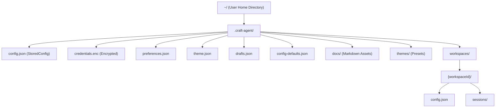
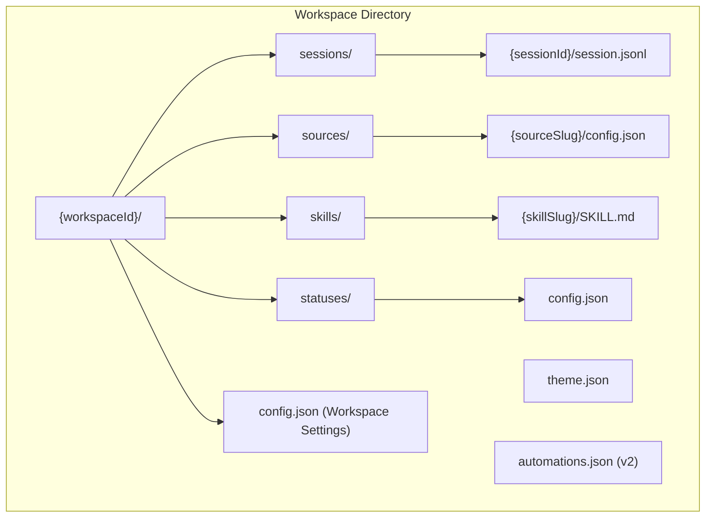
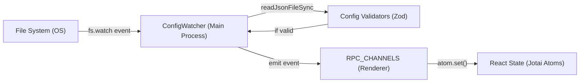
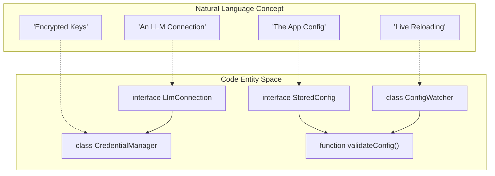

# Storage & Configuration

Relevant source files

The following files were used as context for generating this wiki page:

- [apps/electron/resources/config-defaults.json](apps/electron/resources/config-defaults.json)
- [apps/electron/src/main/onboarding.ts](apps/electron/src/main/onboarding.ts)
- [apps/electron/src/renderer/pages/settings/AppSettingsPage.tsx](apps/electron/src/renderer/pages/settings/AppSettingsPage.tsx)
- [apps/electron/src/shared/types.ts](apps/electron/src/shared/types.ts)
- [bun.lock](bun.lock)
- [packages/shared/src/config/config-defaults-schema.ts](packages/shared/src/config/config-defaults-schema.ts)
- [packages/shared/src/config/llm-connections.ts](packages/shared/src/config/llm-connections.ts)
- [packages/shared/src/config/models.ts](packages/shared/src/config/models.ts)
- [packages/shared/src/config/storage.ts](packages/shared/src/config/storage.ts)
- [packages/shared/src/config/validators.ts](packages/shared/src/config/validators.ts)
- [packages/shared/src/config/watcher.ts](packages/shared/src/config/watcher.ts)

This document describes the file-based storage architecture for Craft Agents, including the on-disk data layout under `~/.craft-agent/`, the `StoredConfig` structure, `LlmConnection` management, workspace data directories, and the `ConfigWatcher` for live configuration reloading.

---

## Storage Root Directory

All Craft Agents data is stored in a single directory at `~/.craft-agent/` in the user's home directory. This location is used consistently across platforms and contains application-level configuration, encrypted credentials, and workspace data.

**`~/.craft-agent/` Root Layout**

Sources: [packages/shared/src/config/storage.ts:87-88](), [packages/shared/src/config/paths.ts:1-10](), [packages/shared/src/config/storage.ts:28-29](), [packages/shared/src/config/storage.ts:158-164]()

---

## Application-Level Configuration

### StoredConfig (`config.json`)

The `StoredConfig` interface defines the schema for the main `config.json` file. It tracks global settings, workspace registrations, and LLM connections.

| Field | Type | Description |
|-------|------|-------------|
| `llmConnections` | `LlmConnection[]` | Array of configured AI providers and their auth metadata. |
| `defaultLlmConnection` | `string` | Slug of the connection used for new sessions by default. |
| `workspaces` | `Workspace[]` | List of registered workspaces (id, name, slug, path). |
| `activeWorkspaceId` | `string` | The ID of the workspace currently open in the UI. |
| `activeSessionId` | `string` | The ID of the session currently focused. |
| `colorTheme` | `string` | ID of the selected preset theme (e.g., 'dracula'). |
| `serverConfig` | `ServerConfig` | Settings for the embedded remote server mode. |
| `notificationsEnabled` | `boolean` | Global toggle for desktop notifications. |

Sources: [packages/shared/src/config/storage.ts:51-87](), [packages/shared/src/config/validators.ts:90-99]()

### Config Defaults

The system uses `config-defaults.json` as a fallback for missing settings. On every launch, `syncConfigDefaults()` copies the bundled defaults from the app resources to `~/.craft-agent/config-defaults.json`.

- **Source:** `apps/electron/resources/config-defaults.json`
- **Destination:** `~/.craft-agent/config-defaults.json`

Sources: [packages/shared/src/config/storage.ts:125-152](), [packages/shared/src/config/storage.ts:158-168](), [packages/shared/src/config/config-defaults-schema.ts:11-33]()

---

## LLM Connection Management

`LlmConnection` objects are the authoritative source for provider-specific settings. They separate the provider implementation (e.g., Anthropic, Pi) from the authentication mechanism.

### LlmConnection Structure

| Field | Type | Description |
|-------|------|-------------|
| `slug` | `string` | Unique URL-safe identifier (e.g., `anthropic-api`). |
| `providerType` | `LlmProviderType` | `anthropic`, `pi`, `pi_compat`. |
| `authType` | `LlmAuthType` | `api_key`, `oauth`, `iam_credentials`, `none`. |
| `models` | `ModelDefinition[]` | List of models available for this specific connection. |
| `modelSelectionMode` | `ModelSelectionMode` | `automaticallySyncedFromProvider` or `userDefined3Tier`. |

Sources: [packages/shared/src/config/llm-connections.ts:116-172](), [packages/shared/src/config/llm-connections.ts:51-54]()

### Credential Storage (`credentials.enc`)

Sensitive data like API keys and OAuth tokens are **not** stored in `config.json`. Instead, they are encrypted using AES-256-GCM and stored in `credentials.enc`. The `CredentialManager` handles the mapping between connection slugs and their encrypted secrets.

Sources: [packages/shared/src/config/storage.ts:50-51](), [apps/electron/src/main/onboarding.ts:126-141]()

---

## Workspace Data Layout

Each workspace is isolated in its own directory, typically under `~/.craft-agent/workspaces/{id}/`. This directory contains the workspace-specific configuration and all associated data.

**Code Entity to Disk Mapping**

Sources: [packages/shared/src/config/watcher.ts:12-17](), [packages/shared/src/workspaces/storage.ts:1-11]()

---

## Live Configuration Reloading

The `ConfigWatcher` class provides a reactive layer over the file system, allowing the application to respond to manual edits of configuration files without a restart.

### Implementation Detail

The watcher uses recursive directory watching via `fs.watch`. When a change is detected, it triggers specific callbacks defined in the `ConfigWatcherCallbacks` interface.

| Callback | Triggering File |
|----------|-----------------|
| `onConfigChange` | `~/.craft-agent/config.json` |
| `onSourceChange` | `workspaces/{id}/sources/{slug}/config.json` |
| `onSkillChange` | `workspaces/{id}/skills/{slug}/SKILL.md` |
| `onSessionMetadataChange` | `workspaces/{id}/sessions/{id}/session.jsonl` (header change) |
| `onAutomationsConfigChange` | `workspaces/{id}/automations.json` |

### Data Flow for Config Updates

Sources: [packages/shared/src/config/watcher.ts:182-186](), [packages/shared/src/config/watcher.ts:95-156](), [packages/shared/src/config/validators.ts:137-176]()

---

## Data Flow: "Natural Language" to "Code Entity"

This diagram maps the high-level concepts discussed in natural language to the specific classes and functions in the codebase.

Sources: [packages/shared/src/config/storage.ts:51-87](), [packages/shared/src/config/llm-connections.ts:116-172](), [packages/shared/src/config/watcher.ts:182-186](), [packages/shared/src/config/validators.ts:137-150]()