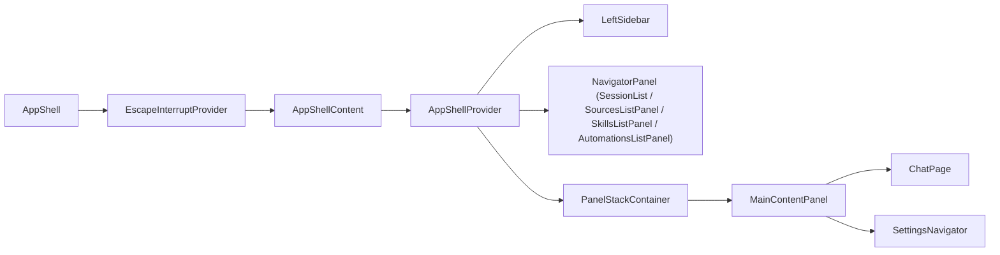
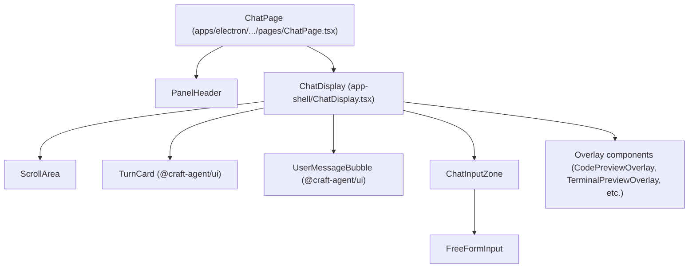
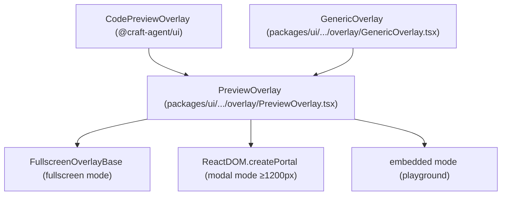

# UI Components & Layout

<details>
<summary>Relevant source files</summary>

The following files were used as context for generating this wiki page:

- [apps/electron/src/renderer/components/app-shell/AppShell.tsx](apps/electron/src/renderer/components/app-shell/AppShell.tsx)
- [apps/electron/src/renderer/components/app-shell/ChatDisplay.tsx](apps/electron/src/renderer/components/app-shell/ChatDisplay.tsx)
- [apps/electron/src/renderer/components/app-shell/SessionList.tsx](apps/electron/src/renderer/components/app-shell/SessionList.tsx)
- [apps/electron/src/renderer/components/app-shell/TopBar.tsx](apps/electron/src/renderer/components/app-shell/TopBar.tsx)
- [apps/electron/src/renderer/components/app-shell/input/FreeFormInput.tsx](apps/electron/src/renderer/components/app-shell/input/FreeFormInput.tsx)
- [apps/electron/src/renderer/context/AppShellContext.tsx](apps/electron/src/renderer/context/AppShellContext.tsx)
- [packages/shared/src/agent/session-scoped-tools.ts](packages/shared/src/agent/session-scoped-tools.ts)
- [packages/shared/src/prompts/system.ts](packages/shared/src/prompts/system.ts)
- [packages/ui/package.json](packages/ui/package.json)
- [packages/ui/src/components/chat/TurnCard.tsx](packages/ui/src/components/chat/TurnCard.tsx)
- [packages/ui/src/components/markdown/Markdown.tsx](packages/ui/src/components/markdown/Markdown.tsx)
- [packages/ui/src/components/overlay/GenericOverlay.tsx](packages/ui/src/components/overlay/GenericOverlay.tsx)
- [packages/ui/src/components/overlay/PreviewOverlay.tsx](packages/ui/src/components/overlay/PreviewOverlay.tsx)

</details>


This page documents the UI component architecture of Craft Agents: the shared `@craft-agent/ui` package, the Electron renderer's application shell and chat components, and how they compose into the three-panel layout. For the IPC communication that backs many UI actions, see [2.6](). For the session lifecycle that drives the data rendered here, see [2.7](). For Mermaid diagram rendering specifically, see [2.11]().

---

## Shared UI Library: `@craft-agent/ui`

The `@craft-agent/ui` package at `packages/ui/` is a React component library consumed by both the Electron renderer and the standalone web viewer (`apps/viewer`). It deliberately contains no Electron-specific code.

### Package Exports

| Export path | Contents |
|---|---|
| `.` (index) | All public components and utilities [packages/ui/package.json:10]() |
| `./chat` | `SessionViewer`, `TurnCard`, grouped re-exports [packages/ui/package.json:11]() |
| `./chat/SessionViewer` | Standalone session transcript viewer [packages/ui/package.json:12]() |
| `./chat/TurnCard` | Single assistant turn renderer [packages/ui/package.json:13]() |
| `./chat/turn-utils` | `groupMessagesByTurn`, `formatTurnAsMarkdown`, etc. [packages/ui/package.json:14]() |
| `./markdown` | `Markdown`, `StreamingMarkdown`, `CodeBlock`, etc. [packages/ui/package.json:15]() |
| `./context` | Shared React contexts [packages/ui/package.json:16]() |
| `./styles` | Base CSS (Tailwind v4) [packages/ui/package.json:17]() |

Sources: [packages/ui/package.json:1-67]()

### Key Dependencies

| Dependency | Role |
|---|---|
| `@craft-agent/core` | Shared types (`ToolDisplayMeta`, etc.) [packages/ui/package.json:20]() |
| `beautiful-mermaid` | Mermaid diagram rendering in chat [packages/ui/package.json:22]() |
| `@pierre/diffs` | Line-level diff calculation for Edit/Write overlays [packages/ui/package.json:34]() |
| `shiki` | Syntax highlighting in code blocks [packages/ui/package.json:49]() |
| `unified` / `rehype-*` / `remark-*` | Markdown processing pipeline [packages/ui/package.json:27,44-46]() |
| `katex` | Math formula rendering [packages/ui/package.json:43]() |
| `motion` | Animation (AnimatePresence, motion.div) [packages/ui/package.json:40]() |
| `jotai` | State atoms (optional peer dep) [packages/ui/package.json:38]() |
| `@uiw/react-json-view` | JSON tree viewer in overlays [packages/ui/package.json:24]() |

Sources: [packages/ui/package.json:19-52]()

---

## Application Shell Layout

### Three-Panel Architecture

`AppShell` in `apps/electron/src/renderer/components/app-shell/AppShell.tsx` is the top-level layout component for the Electron renderer. It renders a horizontal three-panel layout:

**Application Shell — Component Composition**



Sources: [apps/electron/src/renderer/components/app-shell/AppShell.tsx:71-74](), [apps/electron/src/renderer/components/app-shell/AppShell.tsx:77]()

### Panel Widths and Resizing

Default proportions are `[LeftSidebar 20%] | [Navigator 32%] | [MainContent 48%]` but in practice widths are pixel-based and persisted to `localStorage`:

| Panel | Default width | localStorage key |
|---|---|---|
| Left sidebar | 220 px | `sidebarWidth` |
| Session list / Navigator | 300 px | `sessionListWidth` |
| Main content | remaining | — |

Focus mode hides both the left sidebar and the navigator panel, leaving only the main content. This is controlled via the `isFocusedMode` prop in `AppShell`.

Sources: [apps/electron/src/renderer/components/app-shell/AppShell.tsx:159](), [apps/electron/src/renderer/components/app-shell/AppShell.tsx:127-135]()

### Navigator Panel Content

The navigator panel (middle column) renders different content depending on the active `NavigationContext` state:

| Navigation state | Navigator renders | Checked via |
|---|---|---|
| `sessions` | `SessionList` | `isSessionsNavigation(navState)` [apps/electron/src/renderer/components/app-shell/AppShell.tsx:108]() |
| `sources` | `SourcesListPanel` | `isSourcesNavigation(navState)` [apps/electron/src/renderer/components/app-shell/AppShell.tsx:109]() |
| `skills` | `SkillsListPanel` | `isSkillsNavigation(navState)` [apps/electron/src/renderer/components/app-shell/AppShell.tsx:111]() |
| `automations` | `AutomationsListPanel` | `isAutomationsNavigation(navState)` [apps/electron/src/renderer/components/app-shell/AppShell.tsx:112]() |

Sources: [apps/electron/src/renderer/components/app-shell/AppShell.tsx:106-114](), [apps/electron/src/renderer/components/app-shell/AppShell.tsx:117-118]()

### Left Sidebar

`LeftSidebar` provides workspace-level navigation. It contains:
- Workspace selector via `WorkspaceSwitcher` [apps/electron/src/renderer/components/app-shell/TopBar.tsx:42]()
- Navigation items for Sessions, Sources, Skills, and Automations
- Label tree (expandable/collapsible per label group)
- Status workflow shortcuts

The sidebar's collapsed state and layout are persisted in workspace-scoped `localStorage`.

Sources: [apps/electron/src/renderer/components/app-shell/AppShell.tsx:74](), [apps/electron/src/renderer/components/app-shell/SessionList.tsx:8-9]()

---

## Chat Page and ChatDisplay

**ChatPage and ChatDisplay — Component Relationships**



Sources: [apps/electron/src/renderer/components/app-shell/ChatDisplay.tsx:47-65](), [apps/electron/src/renderer/components/app-shell/AppShell.tsx:71-73]()

### ChatPage

`ChatPage` wraps `ChatDisplay` inside a shell. Its responsibilities:

- Resolves the effective LLM model/connection for the session via `resolveEffectiveConnectionSlug` [apps/electron/src/renderer/components/app-shell/input/FreeFormInput.tsx:59]()
- Derives display title via `getSessionTitle` [apps/electron/src/renderer/components/app-shell/AppShell.tsx:84]()
- Owns the per-session draft input value via `getDraft` and `onInputChange` [apps/electron/src/renderer/context/AppShellContext.tsx:51,120]()

Sources: [apps/electron/src/renderer/context/AppShellContext.tsx:33-164]()

### ChatDisplay

`ChatDisplay` is a `forwardRef` component that exposes `ChatDisplayHandle` for imperative match navigation [apps/electron/src/renderer/components/app-shell/ChatDisplay.tsx:128]().

**Scroll behavior:** It uses a `ScrollArea` [apps/electron/src/renderer/components/app-shell/ChatDisplay.tsx:17]() to manage the message list. It handles highlighting of search results using the CSS Custom Highlight API [apps/electron/src/renderer/components/app-shell/ChatDisplay.tsx:79-86]().

Sources: [apps/electron/src/renderer/components/app-shell/ChatDisplay.tsx:1-150]()

### Message Rendering

Messages are grouped into turns by `groupMessagesByTurn` (from `@craft-agent/ui/chat/turn-utils`) before rendering. Each turn type renders a different component:

| Turn type | Rendered by | Notes |
|---|---|---|
| `user` | `UserMessageBubble` | Right-aligned bubble [apps/electron/src/renderer/components/app-shell/ChatDisplay.tsx:48]() |
| `assistant` | `TurnCard` | Expand/collapse, tool activities, streaming response [apps/electron/src/renderer/components/app-shell/ChatDisplay.tsx:47]() |
| `auth-request` | `MemoizedAuthRequestCard` | OAuth/credential prompt [apps/electron/src/renderer/components/app-shell/ChatDisplay.tsx:64]() |

Sources: [apps/electron/src/renderer/components/app-shell/ChatDisplay.tsx:47-64]()

---

## TurnCard

`TurnCard` (in `packages/ui/src/components/chat/TurnCard.tsx`) renders a single assistant turn.

### Activity and Diff Calculation

`TurnCard` includes logic to compute diff statistics for `Edit` and `Write` tool inputs using `@pierre/diffs`. It supports both Claude Code and Codex formats.

```typescript
// Example of diff calculation logic
function computeEditWriteDiffStats(toolName, toolInput) {
  if (toolName === 'Edit') {
    // Logic for Codex and Claude Code formats...
  }
}
```

Sources: [packages/ui/src/components/chat/TurnCard.tsx:136-183]()

### Markdown Rendering

It uses the `Markdown` component to render text content, supporting math (Katex), GFM, and custom blocks like Mermaid [packages/ui/src/components/markdown/Markdown.tsx:2-12]().

Sources: [packages/ui/src/components/chat/TurnCard.tsx:25](), [packages/ui/src/components/markdown/Markdown.tsx:1-25]()

---

## Input System: FreeFormInput

`FreeFormInput` (`apps/electron/src/renderer/components/app-shell/input/FreeFormInput.tsx`) is the primary interface for user interaction.

- **Rich Text Support**: Uses `RichTextInput` to handle `@mentions` and smart typography [apps/electron/src/renderer/components/app-shell/input/FreeFormInput.tsx:38,56]().
- **Mentions & Commands**: Supports `@` for files/skills, `#` for labels, and `/` for slash commands [apps/electron/src/renderer/components/app-shell/input/FreeFormInput.tsx:22-35]().
- **Context Badges**: Displays current model and thinking level via `FreeFormInputContextBadge` [apps/electron/src/renderer/components/app-shell/input/FreeFormInput.tsx:65]().
- **Thinking Levels**: Supports toggling between 'off', 'think', and 'max' thinking levels [apps/electron/src/renderer/components/app-shell/input/FreeFormInput.tsx:68,163]().
- **Permission Modes**: Integrates with `CompactPermissionModeSelector` to cycle through `safe`, `ask`, and `allow-all` modes [apps/electron/src/renderer/components/app-shell/input/FreeFormInput.tsx:80,167]().

Sources: [apps/electron/src/renderer/components/app-shell/input/FreeFormInput.tsx:1-185]()

---

## Overlay System

**Overlay System — Class Hierarchy**



Sources: [packages/ui/src/components/overlay/PreviewOverlay.tsx:1-210](), [packages/ui/src/components/overlay/GenericOverlay.tsx:1-39]()

### PreviewOverlay

`PreviewOverlay` is the base for all full-screen/modal previews. It switches between two rendering modes based on `useOverlayMode()`:

| Mode | Trigger | Behavior |
|---|---|---|
| Fullscreen | viewport < 1200px | Delegated to `FullscreenOverlayBase`, which owns its own masked scroll container and header [packages/ui/src/components/overlay/PreviewOverlay.tsx:169-184]() |
| Modal | viewport ≥ 1200px | Rendered via `ReactDOM.createPortal` to `document.body`, backdrop click closes [packages/ui/src/components/overlay/PreviewOverlay.tsx:188-209]() |
| Embedded | `embedded` prop | Inline `div`, no portal, for design system playground [packages/ui/src/components/overlay/PreviewOverlay.tsx:158-165]() |

Sources: [packages/ui/src/components/overlay/PreviewOverlay.tsx:76-210]()

### GenericOverlay

`GenericOverlay` provides a standard way to display arbitrary tool output. It utilizes the `PreviewOverlay` for the shell and can render content as markdown or code blocks depending on detected format.

Sources: [packages/ui/src/components/overlay/GenericOverlay.tsx:1-39]()

---

## Navigation and Selection

`SessionList` (`apps/electron/src/renderer/components/app-shell/SessionList.tsx`) manages the list of conversations.

- **Grouping**: Supports grouping by 'date' or 'status' [apps/electron/src/renderer/components/app-shell/SessionList.tsx:38]().
- **Selection**: Uses `useSessionSelection` for multi-select logic [apps/electron/src/renderer/components/app-shell/SessionList.tsx:146-151]().
- **Search**: Integrates with `useSessionSearch` and `SessionSearchHeader` for filtering [apps/electron/src/renderer/components/app-shell/SessionList.tsx:17,21]().

Sources: [apps/electron/src/renderer/components/app-shell/SessionList.tsx:1-151]()