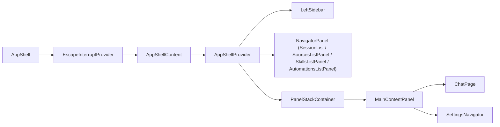
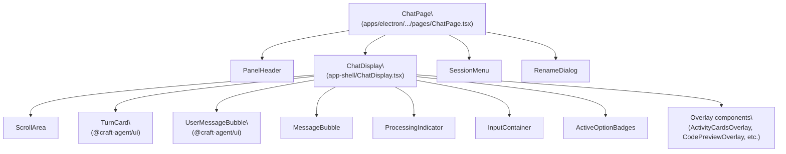
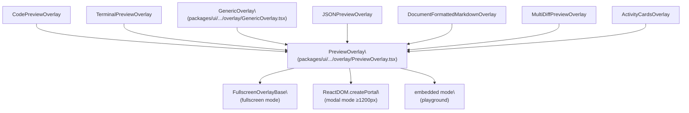

# UI Components & Layout

<details>
<summary>Relevant source files</summary>

The following files were used as context for generating this wiki page:

- [apps/electron/src/renderer/components/app-shell/AppShell.tsx](apps/electron/src/renderer/components/app-shell/AppShell.tsx)
- [apps/electron/src/renderer/components/app-shell/ChatDisplay.tsx](apps/electron/src/renderer/components/app-shell/ChatDisplay.tsx)
- [apps/electron/src/renderer/pages/ChatPage.tsx](apps/electron/src/renderer/pages/ChatPage.tsx)
- [packages/ui/package.json](packages/ui/package.json)
- [packages/ui/src/components/chat/TurnCard.tsx](packages/ui/src/components/chat/TurnCard.tsx)
- [packages/ui/src/components/overlay/GenericOverlay.tsx](packages/ui/src/components/overlay/GenericOverlay.tsx)
- [packages/ui/src/components/overlay/PreviewOverlay.tsx](packages/ui/src/components/overlay/PreviewOverlay.tsx)

</details>

This page documents the UI component architecture of Craft Agents: the shared `@craft-agent/ui` package, the Electron renderer's application shell and chat components, and how they compose into the three-panel layout. For the IPC communication that backs many UI actions, see [2.6](#2.6). For the session lifecycle that drives the data rendered here, see [2.7](#2.7). For Mermaid diagram rendering specifically, see [2.11](#2.11).

---

## Shared UI Library: `@craft-agent/ui`

The `@craft-agent/ui` package at `packages/ui/` is a React component library consumed by both the Electron renderer and the standalone web viewer (`apps/viewer`). It deliberately contains no Electron-specific code.

### Package Exports

| Export path            | Contents                                            |
| ---------------------- | --------------------------------------------------- |
| `.` (index)            | All public components and utilities                 |
| `./chat`               | `SessionViewer`, `TurnCard`, grouped re-exports     |
| `./chat/SessionViewer` | Standalone session transcript viewer                |
| `./chat/TurnCard`      | Single assistant turn renderer                      |
| `./chat/turn-utils`    | `groupMessagesByTurn`, `formatTurnAsMarkdown`, etc. |
| `./markdown`           | `Markdown`, `StreamingMarkdown`, `CodeBlock`, etc.  |
| `./context`            | Shared React contexts                               |
| `./styles`             | Base CSS (Tailwind v4)                              |

Sources: [packages/ui/package.json:1-67]()

### Key Dependencies

| Dependency                          | Role                                                |
| ----------------------------------- | --------------------------------------------------- |
| `@craft-agent/core`                 | Shared types (`ToolDisplayMeta`, etc.)              |
| `beautiful-mermaid`                 | Mermaid diagram rendering in chat                   |
| `@pierre/diffs`                     | Line-level diff calculation for Edit/Write overlays |
| `shiki`                             | Syntax highlighting in code blocks                  |
| `unified` / `rehype-*` / `remark-*` | Markdown processing pipeline                        |
| `katex`                             | Math formula rendering                              |
| `motion`                            | Animation (AnimatePresence, motion.div)             |
| `jotai`                             | State atoms (optional peer dep)                     |
| `@uiw/react-json-view`              | JSON tree viewer in overlays                        |

Sources: [packages/ui/package.json:19-52]()

---

## Application Shell Layout

### Three-Panel Architecture

`AppShell` in `apps/electron/src/renderer/components/app-shell/AppShell.tsx` is the top-level layout component for the Electron renderer. It renders a horizontal three-panel layout:

**Application Shell — Component Composition**



Sources: [apps/electron/src/renderer/components/app-shell/AppShell.tsx:444-451](), [apps/electron/src/renderer/components/app-shell/AppShell.tsx:457-463]()

### Panel Widths and Resizing

Default proportions are `[LeftSidebar 20%] | [Navigator 32%] | [MainContent 48%]` but in practice widths are pixel-based and persisted to `localStorage`:

| Panel                    | Default width | localStorage key   |
| ------------------------ | ------------- | ------------------ |
| Left sidebar             | 220 px        | `sidebarWidth`     |
| Session list / Navigator | 300 px        | `sessionListWidth` |
| Main content             | remaining     | —                  |

Drag handles are managed with `ResizeObserver` and two refs (`resizeHandleRef`, `sessionListHandleRef`). Focus mode (`isSidebarAndNavigatorHidden`, toggled via `app.toggleFocusMode` action / CMD+.) hides both the left sidebar and the navigator panel, leaving only the main content.

Sources: [apps/electron/src/renderer/components/app-shell/AppShell.tsx:494-510](), [apps/electron/src/renderer/components/app-shell/AppShell.tsx:526-530]()

### Navigator Panel Content

The navigator panel (middle column) renders different content depending on the active `NavigationContext` state:

| Navigation state | Navigator renders      | Checked via                         |
| ---------------- | ---------------------- | ----------------------------------- |
| `sessions`       | `SessionList`          | `isSessionsNavigation(navState)`    |
| `sources`        | `SourcesListPanel`     | `isSourcesNavigation(navState)`     |
| `skills`         | `SkillsListPanel`      | `isSkillsNavigation(navState)`      |
| `automations`    | `AutomationsListPanel` | `isAutomationsNavigation(navState)` |

Sources: [apps/electron/src/renderer/components/app-shell/AppShell.tsx:565-580]()

### Left Sidebar

`LeftSidebar` provides workspace-level navigation. It contains:

- Workspace selector
- Navigation items for Sessions, Sources, Skills, and Automations
- Label tree (expandable/collapsible per label group)
- Status workflow shortcuts
- "What's New" entry point

The sidebar's collapsed state, expanded folders, and collapsed nav items are all persisted in workspace-scoped `localStorage`.

Sources: [apps/electron/src/renderer/components/app-shell/AppShell.tsx:73](), [apps/electron/src/renderer/components/app-shell/AppShell.tsx:734-755]()

---

## Chat Page and ChatDisplay

**ChatPage and ChatDisplay — Component Relationships**



Sources: [apps/electron/src/renderer/pages/ChatPage.tsx:1-669](), [apps/electron/src/renderer/components/app-shell/ChatDisplay.tsx:1-100]()

### ChatPage

`ChatPage` (`apps/electron/src/renderer/pages/ChatPage.tsx`) wraps `ChatDisplay` inside a `PanelHeader` + `div.h-full.flex.flex-col` shell. Its responsibilities:

- Resolves the effective LLM model/connection for the session (`resolveEffectiveConnectionSlug`)
- Derives display title via `getSessionTitle`
- Owns the per-session draft input value (polling-based sync with parent)
- Handles share actions (share to viewer, copy link, update share, revoke share) via `window.electronAPI.sessionCommand`
- Renders the share button and `SessionMenu` as slots in `PanelHeader`
- Opens `RenameDialog` on rename

Props: `{ sessionId: string }`. All other data comes from `useAppShellContext()`.

Sources: [apps/electron/src/renderer/pages/ChatPage.tsx:27-29](), [apps/electron/src/renderer/pages/ChatPage.tsx:605-667]()

### ChatDisplay

`ChatDisplay` is a `forwardRef` component that exposes `ChatDisplayHandle` for imperative match navigation:

```
interface ChatDisplayHandle {
  goToNextMatch: () => void
  goToPrevMatch: () => void
  matchCount: number
  currentMatchIndex: number
}
```

**Scroll behavior:** A `ResizeObserver` on the scroll content container drives auto-scroll when `isStickToBottomRef.current === true`. The ref is set to `false` when the user scrolls up, and back to `true` when they scroll to the bottom (within 20px threshold). In unfocused panels (multi-panel layout), scroll is always instant to bottom.

**Reverse pagination:** Initially renders the last `TURNS_PER_PAGE` (20) turns. When the user scrolls within 100px of the top, `visibleTurnCount` increases by another 20 turns, with scroll position compensated via `requestAnimationFrame`.

**Search highlighting:** When `searchQuery` is provided, `ChatDisplay` uses DOM `TreeWalker` to find and wrap text nodes in `<mark class="search-highlight">` elements. Active match receives additional yellow highlight and ring styles. Match IDs follow the pattern `{turnId}-match-{index}`.

Sources: [apps/electron/src/renderer/components/app-shell/ChatDisplay.tsx:197-202](), [apps/electron/src/renderer/components/app-shell/ChatDisplay.tsx:444-453](), [apps/electron/src/renderer/components/app-shell/ChatDisplay.tsx:1096-1130]()

### Message Rendering

Messages are grouped into turns by `groupMessagesByTurn` (from `@craft-agent/ui/chat/turn-utils`) before rendering. Each turn type renders a different component:

| Turn type      | Rendered by               | Notes                                                 |
| -------------- | ------------------------- | ----------------------------------------------------- |
| `user`         | `UserMessageBubble`       | Right-aligned bubble, supports attachments and badges |
| `assistant`    | `TurnCard`                | Expand/collapse, tool activities, streaming response  |
| `system`       | `MessageBubble`           | Error, status, info, warning variants                 |
| `auth-request` | `MemoizedAuthRequestCard` | OAuth/credential prompt, interactive only if last     |

All rendered turns are wrapped in a `div` with a `ref` stored in `turnRefs` (a `Map<string, HTMLDivElement>`) for search highlighting.

Sources: [apps/electron/src/renderer/components/app-shell/ChatDisplay.tsx:1369-1590]()

### ProcessingIndicator

`ProcessingIndicator` renders while `session.isProcessing` is true. It cycles through a pool of 50+ status strings (e.g., "Thinking…", "Percolating…") every 10 seconds, with an elapsed timer (`Xm:Ys` format) updated every second. If `session.currentStatus.message` is set (e.g., "Compacting…"), it overrides the cycling messages.

Sources: [apps/electron/src/renderer/components/app-shell/ChatDisplay.tsx:282-346]()

---

## TurnCard

`TurnCard` (in `packages/ui/src/components/chat/TurnCard.tsx`) renders a single assistant turn consisting of:

- A collapsible **header** showing a summary (intent, activity count, badges)
- An **expanded activity list** with per-activity icons and labels
- A **response section** showing the final markdown text

### ActivityItem Structure

```
ActivityItem {
  id, type, status, toolName, toolUseId
  toolInput, content, intent, displayName
  toolDisplayMeta  // embedded icon/category metadata
  timestamp, error
  parentId, depth  // for nested Task subagents
  taskId, shellId, elapsedSeconds, isBackground
}
```

`ActivityStatus`: `'pending' | 'running' | 'completed' | 'error' | 'backgrounded'`  
`ActivityType`: `'tool' | 'thinking' | 'intermediate' | 'status' | 'plan'`

Sources: [packages/ui/src/components/chat/TurnCard.tsx:187-210]()

### Response Buffering

During streaming, `TurnCard` uses a buffering algorithm (`shouldShowContent`) to delay showing the response text until enough content has accumulated, preventing rapid layout shifts:

| Trigger               | Threshold         | Min words            |
| --------------------- | ----------------- | -------------------- |
| Always show           | Stream complete   | —                    |
| Code block detected   | ≥ 500 ms elapsed  | 15 words             |
| Header (`#`) detected | ≥ 500 ms elapsed  | 12 words             |
| List detected         | ≥ 500 ms elapsed  | 20 words             |
| Question ending       | ≥ 500 ms elapsed  | 8 words              |
| Standard prose        | ≥ 500 ms elapsed  | 40 words + structure |
| High word count       | ≥ 500 ms elapsed  | 60 words (any)       |
| Timeout               | > 2500 ms elapsed | 5 words              |

Sources: [packages/ui/src/components/chat/TurnCard.tsx:295-424]()

### SIZE_CONFIG

`SIZE_CONFIG` is an exported constant that defines sizing for all TurnCard sub-components so the UI scales uniformly:

```
SIZE_CONFIG = {
  fontSize: 'text-[13px]',
  iconSize: 'w-3 h-3',
  spinnerSize: 'text-[10px]',
  spinnerSizeSmall: 'text-[8px]',
  activityRowHeight: 24,
  maxVisibleActivities: 15,
  staggeredAnimationLimit: 10,
}
```

Sources: [packages/ui/src/components/chat/TurnCard.tsx:148-163]()

### ActivityStatusIcon

`ActivityStatusIcon` is exported from `TurnCard.tsx` for reuse in inline execution UIs. It renders animated crossfades between icons for `pending`, `running`, `backgrounded`, `completed`, and `error` states. Completed activities with a custom icon (`toolDisplayMeta.iconDataUrl`) render the icon instead of the green checkmark.

Sources: [packages/ui/src/components/chat/TurnCard.tsx:698-777]()

### Tool Display Formatting

`formatToolDisplay(activity)` resolves the human-readable name and icon for each activity row using `toolDisplayMeta`. Priority order:

1. Embedded `toolDisplayMeta` (set at storage time in the main process)
2. `displayName` (LLM-generated friendly name)
3. `getToolDisplayName(toolName)` which strips MCP prefixes and applies a fixed rename table (e.g., `TodoWrite` → `"Todo List Updated"`)

For `Bash` tools with a non-"Terminal" icon, the display is formatted as `"IconName: Action"`.

Sources: [packages/ui/src/components/chat/TurnCard.tsx:554-619]()

---

## Input System

`InputContainer` is located at `apps/electron/src/renderer/components/app-shell/input/` (imported as `"./input"` in `ChatDisplay.tsx`). It renders one of two modes:

- **Free-form mode** (`FreeFormInput`): The standard multi-line rich text input. Supports `@mention` for skills, `#` for labels/statuses, `/` for slash commands, file attachments, and model/connection selection.
- **Structured mode** (`StructuredInputState`): Rendered when `pendingPermission` or `pendingCredential` is set. Shows the permission prompt or credential request UI instead of the text input.

`ActiveOptionBadges` renders above the input and shows active session options as dismissible chips:

- Ultrathink mode badge
- Permission mode indicator (ModeManager)
- Background task badges (with kill buttons)
- Label badges (with value popover support)
- Session status selector

Sources: [apps/electron/src/renderer/components/app-shell/ChatDisplay.tsx:49](), [apps/electron/src/renderer/components/app-shell/ChatDisplay.tsx:1254-1275](), [apps/electron/src/renderer/components/app-shell/ChatDisplay.tsx:1621-1645]()

---

## Overlay System

**Overlay System — Class Hierarchy**



Sources: [packages/ui/src/components/overlay/PreviewOverlay.tsx:1-210](), [apps/electron/src/renderer/components/app-shell/ChatDisplay.tsx:1715-1843]()

### PreviewOverlay

`PreviewOverlay` is the base for all full-screen/modal previews. It switches between two rendering modes based on `useOverlayMode()` (which checks viewport width against `OVERLAY_LAYOUT`):

| Mode       | Trigger           | Behavior                                                                                    |
| ---------- | ----------------- | ------------------------------------------------------------------------------------------- |
| Fullscreen | viewport < 1200px | Delegated to `FullscreenOverlayBase`, which owns its own masked scroll container and header |
| Modal      | viewport ≥ 1200px | Rendered via `ReactDOM.createPortal` to `document.body`, backdrop click closes              |
| Embedded   | `embedded` prop   | Inline `div`, no portal, for design system playground                                       |

Escape key handling: modal mode adds a `keydown` listener; fullscreen mode is handled by `FullscreenOverlayBase`.

A CSS `mask-image` gradient (`linear-gradient`) fades content at top and bottom in all modes to indicate scrollability.

Sources: [packages/ui/src/components/overlay/PreviewOverlay.tsx:76-210]()

### Overlay Selection Logic in ChatDisplay

`ChatDisplay` maintains an `overlayState` discriminated union:

```
type OverlayState =
  | { type: 'activity'; activity: ActivityItem }
  | { type: 'multi-diff'; changes: FileChange[]; consolidated: boolean; focusedChangeId?: string }
  | { type: 'markdown'; content: string; title: string; forceCodeView?: boolean }
  | null
```

When an activity row is clicked (`onOpenActivityDetails`), the routing logic selects the overlay type:

| Activity                         | Overlay shown                                                               |
| -------------------------------- | --------------------------------------------------------------------------- |
| `Bash` or `mcp__*`               | `ActivityCardsOverlay` (stacked input/output cards)                         |
| `Edit` or `Write` (non-markdown) | `MultiDiffPreviewOverlay` (diff view)                                       |
| `Write` to `.md`/`.txt`          | `DocumentFormattedMarkdownOverlay`                                          |
| Other tools                      | `GenericOverlay` or `DocumentFormattedMarkdownOverlay` depending on content |

Sources: [apps/electron/src/renderer/components/app-shell/ChatDisplay.tsx:63-91](), [apps/electron/src/renderer/components/app-shell/ChatDisplay.tsx:1547-1590]()

### GenericOverlay

`GenericOverlay` is the fallback overlay for unrecognized tool outputs. `detectLanguage(content)` auto-detects JSON (checks for `{…}` or `[…]`) or code block markers, defaulting to `markdown`. `detectLanguageFromPath(filePath)` maps common extensions to language identifiers. In diff mode it renders two `CodeBlock` panels side-by-side.

Sources: [packages/ui/src/components/overlay/GenericOverlay.tsx:45-112]()

---

## AppShellContext and Data Flow

`AppShellProvider` supplies `AppShellContextType` via React context. All major child components access data and callbacks through `useAppShellContext()` instead of prop drilling. The key fields:

| Category            | Examples                                                                |
| ------------------- | ----------------------------------------------------------------------- |
| Workspace data      | `workspaces`, `activeWorkspaceId`, `llmConnections`                     |
| Session callbacks   | `onSendMessage`, `onDeleteSession`, `onFlagSession`, `onRenameSession`  |
| Permission handling | `onRespondToPermission`, `onRespondToCredential`, `pendingPermissions`  |
| Input state         | `textareaRef`, `getDraft`, `onInputChange`                              |
| Workspace config    | `enabledSources`, `skills`, `labels`, `sessionStatuses`, `enabledModes` |
| UI refs             | `chatDisplayRef`, `onChatMatchInfoChange`                               |

Session-specific Jotai atoms are used for isolated per-session updates: `sessionMetaMapAtom`, `loadedSessionsAtom`, `ensureSessionMessagesLoadedAtom` control lazy loading. The panel stack is managed by `panelStackAtom`, `focusedPanelIdAtom`, and `focusedSessionIdAtom`.

Sources: [apps/electron/src/renderer/components/app-shell/AppShell.tsx:464-489](), [apps/electron/src/renderer/pages/ChatPage.tsx:37-74]()

---

## Multi-Panel Support

`PanelStackContainer` and `panelStackAtom` implement a side-by-side panel layout where each panel holds an independent navigation route. Key atoms:

| Atom                                        | Type             | Purpose                        |
| ------------------------------------------- | ---------------- | ------------------------------ |
| `panelStackAtom`                            | `PanelEntry[]`   | Ordered list of open panels    |
| `panelCountAtom`                            | `number`         | Derived from stack length      |
| `focusedPanelIdAtom`                        | `string`         | Which panel has keyboard focus |
| `focusedSessionIdAtom`                      | `string \| null` | Session in the focused panel   |
| `focusNextPanelAtom` / `focusPrevPanelAtom` | write-only       | Panel focus cycling            |

`ChatDisplay` reads `isFocusedPanel` from `AppShellContext` to gate auto-focus of the text input and modify scroll behavior (unfocused panels always scroll instantly to bottom).

Sources: [apps/electron/src/renderer/components/app-shell/AppShell.tsx:89](), [apps/electron/src/renderer/components/app-shell/ChatDisplay.tsx:438-454]()

---

## Component → File Reference

| Component                                                    | File path                                                         |
| ------------------------------------------------------------ | ----------------------------------------------------------------- |
| `AppShell`, `AppShellContent`                                | `apps/electron/src/renderer/components/app-shell/AppShell.tsx`    |
| `ChatPage`                                                   | `apps/electron/src/renderer/pages/ChatPage.tsx`                   |
| `ChatDisplay`, `ChatDisplayHandle`                           | `apps/electron/src/renderer/components/app-shell/ChatDisplay.tsx` |
| `TurnCard`, `ActivityStatusIcon`, `SIZE_CONFIG`              | `packages/ui/src/components/chat/TurnCard.tsx`                    |
| `PreviewOverlay`                                             | `packages/ui/src/components/overlay/PreviewOverlay.tsx`           |
| `GenericOverlay`, `detectLanguage`, `detectLanguageFromPath` | `packages/ui/src/components/overlay/GenericOverlay.tsx`           |
| `@craft-agent/ui` package                                    | `packages/ui/package.json`                                        |
