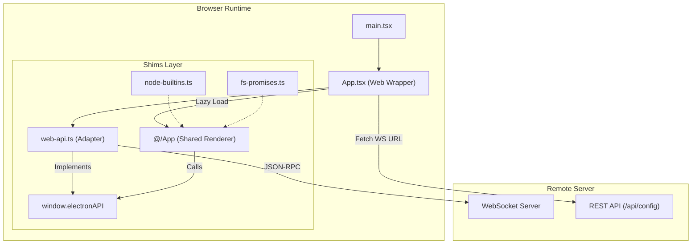
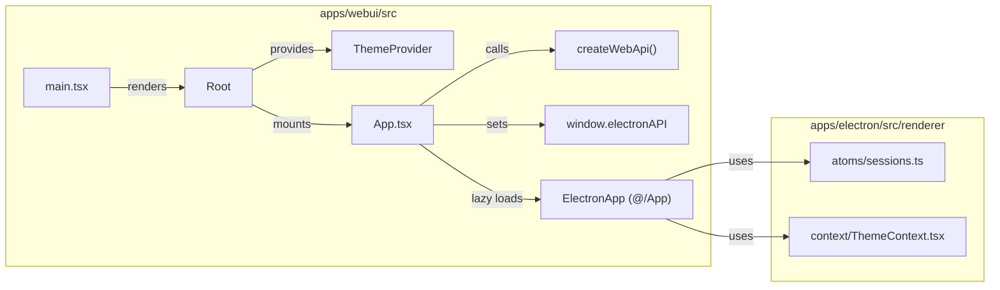

# Web UI Application

Relevant source files

The following files were used as context for generating this wiki page:

- [apps/webui/package.json](apps/webui/package.json)
- [apps/webui/src/App.tsx](apps/webui/src/App.tsx)
- [apps/webui/src/adapter/web-api.ts](apps/webui/src/adapter/web-api.ts)
- [apps/webui/src/index.html](apps/webui/src/index.html)
- [apps/webui/src/login.html](apps/webui/src/login.html)
- [apps/webui/src/main.tsx](apps/webui/src/main.tsx)
- [apps/webui/src/shims/electron-log.ts](apps/webui/src/shims/electron-log.ts)
- [apps/webui/src/shims/fs-promises.ts](apps/webui/src/shims/fs-promises.ts)
- [apps/webui/src/shims/node-builtins.ts](apps/webui/src/shims/node-builtins.ts)
- [apps/webui/src/shims/open.ts](apps/webui/src/shims/open.ts)
- [apps/webui/src/shims/sentry-electron.ts](apps/webui/src/shims/sentry-electron.ts)
- [apps/webui/src/shims/ws.ts](apps/webui/src/shims/ws.ts)
- [apps/webui/vite.config.ts](apps/webui/vite.config.ts)

The `apps/webui` application is a browser-based thin client for Craft Agents. It provides a near-identical user experience to the Electron desktop application by reusing the same React renderer codebase while substituting the Electron IPC layer with a WebSocket-based RPC implementation.

## Overview and Role

The Web UI serves as a remote interface to a Craft Agent server. Unlike the desktop app, which manages its own local server process, the Web UI connects to a remote instance over a secure WebSocket (`wss://`) connection. It leverages a shim layer to satisfy Node.js and Electron-specific dependencies, allowing the shared `@/App` component from the Electron renderer to run in a standard browser environment.

### Key Characteristics
- **Thin Client**: Does not perform local file system operations or manage agent lifecycles directly; it delegates all logic to the remote server via RPC [apps/webui/src/App.tsx:2-5]().
- **Code Sharing**: Directly imports components, hooks, and contexts from the Electron renderer package via Vite aliases [apps/webui/src/App.tsx:18-19]().
- **Adapter Layer**: Implements `window.electronAPI` using a WebSocket RPC client to maintain compatibility with components designed for Electron [apps/webui/src/adapter/web-api.ts:2-5]().

## System Architecture and Data Flow

The Web UI initialization process involves fetching server configuration, establishing a WebSocket connection, and mounting the shared renderer.

### Initialization Sequence
1. **Config Fetch**: The app calls `/api/config` to retrieve the `wsUrl`. This request includes the browser's session cookie for authentication [apps/webui/src/App.tsx:70-81]().
2. **Workspace Resolution**: It determines the active workspace from URL parameters or server defaults via `/api/config/workspaces` [apps/webui/src/App.tsx:84-99]().
3. **API Creation**: `createWebApi` instantiates a `WsRpcClient` and builds the `electronAPI` proxy using the shared `CHANNEL_MAP` [apps/webui/src/App.tsx:107-111]().
4. **Mounting**: The `ElectronApp` is lazy-loaded only after `window.electronAPI` is globally available to prevent initialization errors in renderer components [apps/webui/src/App.tsx:15-18]().

### Component Relationship Diagram
This diagram illustrates how the Web UI shims the Electron environment to host the shared renderer.

"Web UI Architecture"

Sources: [apps/webui/src/App.tsx:1-144](), [apps/webui/src/adapter/web-api.ts:1-81](), [apps/webui/src/main.tsx:1-52]()

## The Web API Adapter

The `createWebApi` function is the core of the Web UI's compatibility layer. It uses `buildClientApi` and the shared `CHANNEL_MAP` from the Electron transport layer to create a proxy object that matches the `ElectronAPI` interface [apps/webui/src/adapter/web-api.ts:63-81]().

### Implementation Strategy
The adapter handles three types of methods:
1. **Remote Methods**: Calls like `invoke('session:get')` are passed directly over the WebSocket to the server [apps/webui/src/adapter/web-api.ts:77-81]().
2. **Web Equivalents**: Native Electron features are replaced with browser APIs. For example, `openUrl` uses `window.open` [apps/webui/src/adapter/web-api.ts:86-89](), and `openFileDialog` uses a dynamically created `<input type="file">` [apps/webui/src/adapter/web-api.ts:20-38]().
3. **No-ops**: Desktop-only features (e.g., `setTrafficLightsVisible`, `showInFolder`) are implemented as empty promises or no-op functions to prevent runtime crashes [apps/webui/src/adapter/web-api.ts:113-117]().

### Comparison of IPC vs. Web Implementations

| Feature | Electron Implementation | Web UI Implementation |
| :--- | :--- | :--- |
| **Transport** | `ipcRenderer.invoke` | `WsRpcClient.invoke` (WebSocket) [apps/webui/src/adapter/web-api.ts:69-74]() |
| **File Picker** | `dialog.showOpenDialog` | `webFilePicker` (Hidden `<input type="file">`) [apps/webui/src/adapter/web-api.ts:20-38]() |
| **Theme Sync** | `nativeTheme` events | `window.matchMedia` listeners [apps/webui/src/adapter/web-api.ts:44-50]() |
| **Workspace Switch** | Local state change | `window:switchWorkspace` RPC call [apps/webui/src/adapter/web-api.ts:135-137]() |
| **New Windows** | `browserWindow` APIs | `window.open` with session URL param [apps/webui/src/adapter/web-api.ts:139-142]() |

Sources: [apps/webui/src/adapter/web-api.ts:20-176](), [apps/webui/src/App.tsx:107-111]()

## Shims and Polyfills

Because the shared codebase imports Node.js modules (like `fs`, `path`, and `crypto`) for server-side logic, the Web UI uses a series of shims to satisfy the bundler's static analysis.

### Node.js Built-in Shims
The `node-builtins.ts` file provides minimal implementations of standard modules:
- **`path`**: Implemented using basic string manipulation (e.g., `join` uses `/` separator) [apps/webui/src/shims/node-builtins.ts:36-47]().
- **`fs`**: Most methods throw errors if called, as the Web UI should never access a local filesystem directly [apps/webui/src/shims/node-builtins.ts:13-33]().
- **`crypto`**: Redirects to the native `globalThis.crypto` for `randomUUID` and `randomBytes` [apps/webui/src/shims/node-builtins.ts:63-68]().
- **`events`**: Provides a basic `EventEmitter` class for internal event handling required by shared transport logic [apps/webui/src/shims/node-builtins.ts:119-128]().

### External Dependency Shims
- **`electron-log`**: Redirects all logging levels (`info`, `warn`, `error`) to the browser `console` [apps/webui/src/shims/electron-log.ts:2-17]().
- **`open`**: Replaces the Node `open` package with `window.open` [apps/webui/src/shims/open.ts:2-5]().
- **`sentry-electron`**: Provides no-op functions to disable Sentry in the browser build while keeping the code typesafe [apps/webui/src/shims/sentry-electron.ts:2-6]().
- **`ws`**: Shims the `WebSocketServer` (which is never used in browser) and re-exports the native `globalThis.WebSocket` [apps/webui/src/shims/ws.ts:9-20]().

Sources: [apps/webui/src/shims/node-builtins.ts:1-130](), [apps/webui/src/shims/electron-log.ts:1-18](), [apps/webui/src/shims/ws.ts:1-21]()

## User Interface and Authentication

The Web UI includes a dedicated login page (`login.html`) that handles server token authentication [apps/webui/src/login.html:1-236](). Once authenticated, the server sets a session cookie used for both REST API calls and the WebSocket upgrade request [apps/webui/src/adapter/web-api.ts:7-9]().

"Code Entity Mapping: Web UI Entry Point"

Sources: [apps/webui/src/main.tsx:33-42](), [apps/webui/src/App.tsx:58-144](), [apps/webui/src/index.html:1-31]()