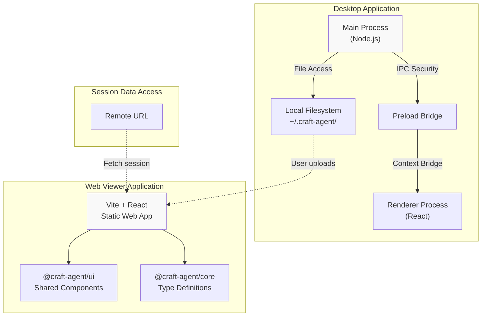
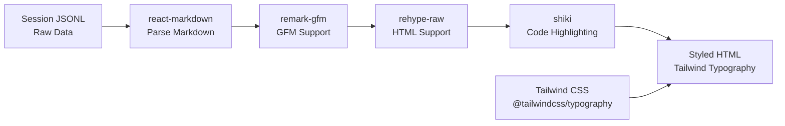
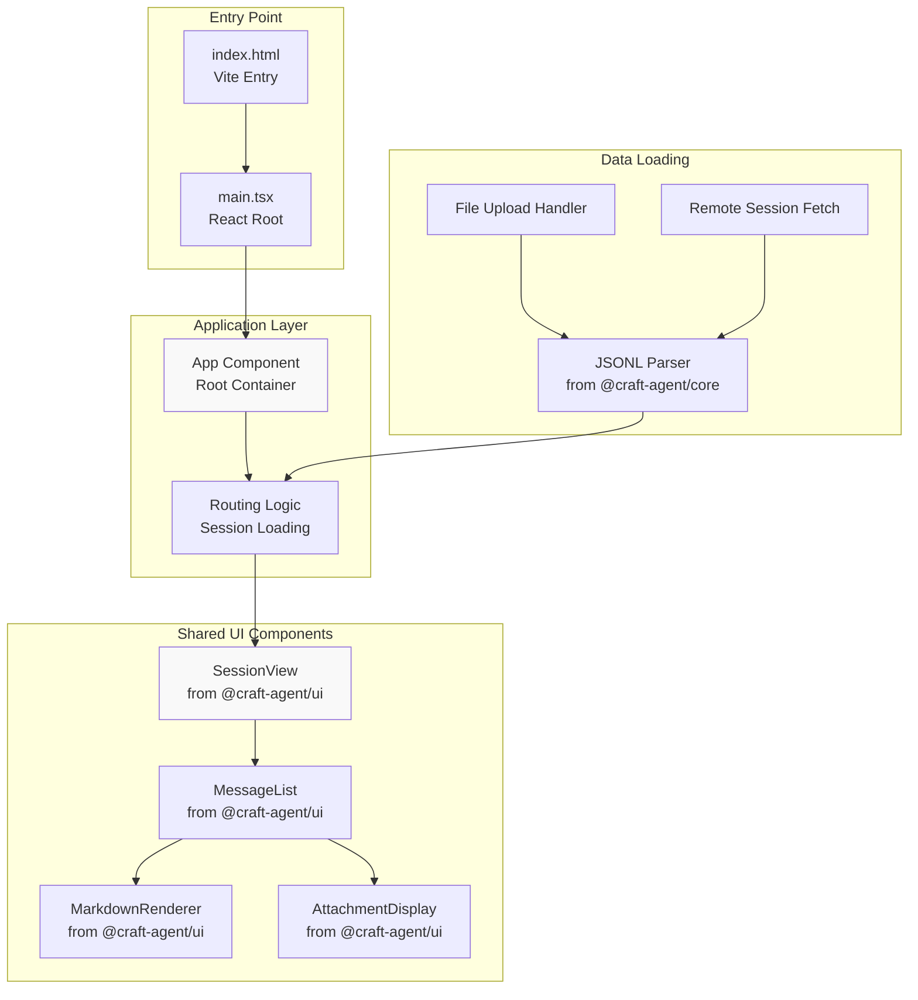
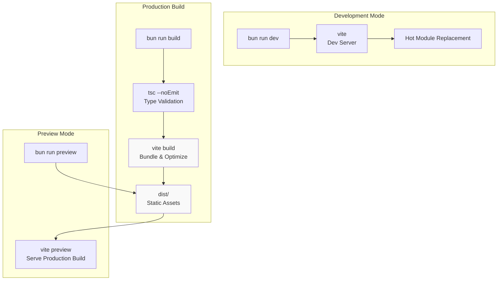
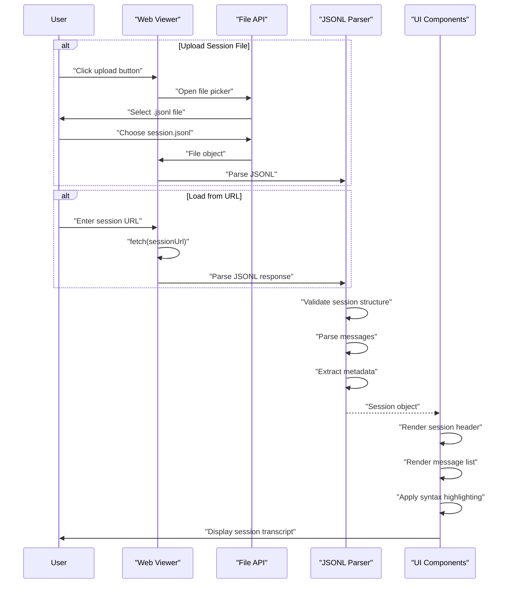
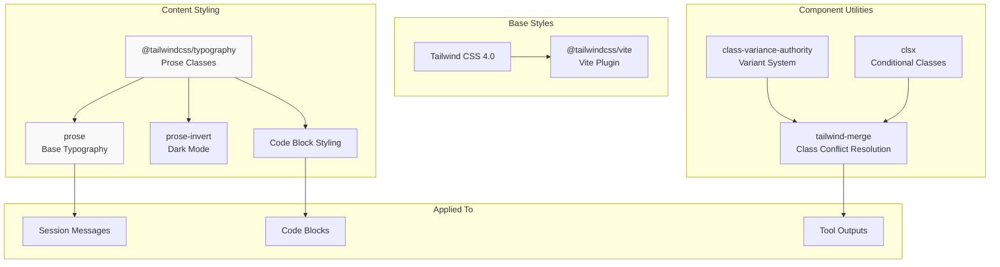

# Web Viewer Application

Relevant source files

The following files were used as context for generating this wiki page:

- [apps/viewer/package.json](apps/viewer/package.json)
- [packages/ui/package.json](packages/ui/package.json)

## Purpose and Scope

The Web Viewer Application is a standalone web application for viewing and sharing Craft Agents session transcripts. Unlike the Electron desktop application which provides full agent interaction capabilities, the viewer is a read-only interface for displaying session content. This enables users to share session transcripts via the web without requiring recipients to install the full Craft Agents desktop application.

For information about the full desktop application architecture, see [Electron Application Architecture](#2.2). For details on session lifecycle and management, see [Session Lifecycle](#2.7).

## Architecture Overview

The viewer follows a fundamentally different architecture than the desktop application, operating as a pure client-side web application rather than an Electron-based desktop tool.

### Application Comparison

**Sources:** [apps/viewer/package.json:1-36]()

The key architectural differences:

| Aspect                | Desktop Application         | Web Viewer                  |
| --------------------- | --------------------------- | --------------------------- |
| **Process Model**     | Multi-process Electron      | Single-page web application |
| **Runtime**           | Node.js + Chromium          | Browser environment only    |
| **File Access**       | Direct filesystem access    | Upload or fetch via HTTP    |
| **Agent Interaction** | Full agent capabilities     | Read-only display           |
| **Data Persistence**  | Local workspace directories | No persistence (stateless)  |
| **Build System**      | ESBuild + Vite              | Vite only                   |

### Technology Stack

```mermaid
graph TB
    subgraph "Build Layer"
        Vite["Vite 6.2.5<br/>Build Tool"]
        ViteReact["@vitejs/plugin-react<br/>React Support"]
        TypeScript["TypeScript 5.7.3<br/>Type Checking"]

        Vite --> ViteReact
        Vite --> TypeScript
    end

    subgraph "UI Framework"
        React["React 18.3.1"]
        ReactDOM["react-dom 18.3.1"]
        Motion["motion 12.0.0<br/>Animations"]

        React --> ReactDOM
    end

    subgraph "Styling System"
        Tailwind["Tailwind CSS 4.0.0"]
        TailwindTypography["@tailwindcss/typography<br/>Prose Styling"]
        CVA["class-variance-authority<br/>Component Variants"]
        CLSX["clsx<br/>Conditional Classes"]
        TailwindMerge["tailwind-merge<br/>Class Merging"]

        Tailwind --> TailwindTypography
    end

    subgraph "Content Rendering"
        ReactMarkdown["react-markdown 9.0.3<br/>Markdown Parser"]
        RemarkGFM["remark-gfm 4.0.1<br/>GitHub Flavored Markdown"]
        RehypeRaw["rehype-raw 7.0.0<br/>HTML Support"]
        Shiki["shiki 3.0.0<br/>Syntax Highlighting"]

        ReactMarkdown --> RemarkGFM
        ReactMarkdown --> RehypeRaw
        ReactMarkdown --> Shiki
    end

    subgraph "Shared Packages"
        UIPackage["@craft-agent/ui<br/>Component Library"]
        CorePackage["@craft-agent/core<br/>Type Definitions"]
    end

    Vite --> React
    Vite --> Tailwind
    Vite --> ReactMarkdown
    Vite --> UIPackage
    Vite --> CorePackage

    style Vite fill:#f9f9f9
    style ReactMarkdown fill:#f9f9f9
```

**Sources:** [apps/viewer/package.json:13-35]()

## Package Dependencies

The viewer leverages the monorepo's shared packages while maintaining minimal dependencies:

### Core Dependencies

The application depends on two workspace packages:

| Package             | Purpose                                                            |
| ------------------- | ------------------------------------------------------------------ |
| `@craft-agent/core` | Type definitions for sessions, messages, attachments, and metadata |
| `@craft-agent/ui`   | Reusable React components for rendering session transcripts        |

**Sources:** [apps/viewer/package.json:13-15]()

### Content Rendering Pipeline

The viewer implements a sophisticated markdown rendering pipeline:

**Sources:** [apps/viewer/package.json:20-30]()

**Key rendering features:**

1. **GitHub Flavored Markdown** via `remark-gfm` - supports tables, task lists, strikethrough, and autolinks
2. **Raw HTML Support** via `rehype-raw` - preserves HTML elements in markdown content
3. **Syntax Highlighting** via `shiki` - provides high-quality code block highlighting with multiple themes
4. **Typography** via `@tailwindcss/typography` - professional prose styling for session transcripts

## Application Structure

The viewer follows a component-based architecture built on the shared UI package:

**Sources:** [apps/viewer/package.json:13-17]()

### Component Reuse Strategy

The viewer maximizes code reuse by importing pre-built components from `@craft-agent/ui`:

| UI Component             | Reused From Desktop | Purpose                               |
| ------------------------ | ------------------- | ------------------------------------- |
| Session metadata display | Yes                 | Show session title, timestamps, model |
| Message rendering        | Yes                 | Display user/assistant messages       |
| Markdown formatting      | Yes                 | Parse and style markdown content      |
| Code block highlighting  | Yes                 | Syntax-highlighted code snippets      |
| Tool call visualization  | Yes                 | Show tool invocations and results     |
| Attachment previews      | Yes                 | Display images, files, metadata       |

This ensures visual consistency between the desktop application and web viewer while minimizing duplicate code.

## Build System

The viewer uses Vite as its build tool, providing fast development and optimized production builds:

### Build Scripts

**Sources:** [apps/viewer/package.json:7-11]()

### Build Configuration

The Vite configuration optimizes for:

1. **Code Splitting** - Separate chunks for vendor dependencies and application code
2. **Tree Shaking** - Eliminate unused code from shared packages
3. **Asset Optimization** - Minify CSS, compress images
4. **TypeScript Compilation** - Transform TSX to optimized JavaScript

The build output in `dist/` is a fully static site that can be deployed to any web hosting service (Vercel, Netlify, GitHub Pages, etc.).

## Session Data Flow

The viewer operates in a stateless manner, loading session data on-demand:

**Sources:** [apps/viewer/package.json:13-15]()

### Session Loading Strategies

| Loading Method  | Use Case                      | Implementation                                 |
| --------------- | ----------------------------- | ---------------------------------------------- |
| **File Upload** | User has local session file   | HTML file input → FileReader API → Parse JSONL |
| **Remote URL**  | Session hosted publicly       | fetch() → Parse JSONL response                 |
| **Direct Link** | URL parameter with session ID | Query param → Fetch from server → Parse        |

The viewer does not persist session data - all state is ephemeral and exists only in browser memory during the viewing session.

## Styling and Theming

The viewer uses Tailwind CSS 4.0 with specialized plugins for prose rendering:

### Typography Configuration

**Sources:** [apps/viewer/package.json:20-32]()

The typography plugin provides consistent styling for:

- Headings (h1-h6)
- Paragraphs and line spacing
- Lists (ordered and unordered)
- Blockquotes
- Code blocks (inline and fenced)
- Tables
- Links

## Deployment Characteristics

The viewer's architecture enables flexible deployment:

| Characteristic            | Value                         |
| ------------------------- | ----------------------------- |
| **Runtime Requirements**  | None (static files only)      |
| **Server Requirements**   | Any static file host          |
| **Database Requirements** | None                          |
| **Authentication**        | Not required (public viewing) |
| **Scalability**           | Unlimited (CDN-based)         |
| **Cost**                  | Near-zero (static hosting)    |

The stateless, client-side architecture means the viewer can be hosted on:

- Vercel
- Netlify
- GitHub Pages
- AWS S3 + CloudFront
- Any static file CDN

## Limitations and Constraints

As a read-only viewing application, the viewer has intentional limitations:

| Desktop Feature     | Viewer Support    | Rationale                         |
| ------------------- | ----------------- | --------------------------------- |
| Agent interaction   | ❌ Not supported  | No backend/agent runtime          |
| Session creation    | ❌ Not supported  | Desktop-only capability           |
| File attachments    | ✅ Display only   | No file system access             |
| Source integration  | ❌ Not supported  | No authentication/credentials     |
| Tool execution      | ❌ Not supported  | Read-only view of past executions |
| Session editing     | ❌ Not supported  | Immutable transcript view         |
| Permission controls | ❌ Not applicable | No agent execution                |
| Workspace context   | ❌ Not supported  | No workspace concept              |

The viewer is designed exclusively for sharing and viewing completed session transcripts, not for interactive agent usage.

**Sources:** [apps/viewer/package.json:1-36]()
