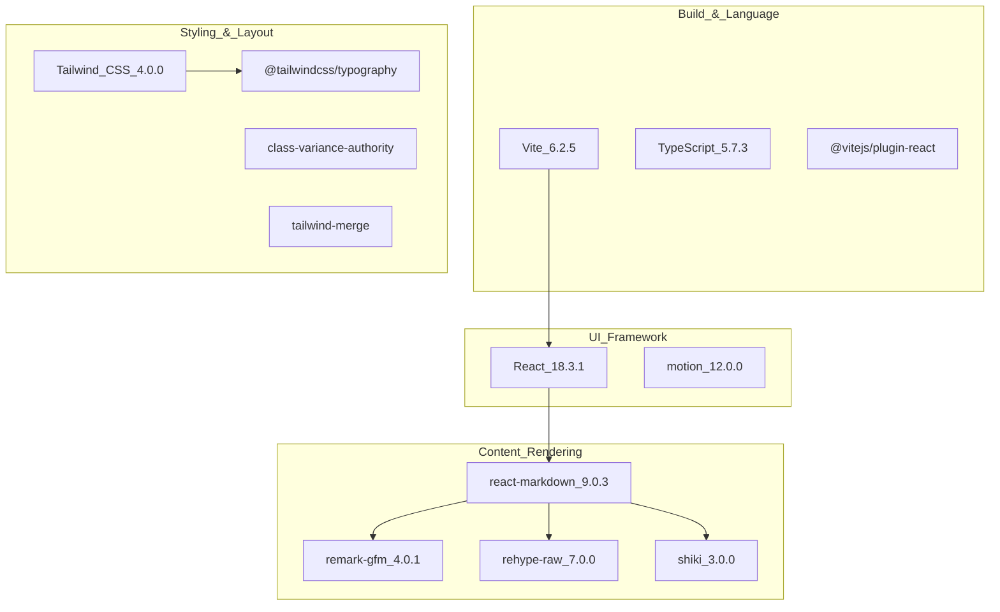
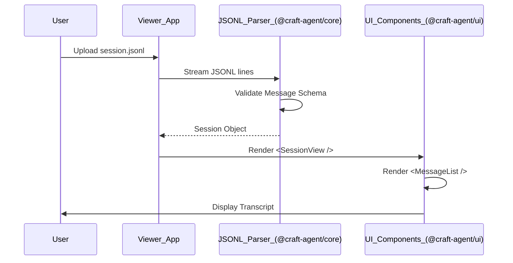

# Web Viewer Application

<details>
<summary>Relevant source files</summary>

The following files were used as context for generating this wiki page:

- [apps/viewer/package.json](apps/viewer/package.json)

</details>


## Purpose and Scope

The Web Viewer Application is a standalone web application for uploading, viewing, and sharing Craft Agents session transcripts. While the main Electron desktop application provides a full environment for agent interaction, local file access, and tool execution, the viewer is a read-only interface optimized for displaying session content in a browser environment. This enables users to share session transcripts (exported as `.jsonl` files) with others who may not have the desktop application installed.

For information about the full desktop application architecture, see [Electron Application Architecture](). For details on session lifecycle and management, see [Session Lifecycle]().

## Architecture Overview

The viewer is a single-page application (SPA) built with React and Vite. It operates as a pure client-side tool, meaning it does not require a dedicated backend for processing session data; all parsing and rendering happen within the user's browser.

### Application Comparison

```mermaid
graph TB
    subgraph "Desktop_Application [apps/electron]"
        ElectronMain["Main_Process<br/>(Node.js)"]
        ElectronPreload["Preload_Bridge"]
        ElectronRenderer["Renderer_Process<br/>(React)"]
        
        ElectronMain -->|"IPC_Security"| ElectronPreload
        ElectronPreload -->|"Context_Bridge"| ElectronRenderer
        ElectronMain -->|"File_Access"| LocalFS["Local_Filesystem<br/>~/.craft-agent/"]
    end
    
    subgraph "Web_Viewer_Application [apps/viewer]"
        ViewerApp["Vite_+_React<br/>Static_Web_App"]
        ViewerUI["@craft-agent/ui<br/>Shared_Components"]
        ViewerCore["@craft-agent/core<br/>Type_Definitions"]
        
        ViewerApp --> ["@craft-agent/ui"]
        ViewerApp --> ["@craft-agent/core"]
    end
    
    subgraph "Session_Data_Access"
        LocalFS -.->|"User_uploads"| ViewerApp
        RemoteURL["Remote_URL"] -.->|"Fetch_session"| ViewerApp
    end
```

**Sources:** [apps/viewer/package.json:1-37]()

The key architectural differences:

| Aspect | Desktop Application | Web Viewer |
|--------|-------------------|------------|
| **Process Model** | Multi-process (Main/Preload/Renderer) | Single-process (Browser) |
| **Runtime** | Node.js + Chromium | Browser environment only |
| **File Access** | Direct filesystem access (IPC) | File Upload API or Fetch API |
| **Agent Interaction** | Full execution & tool use | Read-only transcript display |
| **Build System** | Multi-stage (esbuild + Vite) | Vite-only |

### Technology Stack

The viewer leverages modern web technologies to ensure high-performance rendering of complex session data.



**Sources:** [apps/viewer/package.json:17-35]()

## Package Dependencies

The viewer relies heavily on the internal monorepo packages to maintain visual and functional parity with the desktop application.

### Shared Internal Packages

| Package | Role in Viewer |
|---------|----------------|
| `@craft-agent/core` | Provides the TypeScript interfaces for `Session`, `Message`, and `Attachment` entities, ensuring the viewer correctly interprets the JSONL format produced by the desktop app. |
| `@craft-agent/ui` | Provides the React components for rendering the chat interface, including message bubbles, tool call cards, and attachment previews. |

**Sources:** [apps/viewer/package.json:14-16]()

### Content Rendering Pipeline

The viewer implements a markdown rendering pipeline identical to the desktop app to ensure "What You See Is What You Shared" (WYSIWYS).

1.  **Markdown Parsing**: Uses `react-markdown` [apps/viewer/package.json:28]().
2.  **GitHub Flavored Markdown**: `remark-gfm` [apps/viewer/package.json:30]() enables tables, task lists, and autolinks.
3.  **HTML Support**: `rehype-raw` [apps/viewer/package.json:29]() allows rendering of safe HTML embedded in messages.
4.  **Syntax Highlighting**: `shiki` [apps/viewer/package.json:31]() provides high-fidelity code block rendering.
5.  **Styling**: `@tailwindcss/typography` [apps/viewer/package.json:21]() applies professional prose styling to the rendered output.

## Application Structure and Data Flow

The viewer follows a stateless data flow. Since it lacks a persistent database, it processes data either from a user-uploaded file or a remote URL.



**Sources:** [apps/viewer/package.json:14-18]()

### Build and Development Scripts

The application is managed via standard Vite scripts:

*   `dev`: Starts the Vite development server [apps/viewer/package.json:9]().
*   `build`: Compiles the application into a static production bundle in the `dist/` directory [apps/viewer/package.json:10]().
*   `typecheck`: Runs `tsc` to validate types across the application [apps/viewer/package.json:12]().

## Deployment and Sharing Flow

The Web Viewer is the destination for the "Share Session" feature in the Electron application.

1.  **Export**: The desktop app packages the session into a standard JSONL format.
2.  **Upload/Host**: The JSONL file is either uploaded to a storage provider or manually shared.
3.  **View**: The recipient opens the Web Viewer URL and loads the JSONL file to view the conversation, including all tool outputs and attachments, without needing the original environment or API keys.

**Sources:** [apps/viewer/package.json:5]()