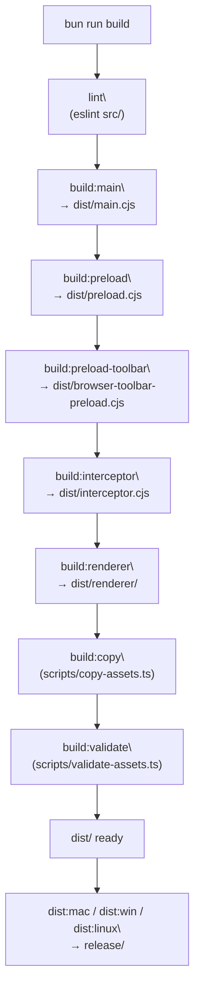
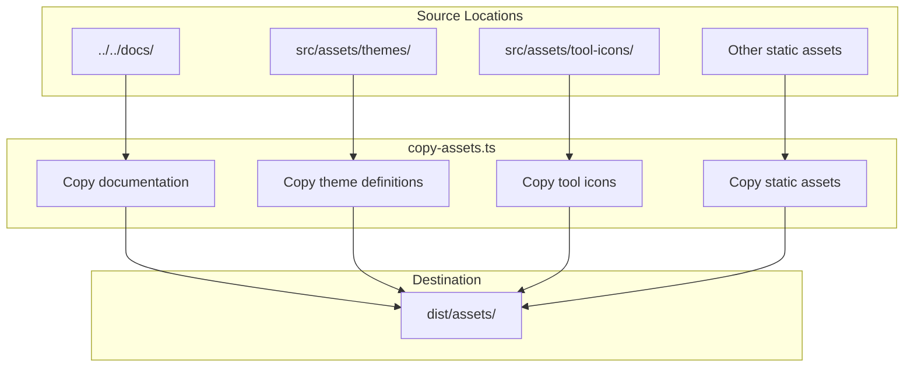
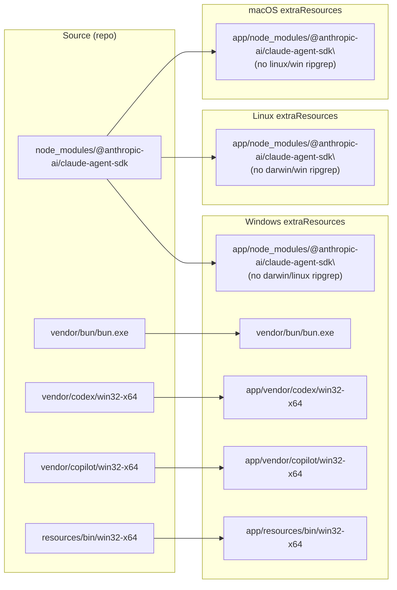
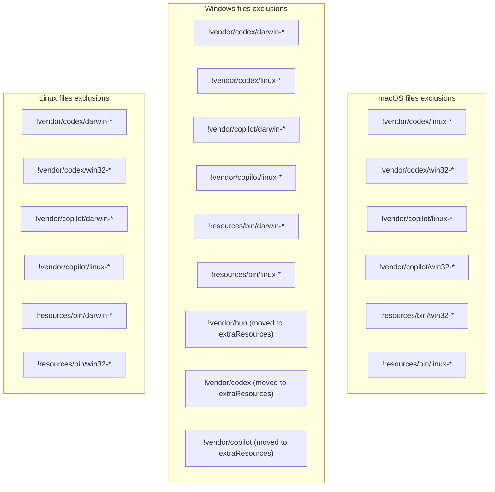
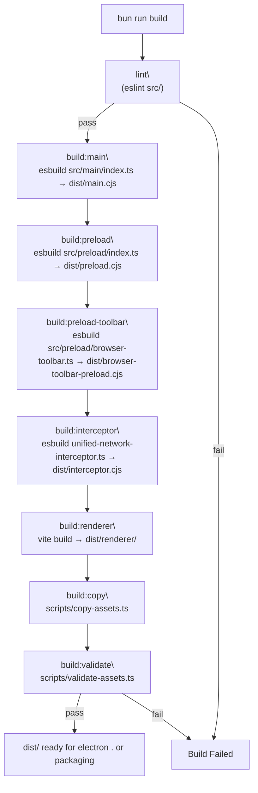

# Electron Packaging

<details>
<summary>Relevant source files</summary>

The following files were used as context for generating this wiki page:

- [apps/electron/electron-builder.yml](apps/electron/electron-builder.yml)

</details>


## Purpose and Scope

This document details the Electron Builder configuration and packaging process for creating distributable installers of the Craft Agents desktop application. It covers the multi-stage build pipeline, asset management, and the packaging workflow that transforms compiled code into platform-specific installers (DMG for macOS, installers for Windows, AppImage/deb for Linux).

For information about platform-specific build configurations and cross-compilation, see [6.1 Platform-Specific Builds](). For details on the auto-update mechanism and update distribution, see [6.3 Self-Update System]().

---

## Build Pipeline Overview

The `build` script in `apps/electron/package.json` runs eight sequential steps. All intermediate artifacts land in `dist/`. The final packaging step (invoked via `dist:mac`, `dist:win`, etc.) runs `electron-builder` and writes platform installers to the `release/` directory.

**Build pipeline — script names and output artifacts**



Sources: [apps/electron/package.json:17-37]()

---

## Main Process Compilation

The main process is compiled using esbuild with Node.js as the target platform, producing a single CommonJS bundle that serves as the application entry point.

### Build Configuration

| Configuration | Value | Purpose |
|---------------|-------|---------|
| Input | `src/main/index.ts` | Main process entry point |
| Output | `dist/main.cjs` | Bundled CommonJS file |
| Platform | `node` | Node.js runtime targeting |
| Format | `cjs` | CommonJS module format |
| External | `electron` | Electron runtime exclusion |

### Environment Variable Injection

OAuth credentials are injected at build time through esbuild's `--define` flag, making them available as `process.env` variables in the compiled bundle:

```
GOOGLE_OAUTH_CLIENT_ID
GOOGLE_OAUTH_CLIENT_SECRET
SLACK_OAUTH_CLIENT_ID
SLACK_OAUTH_CLIENT_SECRET
MICROSOFT_OAUTH_CLIENT_ID
```

The Unix build script sources `.env` from the repository root, while the Windows build script (`build:main:win`) omits credential injection to avoid PowerShell escaping issues.

**Sources:** [apps/electron/package.json:18-19]()

---

## Preload and Interceptor Compilation

### Preload Bridge

The preload script establishes the context bridge between main and renderer processes, providing the `window.electronAPI` interface with security-isolated IPC channels.

| Configuration | Value |
|---------------|-------|
| Input | `src/preload/index.ts` |
| Output | `dist/preload.cjs` |
| Platform | `node` |
| Format | `cjs` |
| External | `electron` |

### Browser Toolbar Preload

A second preload script supports the in-app browser toolbar.

| Configuration | Value |
|---------------|-------|
| Input | `src/preload/browser-toolbar.ts` |
| Output | `dist/browser-toolbar-preload.cjs` |
| Platform | `node` |
| Format | `cjs` |
| External | `electron` |

### Network Interceptor

The unified network interceptor is bundled separately. It intercepts network requests to inject API error capture and MCP schema information.

| Configuration | Value |
|---------------|-------|
| Input | `packages/shared/src/unified-network-interceptor.ts` |
| Output | `dist/interceptor.cjs` |
| Platform | `node` |
| Format | `cjs` |

Note: Several companion source files from `packages/shared/src/` (`interceptor-common.ts`, `feature-flags.ts`, `interceptor-request-utils.ts`) are also listed directly in the `electron-builder.yml` `files` array so they are available at runtime inside the packaged app.

Sources: [apps/electron/package.json:20-22](), [apps/electron/electron-builder.yml:27-30]()

---

## Renderer Process Build

The renderer process uses Vite for hot module replacement during development and optimized production builds. Vite bundles the React application with code splitting and asset optimization.

### Build Output Structure

```
dist/renderer/
├── index.html           # Application entry point
├── assets/
│   ├── index-[hash].js  # Main application bundle
│   ├── vendor-[hash].js # Third-party dependencies
│   └── *.css            # Styled component CSS
└── [static assets]      # Images, fonts, etc.
```

The renderer build is configured via `vite.config.ts` (not shown but referenced by the build script) and outputs to `dist/renderer/` for packaging.

**Sources:** [apps/electron/package.json:22]()

---

## Asset Management

### Asset Copying

The `copy-assets.ts` script copies non-code resources into the distribution directory, ensuring all runtime assets are available in the packaged application.



### Asset Validation

The `validate-assets.ts` script verifies that all required assets exist in the distribution directory before packaging, preventing runtime failures due to missing resources.

**Validation Checks:**

1. **Documentation files** - Ensures built-in docs are present
2. **Theme definitions** - Validates JSON schema for theme files
3. **Tool icons** - Checks icon file references
4. **Critical static assets** - Verifies required images/fonts

The build fails if validation detects missing or malformed assets, providing early error detection.

**Sources:** [apps/electron/package.json:23-25]()

---

## Platform-Specific Distribution Scripts

### macOS DMG Generation

The `build-dmg.sh` script handles macOS packaging for both ARM64 (Apple Silicon) and x64 (Intel) architectures.

```bash
# Build ARM64 DMG (default)
bun run dist:mac

# Build x64 DMG for Intel Macs
bun run dist:mac:x64
```

The script accepts an architecture argument (`arm64` or `x64`) and configures Electron Builder accordingly. It produces a signed DMG installer with:

- Application bundle (`.app`)
- Code signing configuration
- Notarization for Gatekeeper
- Custom DMG background and layout

### Windows Installer Generation

The `build-win.ps1` PowerShell script creates Windows installers using NSIS (Nullsoft Scriptable Install System).

```powershell
# Build Windows installer
bun run dist:win
```

The script produces:
- NSIS-based installer (`.exe`)
- Auto-update configuration
- Uninstaller
- Registry entries for protocol handlers (`craftagents://`)

**Sources:** [apps/electron/package.json:31-33]()

---

## Electron Builder Configuration

All packaging behavior is controlled by `apps/electron/electron-builder.yml`.

### Top-Level Metadata

| Field | Value | Notes |
|-------|-------|-------|
| `appId` | `com.lukilabs.craft-agent` | Bundle ID / registry key |
| `productName` | `Craft Agents` | Display name in OS UI |
| `electronVersion` | `39.2.7` | Pinned Electron version |
| `directories.output` | `release` | Platform installers land here |
| `directories.buildResources` | `resources` | Icons, DMG background, entitlements |
| `asar` | `false` | ASAR archive disabled to avoid decompression overhead |
| `afterPack` | `scripts/afterPack.cjs` | Post-pack hook for macOS 26+ Liquid Glass icon |
| `publish.provider` | `generic` | electron-updater update source |
| `publish.url` | `https://agents.craft.do/electron/latest` | Update manifest URL |

Sources: [apps/electron/electron-builder.yml:1-79]()

### Files Inclusion

The `files` array in `electron-builder.yml` controls what ends up inside the packaged app. `node_modules` is explicitly excluded at the top level; the Claude Agent SDK is handled separately via `extraResources`.

| Glob pattern | What it includes |
|---|---|
| `dist/**/*` (minus `dist/renderer/src/**`, `**/*.map`) | All compiled bundles and renderer assets |
| `package.json` | App entry point metadata |
| `resources/bridge-mcp-server/**/*` | Bundled Bridge MCP server for Codex sessions |
| `resources/session-mcp-server/**/*` | Bundled Session MCP server for Codex sessions |
| `resources/pi-agent-server/**/*` | Pi agent server subprocess |
| `packages/shared/src/unified-network-interceptor.ts` et al. | Runtime interceptor source files |
| `resources/scripts/**/*` | Python CLI tool scripts |
| `resources/bin/markitdown`, `resources/bin/pdf-tool`, etc. | Unix and Windows shell wrappers for CLI tools |
| `resources/bin/darwin-arm64/**/*` … `resources/bin/linux-x64/**/*` | Platform-specific `uv` binaries |
| `vendor/bun/**/*` | Bundled Bun runtime (platform-specific) |
| `vendor/codex/**/*` | Bundled Codex binary (platform-specific) |
| `vendor/copilot/**/*` | Bundled Copilot CLI binary (platform-specific) |
| `!node_modules/**/*` | Excludes all of node_modules |

Sources: [apps/electron/electron-builder.yml:14-62]()

### extraResources Mechanism

`electron-builder` automatically excludes directories named `node_modules` since v20.15.2. The `@anthropic-ai/claude-agent-sdk` package (which ships a bundled `ripgrep` binary) must be deployed inside the packaged app's `node_modules`, so it is declared as `extraResources` on all platforms with an explicit `from`/`to` mapping. Per-platform ripgrep binaries for other OSes are filtered out.

**Diagram: extraResources copy targets per platform**



Sources: [apps/electron/electron-builder.yml:101-186]()

### Windows EBUSY Workaround

On Windows, `electron-builder`'s npm module collector scans and locks `.exe` files while simultaneously copying them, causing `EBUSY` errors. The workaround is to declare all Windows executables (`bun.exe`, Codex, Copilot CLI, `win32-x64` uv binaries) as `extraResources` instead of `files`. `extraResources` are copied before the module collector runs. This is documented inline in the config.

Sources: [apps/electron/electron-builder.yml:160-186]()

### Platform Targets and Artifact Names

All platforms use predictable artifact names (`Craft-Agents-${arch}.${ext}`) rather than version-stamped names, which simplifies update manifests.

| Platform | Target | Arch | Artifact |
|---|---|---|---|
| macOS | `dmg` | arm64, x64 | `Craft-Agents-arm64.dmg`, `Craft-Agents-x64.dmg` |
| macOS | `zip` | arm64, x64 | `Craft-Agents-arm64.zip`, `Craft-Agents-x64.zip` |
| Windows | `nsis` | x64 | `Craft-Agents-x64.exe` |
| Linux | `AppImage` | x64 | `Craft-Agents-x64.AppImage` |

The `zip` target on macOS produces the archive consumed by `electron-updater` for delta updates (see page 6.3).

Sources: [apps/electron/electron-builder.yml:81-219]()

### macOS Configuration

| Field | Value | Purpose |
|---|---|---|
| `category` | `public.app-category.productivity` | App Store category |
| `hardenedRuntime` | `true` | Required for notarization |
| `gatekeeperAssess` | `false` | Skip local Gatekeeper check during build |
| `entitlements` | `build/entitlements.mac.plist` | Sandbox permissions |
| `extendInfo.CFBundleIconName` | `AppIcon` | macOS 26+ Liquid Glass icon lookup |

The `afterPack` hook (`scripts/afterPack.cjs`) runs `actool` to compile an `Assets.car` containing the Liquid Glass icon, which macOS 26+ uses for the Dock and other system UI surfaces.

Sources: [apps/electron/electron-builder.yml:81-122]()

### DMG Layout

| Field | Value |
|---|---|
| `background` | `resources/dmg-background.tiff` (multi-res 1x+2x TIFF) |
| `icon` | `resources/icon.icns` |
| `iconSize` | `80` |
| `window` | 540 × 380 |

The contents array positions the app icon at (130, 200) and an `/Applications` folder alias at (410, 200).

Sources: [apps/electron/electron-builder.yml:124-143]()

### NSIS (Windows Installer) Configuration

| Field | Value | Notes |
|---|---|---|
| `oneClick` | `true` | Silent install without wizard |
| `perMachine` | `false` | Installs to `%LOCALAPPDATA%\Programs\` |
| `deleteAppDataOnUninstall` | `true` | Cleans up user data on uninstall |

`perMachine: false` is required because Bun subprocesses cannot read/write files under `Program Files` without elevated permissions.

Sources: [apps/electron/electron-builder.yml:188-193]()

### Cross-Platform Binary Exclusions

Each platform section uses a `files` override to exclude native binaries for other platforms, keeping installer sizes minimal.

**Diagram: binary exclusion rules per platform**



Sources: [apps/electron/electron-builder.yml:110-219]()

---

## Package.json Configuration

### Application Entry Point

The `main` field specifies the entry point for the Electron application:

```json
{
  "main": "dist/main.cjs"
}
```

This points to the compiled main process bundle, not the source TypeScript file.

### Dependencies vs DevDependencies

All runtime dependencies are listed in `dependencies`, including:
- **Workspace packages**: `@craft-agent/core`, `@craft-agent/shared`, `@craft-agent/ui`
- **Electron utilities**: `electron-log`, `electron-updater`
- **React ecosystem**: `react`, `react-dom`, UI component libraries

DevDependencies would include build tools (esbuild, Vite, TypeScript), but these are typically managed at the workspace root level in the monorepo.

**Sources:** [apps/electron/package.json:37-70]()

---

## Build Output Artifacts

### Development Build (`dist/`)

Running `bun run build` produces artifacts in `dist/` suitable for local testing with `electron .`:

```
dist/
├── main.cjs                       # Main process bundle
├── preload.cjs                    # Renderer preload bridge
├── browser-toolbar-preload.cjs    # Browser toolbar preload
├── interceptor.cjs                # Network interceptor bundle
├── renderer/                      # Vite-built React app
│   ├── index.html
│   └── assets/
└── resources/                     # Copied by build:copy
    ├── docs/
    ├── themes/
    └── tool-icons/
```

### Production Distribution (`release/`)

Distribution scripts produce platform-specific installers in the `release/` directory (configured via `directories.output` in `electron-builder.yml`):

**macOS:**
```
release/
├── Craft-Agents-arm64.dmg
├── Craft-Agents-x64.dmg
├── Craft-Agents-arm64.zip          # For electron-updater delta updates
├── Craft-Agents-x64.zip
└── mac-arm64/
    └── Craft Agents.app
```

**Windows:**
```
release/
├── Craft-Agents-x64.exe            # NSIS one-click installer
└── win-unpacked/
    └── Craft Agents.exe
```

**Linux:**
```
release/
├── Craft-Agents-x64.AppImage
└── linux-unpacked/
```

Sources: [apps/electron/electron-builder.yml:11-12](), [apps/electron/electron-builder.yml:116-119](), [apps/electron/electron-builder.yml:150-151](), [apps/electron/electron-builder.yml:203]()

---

## Build Script Workflow

### Complete Build Process

The complete build workflow executes all stages in sequence. The Windows variant (`build:win`) skips `lint` and uses `build:main:win` (no OAuth credential injection).



Sources: [apps/electron/package.json:17-28]()

### Distribution Workflow

Distribution builds extend the base build with Electron Builder packaging:

1. **Run complete build** - Executes `bun run build`
2. **Invoke platform script** - Runs `dist:mac`, `dist:win`, or `dist:linux`
3. **Electron Builder** - Packages application with platform-specific configuration
4. **Code signing** - Signs binaries with platform-appropriate certificates
5. **Installer creation** - Generates DMG, NSIS installer, or AppImage
6. **Update manifest** - Creates update metadata for electron-updater

**Sources:** [apps/electron/package.json:25-33]()

---

## Environment-Specific Builds

### Development vs Production

The build system supports two modes:

| Mode | Command | Optimizations | Source Maps |
|------|---------|---------------|-------------|
| Development | `bun run dev` | Minimal | Full inline |
| Production | `bun run build` | Full minification | External files |

Development builds prioritize build speed and debugging, while production builds optimize for file size and performance.

### Platform-Specific Environment Handling

**Unix (macOS/Linux):**
- Sources `.env` file for environment variables
- Uses bash scripts for distribution
- Supports credential injection via shell escaping

**Windows:**
- Uses separate `build:main:win` script
- PowerShell scripts for distribution
- Skips credential injection to avoid escaping issues

**Sources:** [apps/electron/package.json:18-19, 26-28]()

---

## Integration with Electron Builder

### Configuration Resolution

Electron Builder resolves configuration from multiple sources in order of precedence:

1. `electron-builder.yml` in project root
2. `build` field in `package.json`
3. Default configuration

The resolved configuration determines packaging behavior, file inclusion patterns, and platform-specific settings.

### Build Hooks

Electron Builder provides lifecycle hooks for custom build logic:

- **afterPack** - Executes after application files are packed (`scripts/afterPack.cjs` for Liquid Glass icon)
- **afterSign** - Runs after code signing completes
- **beforeBuild** - Allows pre-build validation

These hooks can be defined in the configuration file or as separate scripts.

### Dependency Bundling

Electron Builder automatically bundles production dependencies from `node_modules/` based on the `dependencies` field in `package.json`. DevDependencies are excluded from the packaged application.

For workspace dependencies (`workspace:*`), the bundler resolves them to their built artifacts in the monorepo.

**Sources:** [apps/electron/package.json:37-40](), [apps/electron/electron-builder.yml:8]()

---

## Summary

The Electron packaging process uses a multi-stage build pipeline coordinated through npm scripts:

1. **Lint** - Validate code quality
2. **Compile** - Build main, preload, and interceptor bundles with esbuild
3. **Bundle** - Build renderer process with Vite
4. **Copy** - Transfer static assets to distribution directory
5. **Validate** - Verify asset completeness
6. **Package** - Create platform-specific installers with Electron Builder

Platform-specific distribution scripts (`build-dmg.sh`, `build-win.ps1`) handle the final packaging step, producing signed and notarized installers ready for distribution.