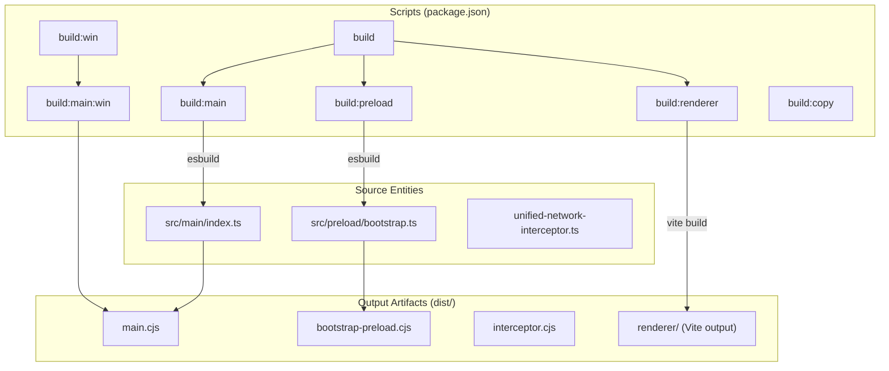
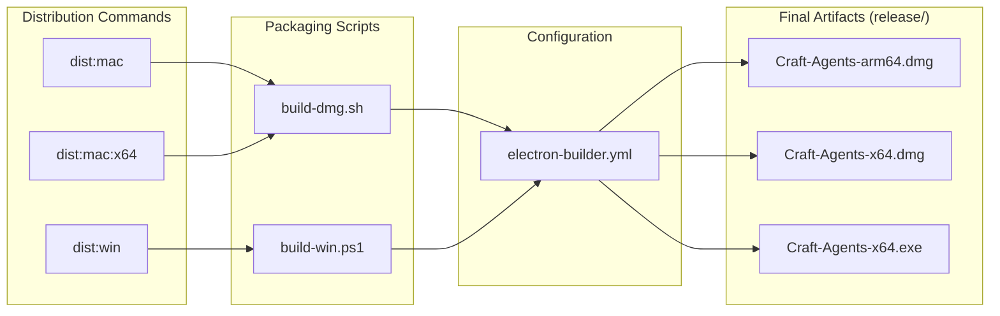

# Building & Distribution

Relevant source files

The following files were used as context for generating this wiki page:

- [apps/electron/electron-builder.yml](apps/electron/electron-builder.yml)
- [apps/electron/package.json](apps/electron/package.json)

This page covers how to produce distributable builds of the Craft Agents Electron application — from compiling source into artifacts to packaging them for end-user delivery on macOS, Windows, and Linux. It focuses on the top-level scripts and the overall pipeline.

For details specific to each platform, see [Platform-Specific Builds](#6.1). For the `electron-builder.yml` configuration and asset bundling details, see [Electron Packaging](#6.2). For the auto-update mechanism that consumes built artifacts, see [Self-Update System](#6.3). For the underlying Vite and esbuild compilation steps, see [Build System](#5.2). For headless server deployment, see [Server Deployment](#6.4).

---

## Build Pipeline Overview

The full build for the Electron application is defined in [`apps/electron/package.json`](apps/electron/package.json:1-78). It consists of two phases: **compilation** and **distribution packaging**.

**Compilation** converts TypeScript source into four `dist/` artifacts, copies resources, and validates them. **Distribution packaging** invokes `electron-builder` (via platform-specific wrapper scripts) to produce a signed, installable artifact.

**Build Pipeline — Script to Output Mapping**

Sources: [apps/electron/package.json:17-27]()

---

## OAuth Credential Injection

The macOS/Linux `build:main` script injects OAuth credentials as compile-time constants via esbuild `--define` flags. The Windows variant (`build:main:win`) omits this because environment variables are injected differently in the PowerShell wrapper.

| Script | OAuth Injection | Source |
|---|---|---|
| `build:main` | `source ../../.env` + `--define:process.env.*` | [apps/electron/package.json:18]() |
| `build:main:win` | None (handled by `build-win.ps1`) | [apps/electron/package.json:19]() |

Credentials injected at build time include `GOOGLE_OAUTH_CLIENT_ID`, `GOOGLE_OAUTH_CLIENT_SECRET`, `SLACK_OAUTH_CLIENT_ID`, `SLACK_OAUTH_CLIENT_SECRET`, and `MICROSOFT_OAUTH_CLIENT_ID`.

Sources: [apps/electron/package.json:18-19]()

---

## Distribution Targets

**Platform Distribution Script and Artifact Summary**

Sources: [apps/electron/package.json:32-34](), [apps/electron/electron-builder.yml:81-151]()

### Platform Targets at a Glance

| Platform | Script | Installer Format | Architecture | Output File |
|---|---|---|---|---|
| macOS (Apple Silicon) | `dist:mac` → `build-dmg.sh arm64` | DMG + ZIP | arm64 | `Craft-Agents-arm64.dmg` |
| macOS (Intel) | `dist:mac:x64` → `build-dmg.sh x64` | DMG + ZIP | x64 | `Craft-Agents-x64.dmg` |
| Windows | `dist:win` → `build-win.ps1` | NSIS (one-click) | x64 | `Craft-Agents-x64.exe` |
| Linux | (direct electron-builder) | AppImage | x64 | `Craft-Agents-x64.AppImage` |

Sources: [apps/electron/electron-builder.yml:81-198]()

---

## Bundled Vendor Binaries

The build bundles several platform-native binaries into `vendor/` and `resources/bin/`. Each platform build excludes binaries for other platforms using file filters in `electron-builder.yml`.

| Binary | Location | Purpose |
|---|---|---|
| Bun runtime | `vendor/bun/` | JavaScript runtime for MCP servers [apps/electron/electron-builder.yml:55-56]() |
| Codex | `vendor/codex/` | Codex agent binary [apps/electron/electron-builder.yml:57-58]() |
| Copilot CLI | `vendor/copilot/` | GitHub Copilot CLI [apps/electron/electron-builder.yml:59-60]() |
| `uv` (Python) | `resources/bin/<platform>/` | Python package manager for tool scripts [apps/electron/electron-builder.yml:50-54]() |
| CLI wrappers | `resources/bin/` | Shell + `.cmd` wrappers for tool scripts (e.g., `markitdown`, `pdf-tool`) [apps/electron/electron-builder.yml:31-49]() |
| MCP servers | `resources/bridge-mcp-server/`, `resources/session-mcp-server/` | Bundled MCP server processes [apps/electron/electron-builder.yml:19-21]() |
| Pi agent server | `resources/pi-agent-server/` | Pi SDK subprocess [apps/electron/electron-builder.yml:22-23]() |

The `@anthropic-ai/claude-agent-sdk` package is included via `extraResources` on all platforms to work around the electron-builder automatic `node_modules` exclusion, with platform-specific ripgrep binary filtering applied per target.

Sources: [apps/electron/electron-builder.yml:14-68](), [apps/electron/electron-builder.yml:101-115](), [apps/electron/electron-builder.yml:170-186]()

---

## Key Configuration Values

These values from `electron-builder.yml` affect the installed application identity and update behavior:

| Key | Value |
|---|---|
| `appId` | `com.lukilabs.craft-agent` |
| `productName` | `Craft Agents` |
| `electronVersion` | `39.2.7` |
| `asar` | `false` (disabled to avoid decompression overhead) |
| `output` directory | `release/` |
| `publish.url` | `https://agents.craft.do/electron/latest` |
| `nsis.perMachine` | `false` (installs to `%LOCALAPPDATA%\Programs\`) |

The `publish.url` is consumed by `electron-updater` at runtime to check for new releases.

Sources: [apps/electron/electron-builder.yml:1-11](), [apps/electron/electron-builder.yml:73-79](), [apps/electron/electron-builder.yml:188-193]()

---

## macOS Code Signing and Notarization

The `mac` section of `electron-builder.yml` enables hardened runtime and references entitlements:

- `hardenedRuntime: true` [apps/electron/electron-builder.yml:97]()
- `gatekeeperAssess: false` [apps/electron/electron-builder.yml:98]()
- `entitlements: build/entitlements.mac.plist` [apps/electron/electron-builder.yml:99]()

An `afterPack` hook at `scripts/afterPack.cjs` runs after packaging to compile the macOS 26+ Liquid Glass icon using `actool`, targeting the `AppIcon` asset catalog entry. The `CFBundleIconName: AppIcon` key is set via `extendInfo`.

Sources: [apps/electron/electron-builder.yml:8-9](), [apps/electron/electron-builder.yml:81-123]()

---

## Windows NSIS Installer Behavior

The Windows NSIS installer is configured as a one-click, per-user installer:

- **One-click**: No UI shown during install [apps/electron/electron-builder.yml:189]().
- **Per-user**: Installs to `%LOCALAPPDATA%\Programs\` rather than `Program Files`. This is required because Bun subprocesses cannot read/write files under `Program Files` due to Windows permission restrictions [apps/electron/electron-builder.yml:190-192]().
- **Uninstall**: `deleteAppDataOnUninstall: true` removes app data on uninstall [apps/electron/electron-builder.yml:193]().

Additionally, binary executables like `bun.exe` and `codex` are moved to `extraResources` on Windows to avoid `EBUSY` file locking errors during the packaging process.

Sources: [apps/electron/electron-builder.yml:160-186]()