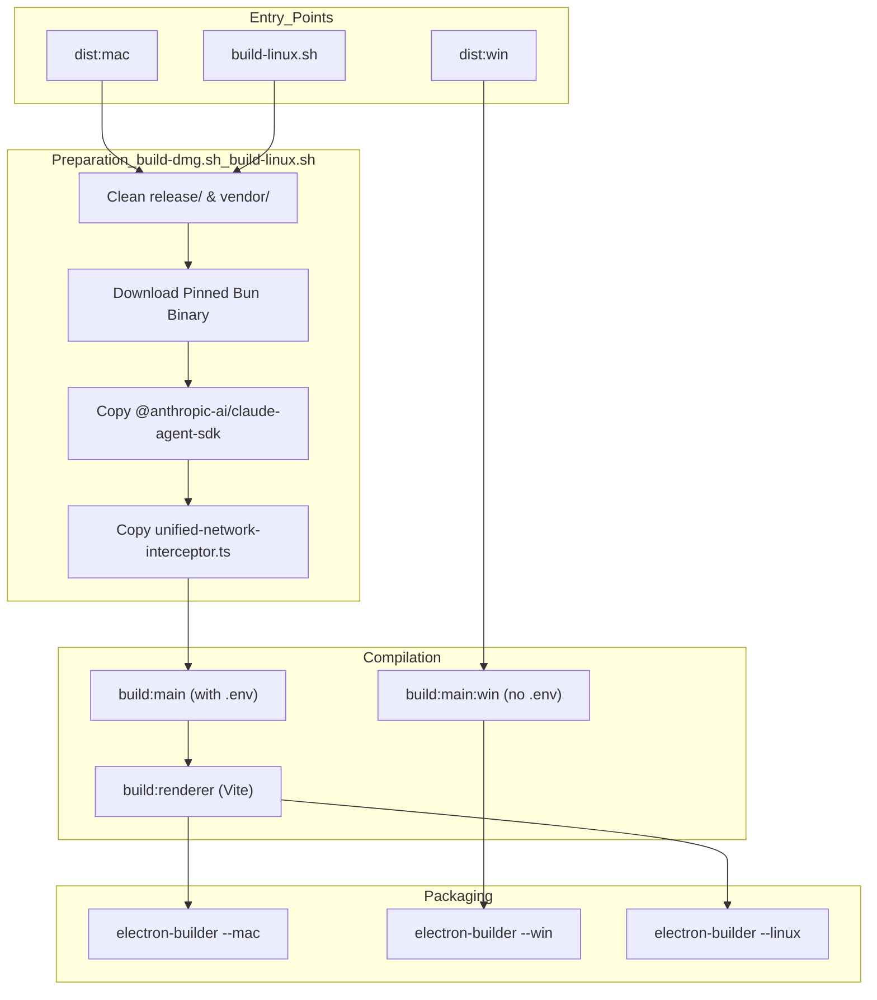
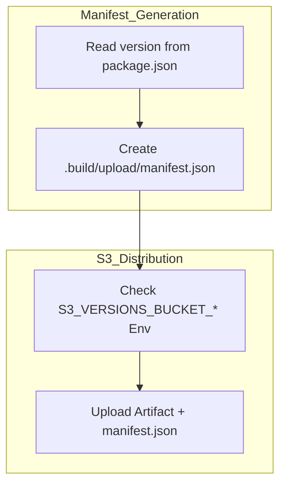

# Platform-Specific Builds

Relevant source files

The following files were used as context for generating this wiki page:

- [apps/electron/electron-builder.yml](apps/electron/electron-builder.yml)
- [apps/electron/scripts/build-dmg.sh](apps/electron/scripts/build-dmg.sh)
- [apps/electron/scripts/build-linux.sh](apps/electron/scripts/build-linux.sh)

This page documents the procedures and scripts required to produce distributable builds of the Craft Agents Electron application for macOS, Windows, and Linux. It covers architecture-specific packaging (arm64 vs x64), the injection of OAuth credentials during the build process, and the role of platform-specific helper scripts.

For the general build pipeline (esbuild, Vite, asset validation) that precedes packaging, see [Build System](). For the `electron-builder.yml` configuration and asset bundling, see [Electron Packaging]().

---

## Build Targets at a Glance

The monorepo utilizes a two-tier script system: root-level convenience scripts in the main `package.json` and platform-specific distribution scripts within `apps/electron/package.json`.

| Platform | Architecture | Electron Package Script | Underlying Tool |
|---|---|---|---|
| macOS | arm64 | `dist:mac` | `build-dmg.sh arm64` |
| macOS | x64 | `dist:mac:x64` | `build-dmg.sh x64` |
| Windows | x64 | `dist:win` | `build-win.ps1` |
| Linux | x64 / arm64 | (via electron-builder) | `build-linux.sh` |

Sources: [apps/electron/scripts/build-dmg.sh:40-43](), [apps/electron/scripts/build-linux.sh:29-32]()

---

## Build Flow Architecture

The distribution process involves cleaning artifacts, installing dependencies, downloading pinned binaries (like Bun), and finally invoking `electron-builder`.

### Platform Build Pipeline

Sources: [apps/electron/scripts/build-dmg.sh:88-150](), [apps/electron/scripts/build-linux.sh:73-142]()

---

## macOS Builds (`build-dmg.sh`)

macOS distribution is managed by `apps/electron/scripts/build-dmg.sh`. This script handles environment synchronization and code signing.

### Key Implementation Details
1.  **Secret Syncing**: If the 1Password CLI (`op`) is present, it runs `sync-secrets` to populate the `.env` file before building [apps/electron/scripts/build-dmg.sh:21-30]().
2.  **Binary Pinning**: It downloads a specific version of Bun (`bun-v1.3.9`) for the target architecture (`darwin-aarch64` or `darwin-x64`) to ensure reproducible builds [apps/electron/scripts/build-dmg.sh:81-122]().
3.  **Code Signing & Notarization**: The script exports `APPLE_SIGNING_IDENTITY`, `APPLE_ID`, and `APPLE_TEAM_ID` to the environment, enabling `electron-builder` to perform Apple notarization [apps/electron/scripts/build-dmg.sh:161-180]().
4.  **DMG Customization**: The build produces a DMG with a custom background (`dmg-background.tiff`) and specific icon layouts defined in the `dmg` section of the configuration [apps/electron/electron-builder.yml:124-143]().

### OAuth Credential Injection
The macOS build uses the `build:main` script, which sources `.env` and uses esbuild's `--define` feature to hardcode OAuth secrets into the `main.cjs` bundle.

Sources: [apps/electron/scripts/build-dmg.sh:32-37](), [apps/electron/electron-builder.yml:81-123]()

---

## Windows Builds (`build-win.ps1`)

Windows builds use a PowerShell script at `apps/electron/scripts/build-win.ps1`. 

### File Locking Workarounds
Windows builds face specific challenges with file locking during the `electron-builder` collection phase. To avoid `EBUSY` errors, several executable binaries are excluded from the standard files list and moved to `extraResources` [apps/electron/electron-builder.yml:160-169]().

| Binary Type | Exclusion Rule | extraResources Destination |
|---|---|---|
| Bun Runtime | `!vendor/bun/**/*` | `vendor/bun/bun.exe` |
| Codex Binary | `!vendor/codex/**/*` | `app/vendor/codex/win32-x64` |
| Copilot CLI | `!vendor/copilot/**/*` | `app/vendor/copilot/win32-x64` |

Sources: [apps/electron/electron-builder.yml:160-186]()

### Differences in Credential Injection
Unlike macOS/Linux, the Windows build process requires OAuth variables to be set in the PowerShell session environment before running the distribution script. The `nsis` installer is configured for per-user installation to `%LOCALAPPDATA%\Programs\` because the Bun subprocess cannot reliably read/write files in `Program Files` due to permission restrictions [apps/electron/electron-builder.yml:188-192]().

---

## Linux Builds (`build-linux.sh`)

The Linux build process at `apps/electron/scripts/build-linux.sh` mirrors the macOS logic but targets `AppImage` formats.

### Architecture Mapping
The script maps Electron architecture names to Bun and Linux naming conventions:
*   **arm64**: Downloads `bun-linux-aarch64` and produces `Craft-Agents-aarch64.AppImage` [apps/electron/scripts/build-linux.sh:90-91,155-160]().
*   **x64**: Downloads `bun-linux-x64-baseline` and produces `Craft-Agents-x86_64.AppImage` [apps/electron/scripts/build-linux.sh:93,153-160]().

### Artifact Renaming
To maintain consistency across platforms, the script renames the `electron-builder` output (e.g., `Craft-Agents-x86_64.AppImage`) to the standard `Craft-Agents-x64.AppImage` format [apps/electron/scripts/build-linux.sh:170-174]().

Sources: [apps/electron/scripts/build-linux.sh:86-114](), [apps/electron/scripts/build-linux.sh:149-174]()

---

## Deployment & Manifests

Both `build-dmg.sh` and `build-linux.sh` include logic to generate a `manifest.json` containing the current version from `package.json` [apps/electron/scripts/build-dmg.sh:202-207](), [apps/electron/scripts/build-linux.sh:181-186]().

### Upload Logic
If the `--upload` flag is provided, the scripts use `S3_VERSIONS_BUCKET_*` credentials to upload the resulting `.dmg` or `.AppImage` to a distribution bucket. The application uses a generic provider for updates, fetching manifests from `https://agents.craft.do/electron/latest` [apps/electron/electron-builder.yml:74-76]().

Sources: [apps/electron/scripts/build-dmg.sh:45-61](), [apps/electron/scripts/build-linux.sh:44-46](), [apps/electron/electron-builder.yml:74-76]()