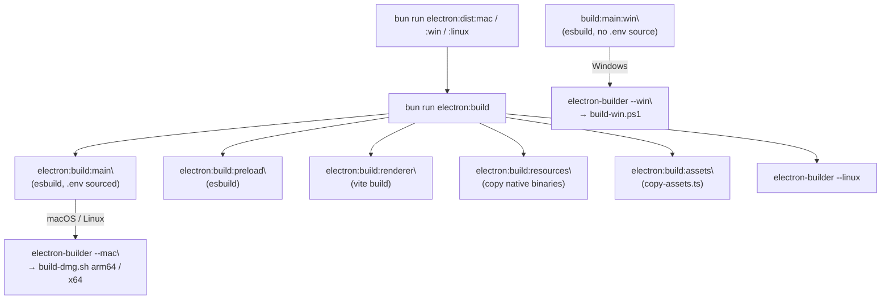
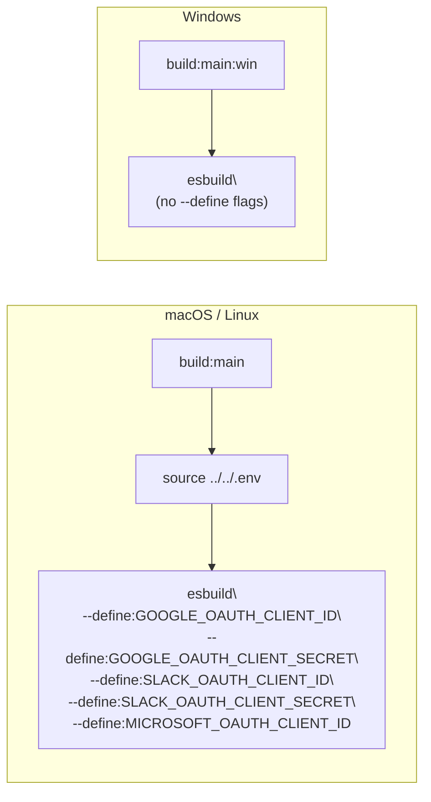
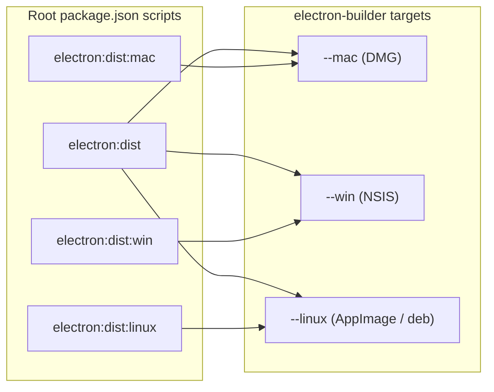

# Platform-Specific Builds

<details>
<summary>Relevant source files</summary>

The following files were used as context for generating this wiki page:

- [apps/electron/package.json](apps/electron/package.json)
- [package.json](package.json)

</details>

This page documents how to produce distributable builds of the Craft Agents Electron application for each supported target platform: macOS (arm64 and x64 DMGs), Windows (NSIS installer), and Linux. It covers the platform-specific scripts, the OAuth environment variable injection differences between platforms, and the invocation order for each target.

For the general build pipeline (esbuild, Vite, preload, renderer) that runs before packaging, see [Build System](#5.2). For the `electron-builder.yml` configuration, asset bundling, and `extraResources`, see [Electron Packaging](#6.2).

---

## Build Targets at a Glance

The monorepo exposes two levels of distribution scripts: root-level convenience scripts in `package.json` and platform-level scripts inside `apps/electron/package.json`.

| Platform    | Root Script           | Electron Package Script  | Underlying Tool            |
| ----------- | --------------------- | ------------------------ | -------------------------- |
| macOS arm64 | `electron:dist:mac`   | `dist:mac`               | `build-dmg.sh arm64`       |
| macOS x64   | _(invoke directly)_   | `dist:mac:x64`           | `build-dmg.sh x64`         |
| Windows     | `electron:dist:win`   | `dist:win`               | `build-win.ps1`            |
| Linux       | `electron:dist:linux` | _(via electron-builder)_ | `electron-builder --linux` |

Sources: [package.json:38-41](), [apps/electron/package.json:32-35]()

---

## Build Flow Overview

**Platform Build Pipeline**



> **Note:** On Windows the main process is compiled with `build:main:win` rather than `build:main`. The difference is described in the [OAuth Credential Injection](#oauth-credential-injection) section below.

Sources: [package.json:27-41](), [apps/electron/package.json:18-35]()

---

## macOS Builds

### Scripts

macOS distribution is triggered through `apps/electron/scripts/build-dmg.sh`, which accepts a single architecture argument.

| Invocation                          | Architecture  | Output         |
| ----------------------------------- | ------------- | -------------- |
| `dist:mac` → `build-dmg.sh arm64`   | Apple Silicon | `.dmg` (arm64) |
| `dist:mac:x64` → `build-dmg.sh x64` | Intel         | `.dmg` (x64)   |

From the root workspace, the shortcut `electron:dist:mac` runs `electron:build` followed by `electron-builder --config electron-builder.yml --project apps/electron --mac`.

Sources: [apps/electron/package.json:32-34](), [package.json:39]()

### OAuth Credential Injection on macOS

The `build:main` script (used for macOS and Linux) sources the `.env` file before invoking `esbuild`:

```
source ../../.env 2>/dev/null || true
```

This injects OAuth client IDs and secrets as compile-time `--define` flags directly into the bundled `dist/main.cjs`:

| `--define` key                           | Environment variable         |
| ---------------------------------------- | ---------------------------- |
| `process.env.GOOGLE_OAUTH_CLIENT_ID`     | `GOOGLE_OAUTH_CLIENT_ID`     |
| `process.env.GOOGLE_OAUTH_CLIENT_SECRET` | `GOOGLE_OAUTH_CLIENT_SECRET` |
| `process.env.SLACK_OAUTH_CLIENT_ID`      | `SLACK_OAUTH_CLIENT_ID`      |
| `process.env.SLACK_OAUTH_CLIENT_SECRET`  | `SLACK_OAUTH_CLIENT_SECRET`  |
| `process.env.MICROSOFT_OAUTH_CLIENT_ID`  | `MICROSOFT_OAUTH_CLIENT_ID`  |

Sources: [apps/electron/package.json:18]()

For setting up the `.env` file locally, see [Development Setup](#5.1).

---

## Windows Builds

### Scripts

Windows distribution uses a PowerShell script at `apps/electron/scripts/build-win.ps1`.

The `dist:win` script in `apps/electron/package.json` invokes it as:

```
powershell -ExecutionPolicy Bypass -File scripts/build-win.ps1
```

From the root workspace, `electron:dist:win` runs `electron:build` (which calls `build:main:win` for the main process) then `electron-builder --win`.

Sources: [apps/electron/package.json:35](), [package.json:40]()

### OAuth Credential Injection on Windows {#oauth-credential-injection}

Windows does not support the `source` shell command. The `build:main:win` script therefore **omits the `.env` sourcing step** entirely:

```
esbuild src/main/index.ts --bundle --platform=node --format=cjs --outfile=dist/main.cjs --external:electron
```

No `--define` flags for OAuth credentials appear in `build:main:win`. For a Windows distribution build that includes OAuth credentials, those environment variables must be present in the shell environment before invoking the build — for example, set via the system environment or a CI pipeline secret injection mechanism.

**Comparison of main process build commands**



Sources: [apps/electron/package.json:18-19](), [apps/electron/package.json:27]()

### Full Windows Build Sequence

The `build:win` script in `apps/electron/package.json` replaces `build:main` with `build:main:win` and otherwise runs the same steps:

```
build:main:win → build:preload → build:preload-toolbar → build:interceptor → build:renderer → build:copy → build:validate
```

Note that `build:win` (unlike `build`) skips `lint` at the start, since ESLint may not be available in a headless Windows CI environment.

Sources: [apps/electron/package.json:26-27]()

---

## Linux Builds

Linux packaging is handled entirely through `electron-builder` with no separate shell script wrapper. The root script `electron:dist:linux` runs:

```
bun run electron:build && electron-builder --config electron-builder.yml --project apps/electron --linux
```

Like macOS, the Linux main process build uses `build:main` (the `.env`-sourcing variant), so OAuth credentials are injected at compile time when the `.env` file is present.

The specific Linux packaging targets (e.g., `AppImage`, `deb`, `rpm`) are defined in `electron-builder.yml`. See [Electron Packaging](#6.2) for the full `electron-builder.yml` reference.

Sources: [package.json:41](), [apps/electron/package.json:18]()

---

## Script Reference Summary

**Root `package.json` dist scripts**



**`apps/electron/package.json` platform scripts**

| Script         | Shell      | Invokes                      |
| -------------- | ---------- | ---------------------------- |
| `dist:mac`     | bash       | `scripts/build-dmg.sh arm64` |
| `dist:mac:x64` | bash       | `scripts/build-dmg.sh x64`   |
| `dist:win`     | PowerShell | `scripts/build-win.ps1`      |

Sources: [package.json:38-41](), [apps/electron/package.json:32-35]()
