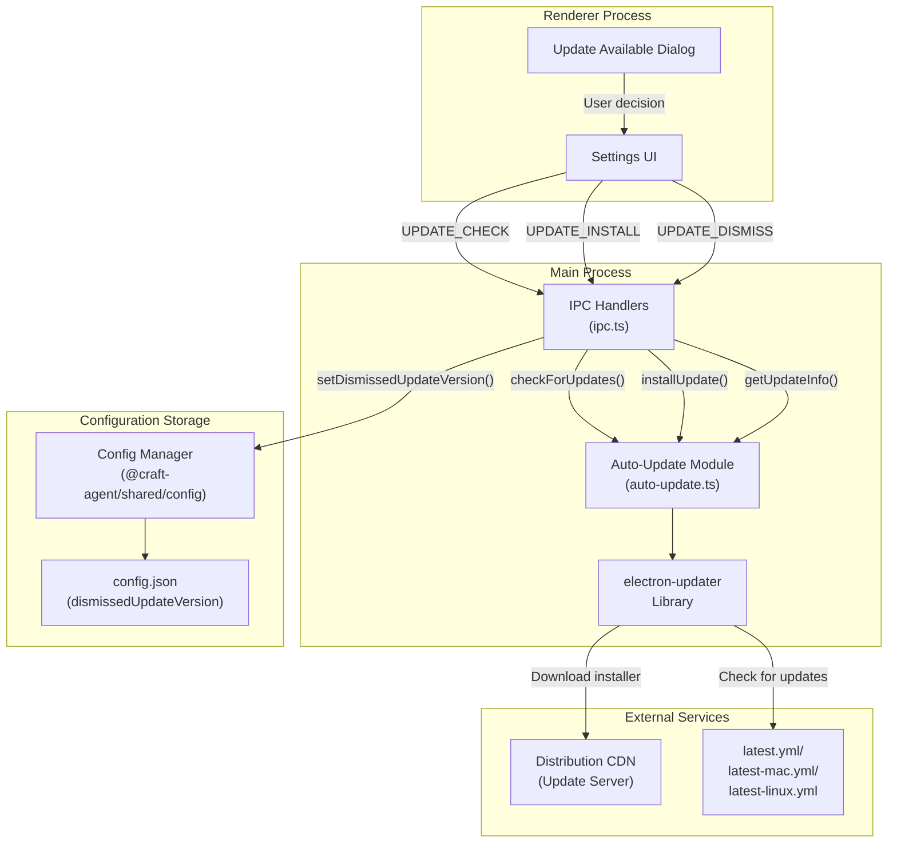
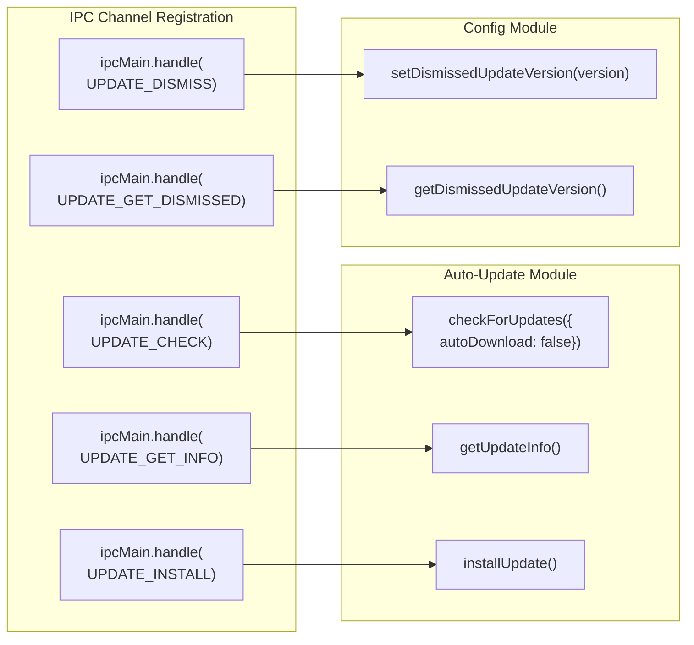
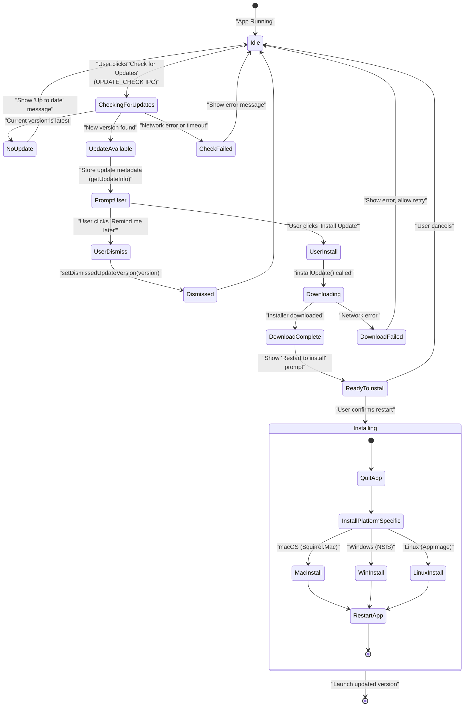

# Self-Update System

<details>
<summary>Relevant source files</summary>

The following files were used as context for generating this wiki page:

- [apps/electron/src/main/auto-update.ts](apps/electron/src/main/auto-update.ts)
- [apps/electron/src/renderer/pages/settings/AppSettingsPage.tsx](apps/electron/src/renderer/pages/settings/AppSettingsPage.tsx)

</details>

The self-update system in Craft Agents enables automatic application updates without requiring users to manually download and install new releases. The system is built on `electron-updater` (version 6.8.0), a mature library that handles platform-specific update mechanisms including delta patching for efficient downloads.

This page documents how `electron-updater` integrates with the Electron main process, the IPC communication layer for update checks, and the platform-specific installation mechanisms.

**Sources:** [apps/electron/package.json:56]()

---

## Architecture Overview

Craft Agents uses `electron-updater` to handle automatic updates across all platforms. The update system consists of three main components:



**Diagram: Update System Architecture**

The system follows a request-response pattern where the renderer UI triggers update checks via IPC, the main process delegates to `electron-updater`, and update metadata is fetched from a CDN. Updates are user-initiated rather than automatic to give users control over bandwidth usage.

**Sources:** [apps/electron/package.json:56]()

---

## IPC Communication Layer

The update system exposes five IPC channels for communication between the renderer and main processes:

| Channel                | Handler Function              | Purpose                                             |
| ---------------------- | ----------------------------- | --------------------------------------------------- |
| `UPDATE_CHECK`         | `checkForUpdates()`           | Manually trigger update check (no auto-download)    |
| `UPDATE_GET_INFO`      | `getUpdateInfo()`             | Retrieve current update state and available version |
| `UPDATE_INSTALL`       | `installUpdate()`             | Download and install available update               |
| `UPDATE_DISMISS`       | `setDismissedUpdateVersion()` | Store dismissed version to prevent repeated prompts |
| `UPDATE_GET_DISMISSED` | `getDismissedUpdateVersion()` | Retrieve dismissed version from config              |

### IPC Handler Implementation



**Diagram: IPC Handler Flow**

The `UPDATE_CHECK` handler explicitly passes `autoDownload: false` to prevent automatic downloads on metered connections, giving users control over when bandwidth is consumed.

**Sources:** [apps/electron/src/main/ipc.ts:920-947]()

---

## electron-updater Integration

The `electron-updater` library is integrated as a production dependency and provides cross-platform update mechanisms:

| Platform | Update Mechanism | Installer Format                     |
| -------- | ---------------- | ------------------------------------ |
| macOS    | Squirrel.Mac     | `.dmg` with `.zip` for delta updates |
| Windows  | NSIS             | `.exe` installer                     |
| Linux    | AppImage Updates | `.AppImage`                          |

### Update Metadata Files

`electron-updater` reads platform-specific YAML files from the distribution server:

- **macOS:** `latest-mac.yml` contains version, release date, and download URLs
- **Windows:** `latest.yml` contains version info and NSIS installer URL
- **Linux:** `latest-linux.yml` contains AppImage download URL

These files are automatically generated by `electron-builder` during the packaging process and uploaded alongside the installers.

### Delta Patching

For macOS, `electron-updater` supports delta updates by downloading only the changed portions of the application. This is accomplished by:

1. Comparing the current app version with the available update
2. Downloading a `.zip` file containing only the diff
3. Applying the patch to the existing installation
4. Verifying the integrity of the patched result

Delta updates significantly reduce bandwidth usage for incremental version updates.

**Sources:** [apps/electron/package.json:54]()

---

## Update Lifecycle

The update system follows a user-initiated flow with manual confirmation at each step:



**Diagram: Update State Machine**

### Manual Update Check

Updates are triggered manually by the user through the Settings UI. The `UPDATE_CHECK` handler invokes `checkForUpdates({ autoDownload: false })`, which queries the update server without immediately downloading the installer. This prevents unexpected bandwidth usage on metered connections.

### Update Notification

When a new version is available, the renderer process calls `UPDATE_GET_INFO` to retrieve:

- `version` - The new version number (e.g., `"0.4.8"`)
- `releaseDate` - ISO timestamp of the release
- `releaseNotes` - Markdown changelog (optional)
- `downloadProgress` - Current download percentage (if downloading)

The UI displays this information in a modal dialog (typically in the Settings view), giving users the choice to install immediately or dismiss the notification.

### Update Dismissal

If the user dismisses the update prompt, the version is stored via `setDismissedUpdateVersion(version)`. On subsequent checks, `getDismissedUpdateVersion()` is called to avoid showing the same notification repeatedly. The dismissed version is cleared when a newer version becomes available.

**Sources:** [apps/electron/src/main/ipc.ts:920-947]()

---

## Installation Process

When the user confirms the update, `installUpdate()` is invoked, triggering the platform-specific installation:

### macOS Installation

`electron-updater` uses Squirrel.Mac for macOS updates:

1. **Download:** Downloads `.zip` file for delta updates or full `.dmg` if delta is unavailable
2. **Verification:** SHA-512 checksum validation against `latest-mac.yml`
3. **Extraction:** For delta updates, applies binary diff to existing app bundle
4. **Quit & Replace:** Quits the app and replaces files in `/Applications/Craft Agents.app` (or current install location)
5. **Relaunch:** Automatically relaunches the updated app

### Windows Installation

`electron-updater` uses NSIS for Windows updates:

1. **Download:** Downloads NSIS `.exe` installer to temp directory
2. **Verification:** Validates installer signature and checksum against `latest.yml`
3. **Silent Install:** Executes NSIS installer with silent flags (`/S /UPDATE`)
4. **Per-User Update:** Replaces files in `%LOCALAPPDATA%\Programs\@craft-agentelectron\` without requiring UAC elevation
5. **Relaunch:** Starts the updated application after installation completes

### Linux Installation

`electron-updater` replaces the AppImage directly:

1. **Download:** Downloads new `.AppImage` file
2. **Verification:** Validates checksum against `latest-linux.yml`
3. **Replace:** Overwrites the existing `.AppImage` file
4. **Relaunch:** Executes the updated `.AppImage`

All platforms preserve the user's data in `~/.craft-agent/` during the update process, as this directory is separate from the application installation path. The update process only replaces application code, not user configuration or session data.

**Sources:** [apps/electron/package.json:56]()

---

## Configuration Storage

Update preferences are stored in the app-level `config.json` file:

```typescript
interface Config {
  dismissedUpdateVersion?: string // Most recent version user dismissed
  // ... other config fields
}
```

The `dismissedUpdateVersion` field is managed by:

- `setDismissedUpdateVersion(version)` - Writes to `~/.craft-agent/config.json`
- `getDismissedUpdateVersion()` - Reads from config file

This persistence allows the app to remember dismissed updates across restarts. When a new version is released (greater than the dismissed version), the notification is shown again.

---

## Update Server Configuration

The `electron-updater` library checks for updates by fetching platform-specific YAML metadata files from a distribution server. For Craft Agents, the update server is typically a CDN hosting:

- **macOS:** `https://agents.craft.do/releases/latest-mac.yml`
- **Windows:** `https://agents.craft.do/releases/latest.yml`
- **Linux:** `https://agents.craft.do/releases/latest-linux.yml`

These files are generated automatically by `electron-builder` during the packaging process and contain:

```yaml
version: 0.4.8
releaseDate: '2024-01-15T10:30:00.000Z'
files:
  - url: Craft-Agents-0.4.8.dmg
    sha512: <checksum>
    size: 123456789
path: Craft-Agents-0.4.8.dmg
sha512: <checksum>
```

The `autoUpdater.checkForUpdates()` method fetches this metadata, compares the version against the currently installed version, and determines whether an update is available.

**Sources:** [apps/electron/package.json:4]()

---

## Integration with Build System

The update system integrates with the build pipeline through `electron-builder` configuration. The packaging process creates platform-specific installers and generates the metadata files required by `electron-updater`.

### Build Pipeline Stages

| Build Stage            | Command                         | Output                                  |
| ---------------------- | ------------------------------- | --------------------------------------- |
| **Build Main Process** | `bun run build:main`            | Bundles main process to `dist/main.cjs` |
| **Build Renderer**     | `bun run build:renderer`        | Builds React UI with Vite               |
| **Package App**        | `bun run dist:mac` / `dist:win` | Creates `.dmg`, `.exe`, or `.AppImage`  |
| **Generate Metadata**  | (automatic)                     | Generates `latest-*.yml` files          |
| **Upload Artifacts**   | (manual/CI)                     | Uploads installers + metadata to CDN    |

The packaging scripts are defined in [apps/electron/package.json:31-33]():

- `dist:mac` - Builds macOS DMG for arm64
- `dist:mac:x64` - Builds macOS DMG for x64
- `dist:win` - Builds Windows installer

Each script invokes `electron-builder` with platform-specific configuration, producing signed installers and update metadata.

**Sources:** [apps/electron/package.json:17-35]()

---

## Security Considerations

The self-update system must address several security concerns:

### Script Integrity

The update scripts themselves are bundled with the application and are not downloaded at runtime, reducing the attack surface. However, they download and execute new installers, so verification is critical:

- Downloaded installers should be verified using checksums or signatures
- HTTPS must be used for all download URLs
- The release server's SSL certificate should be validated

### Code Signing

On macOS, the updated application must be properly signed and notarized to pass Gatekeeper checks. The update script must preserve or re-apply code signatures after installation. The `hardenedRuntime` and `entitlements` settings [apps/electron/electron-builder.yml:52-55]() affect how updates are validated by the operating system.

### Permission Model

The Windows per-user installation strategy [apps/electron/electron-builder.yml:110-114]() provides better security by avoiding UAC prompts and reducing the risk of privilege escalation attacks. The update script operates within the user's own permissions, making it less vulnerable to system-wide compromise.

**Sources:** [apps/electron/electron-builder.yml:42](), [apps/electron/electron-builder.yml:52-55](), [apps/electron/electron-builder.yml:88-90](), [apps/electron/electron-builder.yml:110-114]()
