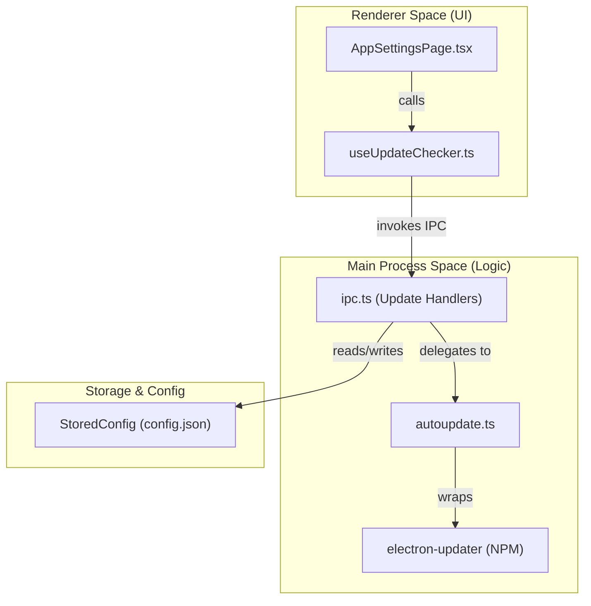
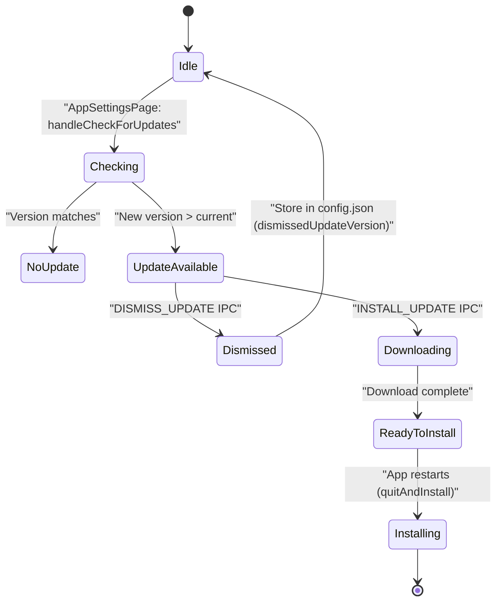

# Self-Update System

Relevant source files

The following files were used as context for generating this wiki page:

- [apps/electron/resources/release-notes/0.8.0.md](apps/electron/resources/release-notes/0.8.0.md)
- [apps/electron/resources/release-notes/0.8.1.md](apps/electron/resources/release-notes/0.8.1.md)
- [apps/electron/resources/release-notes/0.8.2.md](apps/electron/resources/release-notes/0.8.2.md)
- [apps/electron/resources/release-notes/0.8.3.md](apps/electron/resources/release-notes/0.8.3.md)
- [apps/electron/src/main/__tests__/connection-setup-logic.test.ts](apps/electron/src/main/__tests__/connection-setup-logic.test.ts)
- [apps/electron/src/main/onboarding.ts](apps/electron/src/main/onboarding.ts)
- [apps/electron/src/renderer/pages/settings/AppSettingsPage.tsx](apps/electron/src/renderer/pages/settings/AppSettingsPage.tsx)
- [apps/electron/src/shared/types.ts](apps/electron/src/shared/types.ts)
- [bun.lock](bun.lock)
- [packages/shared/src/config/storage.ts](packages/shared/src/config/storage.ts)

The self-update system in Craft Agents enables automatic application updates without requiring users to manually download and install new releases. The system is built on `electron-updater`, which handles platform-specific update mechanisms including delta patching for efficient downloads.

This page documents how `electron-updater` integrates with the Electron main process, how the `AppSettingsPage` UI drives manual update checks, and how dismissed versions are tracked in the configuration.

**Sources:** [bun.lock:154](), [apps/electron/src/renderer/pages/settings/AppSettingsPage.tsx:111-121]()

---

## Architecture Overview

Craft Agents uses `electron-updater` to handle automatic updates across all platforms. The update system consists of the UI layer in the renderer, IPC handlers in the main process, and the underlying `electron-updater` library.

### Update System Entity Map

The following diagram maps the natural language concepts of the update flow to specific code entities within the repository.

**Diagram: Update System Entity Mapping**

**Sources:** [apps/electron/src/renderer/pages/settings/AppSettingsPage.tsx:33](), [apps/electron/src/renderer/pages/settings/AppSettingsPage.tsx:111-121](), [apps/electron/src/shared/types.ts:199]()

---

## User-Driven Update Flow

Unlike many Electron apps that force background updates, Craft Agents prioritizes user control. The update process is typically initiated from the **About** section of the `AppSettingsPage`.

### Manual Check Implementation

The `AppSettingsPage` uses a custom hook `useUpdateChecker` to interface with the main process via `window.electronAPI`.

1.  **Trigger**: The user clicks "Check for Updates" [apps/electron/src/renderer/pages/settings/AppSettingsPage.tsx:114-121]().
2.  **State Management**: `setIsCheckingForUpdates(true)` provides visual feedback via a `Spinner` or disabled button state [apps/electron/src/renderer/pages/settings/AppSettingsPage.tsx:115-119]().
3.  **IPC Call**: The `updateChecker.checkForUpdates()` method sends a request to the main process using the `CHECK_FOR_UPDATES` channel.

**Sources:** [apps/electron/src/renderer/pages/settings/AppSettingsPage.tsx:111-121](), [apps/electron/src/shared/types.ts:251]()

### Update Lifecycle State Machine

The following diagram describes the state transitions during an update lifecycle, specifically how the system handles discovery, dismissal, and installation.

**Diagram: Update Lifecycle State Machine**

---

## IPC Communication Layer

The main process registers several handlers to manage the update lifecycle. These handlers act as the bridge between the React UI and the `autoupdate.ts` logic.

| IPC Channel | Purpose | Code Reference |
| :--- | :--- | :--- |
| `CHECK_FOR_UPDATES` | Triggers a check against the remote update server. | [apps/electron/src/shared/types.ts:251]() |
| `GET_UPDATE_INFO` | Returns details about the available update (version, release notes). | [apps/electron/src/shared/types.ts:252]() |
| `INSTALL_UPDATE` | Initiates the download and subsequent restart/install. | [apps/electron/src/shared/types.ts:253]() |
| `DISMISS_UPDATE` | Marks a specific version as "ignored" by the user. | [apps/electron/src/shared/types.ts:254]() |

**Sources:** [apps/electron/src/shared/types.ts:251-254]()

---

## Configuration & Dismissal Tracking

To prevent nagging users about updates they have already seen but chosen not to install, the system tracks a `dismissedUpdateVersion` in the global application configuration.

1.  **StoredConfig**: The `StoredConfig` interface defines `dismissedUpdateVersion` as a string field [packages/shared/src/config/storage.ts:65]().
2.  **Persistence**: When a user dismisses an update, the `DISMISS_UPDATE` handler updates the `config.json` file.
3.  **Storage**: This value is saved to `~/.craft-agent/config.json` [packages/shared/src/config/storage.ts:89]().
4.  **Filtering**: On subsequent launches, the app checks if the available version matches the `dismissedUpdateVersion` to decide whether to show a notification.

**Sources:** [packages/shared/src/config/storage.ts:65](), [packages/shared/src/config/storage.ts:89]()

---

## Platform-Specific Distribution

The `electron-updater` logic relies on metadata files generated during the build process by `electron-builder`. Release notes are bundled as markdown assets and synced to the application configuration directory.

-   **Release Notes**: Each version has a corresponding markdown file (e.g., `0.8.1.md`, `0.8.2.md`, `0.8.3.md`) containing feature lists and bug fixes [apps/electron/resources/release-notes/0.8.1.md:1-22](), [apps/electron/resources/release-notes/0.8.2.md:1-25](), [apps/electron/resources/release-notes/0.8.3.md:1-28]().
-   **Bundled Assets**: The system uses `syncConfigDefaults` and similar patterns to ensure bundled assets like `config-defaults.json` are available to the updater logic [packages/shared/src/config/storage.ts:125-152]().

**Sources:** [apps/electron/resources/release-notes/0.8.1.md:1-22](), [apps/electron/resources/release-notes/0.8.2.md:1-25](), [apps/electron/resources/release-notes/0.8.3.md:1-28](), [packages/shared/src/config/storage.ts:125-152]()