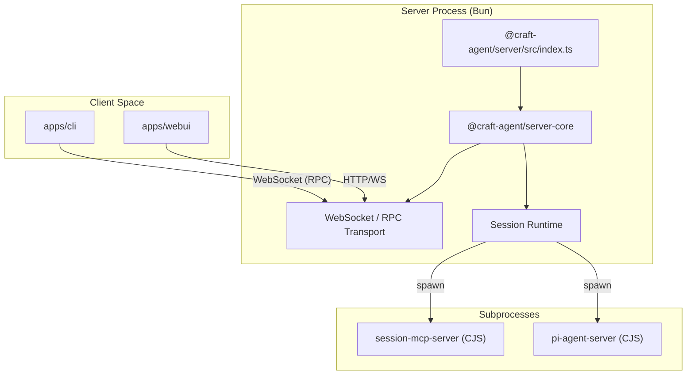
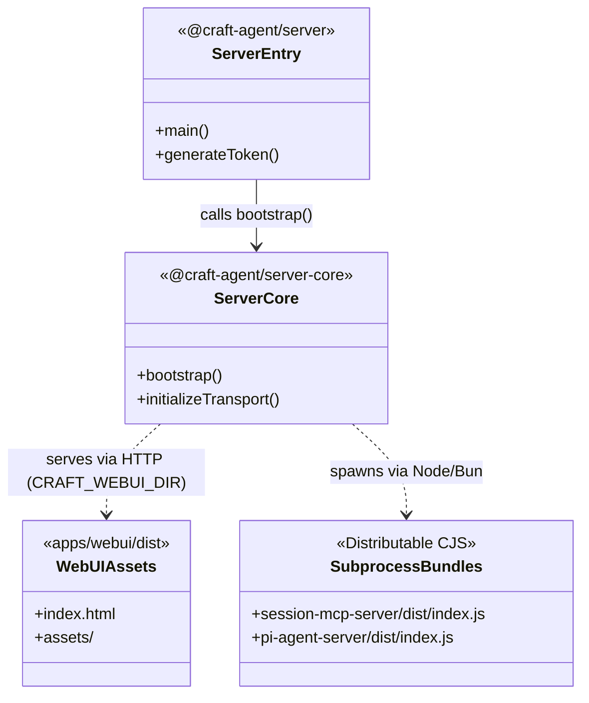

# Server Deployment

<details>
<summary>Relevant source files</summary>

The following files were used as context for generating this wiki page:

- [.github/workflows/validate-server.yml](.github/workflows/validate-server.yml)
- [Dockerfile.server](Dockerfile.server)
- [packages/server-core/package.json](packages/server-core/package.json)
- [packages/server/package.json](packages/server/package.json)
- [scripts/install-server.sh](scripts/install-server.sh)

</details>


The Craft Agent server is a headless, standalone implementation of the Craft Agent environment. It provides the same core AI agent orchestration, tool execution, and session management capabilities as the Electron desktop application but is optimized for remote execution, containerized environments, and CI/CD workflows.

The server allows users to connect via the **Web UI** (a browser-based thin client) or the **CLI Client**, enabling persistent agentic workflows on remote hardware or in the cloud.

### Server Architecture Overview

The server is built on a modular architecture where `@craft-agent/server` acts as the entry point, leveraging `@craft-agent/server-core` for the underlying RPC transport and session runtime logic.

**Title: Server Component Interaction**

Sources: [packages/server/package.json:1-37](), [packages/server-core/package.json:1-37](), [Dockerfile.server:66-70]()

---

### Deployment Methods

#### 1. Script-based Installation
For local Linux or macOS environments, the `install-server.sh` script automates the setup of the server environment. It ensures all prerequisites are met, installs dependencies using Bun, and builds the necessary subprocess helpers.

**Key Operations:**
*   **Dependency Resolution:** Runs `bun install` with a frozen lockfile to ensure environment parity [scripts/install-server.sh:54-56]().
*   **Subprocess Compilation:** Builds the MCP helper servers required for tool execution via the `server:build:subprocess` script [scripts/install-server.sh:58-59]().
*   **Web UI Bundling:** Compiles the browser-based interface located in `apps/webui` using `webui:build` [scripts/install-server.sh:61-62]().
*   **Token Generation:** Invokes the server binary with the `--generate-token` flag to create a secure access credential [scripts/install-server.sh:68-69]().

Sources: [scripts/install-server.sh:1-107]()

#### 2. Docker Deployment
The `Dockerfile.server` provides a multi-platform, non-root containerized environment based on `oven/bun:1.3-slim` [Dockerfile.server:26-30]().

**Build Stages:**
*   **User Isolation:** Creates a `craftagents` user and group. This is critical because certain underlying SDKs (like Claude Code) refuse to execute with root privileges [Dockerfile.server:38-39]().
*   **CJS Bundling:** The server runtime requires helper servers (`session-mcp-server` and `pi-agent-server`) to be available as CommonJS (CJS) bundles for the runtime to execute them correctly [Dockerfile.server:66-70]().
*   **Vite Build:** The Web UI is built into static assets during the image creation to be served directly by the server's RPC port [Dockerfile.server:72-73]().
*   **Permissions:** The script ensures the `/app` directory is world-readable and the home directory is writable for the `.craft-agent` configuration folder [Dockerfile.server:81-83]().

Sources: [Dockerfile.server:1-94]()

---

### Environment Configuration

The server is configured primarily through environment variables. These control networking, security, and asset resolution.

| Variable | Description | Default |
| :--- | :--- | :--- |
| `CRAFT_SERVER_TOKEN` | **Required.** The secret token used to authenticate WebSocket connections. | N/A |
| `CRAFT_RPC_PORT` | The port the server listens on for both Web UI (HTTP) and RPC (WS). | `9100` |
| `CRAFT_RPC_HOST` | The network interface to bind to. Use `0.0.0.0` for Docker. | `127.0.0.1` |
| `CRAFT_WEBUI_DIR` | Path to the compiled Web UI assets to be served. | N/A |
| `CRAFT_RPC_TLS_CERT` | Path to the TLS certificate file (`.pem`) for HTTPS/WSS. | N/A |
| `CRAFT_RPC_TLS_KEY` | Path to the TLS private key file (`.pem`). | N/A |
| `CRAFT_BUNDLED_ASSETS_ROOT` | Path to bundled documentation and resources. | N/A |

Sources: [scripts/install-server.sh:82-103](), [Dockerfile.server:87-89]()

---

### Implementation Details

#### Server Entry Point and Token Management
The server entry point in `packages/server/src/index.ts` handles command-line arguments and initializes the `@craft-agent/server-core` bootstrap logic [packages/server/package.json:6-8]().

A critical security feature is the token generation mechanism. Running the server with the `--generate-token` flag produces a high-entropy string that must be provided by clients to establish a session [packages/server/package.json:24](), [scripts/install-server.sh:68]().

#### Runtime Subprocesses
The server does not run tools in its main process. Instead, it spawns dedicated subprocesses for specialized tasks:
1.  **`session-mcp-server`**: Handles Model Context Protocol (MCP) tool execution [Dockerfile.server:67-68]().
2.  **`pi-agent-server`**: Manages specific agentic integrations [Dockerfile.server:69-70]().

These are bundled as CJS during the build process to ensure compatibility with the runtime's process spawning logic.

**Title: Server Runtime and Asset Mapping**

Sources: [packages/server/package.json:8](), [packages/server-core/package.json:14](), [Dockerfile.server:66-73]()

### Build and Run Commands

To build a production-ready server bundle manually:

1.  **Install:** `bun install --frozen-lockfile` [scripts/install-server.sh:56]()
2.  **Build Subprocesses:** `bun run server:build:subprocess` [scripts/install-server.sh:59]()
3.  **Build Web UI:** `bun run webui:build` [scripts/install-server.sh:62]()
4.  **Run:** 
    ```bash
    CRAFT_SERVER_TOKEN=your_token \
    CRAFT_WEBUI_DIR=./apps/webui/dist \
    bun run packages/server/src/index.ts
    ```

Sources: [scripts/install-server.sh:54-85]()