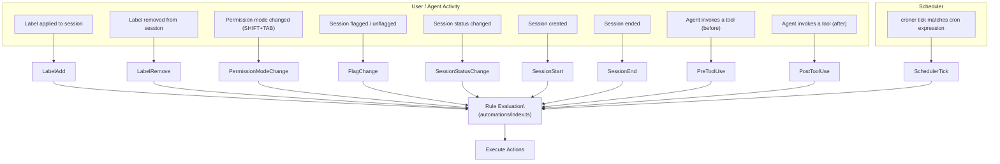
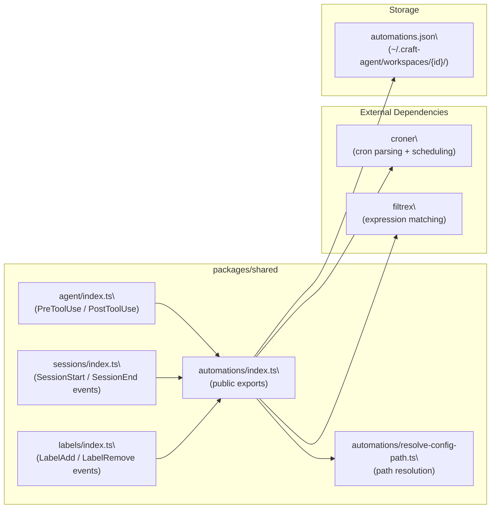

# Hooks & Automation

<details>
<summary>Relevant source files</summary>

The following files were used as context for generating this wiki page:

- [README.md](README.md)
- [packages/shared/package.json](packages/shared/package.json)

</details>

This page documents the automations system: the `automations.json` schema, every supported event type, cron scheduling, prompt action expansion, and how automations spawn new agent sessions. For the label system that drives `LabelAdd`/`LabelRemove` events, see [Labels (4.7)](#4.7). For the status system that drives `SessionStatusChange`, see [Status Workflow (4.6)](#4.6). For how agent sessions are created and executed, see [Agent System (2.3)](#2.3) and [Session Lifecycle (2.7)](#2.7).

---

## Overview

Automations let you trigger agent sessions and other actions in response to workspace events—without writing any code. Rules are stored in a per-workspace `automations.json` file. The runtime lives in `packages/shared/src/automations/`, and cron scheduling is handled by the [`croner`](https://www.npmjs.com/package/croner) library.

**File location:**

```
~/.craft-agent/workspaces/{workspaceId}/automations.json
```

**Entry point:**

- `packages/shared/src/automations/index.ts`
- Config path resolution: `packages/shared/src/automations/resolve-config-path.ts`

Sources: [packages/shared/package.json:57-58](), [README.md:313-355]()

---

## The `automations.json` Schema

The top-level document has two fields:

| Field         | Type     | Description                                                       |
| ------------- | -------- | ----------------------------------------------------------------- |
| `version`     | `number` | Must be `2`.                                                      |
| `automations` | `object` | Keys are event-type names; values are arrays of automation rules. |

Each key in `automations` is one of the supported event type strings (see the Event Types section below). The value is an array of **rule objects**, evaluated in order when that event fires.

Sources: [README.md:325-349]()

### Schema Example

```json
{
  "version": 2,
  "automations": {
    "SchedulerTick": [
      {
        "cron": "0 9 * * 1-5",
        "timezone": "America/New_York",
        "labels": ["Scheduled"],
        "actions": [
          {
            "type": "prompt",
            "prompt": "Check @github for new issues assigned to me"
          }
        ]
      }
    ],
    "LabelAdd": [
      {
        "matcher": "^urgent$",
        "actions": [
          {
            "type": "prompt",
            "prompt": "An urgent label was added to session $CRAFT_SESSION_ID. Triage and summarise."
          }
        ]
      }
    ]
  }
}
```

---

## Rule Object Fields

Different event types support different subsets of these fields:

| Field      | Type       | Applies to               | Description                                                                                     |
| ---------- | ---------- | ------------------------ | ----------------------------------------------------------------------------------------------- |
| `cron`     | `string`   | `SchedulerTick`          | Standard 5-field cron expression.                                                               |
| `timezone` | `string`   | `SchedulerTick`          | IANA timezone string (e.g., `"America/New_York"`). Defaults to local system timezone.           |
| `labels`   | `string[]` | `SchedulerTick`          | Labels to attach to the new session created by this automation.                                 |
| `matcher`  | `string`   | Label/Status/Tool events | A regular expression tested against the event value (e.g., label name, status name, tool name). |
| `actions`  | `Action[]` | All                      | Array of action objects to execute when the rule fires.                                         |

Sources: [README.md:326-349]()

---

## Event Types

**Diagram: Event Types and Their Trigger Sources**



Sources: [README.md:353-354](), [packages/shared/package.json:57-58]()

### Event Reference Table

| Event Type             | `matcher` applies to                           | Notes                                         |
| ---------------------- | ---------------------------------------------- | --------------------------------------------- |
| `LabelAdd`             | Label name added                               | Fires when any label is applied to a session. |
| `LabelRemove`          | Label name removed                             | Fires when a label is removed from a session. |
| `SessionStatusChange`  | New status name                                | Fires on any workflow status transition.      |
| `FlagChange`           | `"flagged"` / `"unflagged"`                    | Fires when a session flag state changes.      |
| `PermissionModeChange` | Mode string (`"safe"`, `"ask"`, `"allow-all"`) | Fires when the user cycles permission modes.  |
| `SessionStart`         | —                                              | Fires when a new session is created.          |
| `SessionEnd`           | —                                              | Fires when a session ends.                    |
| `PreToolUse`           | Tool name                                      | Fires before the agent executes a tool call.  |
| `PostToolUse`          | Tool name                                      | Fires after a tool call completes.            |
| `SchedulerTick`        | — (uses `cron` field)                          | Time-based trigger; no `matcher` needed.      |

Sources: [README.md:353-354](), [README.md:329-349]()

---

## Cron Scheduling

`SchedulerTick` rules use standard 5-field cron syntax. The `croner` package (listed as a dependency of `@craft-agent/shared`) handles cron parsing and evaluation.

```
┌─────── minute   (0–59)
│ ┌───── hour     (0–23)
│ │ ┌─── day      (1–31)
│ │ │ ┌─ month    (1–12)
│ │ │ │ ┌ weekday (0–7, 0 and 7 = Sunday)
│ │ │ │ │
0 9 * * 1-5     →  09:00 every Monday–Friday
0 17 * * 5      →  17:00 every Friday
*/30 * * * *    →  every 30 minutes
```

The optional `timezone` field accepts any IANA timezone string. If omitted, the host system's local timezone is used.

**Example — Weekly Friday summary:**

```json
{
  "cron": "0 17 * * 5",
  "timezone": "Europe/London",
  "labels": ["Weekly Summary"],
  "actions": [
    {
      "type": "prompt",
      "prompt": "Summarise all completed tasks from this week."
    }
  ]
}
```

Sources: [packages/shared/package.json:63](), [README.md:329-337]()

---

## Actions

Currently, the `prompt` action type is the primary supported action. Its purpose is to create a new agent session with the specified prompt text.

### Prompt Action

```json
{ "type": "prompt", "prompt": "<text>" }
```

The prompt string supports two extension mechanisms:

#### 1. `@mention` Expansion

Mentions in the prompt are resolved at execution time, injecting the referenced source or skill into the new session's context—exactly as if the user typed `@mention` in the chat input.

| Syntax      | Effect                                              |
| ----------- | --------------------------------------------------- |
| `@github`   | Activates the `github` source for the new session   |
| `@my-skill` | Injects the `my-skill` skill into the system prompt |

For details on how sources and skills are resolved from `@mentions`, see [Sources (4.3)](#4.3) and [Skills (4.4)](#4.4).

#### 2. `$CRAFT_*` Environment Variable Expansion

Variables of the form `$CRAFT_VAR_NAME` are expanded into the prompt before it is submitted to the agent. These provide event context to the automation.

| Variable            | Description                                          |
| ------------------- | ---------------------------------------------------- |
| `$CRAFT_SESSION_ID` | ID of the session that triggered the event           |
| `$CRAFT_LABEL`      | The label name (for `LabelAdd`/`LabelRemove` events) |
| `$CRAFT_STATUS`     | The new status name (for `SessionStatusChange`)      |
| `$CRAFT_TOOL`       | The tool name (for `PreToolUse`/`PostToolUse`)       |

Sources: [README.md:351-353]()

---

## How an Automation Creates a Session

**Diagram: Automation Execution Flow**

```mermaid
sequenceDiagram
    participant E as "Event Source\
(label/status/cron/tool)"
    participant AM as "automations/index.ts\
(AutomationManager)"
    participant RC as "resolve-config-path.ts"
    participant AF as "automations.json"
    participant PE as "Prompt Expander\
(@mention + $CRAFT_*)"
    participant SM as "SessionManager"
    participant AG as "Agent\
(CraftAgent / ClaudeAgent)"

    E->>AM: "fireEvent(eventType, context)"
    AM->>RC: "resolveConfigPath(workspaceId)"
    RC-->>AM: "/path/to/automations.json"
    AM->>AF: "read and parse"
    AF-->>AM: "rule list for eventType"
    AM->>AM: "match rule.matcher against event value"
    AM->>PE: "expand @mentions and $CRAFT_* vars in prompt"
    PE-->>AM: "expanded prompt string"
    AM->>SM: "createSession({ prompt, sources, labels })"
    SM->>AG: "run agent with expanded prompt"
    AG-->>SM: "streaming session events"
```

Sources: [packages/shared/package.json:57-58](), [README.md:317-354]()

The key steps are:

1. **Event fired** — an event is emitted somewhere in the main process (e.g., when a label is applied in `SessionManager`, a cron tick fires, or a tool use hook is reached).
2. **Config loaded** — `resolve-config-path.ts` resolves the workspace-specific `automations.json` path.
3. **Rule matching** — for label/status/tool events, the `matcher` regex is tested against the event value. For `SchedulerTick`, only cron timing is checked.
4. **Prompt expansion** — `@mention` references are resolved and `$CRAFT_*` variables are substituted.
5. **Session creation** — `SessionManager` creates a new session, applying any `labels` from the rule, and starts the agent.

---

## Configuring Automations

### Via the Agent (Recommended)

Simply describe what you want in a session:

```
"Set up a daily standup briefing every weekday at 9am"
"When a session is labelled urgent, triage it and summarise what needs attention"
"Every Friday at 5pm, summarise this week's completed tasks"
"Track permission mode changes and log them"
```

The agent will write the correct `automations.json` entries.

### Via Direct File Edit

Edit `~/.craft-agent/workspaces/{id}/automations.json` directly. The file is watched for changes and reloaded at runtime — no restart required.

Sources: [README.md:313-354](), [README.md:54-55]()

---

## Module Map

**Diagram: Automation Code Entity Relationships**



Sources: [packages/shared/package.json:57-58](), [packages/shared/package.json:62-64]()

---

## Relationship to Other Systems

| Related System                        | Connection                                                                           |
| ------------------------------------- | ------------------------------------------------------------------------------------ |
| [Labels (4.7)](#4.7)                  | `LabelAdd` / `LabelRemove` events are the most common automation triggers            |
| [Status Workflow (4.6)](#4.6)         | `SessionStatusChange` fires on every status transition                               |
| [Permission System (4.5)](#4.5)       | `PermissionModeChange` fires when mode is cycled with SHIFT+TAB                      |
| [Sources (4.3)](#4.3)                 | `@mention` in prompt actions activates sources in the spawned session                |
| [Skills (4.4)](#4.4)                  | `@mention` in prompt actions injects skills into the spawned session                 |
| [Session Lifecycle (2.7)](#2.7)       | Each automation ultimately calls into `SessionManager` to create a session           |
| [Storage & Configuration (2.8)](#2.8) | `automations.json` lives inside the workspace directory alongside other config files |
