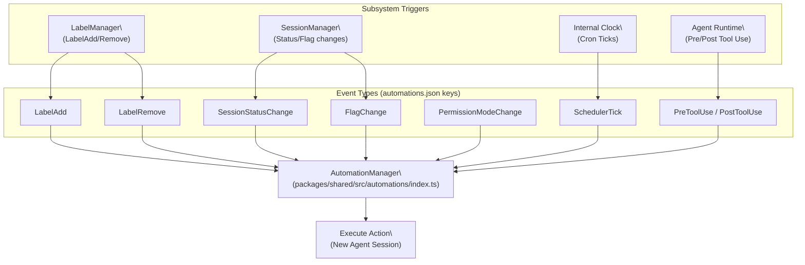

# Hooks & Automation

<details>
<summary>Relevant source files</summary>

The following files were used as context for generating this wiki page:

- [packages/shared/package.json](packages/shared/package.json)

</details>


This page documents the automations system: the `automations.json` schema (version 2), every supported event type, cron scheduling with timezone support, prompt action expansion using `@mentions` and `$CRAFT_*` environment variables, and how automations spawn new agent sessions.

---

## Overview

Automations allow the Craft Agents system to trigger agent sessions and other actions in response to workspace events—without manual user intervention. Rules are stored in a per-workspace `automations.json` file. The business logic for resolving these configurations and executing them resides in the `@craft-agent/shared` package.

**Key components:**
- **File location:** `~/.craft-agent/workspaces/{workspaceId}/automations.json`
- **Implementation:** `packages/shared/src/automations/` [packages/shared/package.json:60-61]()
- **Scheduling:** Handled via the `croner` library [packages/shared/package.json:70]().

Sources: [packages/shared/package.json:60-61](), [packages/shared/package.json:70]()

---

## The `automations.json` Schema (Version 2)

The automation configuration uses a structured JSON format. The top-level object defines the version and a map of event types to rule arrays.

| Field | Type | Description |
|---|---|---|
| `version` | `number` | Must be `2` for current schema support. |
| `automations` | `Record<EventType, Rule[]>` | Keys are event names; values are arrays of automation rules. |

### Schema Example
```json
{
  "version": 2,
  "automations": {
    "SchedulerTick": [
      {
        "cron": "0 9 * * 1-5",
        "timezone": "America/New_York",
        "labels": ["Daily-Standup"],
        "actions": [
          { "type": "prompt", "prompt": "Check @github for my assigned PRs." }
        ]
      }
    ],
    "LabelAdd": [
      {
        "matcher": "^urgent$",
        "actions": [
          {
            "type": "prompt",
            "prompt": "Urgent label added to $CRAFT_SESSION_ID. Triage immediately."
          }
        ]
      }
    ]
  }
}
```

---

## Supported Event Types

Events are triggered by various subsystems within the application, such as the `SessionManager`, `LabelManager`, or the internal scheduler.

**Diagram: Event-to-Automation Mapping**


Sources: [packages/shared/package.json:60-61]()

### Event Reference

| Event Type | `matcher` target | Description |
|---|---|---|
| `LabelAdd` | Label name | Fires when a label is applied to a session. |
| `LabelRemove` | Label name | Fires when a label is removed. |
| `SessionStatusChange` | New status name | Fires on workflow transitions (e.g., "Todo" -> "In Progress"). |
| `FlagChange` | `"flagged"` / `"unflagged"` | Fires when a session is starred/unstarred. |
| `PermissionModeChange` | Mode name | Fires when toggling between `safe`, `ask`, and `allow-all`. |
| `SchedulerTick` | N/A | Triggered by cron expressions. |
| `PreToolUse` | Tool name | Fires before an agent executes a tool. |
| `PostToolUse` | Tool name | Fires after a tool execution finishes. |

---

## Cron Scheduling & Timezones

The `SchedulerTick` event utilizes the `croner` package for high-precision scheduling. It supports standard 5-segment cron syntax and explicit IANA timezone strings.

- **Cron Syntax:** `minute hour day-of-month month day-of-week`
- **Timezone Support:** If `timezone` is not specified, the system defaults to the local machine's timezone.

**Example Rule:**
```json
{
  "cron": "0 17 * * 5",
  "timezone": "Europe/London",
  "actions": [{ "type": "prompt", "prompt": "Generate weekly report." }]
}
```
Sources: [packages/shared/package.json:70]()

---

## Actions & Prompt Expansion

The primary action type is `prompt`. When triggered, it initializes a new agent session. Before the session starts, the prompt text undergoes expansion to inject context.

### 1. @Mention Expansion
Any `@name` in the prompt is parsed. If it matches a **Source** (MCP/API) or a **Skill** (markdown instruction), that entity is automatically attached to the new session's context. The logic for identifying these mentions is part of the `@craft-agent/shared/mentions` module.

### 2. $CRAFT_* Environment Variables
Variables are replaced with metadata from the triggering event:

| Variable | Value |
|---|---|
| `$CRAFT_SESSION_ID` | The ID of the session that triggered the event. |
| `$CRAFT_LABEL` | The name of the label (for `LabelAdd`/`LabelRemove`). |
| `$CRAFT_STATUS` | The new status string (for `SessionStatusChange`). |
| `$CRAFT_TOOL` | The name of the tool (for `Pre/PostToolUse`). |

Sources: [packages/shared/package.json:58]()

---

## Implementation & Data Flow

Automations are processed by the `AutomationManager` (exported from `@craft-agent/shared`). It resolves the configuration path using a dedicated utility and monitors the file for live updates.

**Diagram: Automation Execution Pipeline**

```mermaid
sequenceDiagram
    participant P as "Main Process / Subsystem"
    participant AM as "AutomationManager\
(automations/index.ts)"
    participant RC as "resolve-config-path.ts"
    participant PE as "PromptExpander"
    participant SM as "SessionManager"

    P->>AM: "trigger(eventType, context)"
    AM->>RC: "resolveConfigPath(workspaceId)"
    RC-->>AM: "path/to/automations.json"
    AM->>AM: "Parse JSON & Filter Rules"
    loop "For each matching rule"
        AM->>PE: "expandVariables(rule.prompt, context)"
        PE-->>AM: "Final Prompt String"
        AM->>SM: "createNewSession({ prompt, labels, sources })"
        SM-->>AM: "Session Instance"
    end
```
Sources: [packages/shared/package.json:60-61](), [packages/shared/package.json:30]()

### Key Files
- `packages/shared/src/automations/index.ts`: Core logic for matching events to rules and executing actions [packages/shared/package.json:60]().
- `packages/shared/src/automations/resolve-config-path.ts`: Handles finding the `automations.json` file within the hierarchical workspace structure [packages/shared/package.json:61]().
- `packages/shared/src/sessions/index.ts`: The `SessionManager` which is called by automations to spawn new agent interactions [packages/shared/package.json:30]().
- `packages/shared/src/mentions/index.ts`: Handles the parsing of `@mentions` in prompts [packages/shared/package.json:58]().

Sources: [packages/shared/package.json:60-61](), [packages/shared/package.json:30](), [packages/shared/package.json:58]()