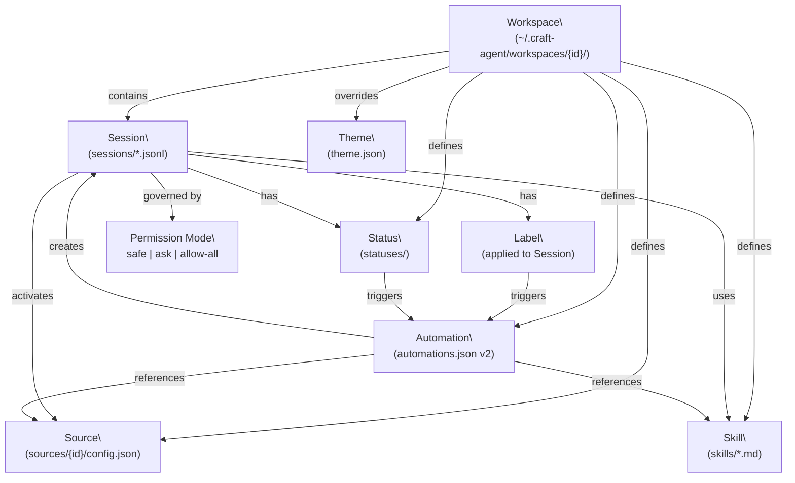
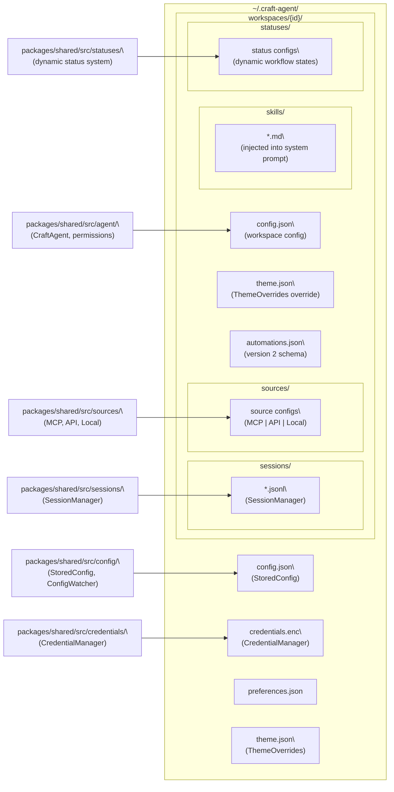
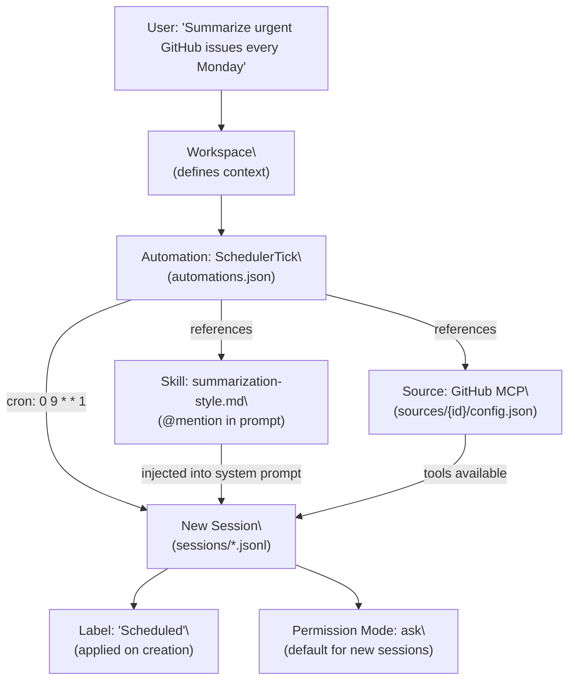

# Core Concepts

<details>
<summary>Relevant source files</summary>

The following files were used as context for generating this wiki page:

- [README.md](README.md)

</details>

This page introduces the fundamental building blocks of Craft Agents that every user needs to understand before working effectively with the application. These concepts apply at the user-facing level — what things are called, how they relate, and how to configure them.

For deeper technical details, each concept has its own dedicated child page. For implementation specifics such as IPC channels, agent backends, and session persistence internals, see [Architecture](#2).

---

## Concept Map

The following diagram shows how all core concepts relate to each other within the system.

**Craft Agents Core Concept Relationships**



Sources: [README.md:152-171]()

---

## On-Disk Layout and Code Entities

All user data lives under `~/.craft-agent/`. The following diagram maps each directory and file to the code entity that manages it.

**On-Disk Storage Mapped to Code Entities**



Sources: [README.md:294-311]()

---

## Workspaces

A **workspace** is the top-level organizational unit. Everything — sessions, sources, skills, statuses, automations, and theme overrides — lives within a workspace.

- Each workspace is stored in `~/.craft-agent/workspaces/{id}/`
- Multiple workspaces can exist; you switch between them via the left sidebar
- Workspace-level configuration (LLM connection, sources, skills, etc.) is in `workspaces/{id}/config.json`

> For full details on workspace management, see [Workspaces](#4.1).

---

## Sessions

A **session** is a single conversation thread with the agent.

| Property        | Description                                                                |
| --------------- | -------------------------------------------------------------------------- |
| **Persistence** | Stored as a JSONL file in `workspaces/{id}/sessions/`                      |
| **Status**      | One of the workspace-defined status states (e.g., Todo, In Progress, Done) |
| **Labels**      | Zero or more free-form tags applied to the session                         |
| **Flagged**     | Boolean marker for quick access                                            |
| **Archived**    | Moves session out of the active inbox                                      |
| **Branching**   | New session forked from a specific turn in the conversation                |

Sessions are managed by `SessionManager` in `packages/shared/src/sessions/`. The inbox displays sessions filtered by status — active states appear in the inbox, completed or archived sessions are separated.

> For the full session lifecycle, see [Sessions](#4.2).

---

## Sources

A **source** is a connection to an external system that the agent can use as a tool during a session. Sources are defined per-workspace and can be activated (or deactivated) per session.

**Source Types**

| Type    | Examples                                      | Transport                 |
| ------- | --------------------------------------------- | ------------------------- |
| `MCP`   | Linear, GitHub, Craft, Notion, custom servers | `stdio`, HTTP, SSE        |
| `API`   | Gmail, Calendar, Drive, Slack, Microsoft      | REST with OAuth / API key |
| `Local` | Filesystem, Obsidian vaults, Git repos        | Direct file access        |

Source configurations live in `workspaces/{id}/sources/`. Credentials are stored separately in `credentials.enc` via `CredentialManager` in `packages/shared/src/credentials/`.

**Source Activation Flow**

```mermaid
sequenceDiagram
    participant User
    participant Session
    participant "SourceManager\
(packages/shared/src/sources/)" as SM
    participant "External System" as Ext

    User->>Session: "@mention source or activate in UI"
    Session->>SM: "resolve source config"
    SM->>SM: "load credentials from credentials.enc"
    SM->>Ext: "connect (stdio / HTTP / REST)"
    Ext-->>SM: "tool definitions"
    SM-->>Session: "tools available to agent"
```

> For configuration details, transport variants, and authentication, see [Sources](#4.3).

---

## Skills

A **skill** is a Markdown file stored in `workspaces/{id}/skills/`. Skills contain agent instructions that are injected into the system prompt when referenced.

- Skills are created and edited as `.md` files
- You reference a skill by typing `@skill-name` in the input field, even mid-conversation
- The referenced skill's content is appended to the agent's system prompt for that session
- Skills do not require an application restart to take effect

Skills are a lightweight way to encode reusable workflows, conventions, or domain knowledge without modifying the agent itself.

> For storage format, injection mechanics, and `@mention` behavior, see [Skills](#4.4).

---

## Permission Modes

The **permission mode** governs what the agent is allowed to do without asking the user first. Permissions apply at the session level and can be changed at any time via `SHIFT+TAB`.

| Mode Key    | UI Label    | Behavior                                                |
| ----------- | ----------- | ------------------------------------------------------- |
| `safe`      | Explore     | Read-only. All write operations are blocked.            |
| `ask`       | Ask to Edit | Prompts for approval before write operations (default). |
| `allow-all` | Auto        | Auto-approves all tool calls including writes.          |

The `ModeManager` component in the renderer renders the current mode indicator and handles the `SHIFT+TAB` cycle. Permission logic is enforced in the pre-tool-use check pipeline in `packages/shared/src/agent/`.

An `alwaysAllow` list can whitelist specific shell commands or network domains so they are never prompted in `ask` mode.

> For the full permission pipeline, `alwaysAllow` configuration, and `ModeManager`, see [Permission System](#4.5).

---

## Status Workflow

The **status system** allows each workspace to define a custom set of session states that model a workflow.

- Statuses are defined in `workspaces/{id}/statuses/`
- A default workflow follows the pattern: **Todo → In Progress → Needs Review → Done**
- Each session has exactly one status at any time
- Status changes can trigger automations (see [Automations](#4.9))
- Sessions are grouped by status in the session list / inbox view

Statuses are managed by the `statuses` module in `packages/shared/src/statuses/`.

> For configuration format, status transitions, and automation triggers, see [Status Workflow](#4.6).

---

## Labels

**Labels** are free-form tags that can be applied to sessions. Unlike statuses (which represent workflow state), labels are additive — a session can have multiple labels simultaneously.

- Labels are defined per-workspace
- Adding or removing a label fires a `LabelAdd` or `LabelRemove` event that automations can listen to
- Labels are useful for categorizing sessions by topic, priority, or project

> For label configuration and automation triggers, see [Labels](#4.7).

---

## Themes

Craft Agents has a **cascading theme system** with two levels:

| Level           | File                                        | Scope                                  |
| --------------- | ------------------------------------------- | -------------------------------------- |
| App-level       | `~/.craft-agent/theme.json`                 | Applies to all workspaces              |
| Workspace-level | `~/.craft-agent/workspaces/{id}/theme.json` | Overrides app theme for that workspace |

Both files use the `ThemeOverrides` format. Workspace themes take precedence over the app theme, allowing per-workspace visual customization. Preset themes are available through the settings UI.

> For the `ThemeOverrides` schema and preset list, see [Theme System](#4.8).

---

## Automations

**Automations** are event-driven rules defined in `workspaces/{id}/automations.json` (schema version 2). When a specified event occurs, the automation executes one or more actions — most commonly creating a new agent session with a predefined prompt.

**Supported Event Types**

| Event                  | Description                        |
| ---------------------- | ---------------------------------- |
| `LabelAdd`             | A label was added to a session     |
| `LabelRemove`          | A label was removed from a session |
| `SessionStatusChange`  | A session's status changed         |
| `FlagChange`           | A session was flagged or unflagged |
| `PermissionModeChange` | The permission mode changed        |
| `SchedulerTick`        | A cron schedule fired              |
| `PreToolUse`           | Before a tool call executes        |
| `PostToolUse`          | After a tool call completes        |
| `SessionStart`         | A session began                    |
| `SessionEnd`           | A session ended                    |

**Automations Schema (version 2)**

```json
{
  "version": 2,
  "automations": {
    "LabelAdd": [
      {
        "matcher": "^urgent$",
        "actions": [
          {
            "type": "prompt",
            "prompt": "An urgent label was added. Triage the session."
          }
        ]
      }
    ],
    "SchedulerTick": [
      {
        "cron": "0 9 * * 1-5",
        "timezone": "America/New_York",
        "labels": ["Scheduled"],
        "actions": [
          {
            "type": "prompt",
            "prompt": "Check @github for new issues assigned to me"
          }
        ]
      }
    ]
  }
}
```

**Automation Execution Flow**

```mermaid
sequenceDiagram
    participant "Event Source\
(session, scheduler, tool)" as ES
    participant "AutomationEngine\
(automations.json v2)" as AE
    participant "PromptAction" as PA
    participant "SessionManager\
(packages/shared/src/sessions/)" as SM
    participant "CraftAgent\
(packages/shared/src/agent/)" as CA

    ES->>AE: "event fires (e.g. LabelAdd)"
    AE->>AE: "match against automations[]"
    AE->>PA: "expand $CRAFT_* env vars\
resolve @mention sources and skills"
    PA->>SM: "createSession()"
    SM->>CA: "run agent with prompt"
```

Prompt actions support `@mention` syntax for sources and skills, and the following environment variables are automatically expanded:

| Variable            | Value                                   |
| ------------------- | --------------------------------------- |
| `$CRAFT_LABEL`      | The label that triggered the event      |
| `$CRAFT_SESSION_ID` | The session ID that triggered the event |

> For the full automations schema, event matchers, cron syntax, and `$CRAFT_*` variable reference, see [Hooks & Automation](#4.9).

---

## How Concepts Compose

The following diagram shows a typical real-world usage pattern, mapping user intent to the underlying concept chain:



Sources: [README.md:313-355]()
