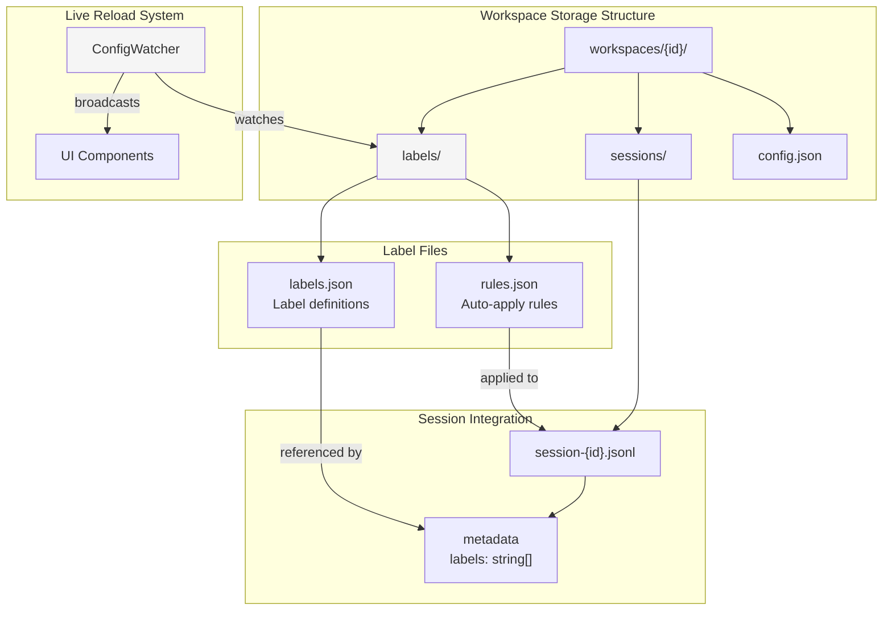
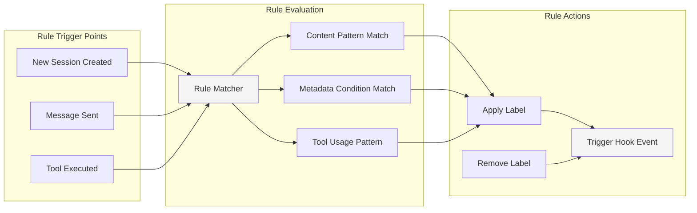
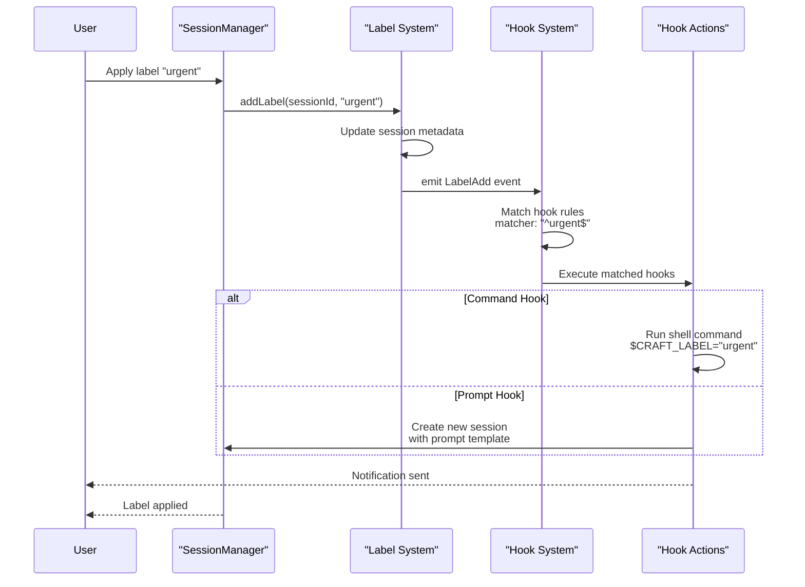
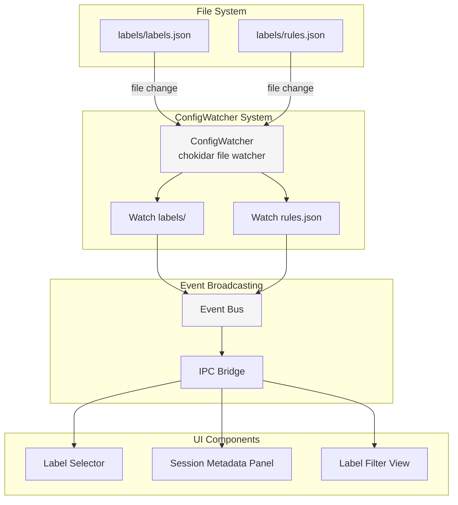

# Labels

<details>
<summary>Relevant source files</summary>

The following files were used as context for generating this wiki page:

- [README.md](README.md)
- [packages/shared/package.json](packages/shared/package.json)

</details>

## Purpose and Scope

Labels provide a flexible tagging system for sessions within workspaces. They enable users to categorize conversations by topic, priority, project, or any custom dimension. Labels complement the status workflow system (see page 4.6) and integrate with the automation system (see page 4.9) to enable event-driven workflows based on label changes.

The label system is implemented in `packages/shared/src/labels/`, with storage logic in `packages/shared/src/labels/storage.ts` and automatic label logic in `packages/shared/src/labels/auto/index.ts`.

---

## Label System Overview

Labels are workspace-scoped tags that can be applied to sessions for organization and filtering. Unlike the status system which tracks workflow state (Todo, In Progress, Done), labels provide free-form categorization with no predefined values.

### Key Features

| Feature               | Description                                                                                     |
| --------------------- | ----------------------------------------------------------------------------------------------- |
| **Hierarchy Support** | Labels can be organized in parent-child relationships (e.g., `projects/web`, `projects/mobile`) |
| **Auto-Apply Rules**  | Labels can be automatically applied based on session content or context                         |
| **Event Integration** | Label changes trigger `LabelAdd` and `LabelRemove` events for hook automation                   |
| **Multiple Labels**   | Sessions can have multiple labels applied simultaneously                                        |
| **Live Reload**       | Label configuration changes are detected and applied without restart                            |

Sources: [README.md:1-412](), [packages/shared/src/config/storage.ts:285-300]()

---

## Storage Architecture



**Label Storage Paths**

Labels are stored per-workspace in the `labels/` directory at `~/.craft-agent/workspaces/{id}/labels/`:

- **`labels.json`** - Label definitions including name, color, description, and hierarchy
- **`rules.json`** - Auto-apply rules that match session content or metadata
- Session metadata stores applied labels as an array of label IDs

Sources: [packages/shared/src/config/storage.ts:283-300]()

---

## Label Configuration Format

### Label Definitions

Labels are defined in `workspaces/{id}/labels/labels.json` with the following structure:

```json
{
  "version": 1,
  "labels": [
    {
      "id": "urgent",
      "name": "Urgent",
      "color": "#FF5733",
      "description": "High-priority items requiring immediate attention"
    },
    {
      "id": "projects-web",
      "name": "Web Project",
      "parent": "projects",
      "color": "#3498DB"
    },
    {
      "id": "projects",
      "name": "Projects",
      "color": "#2ECC71",
      "description": "Project-related work"
    }
  ]
}
```

**Label Properties**

| Field         | Type   | Required | Description                                      |
| ------------- | ------ | -------- | ------------------------------------------------ |
| `id`          | string | Yes      | Unique identifier for the label (slug format)    |
| `name`        | string | Yes      | Display name shown in UI                         |
| `color`       | string | No       | Hex color code for visual identification         |
| `description` | string | No       | Human-readable description of label purpose      |
| `parent`      | string | No       | ID of parent label for hierarchical organization |

### Hierarchical Labels

Labels support parent-child relationships for nested organization. Child labels reference their parent via the `parent` field:

```json
{
  "labels": [
    { "id": "work", "name": "Work" },
    { "id": "work-meetings", "name": "Meetings", "parent": "work" },
    { "id": "work-planning", "name": "Planning", "parent": "work" },
    { "id": "personal", "name": "Personal" },
    { "id": "personal-learning", "name": "Learning", "parent": "personal" }
  ]
}
```

The UI can display these hierarchically (e.g., "Work > Meetings") and operations on parent labels can optionally cascade to children.

Sources: [README.md:283-300]()

---

## Auto-Apply Rules



Auto-apply rules automatically tag sessions based on content patterns, metadata conditions, or tool usage. Rules are defined in `workspaces/{id}/labels/rules.json`:

```json
{
  "version": 1,
  "rules": [
    {
      "id": "urgent-keywords",
      "trigger": "message_content",
      "pattern": "\\b(urgent|asap|critical|emergency)\\b",
      "ignoreCase": true,
      "labelId": "urgent",
      "action": "add"
    },
    {
      "id": "github-integration",
      "trigger": "tool_used",
      "toolName": "github_.*",
      "labelId": "github-work",
      "action": "add"
    },
    {
      "id": "high-token-usage",
      "trigger": "session_metadata",
      "condition": "totalTokens > 50000",
      "labelId": "expensive",
      "action": "add"
    }
  ]
}
```

**Rule Trigger Types**

| Trigger            | Description                | Pattern Format                 |
| ------------------ | -------------------------- | ------------------------------ |
| `message_content`  | Match against message text | Regular expression             |
| `tool_used`        | Match tool name patterns   | Regular expression (tool name) |
| `session_metadata` | Evaluate session metadata  | JavaScript expression          |
| `source_connected` | Match source configuration | Source slug pattern            |

**Rule Actions**

- `add` - Apply the label if pattern matches
- `remove` - Remove the label if pattern matches
- `toggle` - Add if absent, remove if present

Sources: [README.md:99-100](), [README.md:327-346]()

---

## Label Events and Hook Integration



Label changes emit events that integrate with the hook system, enabling automated workflows:

**Label Events**

| Event         | Emitted When               | Environment Variables                                      |
| ------------- | -------------------------- | ---------------------------------------------------------- |
| `LabelAdd`    | Label applied to session   | `$CRAFT_LABEL`, `$CRAFT_SESSION_ID`, `$CRAFT_WORKSPACE_ID` |
| `LabelRemove` | Label removed from session | `$CRAFT_LABEL`, `$CRAFT_SESSION_ID`, `$CRAFT_WORKSPACE_ID` |

**Hook Configuration Example**

```json
{
  "version": 1,
  "hooks": {
    "LabelAdd": [
      {
        "matcher": "^urgent$",
        "hooks": [
          {
            "type": "command",
            "command": "osascript -e 'display notification \"Urgent session tagged\" with title \"Craft Agent\"'"
          }
        ]
      },
      {
        "matcher": "^blocked$",
        "permissionMode": "safe",
        "hooks": [
          {
            "type": "prompt",
            "prompt": "This session is blocked. Analyze the blocker and suggest next steps."
          }
        ]
      }
    ],
    "LabelRemove": [
      {
        "matcher": "^in-progress$",
        "hooks": [
          {
            "type": "command",
            "command": "echo 'Session no longer in progress' >> ~/craft-activity.log"
          }
        ]
      }
    ]
  }
}
```

**Hook Matcher Patterns**

The `matcher` field accepts regular expressions to filter which label changes trigger the hook:

- `^urgent$` - Exact match for "urgent" label
- `^projects-.*` - Any label starting with "projects-"
- `.*-review$` - Any label ending with "-review"

Sources: [README.md:302-346](), [packages/shared/src/config/storage.ts:283-300]()

---

## Session Label Management

### Applying Labels

Labels can be applied through multiple mechanisms:

**1. Manual Application**

- User applies labels through the UI session metadata panel
- Labels are stored in session JSONL file metadata

**2. Auto-Apply Rules**

- Rule engine evaluates patterns on session events
- Matching rules automatically apply configured labels

**3. Hook-Triggered Application**

- Prompt hooks can include label directives
- Agent can apply labels via session-scoped tools

### Label Storage in Sessions

Session files (`workspaces/{id}/sessions/session-{id}.jsonl`) store labels in the metadata block:

```json
{
  "type": "metadata",
  "id": "session-abc123",
  "name": "Implement OAuth flow",
  "labels": ["urgent", "projects-auth", "security"],
  "status": "in-progress",
  "createdAt": 1704067200000,
  "updatedAt": 1704153600000
}
```

**Label Operations**

| Operation    | Behavior                                                   |
| ------------ | ---------------------------------------------------------- |
| Add Label    | Appends to `labels` array if not present, emits `LabelAdd` |
| Remove Label | Filters from `labels` array, emits `LabelRemove`           |
| List Labels  | Returns all labels from session metadata                   |
| Clear Labels | Removes all labels, emits `LabelRemove` for each           |

Sources: [packages/shared/src/config/storage.ts:4-22]()

---

## Configuration Watching and Live Reload



The `ConfigWatcher` system monitors the `labels/` directory for changes and broadcasts updates to all open UI windows without requiring restart. This enables:

- **Live Editing**: Modify label definitions in external editors with immediate UI reflection
- **Rule Refinement**: Test auto-apply rules and adjust patterns without restarting sessions
- **Multi-Window Sync**: All open workspace windows receive label updates simultaneously

**Watched Paths**

- `workspaces/{id}/labels/labels.json` - Label definitions
- `workspaces/{id}/labels/rules.json` - Auto-apply rule configuration

**Change Detection**
Changes are debounced (50ms) to avoid excessive reloads during bulk edits. The UI re-fetches label configuration and updates all components displaying label data.

Sources: [packages/shared/src/config/storage.ts:283-300]()

---

## Common Label Patterns

### Project Organization

```json
{
  "labels": [
    { "id": "project-alpha", "name": "Project Alpha", "color": "#3498DB" },
    { "id": "project-beta", "name": "Project Beta", "color": "#E74C3C" },
    { "id": "research", "name": "Research", "color": "#9B59B6" }
  ],
  "rules": [
    {
      "id": "alpha-files",
      "trigger": "tool_used",
      "toolName": "read_file",
      "pattern": "/projects/alpha/",
      "labelId": "project-alpha",
      "action": "add"
    }
  ]
}
```

### Priority Tagging

```json
{
  "labels": [
    { "id": "p0", "name": "P0 - Critical", "color": "#FF0000" },
    { "id": "p1", "name": "P1 - High", "color": "#FF8C00" },
    { "id": "p2", "name": "P2 - Medium", "color": "#FFD700" },
    { "id": "p3", "name": "P3 - Low", "color": "#90EE90" }
  ],
  "rules": [
    {
      "id": "urgent-keywords",
      "trigger": "message_content",
      "pattern": "\\b(urgent|critical|emergency|asap)\\b",
      "labelId": "p0",
      "action": "add"
    }
  ]
}
```

### Integration-Based Labels

```json
{
  "labels": [
    { "id": "github", "name": "GitHub", "color": "#24292E" },
    { "id": "linear", "name": "Linear", "color": "#5E6AD2" },
    { "id": "slack", "name": "Slack", "color": "#4A154B" }
  ],
  "rules": [
    {
      "id": "github-tools",
      "trigger": "tool_used",
      "toolName": "github_.*",
      "labelId": "github",
      "action": "add"
    }
  ]
}
```

Sources: [README.md:29-48](), [README.md:119-128]()

---

## Best Practices

### Label Hierarchy Design

- Keep hierarchies shallow (2-3 levels maximum) for usability
- Use parent labels for broad categories, children for specifics
- Avoid overlapping hierarchies (e.g., both by-project and by-technology)

### Rule Pattern Guidelines

- Use case-insensitive matching for content patterns (`"ignoreCase": true`)
- Test regex patterns with sample session content before deployment
- Prefer specific patterns over broad matches to avoid false positives
- Use negative lookaheads for exclusion patterns

### Integration with Hooks

- Combine labels with status changes for multi-dimensional automation
- Use label removal hooks to clean up temporary tags
- Set appropriate permission modes for automated label-triggered sessions
- Include descriptive names in hook definitions for maintainability

Sources: [README.md:302-346]()
