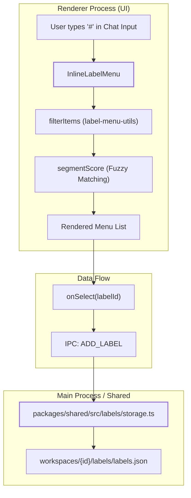
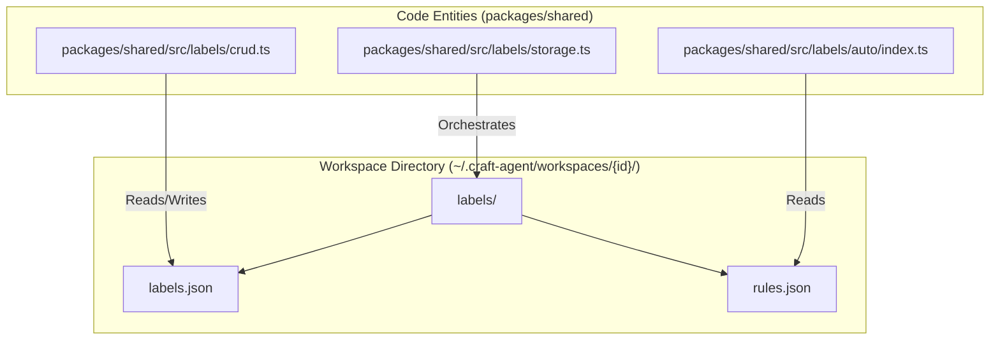
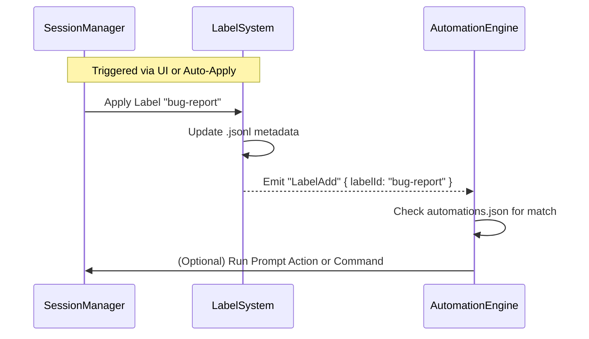

# Labels

Relevant source files

The following files were used as context for generating this wiki page:

- [packages/shared/package.json](packages/shared/package.json)

## Purpose and Scope

Labels provide a flexible tagging system for sessions within workspaces. They enable users to categorize conversations by topic, priority, project, or any custom dimension. Labels complement the status workflow system (see page 4.6) and integrate with the automation system (see page 4.9) to enable event-driven workflows based on label changes.

The label system logic is centralized in the `@craft-agent/shared` package, specifically within `packages/shared/src/labels/` [packages/shared/package.json:45-48](). This includes CRUD operations, storage handling, and automatic labeling logic.

---

## Label System Overview

Labels are workspace-scoped tags applied to sessions. Unlike the status system which tracks a single linear workflow state (e.g., Todo, In Progress, Done), multiple labels can be applied to a single session simultaneously.

### Key Components

| Component | Code Entity | Role |
|-----------|-------------|------|
| **Label Config** | `LabelConfig` | Interface defining the structure of a label (ID, name, color, etc.) [apps/electron/src/renderer/components/ui/label-menu.tsx:5]() |
| **Menu UI** | `InlineLabelMenu` | Autocomplete menu triggered by `#` in the input field [apps/electron/src/renderer/components/ui/label-menu.tsx:81-93]() |
| **Menu Utils** | `label-menu-utils.ts` | Logic for filtering, scoring, and creating menu items [apps/electron/src/renderer/components/ui/label-menu.tsx:6]() |
| **Storage** | `packages/shared/src/labels/storage.ts` | Handles persistence of label definitions to disk [packages/shared/package.json:47]() |
| **CRUD Logic** | `packages/shared/src/labels/crud.ts` | Core logic for creating, updating, and deleting labels [packages/shared/package.json:48]() |

Sources: [packages/shared/package.json:45-48](), [apps/electron/src/renderer/components/ui/label-menu.tsx:1-32]()

---

## UI and Interaction Space

The primary interface for interacting with labels is the `InlineLabelMenu`. This component is an autocomplete menu that appears above the cursor position when a user triggers it (typically via the `#` character).

### Label Menu Logic

**Keyboard Navigation and Selection**
The `InlineLabelMenu` manages a unified index for keyboard navigation, allowing users to scroll through both suggested "States" (workflow statuses) and "Labels" [apps/electron/src/renderer/components/ui/label-menu.tsx:100-102](). 

- **Filtering**: Uses `segmentScore` logic to match user input against label names [apps/electron/src/renderer/components/ui/label-menu.tsx:47-70]().
- **Selection**: Pressing `Enter` or `Tab` triggers the `onSelect` callback, which passes the `labelId` back to the session orchestrator [apps/electron/src/renderer/components/ui/label-menu.tsx:140-158]().

Sources: [apps/electron/src/renderer/components/ui/label-menu.tsx:81-168](), [apps/electron/src/renderer/components/ui/label-menu-utils.tsx:1-50]()

---

## Storage Architecture

Labels are stored per-workspace. The `@craft-agent/shared` package provides the underlying CRUD and storage logic.

**Label Persistence**
- **`labels.json`**: Contains the array of `LabelConfig` objects.
- **`rules.json`**: Contains definitions for the automatic labeling engine [packages/shared/package.json:46]().
- **Session Metadata**: Applied labels are stored as an array of strings (IDs) within the session's `.jsonl` file metadata block.

Sources: [packages/shared/package.json:45-48](), [apps/electron/src/renderer/components/ui/label-menu.tsx:5]()

---

## Automatic Labeling (Auto-Apply)

The system includes an "Auto" labeling engine located in `packages/shared/src/labels/auto/index.ts` [packages/shared/package.json:46](). This engine monitors session activity and applies labels based on predefined rules.

### Rule Evaluation Flow

1. **Trigger**: An event occurs (e.g., a new message is added or a tool is executed).
2. **Matching**: The `Auto` engine evaluates the rules defined in `rules.json` against the session context.
3. **Action**: If a match is found, the system calls the internal label application logic, which updates the session metadata and persists the change to disk.

Sources: [packages/shared/package.json:46]()

---

## Label Events and Automation Triggers

Label changes are first-class events in the Craft Agents automation system. Whenever a label is added or removed, the system emits specific events that can trigger `automations.json` hooks [packages/shared/package.json:60-61]().

### Automation Events

| Event Type | Trigger | Context Provided |
|------------|---------|------------------|
| `LabelAdd` | When a label is manually or automatically applied. | `$CRAFT_LABEL` (The ID of the label added) |
| `LabelRemove` | When a label is removed from a session. | `$CRAFT_LABEL` (The ID of the label removed) |

### Automation Flow

Sources: [packages/shared/package.json:60-61]()

---

## Implementation Details

### Label Menu Utilities
The `label-menu-utils.ts` file contains the logic for transforming raw label configurations into UI-ready menu items.

- **`createLabelMenuItems`**: Maps `LabelConfig` objects to `LabelMenuItem` structures used by the renderer [apps/electron/src/renderer/components/ui/label-menu.tsx:6]().
- **`filterItems`**: Filters the available labels based on the user's current search string [apps/electron/src/renderer/components/ui/label-menu.tsx:97]().
- **`segmentScore`**: A scoring algorithm that prioritizes exact matches and prefix matches within hierarchical label segments [apps/electron/src/renderer/components/ui/label-menu.tsx:51-70]().

Sources: [apps/electron/src/renderer/components/ui/label-menu.tsx:1-100](), [packages/shared/package.json:45-48]()