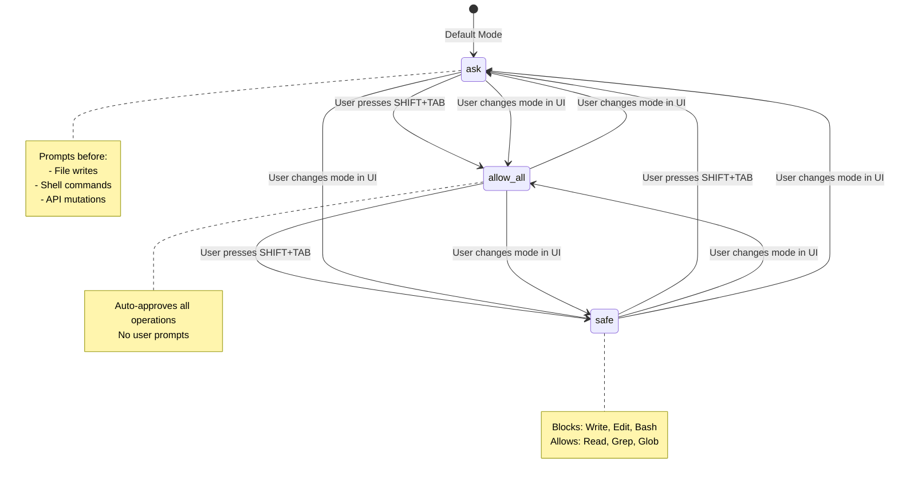
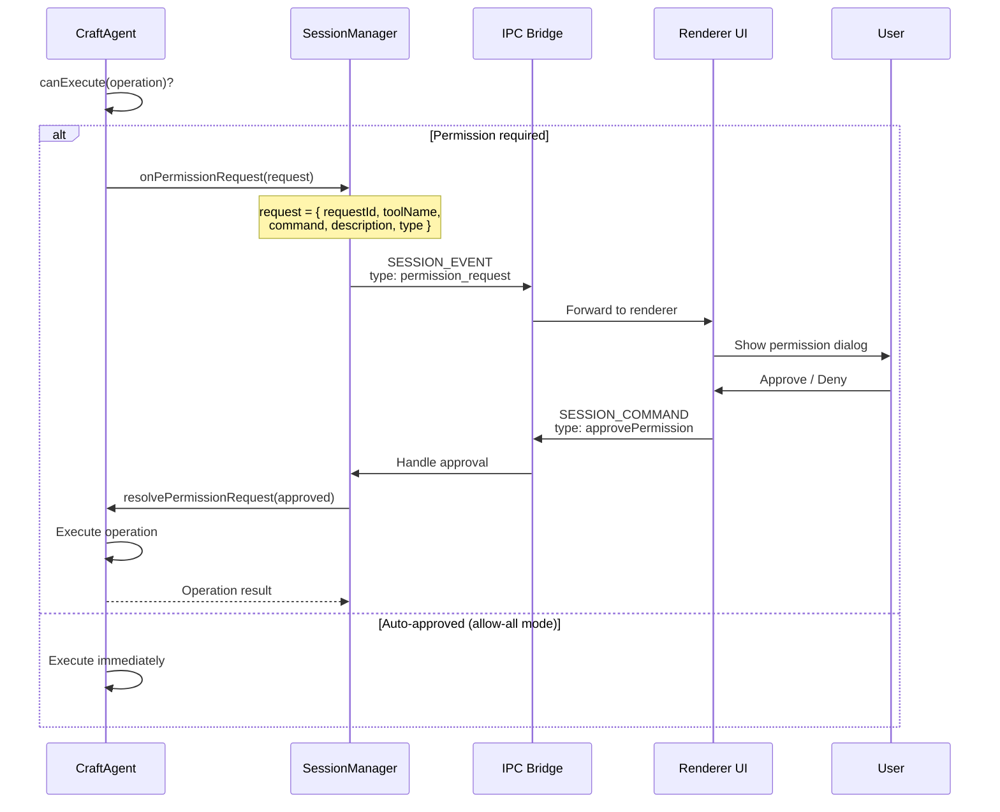
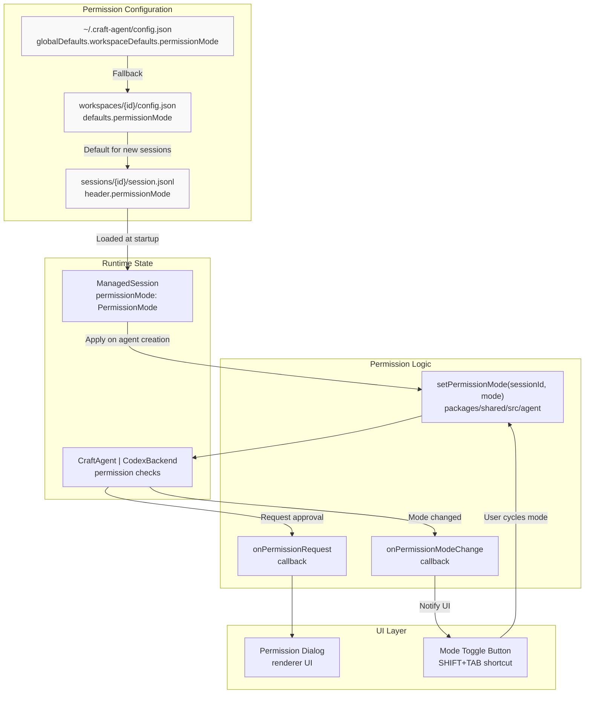
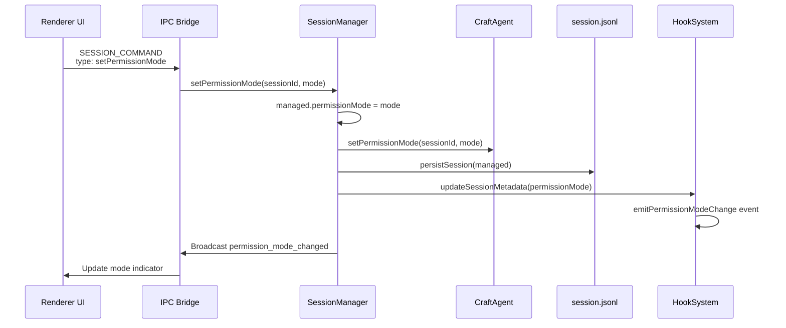
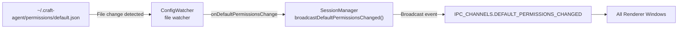

# Permission System

<details>
<summary>Relevant source files</summary>

The following files were used as context for generating this wiki page:

- [README.md](README.md)
- [apps/electron/src/main/sessions.ts](apps/electron/src/main/sessions.ts)
- [packages/shared/src/agent/mode-manager.ts](packages/shared/src/agent/mode-manager.ts)

</details>

The Permission System controls agent autonomy by defining what operations the agent can execute without user approval. It provides three permission modes (`safe`, `ask`, `allow-all`) that govern whether write operations, shell commands, and API mutations require explicit user consent. This system balances agent capability with user control, allowing users to tune the level of supervision from read-only exploration to fully autonomous execution.

For information about file access validation and security controls, see [File Access Validation](#7.3). For hook-driven automation based on permission changes, see [Hooks & Automation](#4.9).

---

## Permission Modes

The system provides three distinct permission modes that determine how the agent handles potentially destructive or side-effect-producing operations:

| Mode        | Display Name | Behavior                                                              | Use Case                                                   |
| ----------- | ------------ | --------------------------------------------------------------------- | ---------------------------------------------------------- |
| `safe`      | Explore      | Blocks all write operations; agent can only read files and fetch data | Safe exploration of codebases without risk of modification |
| `ask`       | Ask to Edit  | Prompts user for approval before executing write operations (default) | Balanced workflow with human-in-the-loop oversight         |
| `allow-all` | Auto         | Automatically approves all operations without prompting               | High-trust scenarios requiring minimal interruption        |

**Sources:** [README.md:129-137](), [README.md:92]()

---

## Permission Mode State Machine



**Diagram: Permission Mode Transitions**

The permission mode is session-scoped and persists across restarts. Users can cycle through modes using `SHIFT+TAB` or select a specific mode via the UI. The default mode for new sessions is `ask`, but this can be overridden by workspace or global configuration.

**Sources:** [README.md:137](), [README.md:142-148]()

---

## Permission Request Flow

When the agent attempts an operation requiring permission, the request flows through multiple layers before reaching the user:



**Diagram: Permission Request Flow Through System Layers**

The flow is asynchronous: when the agent encounters a permission-required operation, it pauses execution, sends a request, and waits for user response. The `requestId` uniquely identifies each request to match responses with pending operations.

**Sources:** [apps/electron/src/main/sessions.ts:2676-2688]()

---

## Permission Request Types

Different operation types require different permission checks:

| Type           | Description                  | Example Operations                    | Mode Gating                          |
| -------------- | ---------------------------- | ------------------------------------- | ------------------------------------ |
| `bash`         | Shell command execution      | `npm install`, `git commit`, `rm -rf` | Blocked in `safe`, prompted in `ask` |
| `file_write`   | File modification operations | `Write`, `Edit` tools                 | Blocked in `safe`, prompted in `ask` |
| `mcp_mutation` | MCP server mutations         | Create issue, update task, send email | Blocked in `safe`, prompted in `ask` |
| `api_mutation` | REST API mutations           | POST, PUT, DELETE requests            | Blocked in `safe`, prompted in `ask` |

Read-only operations (`Read`, `Grep`, `Glob`, `WebFetch`) are never gated by permissions—they execute immediately in all modes.

**Sources:** [apps/electron/src/main/sessions.ts:2676-2688]()

---

## Code Architecture



**Diagram: Permission System Code Entities**

Permission configuration cascades through three levels: global defaults, workspace defaults, and session-specific overrides. The session manager applies the permission mode to the agent at creation time and handles mode changes during the session lifecycle.

**Sources:** [apps/electron/src/main/sessions.ts:1997-2003](), [apps/electron/src/main/sessions.ts:2929-2934](), [apps/electron/src/main/sessions.ts:2695-2704]()

---

## Session-Level Permissions

Each session maintains its own permission mode, which is:

1. **Initialized from defaults** when the session is created (workspace default → global default → `ask`)
2. **Persisted** to `sessions/{id}/session.jsonl` header for durability across restarts
3. **Applied immediately** to the agent when the mode changes
4. **Visible in the UI** via a mode indicator in the chat interface

The mode can be overridden at session creation time (used by EditPopover for auto-execute mode):

```typescript
// Example: Create session with specific permission mode
await createSession(workspaceId, {
  permissionMode: 'allow-all', // Override default
  hidden: true, // Mini agent session
})
```

**Sources:** [apps/electron/src/main/sessions.ts:1997-2003](), [apps/electron/src/main/sessions.ts:2928-2934]()

---

## Default Permission Configuration

Workspace and global defaults are configured in JSON files:

**Global Config** (`~/.craft-agent/config.json`):

```json
{
  "globalDefaults": {
    "workspaceDefaults": {
      "permissionMode": "ask"
    }
  }
}
```

**Workspace Config** (`workspaces/{id}/config.json`):

```json
{
  "defaults": {
    "permissionMode": "safe" // Override global default
  }
}
```

The resolution order is: session override → workspace default → global default → hardcoded `ask`.

**Sources:** [apps/electron/src/main/sessions.ts:1997-2003]()

---

## Permission Mode Changes and Persistence

When the user changes the permission mode for a session:

1. **SessionManager** updates in-memory state (`managed.permissionMode`)
2. **Agent** applies the new mode immediately via `setPermissionMode(sessionId, mode)`
3. **Storage layer** persists the change to `session.jsonl` header
4. **All windows** receive a `permission_mode_changed` event to update UI
5. **HookSystem** emits a `PermissionModeChange` hook event for automation



**Diagram: Permission Mode Change Propagation**

The change is immediately effective—the next operation the agent attempts will use the new mode. The HookSystem's diffing logic ensures hooks only fire when the mode actually changes (prevents redundant triggers).

**Sources:** [apps/electron/src/main/sessions.ts:2695-2704](), [apps/electron/src/main/sessions.ts:1055-1068]()

---

## Permission Request UI Interaction

The permission dialog displays:

- **Tool name** (e.g., "Terminal", "Write", "Edit")
- **Operation description** (e.g., "Run shell command: `npm install`")
- **Command preview** (for bash operations, shows the full command)
- **Approve/Deny buttons** with keyboard shortcuts

Users can:

- **Approve** the operation (allows it to proceed)
- **Deny** the operation (cancels it, agent receives error)
- **Change mode** before approving (e.g., switch to `allow-all` to avoid future prompts)

**Sources:** [apps/electron/src/main/sessions.ts:2676-2688]()

---

## Keyboard Shortcuts

| Shortcut    | Action                                                         |
| ----------- | -------------------------------------------------------------- |
| `SHIFT+TAB` | Cycle through permission modes (safe → ask → allow-all → safe) |
| `Cmd+/`     | Open keyboard shortcuts dialog (shows all shortcuts)           |

The cycle order ensures users can quickly toggle between the most common modes without requiring a dropdown menu.

**Sources:** [README.md:137](), [README.md:142-148]()

---

## Hooks Integration

The permission system integrates with the event-driven hook system via `PermissionModeChange` events. This allows automation based on permission changes:

**Example Hook Configuration** (`hooks.json`):

```json
{
  "PermissionModeChange": [
    {
      "matcher": "^allow-all$",
      "hooks": [
        {
          "type": "command",
          "command": "echo '[AUDIT] Session $CRAFT_SESSION_ID switched to auto mode' >> ~/audit.log"
        }
      ]
    }
  ]
}
```

This enables audit trails for high-risk mode changes without requiring code modifications.

**Sources:** [apps/electron/src/main/sessions.ts:1055-1068](), [README.md:329-346]()

---

## Default Permissions File Watching

The system watches `~/.craft-agent/permissions/default.json` for changes and broadcasts updates to all windows. This enables real-time permission rule updates without restarting the app:



**Diagram: Default Permissions Change Propagation**

The file watcher detects changes immediately (via `chokidar`), ensuring permission rules are always up-to-date across all open windows.

**Sources:** [apps/electron/src/main/sessions.ts:991-994](), [apps/electron/src/main/sessions.ts:1162-1166]()

---

## Summary

The Permission System provides fine-grained control over agent autonomy through:

- **Three permission modes** (`safe`, `ask`, `allow-all`) with clear behavioral boundaries
- **Session-scoped configuration** that persists across restarts
- **Asynchronous permission requests** with UI approval flow
- **Cascading defaults** from global → workspace → session levels
- **Hooks integration** for audit trails and automation
- **Live reload** of default permission rules without app restart

This architecture balances security (preventing accidental modifications) with usability (minimal friction for trusted workflows), allowing users to tune the system to their specific needs.

**Sources:** [README.md:92](), [README.md:129-137](), [apps/electron/src/main/sessions.ts:2676-2704](), [apps/electron/src/main/sessions.ts:1997-2003](), [apps/electron/src/main/sessions.ts:2929-2934]()
