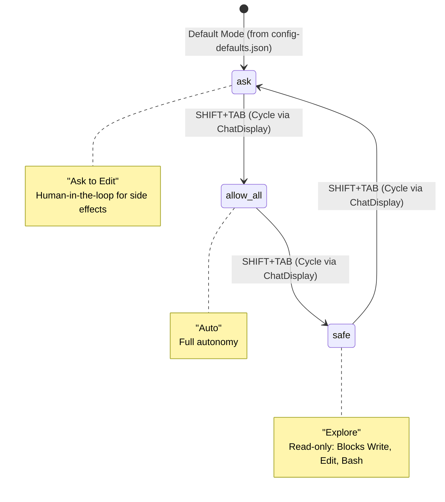
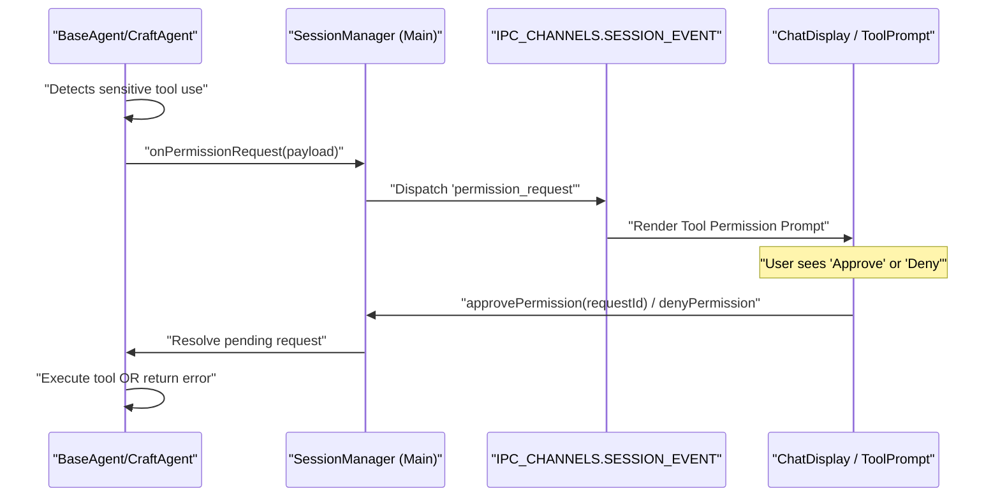
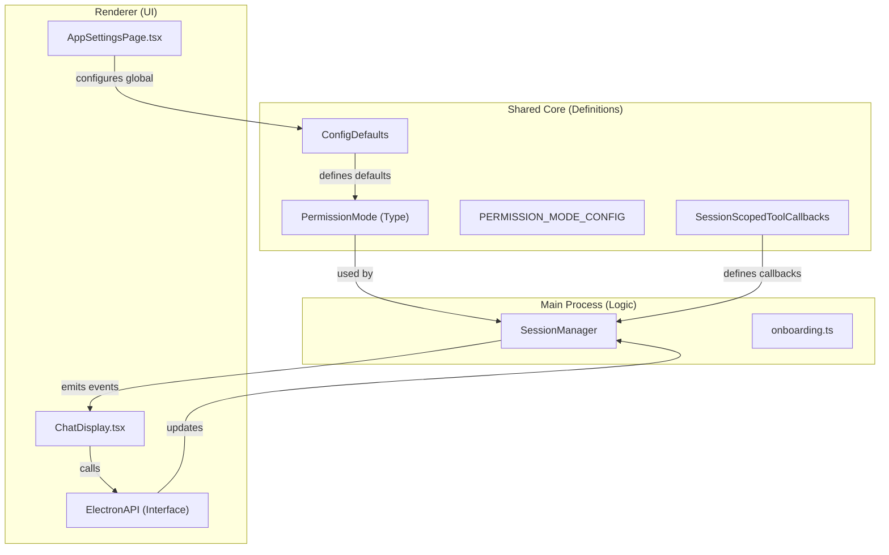

# Permission System

Relevant source files

The following files were used as context for generating this wiki page:

- [apps/electron/src/main/onboarding.ts](apps/electron/src/main/onboarding.ts)
- [apps/electron/src/renderer/components/app-shell/ChatDisplay.tsx](apps/electron/src/renderer/components/app-shell/ChatDisplay.tsx)
- [apps/electron/src/renderer/pages/settings/AppSettingsPage.tsx](apps/electron/src/renderer/pages/settings/AppSettingsPage.tsx)
- [apps/electron/src/shared/types.ts](apps/electron/src/shared/types.ts)
- [bun.lock](bun.lock)
- [packages/shared/src/agent/session-scoped-tools.ts](packages/shared/src/agent/session-scoped-tools.ts)
- [packages/shared/src/config/storage.ts](packages/shared/src/config/storage.ts)
- [packages/shared/src/prompts/system.ts](packages/shared/src/prompts/system.ts)
- [packages/ui/src/components/chat/TurnCard.tsx](packages/ui/src/components/chat/TurnCard.tsx)

The Permission System controls agent autonomy by defining what operations the agent can execute without user approval. It provides three permission modes (`safe`, `ask`, `allow-all`) that govern whether write operations, shell commands, and API mutations require explicit user consent. This system balances agent capability with user control, allowing users to tune the level of supervision from read-only exploration to fully autonomous execution.

---

## Permission Modes

The system provides three distinct permission modes that determine how the agent handles potentially destructive or side-effect-producing operations. These are defined in the `PermissionMode` type and managed via the `StoredConfig` and `WorkspaceDefaults`.

| Mode | Display Name | Behavior | Use Case |
|------|--------------|----------|----------|
| `safe` | Explore | Blocks all write operations; agent can only read files and fetch data | Safe exploration of codebases without risk of modification |
| `ask` | Ask to Edit | Prompts user for approval before executing write operations (default) | Balanced workflow with human-in-the-loop oversight |
| `allow-all` | Auto | Automatically approves all operations without prompting | High-trust scenarios requiring minimal interruption |

**Sources:** [apps/electron/src/shared/types.ts:26-28](), [packages/shared/src/config/storage.ts:103-123](), [packages/shared/src/config/storage.ts:165-168]()

---

## Permission Mode State Machine & Cycling

The `SHIFT+TAB` shortcut allows users to cycle through available permission modes. The available modes for cycling are defined in `config-defaults.json` under `cyclablePermissionModes`. The `ChatDisplay` component handles the UI state for these modes, while the `ElectronAPI` provides the interface to persist changes.

**Diagram: Permission Mode Transitions and SHIFT+TAB Cycle**

**Sources:** [packages/shared/src/config/storage.ts:119-120](), [apps/electron/src/renderer/components/app-shell/ChatDisplay.tsx:163-167](), [apps/electron/src/shared/types.ts:222-225]()

---

## Permission Request Flow

When the agent attempts an operation requiring permission (e.g., `bash`, `file_write`), the request is intercepted. In `ask` mode, a `PermissionRequest` is generated and sent to the renderer.

**Diagram: Tool Permission Request Pipeline**

The `ChatDisplay` component in the renderer receives these requests via the `pendingPermission` prop and provides callbacks like `onRespondToPermission` to resolve them.

**Sources:** [apps/electron/src/renderer/components/app-shell/ChatDisplay.tsx:143-152](), [apps/electron/src/shared/types.ts:212-220](), [packages/shared/src/agent/session-scoped-tools.ts:67-78]()

---

## Configuration & Whitelisting

The system supports whitelisting and default behaviors through a multi-layered configuration system.

### Configuration Hierarchy
1.  **Global Defaults**: Defined in `config-defaults.json` (synced to `~/.craft-agent/config-defaults.json` at startup).
2.  **Workspace Overrides**: Stored in the workspace's `config.json` under `workspaceDefaults`.
3.  **Session State**: Persisted in the session's metadata.

### Key Configuration Entities
| Entity | File Path | Role |
|--------|-----------|------|
| `StoredConfig` | [packages/shared/src/config/storage.ts:51-87]() | Defines the schema for the main `config.json`. |
| `ConfigDefaults` | [packages/shared/src/config/storage.ts:103-123]() | Schema for default values like `permissionMode` and `cyclablePermissionModes`. |
| `FALLBACK_CONFIG_DEFAULTS` | [packages/shared/src/config/storage.ts:103-123]() | Hardcoded defaults if bundled assets are missing. |

**Sources:** [packages/shared/src/config/storage.ts:89-91](), [packages/shared/src/config/storage.ts:125-152](), [packages/shared/src/config/storage.ts:158-168]()

---

## Code Entity Mapping

The following diagram bridges the high-level permission concepts to the specific TypeScript classes and interfaces used in the codebase.

**Diagram: Permission System Entity Mapping**

**Sources:** [apps/electron/src/shared/types.ts:26-28](), [packages/shared/src/config/storage.ts:51-87](), [apps/electron/src/renderer/components/app-shell/ChatDisplay.tsx:163-167](), [packages/shared/src/agent/session-scoped-tools.ts:67-111]()

---

## Implementation Details: Tool Gating

The system uses the `SessionScopedToolCallbacks` to bridge agent tool calls to the user interface for permission handling.

### Tool Gating Logic
- **Safe Mode**: Only tools with `readOnly: true` or equivalent metadata are allowed. Tools like `bash` or `writeFile` are typically blocked or trigger a failure.
- **Ask Mode**: All non-read-only tools trigger an `onAuthRequest` or `onPermissionRequest`. The agent execution pauses until the `ElectronAPI.approvePermission` IPC call is received.
- **Allow-All Mode**: The `PermissionRequest` is bypassed, and the agent proceeds with execution immediately.

### Persistence
The permission mode is part of the `StoredConfig` and `Workspace` structures, ensuring that user preferences are maintained across application restarts.

**Sources:** [apps/electron/src/shared/types.ts:42-47](), [packages/shared/src/config/storage.ts:57-59](), [packages/shared/src/agent/session-scoped-tools.ts:67-111](), [packages/shared/src/config/storage.ts:117-122]()

---

## Summary of IPC Surface

The renderer interacts with the permission system through the `ElectronAPI` exposed via `contextBridge`.

- `getBrowserToolEnabled()`: Checks if the browser tool is permitted globally.
- `setBrowserToolEnabled(enabled)`: Toggles global permission for the browser tool.
- `onRespondToPermission(sessionId, requestId, allowed, alwaysAllow, options)`: Approves or denies a specific tool execution request.

**Sources:** [apps/electron/src/renderer/components/app-shell/ChatDisplay.tsx:146-152](), [apps/electron/src/renderer/pages/settings/AppSettingsPage.tsx:127-135](), [apps/electron/src/shared/types.ts:212-220]()